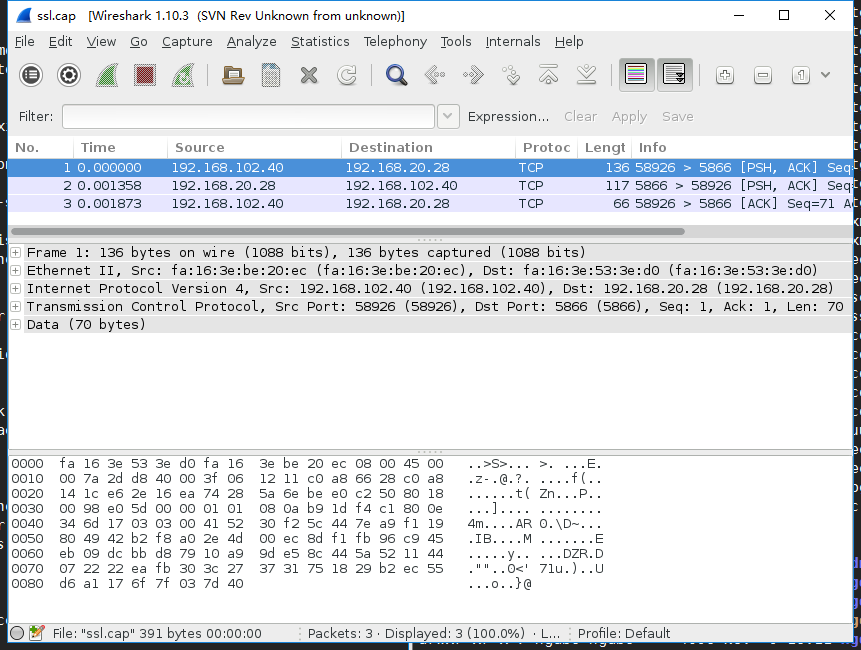
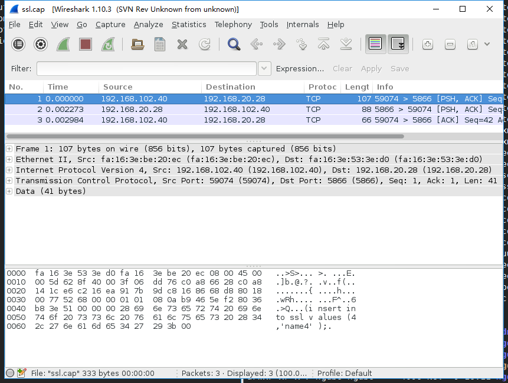

PostgreSQL支持使用SSL连接对客户端/服务器通讯进行加密，以增加安全性。

要求客户端和服务端都支持OPENSSL，数据库编译时需要带上--with-openssl的选项。


### 服务器SSL配置相关文件

文件 | 内容 | 功能
---|---|---
ssl_cert_file ($PGDATA/server.crt) | 服务器证书 | 服务器要求的
ssl_key_file ($PGDATA/server.key) | 服务器私钥 | 证明由所有者发送的客户端证书，并不表示证书拥有者是值得信赖的
ssl_ca_file ($PGDATA/root.crt) |  受信任的根证书 | 检查服务器证书是由受信任的证书机关签署
ssl_crl_file ($PGDATA/root.crl) |  撤销的证书 | 服务器证书必须不在这个名单

### SSL认证配置

创建第一个文件 — 私钥:
```shell
#/C     -- Country Name
#/ST    -- Province Name
#/L     -- Locality Name (eg, city)
#/O     -- Organization Name (eg, company)
#/CN    -- Common Name (eg, your name or your server's hostname):

openssl req -new -text -subj "/C=CH/ST=Shandong/L=Jinan/O=HighGo/CN=young" -out server.req
```
在生成server.key文件的过程中，它会要求输入密码，随意输入并确认。

移去密钥（如果你想自动启动服务器就必须这样）。通过如下命令实现：
```shell
openssl rsa -in privkey.pem -out server.key
rm privkey.pem 
```
创建基于server.key文件的服务器证书, 如下：
```shell
openssl req -x509 -in server.req -text -key server.key -out server.crt
```
为私钥文件设置适当的权限和所有权
```shell
chmod og-rwx server.key
```
### 修改postgresql.conf,打开ssl连接

```shell
ssl = on                                # (change requires restart)
ssl_ciphers = 'HIGH:MEDIUM:+3DES:!aNULL' # allowed SSL ciphers
                                        # (change requires restart)
ssl_prefer_server_ciphers = on          # (change requires restart)
ssl_ecdh_curve = 'prime256v1'           # (change requires restart)
ssl_cert_file = 'server.crt'            # (change requires restart)
ssl_key_file = 'server.key'     
```
### 修改pg_hba.conf，以hostssl方式连接

```shell
hostssl all             all             0.0.0.0/0               md5
```
### 远程连接数据库

```shell
[hgdb7@host-192-168-20-35 bin]$ ./psql -h 192.168.102.30 -U yangjie -d yangjie -p 5866
psql (4.2.1, server 4.2.1)

PSQL: Release 4.2.1
Connected to:
HighGo Database V4.2 Standard Edition Release 4.2.1 - 64-bit Production

SSL connection (protocol: TLSv1.2, cipher: ECDHE-RSA-AES256-GCM-SHA384, bits: 256, compression: off)
Type "help" for help.

yangjie=# 
```
psql调用了libssl库
```shell
[hgdb7@host-192-168-20-35 ~]$ lsof|grep psql|grep ssl
psql      31110               hgdb7  mem       REG              253,1    255888 18099723 /usr/lib64/libssl3.so
psql      31110               hgdb7  mem       REG              253,1    449808 36677904 /opt/highgo/hgdb4/standard/hgdb4-standard/lib/libssl.so.1.0.1e
```

### 使用Tcpdump调试PostgreSQL

连接数据库

```shell
./psql -h 192.168.102.30 -U yangjie -d yangjie -p 5866
```

连接数据库后，确认TCP连接已经建立

```shell
[yangjie@yfslcentos71 bin]$ netstat -na | grep 5866 | grep ESTABLISHED
tcp        0      0 192.168.20.28:5866      192.168.102.40:59551    ESTABLISHED
```


现在就可以使用tcpdump进行抓包了： 

```shell
sudo tcpdump -i eth0 -X -s 3000 host 192.168.102.40 and port 5866 -w ssl.cap
```

执行后，在数据库中执行SQL：insert into ssl values (4,'name4');

```shell
[yangjie@yfslcentos71 ~]$ sudo tcpdump -i eth0 -X -s 3000 host 192.168.102.40 and port 5866 -w ssl.cap
tcpdump: listening on eth0, link-type EN10MB (Ethernet), capture size 3000 bytes
3 packets captured
3 packets received by filter
0 packets dropped by kernel
```
### 分析数据

wireshark 进行解析

```shell
[yangjie@yfslcentos71 ~]$ wireshark ssl.cap
```
加密：



未加密：

