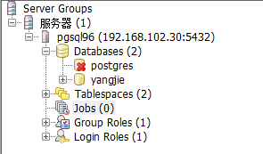
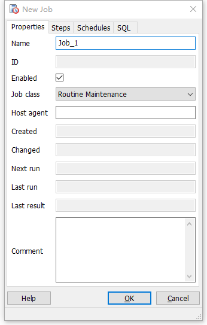
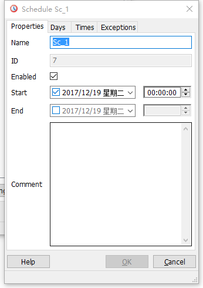
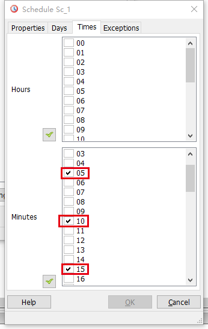
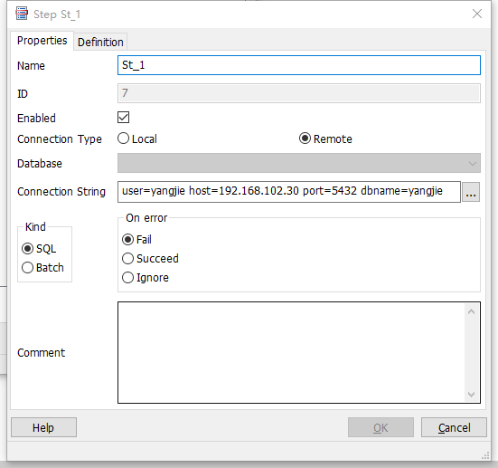
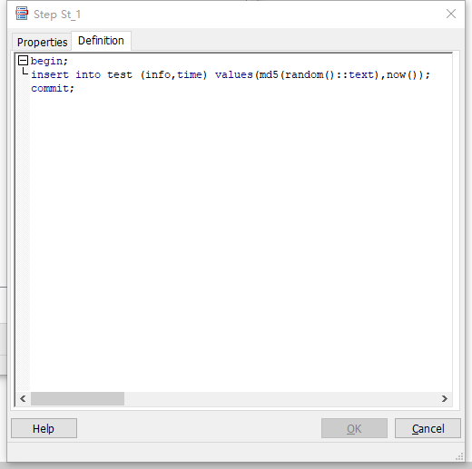
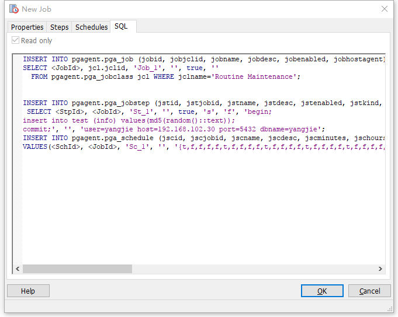
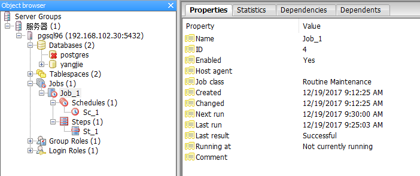
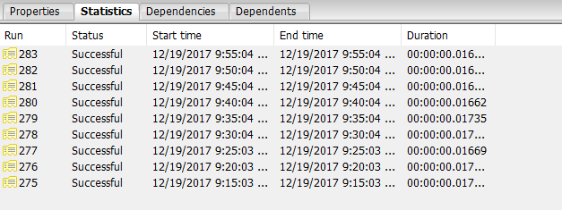
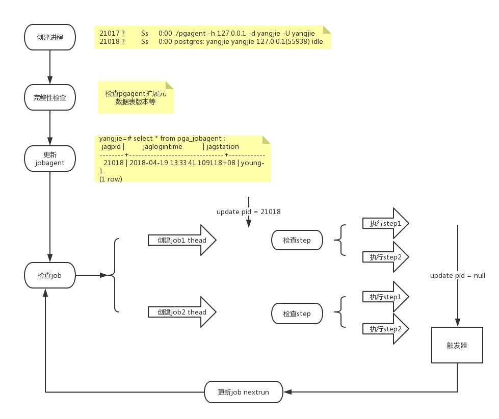

在pgAdminIII v1.4中引入的pgAgent是一个用于PostgreSQL的作业调度代理，可用于执行操作系统批处理脚本和SQL任务。

从pgAdmin 1.9开始，pgAgent独立于pgAdmin单独安装。


#### 环境：

- PostgreSQL 9.6.6
- pgAgent 3.4.0
- cmake 2.8.11
- wxWidgets 2.8.12

先安装PG、wxGTK、cmake


#### 安装pgAgent

```shell
[yangjie@young-1 package]$ tar zxvf pgAgent-3.4.0-Source.tar.gz 
[yangjie@young-1 package]$ cd pgAgent-3.4.0-Source/
[yangjie@young-1 pgAgent-3.4.0-Source]$ cmake ./
--  
-- ================================================================================
-- Configuration summary:
--  
--   Project                     : pgagent
--   Description                 : pgAgent is a job scheduling engine for PostgreSQL
--   Version                     : 3.4.0
--  
--   PostgreSQL version string   : PostgreSQL 9.6.6
--   PostgreSQL version parts    : 9.6.6
--   PostgreSQL path             : /work/pgsql/pg96
--   PostgreSQL config binary    : /work/pgsql/pg96/bin/pg_config
--   PostgreSQL include path     : /work/pgsql/pg96/include
--   PostgreSQL library path     : /work/pgsql/pg96/lib
--   PostgreSQL share path       : /work/pgsql/pg96/share
--  
--   wxWidgets version           : 2.8.12
--   wxWidgets path              : /usr/local
--   wxWidgets config binary     : /usr/local/bin/wx-config
--   wxWidgets Static linking    : YES
--   wxWidgets Debug?            : NO
-- ================================================================================
--  
-- Configuring done
-- Generating done
-- Build files have been written to: /work/extension/pgAgent-3.4.0-Source
[yangjie@young-1 pgAgent-3.4.0-Source]$ make; make install;
```


#### 数据库配置

创建pgagent扩展

```sql
[yangjie@young-1 bin]$ pwd
/work/pgsql/pg96/bin
[yangjie@young-1 bin]$ ./psql 
psql (9.6.6)
Type "help" for help.

yangjie=# create extension pgagent ;
CREATE EXTENSION
yangjie=# \dx
                 List of installed extensions
  Name   | Version |   Schema   |         Description          
---------+---------+------------+------------------------------
 pgagent | 3.4     | pgagent    | A PostgreSQL job scheduler
 plpgsql | 1.0     | pg_catalog | PL/pgSQL procedural language
(2 rows)
```

这个命令将在一个名为“pgagent”的模式中创建许多表和其他对象。

```sql
yangjie=# set search_path to pgagent;
SET
yangjie=# \d
                    List of relations
 Schema  |           Name           |   Type   |  Owner  
---------+--------------------------+----------+---------
 pgagent | pga_exception            | table    | yangjie
 pgagent | pga_exception_jexid_seq  | sequence | yangjie
 pgagent | pga_job                  | table    | yangjie
 pgagent | pga_job_jobid_seq        | sequence | yangjie
 pgagent | pga_jobagent             | table    | yangjie
 pgagent | pga_jobclass             | table    | yangjie
 pgagent | pga_jobclass_jclid_seq   | sequence | yangjie
 pgagent | pga_joblog               | table    | yangjie
 pgagent | pga_joblog_jlgid_seq     | sequence | yangjie
 pgagent | pga_jobstep              | table    | yangjie
 pgagent | pga_jobstep_jstid_seq    | sequence | yangjie
 pgagent | pga_jobsteplog           | table    | yangjie
 pgagent | pga_jobsteplog_jslid_seq | sequence | yangjie
 pgagent | pga_schedule             | table    | yangjie
 pgagent | pga_schedule_jscid_seq   | sequence | yangjie
(15 rows)
```


#### 创建pgagent进程

```shell
[yangjie@young-1 pgAgent-3.4.0-Source]$ ./pgagent 
Usage:
pgagent [options] <connect-string>
options:
-f run in the foreground (do not detach from the terminal)
-t <poll time interval in seconds (default 10)>
-r <retry period after connection abort in seconds (>=10, default 30)>
-s <log file (messages are logged to STDOUT if not specified>
-l <logging verbosity (ERROR=0, WARNING=1, DEBUG=2, default 0)>
[yangjie@young-1 pgAgent-3.4.0-Source]$ ./pgagent hostaddr=127.0.0.1 dbname=yangjie user=yangjie password=yangjie -s ./pgagent.log
```

因为[安全原因](https://www.pgadmin.org/docs/pgadmin4/1.x/using_pgagent.html#security-concerns)，不能直接将密码写入连接字符串，因为那样任何人使用ps命令就可以看到密码。所以使用~/.pgpass文件为数据库用户提供密码。

```shell
[yangjie@young-1 pgAgent-3.4.0-Source]$ ps x
  PID TTY      STAT   TIME COMMAND
22234 ?        S      0:00 sshd: yangjie@pts/0
22235 pts/0    Ss+    0:00 -bash
25204 ?        S      0:00 sshd: yangjie@pts/1
25205 pts/1    Ss     0:00 -bash
25340 pts/1    S      0:01 /work/pgsql/pg96/bin/postgres -D ../data
25342 ?        Ss     0:00 postgres: checkpointer process   
25343 ?        Ss     0:01 postgres: writer process   
25344 ?        Ss     0:01 postgres: wal writer process   
25345 ?        Ss     0:00 postgres: autovacuum launcher process   
25346 ?        Ss     0:02 postgres: stats collector process   
25690 pts/1    S+     0:00 ./psql
25691 ?        Ss     0:00 postgres: yangjie yangjie [local] idle
25766 pts/2    S      0:00 pgagent hostaddr=127.0.0.1 dbname=yangjie user=yangjie password=yangjie -s ./pgagent.log   // 服务
25767 ?        Ss     0:00 postgres: yangjie yangjie 127.0.0.1(56382) idle  // 连接
25769 pts/2    R+     0:00 ps x
31230 ?        S      0:00 sshd: yangjie@pts/2
31231 pts/2    Ss     0:00 -bash
```


#### 创建Job

[Creating a pgAgent Job](https://www.pgadmin.org/docs/pgadmin4/1.x/pgagent_jobs.html#)

当成功安装pgAgent，并且pgAgent已经在正常运行后，接下来的任务就是创建定时执行任务。Postgresql的定时任务的概念分为两个部分：Schedule和Step。 Schedule是定时器，配置这个Job什么时候执行。而Step是执行任务的内容。通过这两部分结合，就可以配置这个Job什么时候做什么。一个Job可以有多个Schedule和多个Step。



新建一个Job



设置Schedules

开始时间以及分钟是5的倍数会执行。





设置Steps



定义要执行的SQL



当您完成计划定义后，您可以使用SQL选项卡来检查将创建或修改Job的代码。



pgAdmin窗口中的Properties选项卡将显示所选Job的概述，而Statistics选项卡将显示Job每次运行的详细信息





数据：

```sql
yangjie=# select * from test;
 id |               info               |      time       
----+----------------------------------+-----------------
  4 | a276e7c7b993ce8aac0a38493c057933 | 09:30:04.05872
  5 | df2fe0cb4a3b4af042af52dd775a60ce | 09:35:04.166973
  6 | dffcc3a86b126e5871699e503cb66e6c | 09:40:04.272227
  7 | de01d2088112ae0dc7df960de53ba8d2 | 09:45:04.378131
  8 | 317b3368fcf3ca8962a425c758110526 | 09:50:04.48115
  9 | c299ee7090275fb6670b41065cb89753 | 09:55:04.586207
 10 | 77bbee280130c0a06c3fae8eca1a1699 | 10:00:04.692692
 11 | a334050f6fc2f028dba36b9eb282b2b2 | 10:05:04.796912
 12 | 970744cf01924e0a15bdf3fa896c88f6 | 10:10:04.89903
 13 | dec651a5eefd0053ec177a86c926fd62 | 10:15:05.004402
 14 | 77780aa213797cac8302d944c23437a7 | 10:20:00.106256
 15 | 092ff024f152895ae7380ee4fea88d60 | 10:25:00.212344
 16 | d71a82445490b2d7c8352a70609b17ea | 10:30:00.32008
 17 | c2c21c7fc3f56bef8da894cbb1423b13 | 10:35:00.4283
 18 | 785712254de5c20af67978393b17563d | 10:40:00.531373
(15 rows)
```


#### pgagent元数据表

```sql
yangjie=# set search_path to pgagent;
SET
yangjie=# \d
                    List of relations
 Schema  |           Name           |   Type   |  Owner  
---------+--------------------------+----------+---------
 pgagent | pga_exception            | table    | yangjie
 pgagent | pga_exception_jexid_seq  | sequence | yangjie
 pgagent | pga_job                  | table    | yangjie
 pgagent | pga_job_jobid_seq        | sequence | yangjie
 pgagent | pga_jobagent             | table    | yangjie
 pgagent | pga_jobclass             | table    | yangjie
 pgagent | pga_jobclass_jclid_seq   | sequence | yangjie
 pgagent | pga_joblog               | table    | yangjie
 pgagent | pga_joblog_jlgid_seq     | sequence | yangjie
 pgagent | pga_jobstep              | table    | yangjie
 pgagent | pga_jobstep_jstid_seq    | sequence | yangjie
 pgagent | pga_jobsteplog           | table    | yangjie
 pgagent | pga_jobsteplog_jslid_seq | sequence | yangjie
 pgagent | pga_schedule             | table    | yangjie
 pgagent | pga_schedule_jscid_seq   | sequence | yangjie
(15 rows)

yangjie=# \x
Expanded display is on.
yangjie=# select * from pga_job;
-[ RECORD 1 ]+------------------------------
jobid        | 4
jobjclid     | 1
jobname      | Job_1
jobdesc      | 
jobhostagent | 
jobenabled   | t
jobcreated   | 2017-12-19 09:12:25.025086+08
jobchanged   | 2017-12-19 09:12:25.025086+08
jobagentid   | 
jobnextrun   | 2017-12-19 10:50:00+08
joblastrun   | 2017-12-19 10:45:00.616219+08

yangjie=# select * from pga_jobstep;
-[ RECORD 1 ]-----------------------------------------------------------------
jstid      | 7
jstjobid   | 4
jstname    | St_1
jstdesc    | 
jstenabled | t
jstkind    | s
jstcode    | begin;\r                                                         +
           | insert into test (info,time) values(md5(random()::text),now());\r+
           | commit;
jstconnstr | user=yangjie host=192.168.102.30 port=5432 dbname=yangjie
jstdbname  | 
jstonerror | f
jscnextrun | 

yangjie=# select * from pga_schedule;
-[ RECORD 1 ]+--------------------------------------------------------------------------------------------------------------------------
jscid        | 7
jscjobid     | 4
jscname      | Sc_1
jscdesc      | 
jscenabled   | t
jscstart     | 2017-12-19 00:00:00+08
jscend       | 
jscminutes   | {t,f,f,f,f,t,f,f,f,f,t,f,f,f,f,t,f,f,f,f,t,f,f,f,f,t,f,f,f,f,t,f,f,f,f,t,f,f,f,f,t,f,f,f,f,t,f,f,f,f,t,f,f,f,f,t,f,f,f,f}
jschours     | {f,f,f,f,f,f,f,f,f,f,f,f,f,f,f,f,f,f,f,f,f,f,f,f}
jscweekdays  | {f,f,f,f,f,f,f}
jscmonthdays | {f,f,f,f,f,f,f,f,f,f,f,f,f,f,f,f,f,f,f,f,f,f,f,f,f,f,f,f,f,f,f,f}
jscmonths    | {f,f,f,f,f,f,f,f,f,f,f,f}

yangjie=# \x
Expanded display is off.
yangjie=# select * from pga_joblog;
 jlgid | jlgjobid | jlgstatus |           jlgstart            |   jlgduration   
-------+----------+-----------+-------------------------------+-----------------
   275 |        4 | s         | 2017-12-19 09:15:03.731043+08 | 00:00:00.017756
   276 |        4 | s         | 2017-12-19 09:20:03.838682+08 | 00:00:00.017349
   277 |        4 | s         | 2017-12-19 09:25:03.944863+08 | 00:00:00.01669
   278 |        4 | s         | 2017-12-19 09:30:04.046135+08 | 00:00:00.017016
   279 |        4 | s         | 2017-12-19 09:35:04.154206+08 | 00:00:00.01735
   280 |        4 | s         | 2017-12-19 09:40:04.259718+08 | 00:00:00.01662
   281 |        4 | s         | 2017-12-19 09:45:04.365681+08 | 00:00:00.016773
   282 |        4 | s         | 2017-12-19 09:50:04.468783+08 | 00:00:00.016581
   283 |        4 | s         | 2017-12-19 09:55:04.573744+08 | 00:00:00.016828
   284 |        4 | s         | 2017-12-19 10:00:04.68007+08  | 00:00:00.017035
   285 |        4 | s         | 2017-12-19 10:05:04.782743+08 | 00:00:00.018488
   286 |        4 | s         | 2017-12-19 10:10:04.886519+08 | 00:00:00.016865
   287 |        4 | s         | 2017-12-19 10:15:04.991821+08 | 00:00:00.016938
   288 |        4 | s         | 2017-12-19 10:20:00.093749+08 | 00:00:00.016909
   289 |        4 | s         | 2017-12-19 10:25:00.199343+08 | 00:00:00.017328
   290 |        4 | s         | 2017-12-19 10:30:00.306797+08 | 00:00:00.018195
   291 |        4 | s         | 2017-12-19 10:35:00.415492+08 | 00:00:00.016837
   292 |        4 | s         | 2017-12-19 10:40:00.519205+08 | 00:00:00.016268
   293 |        4 | s         | 2017-12-19 10:45:00.623464+08 | 00:00:00.015656
(19 rows)

yangjie=# 
```


#### pgagent 原理

 简略描述：



1，创建进程，创建pgagent进程以及一个session连接

2，完整性检查，通过连接去查询pgagent扩展是否有、版本号等是否符合要求

3，将session backendpid和主机名 写入表pga_jobagent

4，检查job，jobnextrun<=now()，找到要执行的job

5，创建job session，pga_job表写入session pid, joblastrun

6，查询step，得到jstcode

7，创建step session，执行jstcode sql或者shelll

8，执行完，更新pga_job，触发器更新jobnextrun

9，->4 循环