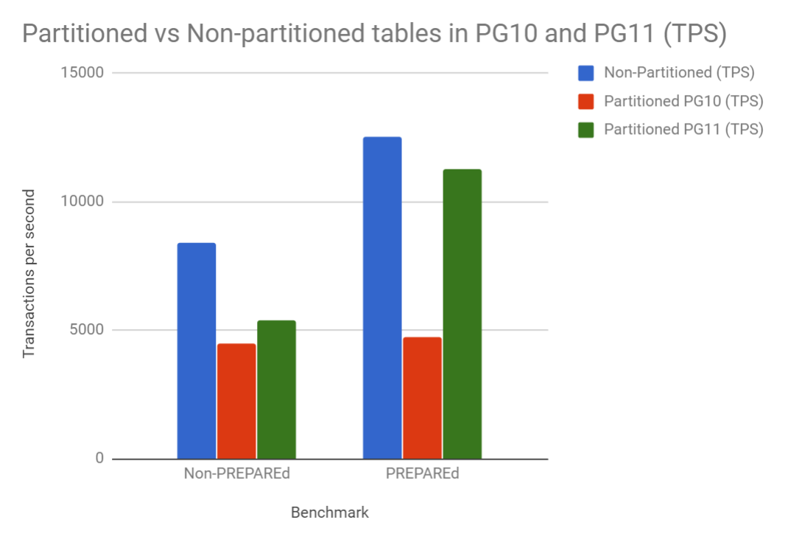

PostgreSQL 10 是第一个支持内置声明式分区表的版本。支持 range、list 分区，与以前的版本相比，提供了显著的性能和易用性优势，但却忽略了许多功能特性和性能优化。PostgreSQL 11 为分区表功能提供更多的改进。这些特性包括：hash 分区、索引增强、DML改进，以及性能优化：faster partition pruning、run-time partition pruning,、partition-wise join。

## 功能特性

下面简单介绍下PostgreSQL分区表的使用以及 11 改进的地方。

#### range 分区

语法：

```sql
-- 主表
CREATE TABLE table_name ( column_name data_type )
	PARTITION BY RANGE ( { column_name } [, ... ] )

-- 子表
CREATE TABLE table_name
    PARTITION OF parent_table
FOR VALUES
    FROM ( { numeric_literal | string_literal | TRUE | FALSE | MINVALUE | MAXVALUE } [, ...] )
      TO ( { numeric_literal | string_literal | TRUE | FALSE | MINVALUE | MAXVALUE } [, ...] ) 
```

范围分区支持多列分区，下面给出两个示例。

示例 1：

```sql
create table test_range(id int, date date) 
  partition by range ( date );

create table test_range_201801 partition of test_range(id primary key) 
  for values from ('2018-01-01') to ('2018-02-01');

create table test_range_201802 partition of test_range(id primary key) 
  for values from ('2018-02-01') to ('2018-03-01');
	
\d+ test_range
                                Table "public.test_range"
 Column |  Type   | Collation | Nullable | Default | Storage | Stats target | Description 
--------+---------+-----------+----------+---------+---------+--------------+-------------
 id     | integer |           |          |         | plain   |              | 
 date   | date    |           |          |         | plain   |              | 
Partition key: RANGE (date)
Partitions: test_range_201801 FOR VALUES FROM ('2018-01-01') TO ('2018-02-01'),
            test_range_201802 FOR VALUES FROM ('2018-02-01') TO ('2018-03-01')

\d+ test_range_201801
                             Table "public.test_range_201801"
 Column |  Type   | Collation | Nullable | Default | Storage | Stats target | Description 
--------+---------+-----------+----------+---------+---------+--------------+-------------
 id     | integer |           | not null |         | plain   |              | 
 date   | date    |           |          |         | plain   |              | 
Partition of: test_range FOR VALUES FROM ('2018-01-01') TO ('2018-02-01')
Partition constraint: ((date IS NOT NULL) AND (date >= '2018-01-01'::date) AND (date < '2018-02-01'::date))
Indexes:
    "test_range_201801_pkey" PRIMARY KEY, btree (id)
```

示例 2:

```sql
create table test_range_key(x int, y int) 
  partition by range(x, y);
create table test_range_key_1 partition of test_range_key 
  for values from (0, 10) to (10, 30);
create table test_range_key_2 partition of test_range_key for 
  values from (10, 30) to (20, 50);

\d+ test_range_key
                              Table "public.test_range_key"
 Column |  Type   | Collation | Nullable | Default | Storage | Stats target | Description 
--------+---------+-----------+----------+---------+---------+--------------+-------------
 x      | integer |           |          |         | plain   |              | 
 y      | integer |           |          |         | plain   |              | 
Partition key: RANGE (x, y)
Partitions: test_range_key_1 FOR VALUES FROM (0, 10) TO (10, 30),
            test_range_key_2 FOR VALUES FROM (10, 30) TO (20, 50)

\d+ test_range_key_1
                             Table "public.test_range_key_1"
 Column |  Type   | Collation | Nullable | Default | Storage | Stats target | Description 
--------+---------+-----------+----------+---------+---------+--------------+-------------
 x      | integer |           |          |         | plain   |              | 
 y      | integer |           |          |         | plain   |              | 
Partition of: test_range_key FOR VALUES FROM (0, 10) TO (10, 30)
Partition constraint: ((x IS NOT NULL) AND (y IS NOT NULL) AND ((x > 0) OR ((x = 0) AND (y >= 10))) AND ((x < 10) OR ((x = 10) AND (y < 30))))

insert into test_range_key values (5, 50);
insert into test_range_key values (10, 20);
insert into test_range_key values (10, 40);
insert into test_range_key values (10, 60);
insert into test_range_key values (15, 20);

select *, tableoid::regclass from test_range_key order by x,y;
 x  | y  |     tableoid     
----+----+------------------
  5 | 50 | test_range_key_1
 10 | 20 | test_range_key_1
 10 | 40 | test_range_key_2
 10 | 60 | test_range_key_2
 15 | 20 | test_range_key_2

(5 rows)
```

注意：

分区键由多个字段组成时，FROM (0, 10) TO (10, 30) 不是简单地以每个字段做上下限（0 < x < 10 and 10 < y < 30），
实际约束定义((x > 0) OR ((x = 0) AND (y >= 10))) AND ((x < 10) OR ((x = 10) AND (y < 30)))，是根据 `ORDER BY` 的形式做的。

#### list 分区

语法：

```sql
-- 主表
CREATE TABLE table_name ( column_name data_type )
	PARTITION BY LIST ( { column_name } )

-- 子表
CREATE TABLE table_name
    PARTITION OF parent_table
FOR VALUES
    IN ( { numeric_literal | string_literal | TRUE | FALSE | NULL } [, ...] )
```

示例：

```sql
create table test_list(id int, city text) 
  partition by list( city );

create table test_list_jn partition of test_list(id primary key) 
  for values in ('济南');

create table test_list_hz partition of test_list(id primary key) 
  for values in ('杭州');

\d+ test_list
                                 Table "public.test_list"
 Column |  Type   | Collation | Nullable | Default | Storage  | Stats target | Description 
--------+---------+-----------+----------+---------+----------+--------------+-------------
 id     | integer |           |          |         | plain    |              | 
 city   | text    |           |          |         | extended |              | 
Partition key: LIST (city)
Partitions: test_list_hz FOR VALUES IN ('杭州'),
            test_list_jn FOR VALUES IN ('济南')

\d+ test_list_jn
                                Table "public.test_list_jn"
 Column |  Type   | Collation | Nullable | Default | Storage  | Stats target | Description 
--------+---------+-----------+----------+---------+----------+--------------+-------------
 id     | integer |           | not null |         | plain    |              | 
 city   | text    |           |          |         | extended |              | 
Partition of: test_list FOR VALUES IN ('济南')
Partition constraint: ((city IS NOT NULL) AND (city = '济南'::text))
Indexes:
    "test_list_jn_pkey" PRIMARY KEY, btree (id)
```

list分区不支持多列。

#### hash 分区

语法：

```sql
-- 主表
CREATE TABLE table_name ( column_name data_type )
	PARTITION BY HASH ( { column_name } [, ... ] )

-- 子表
CREATE TABLE table_name
    PARTITION OF parent_table 
FOR VALUES
    WITH ( MODULUS numeric_literal, REMAINDER numeric_literal )
```

哈希分区支持多列分区，下面给出示例：

示例 1：

```sql
create table test_hash(id int, date date) 
  partition by hash(id);

create table test_hash_1 partition of test_hash 
  for values with(modulus 2, remainder 0);

create table test_hash_2 partition of test_hash 
  for values with(modulus 2, remainder 1);
	
\d+ test_hash
                                 Table "public.test_hash"
 Column |  Type   | Collation | Nullable | Default | Storage | Stats target | Description 
--------+---------+-----------+----------+---------+---------+--------------+-------------
 id     | integer |           |          |         | plain   |              | 
 date   | date    |           |          |         | plain   |              | 
Partition key: HASH (id)
Partitions: test_hash_1 FOR VALUES WITH (modulus 2, remainder 0),
            test_hash_2 FOR VALUES WITH (modulus 2, remainder 1)

\d+ test_hash_1 
                                Table "public.test_hash_1"
 Column |  Type   | Collation | Nullable | Default | Storage | Stats target | Description 
--------+---------+-----------+----------+---------+---------+--------------+-------------
 id     | integer |           |          |         | plain   |              | 
 date   | date    |           |          |         | plain   |              | 
Partition of: test_hash FOR VALUES WITH (modulus 2, remainder 0)
Partition constraint: satisfies_hash_partition('16603'::oid, 2, 0, id)
```

示例 2：

```sql
create table test_hash_key(x int, y int) 
  partition by hash(x,y);

create table test_hash_key_1 partition of test_hash_key 
  for values with(modulus 2, remainder 0);

create table test_hash_key_2 partition of test_hash_key 
  for values with(modulus 2, remainder 1);

\d+ test_hash_key
                               Table "public.test_hash_key"
 Column |  Type   | Collation | Nullable | Default | Storage | Stats target | Description 
--------+---------+-----------+----------+---------+---------+--------------+-------------
 x      | integer |           |          |         | plain   |              | 
 y      | integer |           |          |         | plain   |              | 
Partition key: HASH (x, y)
Partitions: test_hash_key_1 FOR VALUES WITH (modulus 2, remainder 0),
            test_hash_key_2 FOR VALUES WITH (modulus 2, remainder 1)

\d+ test_hash_key_1
                              Table "public.test_hash_key_1"
 Column |  Type   | Collation | Nullable | Default | Storage | Stats target | Description 
--------+---------+-----------+----------+---------+---------+--------------+-------------
 x      | integer |           |          |         | plain   |              | 
 y      | integer |           |          |         | plain   |              | 
Partition of: test_hash_key FOR VALUES WITH (modulus 2, remainder 0)
Partition constraint: satisfies_hash_partition('16561'::oid, 2, 0, x, y)
```

#### 默认分区

PostgreSQL 11新特性，防止插入失败，对于不符合分区约束的数据将会插入到默认分区。

目前，range/list支持默认分区，hash分区不支持

语法：

```sql
CREATE TABLE table_name
    PARTITION OF parent_table 
FOR VALUES
	DEFAULT
```

示例：

```sql
-- range
create table test_range_default partition of test_range  default;

\d+ test_range
                                Table "public.test_range"
 Column |  Type   | Collation | Nullable | Default | Storage | Stats target | Description 
--------+---------+-----------+----------+---------+---------+--------------+-------------
 id     | integer |           |          |         | plain   |              | 
 date   | date    |           |          |         | plain   |              | 
Partition key: RANGE (date)
Partitions: test_range_201801 FOR VALUES FROM ('2018-01-01') TO ('2018-02-01'),
            test_range_201802 FOR VALUES FROM ('2018-02-01') TO ('2018-03-01'),
            test_range_default DEFAULT

\d+ test_range_default 
                            Table "public.test_range_default"
 Column |  Type   | Collation | Nullable | Default | Storage | Stats target | Description 
--------+---------+-----------+----------+---------+---------+--------------+-------------
 id     | integer |           |          |         | plain   |              | 
 date   | date    |           |          |         | plain   |              | 
Partition of: test_range DEFAULT
Partition constraint: (NOT ((date IS NOT NULL) AND (((date >= '2018-01-01'::date) AND (date < '2018-02-01'::date)) OR ((date >= '2018-02-01'::date) AND (date < '2018-03-01'::date)))))

-- list
create table test_list_default partition of test_list  default;

\d+ test_list
                                 Table "public.test_list"
 Column |  Type   | Collation | Nullable | Default | Storage  | Stats target | Description 
--------+---------+-----------+----------+---------+----------+--------------+-------------
 id     | integer |           |          |         | plain    |              | 
 city   | text    |           |          |         | extended |              | 
Partition key: LIST (city)
Partitions: test_list_hz FOR VALUES IN ('杭州'),
            test_list_jn FOR VALUES IN ('济南'),
            test_list_default DEFAULT

\d+ test_list_default 
                             Table "public.test_list_default"
 Column |  Type   | Collation | Nullable | Default | Storage  | Stats target | Description 
--------+---------+-----------+----------+---------+----------+--------------+-------------
 id     | integer |           |          |         | plain    |              | 
 city   | text    |           |          |         | extended |              | 
Partition of: test_list DEFAULT
Partition constraint: (NOT ((city IS NOT NULL) AND (city = ANY (ARRAY['杭州'::text, '济南'::text]))))

-- hash
create table test_hash_default partition of test_hash  default;
ERROR:  a hash-partitioned table may not have a default partition
```

默认分区可以防止插入失败：

```sql
insert into test_list values (3, '北京');

select *, tableoid::regclass from test_list;
 id | city |     tableoid      
----+------+-------------------
  1 | 杭州 | test_list_hz
  2 | 济南 | test_list_jn
  3 | 北京 | test_list_default
(3 rows)
```


#### 多级分区

```sql
create table test_range_list(id int, city text, date date) 
  partition by list (city);

create table test_range_list_jn partition of test_range_list 
  for values in ('济南') 
  partition by range(date);

create table test_range_list_hz partition of test_range_list 
  for values in ('杭州') 
  partition by range(date);

create table test_range_list_jn_201801 partition of test_range_list_jn 
  for values from ('2018-01-01') to ('2018-02-01');
  
create table test_range_list_jn_201802 partition of test_range_list_jn 
  for values from ('2018-02-01') to ('2018-03-01');

create table test_range_list_hz_201801 partition of test_range_list_hz 
  for values from ('2018-01-01') to ('2018-02-01');

create table test_range_list_hz_201802 partition of test_range_list_hz 
  for values from ('2018-02-01') to ('2018-03-01');

\d+ test_range_list
                              Table "public.test_range_list"
 Column |  Type   | Collation | Nullable | Default | Storage  | Stats target | Description 
--------+---------+-----------+----------+---------+----------+--------------+-------------
 id     | integer |           |          |         | plain    |              | 
 city   | text    |           |          |         | extended |              | 
 date   | date    |           |          |         | plain    |              | 
Partition key: LIST (city)
Partitions: test_range_list_hz FOR VALUES IN ('杭州'), PARTITIONED,
            test_range_list_jn FOR VALUES IN ('济南'), PARTITIONED

\d+ test_range_list_jn
                             Table "public.test_range_list_jn"
 Column |  Type   | Collation | Nullable | Default | Storage  | Stats target | Description 
--------+---------+-----------+----------+---------+----------+--------------+-------------
 id     | integer |           |          |         | plain    |              | 
 city   | text    |           |          |         | extended |              | 
 date   | date    |           |          |         | plain    |              | 
Partition of: test_range_list FOR VALUES IN ('济南')
Partition constraint: ((city IS NOT NULL) AND (city = '济南'::text))
Partition key: RANGE (date)
Partitions: test_range_list_jn_201801 FOR VALUES FROM ('2018-01-01') TO ('2018-02-01'),
            test_range_list_jn_201802 FOR VALUES FROM ('2018-02-01') TO ('2018-03-01')

\d+ test_range_list_jn_201801 
                         Table "public.test_range_list_jn_201801"
 Column |  Type   | Collation | Nullable | Default | Storage  | Stats target | Description 
--------+---------+-----------+----------+---------+----------+--------------+-------------
 id     | integer |           |          |         | plain    |              | 
 city   | text    |           |          |         | extended |              | 
 date   | date    |           |          |         | plain    |              | 
Partition of: test_range_list_jn FOR VALUES FROM ('2018-01-01') TO ('2018-02-01')
Partition constraint: ((city IS NOT NULL) AND (city = '济南'::text) AND (date IS NOT NULL) AND (date >= '2018-01-01'::date) AND (date < '2018-02-01'::date))
```

#### ATTACH/DETACH 分区

语法：

```sql
ALTER TABLE name
    ATTACH PARTITION partition_name { FOR VALUES partition_bound_spec | DEFAULT }
    
ALTER TABLE name
    DETACH PARTITION partition_name
```

以hash分区示例进行演示

detach 示例：

```sql
\d+ test_hash
                                 Table "public.test_hash"
 Column |  Type   | Collation | Nullable | Default | Storage | Stats target | Description 
--------+---------+-----------+----------+---------+---------+--------------+-------------
 id     | integer |           |          |         | plain   |              | 
 date   | date    |           |          |         | plain   |              | 
Partition key: HASH (id)
Partitions: test_hash_1 FOR VALUES WITH (modulus 2, remainder 0),
            test_hash_2 FOR VALUES WITH (modulus 2, remainder 1)

alter table test_hash detach partition test_hash_2;

\d+ test_hash
                                 Table "public.test_hash"
 Column |  Type   | Collation | Nullable | Default | Storage | Stats target | Description 
--------+---------+-----------+----------+---------+---------+--------------+-------------
 id     | integer |           |          |         | plain   |              | 
 date   | date    |           |          |         | plain   |              | 
Partition key: HASH (id)
Partitions: test_hash_1 FOR VALUES WITH (modulus 2, remainder 0)
```

attach 示例：

```sql
\d+ test_hash
                                 Table "public.test_hash"
 Column |  Type   | Collation | Nullable | Default | Storage | Stats target | Description 
--------+---------+-----------+----------+---------+---------+--------------+-------------
 id     | integer |           |          |         | plain   |              | 
 date   | date    |           |          |         | plain   |              | 
Partition key: HASH (id)
Partitions: test_hash_1 FOR VALUES WITH (modulus 2, remainder 0)

create table test_hash_attach (id int, date date);

alter table test_hash attach partition test_hash_attach 
  for values with (modulus 2, remainder 1);

\d+ test_hash
                                 Table "public.test_hash"
 Column |  Type   | Collation | Nullable | Default | Storage | Stats target | Description 
--------+---------+-----------+----------+---------+---------+--------------+-------------
 id     | integer |           |          |         | plain   |              | 
 date   | date    |           |          |         | plain   |              | 
Partition key: HASH (id)
Partitions: test_hash_1 FOR VALUES WITH (modulus 2, remainder 0),
            test_hash_attach FOR VALUES WITH (modulus 2, remainder 1)
```

#### 外部表做为分区表

简单介绍如何添加外部表作为分区表，另外还有10版本存在的几个疑问是否得到解决，详见示例。

示例：

```sql
\c postgres_fdw 

--创建外部表，加入测试数据
create table test_fdw(id int, date date);

insert into test_fdw values (1, '2016-01-01');
insert into test_fdw values (2, '2016-12-01');

select * from test_fdw ;
 id |    date    
----+------------
  1 | 2016-01-01
  2 | 2016-12-01
(2 rows)

\c postgres
-- 创建 postgres_fdw extension
create extension postgres_fdw ;

\dx
                               List of installed extensions
     Name     | Version |   Schema   |                    Description                     
--------------+---------+------------+----------------------------------------------------
 plpgsql      | 1.0     | pg_catalog | PL/pgSQL procedural language
 postgres_fdw | 1.0     | public     | foreign-data wrapper for remote PostgreSQL servers
(2 rows)

-- 创建外部服务器
create server foreign_server 
  foreign data wrapper postgres_fdw 
  options (dbname 'postgres_fdw');

--创建外部服务器用户标识
create user MAPPING FOR postgres 
  server foreign_server 
  options (user 'postgres', password '');

--创建外部表
create foreign table test_fdw(id int, date date) 
  server foreign_server 
  options (schema_name 'public', table_name 'test_fdw');

select * from test_fdw ;
 id |    date    
----+------------
  1 | 2016-01-01
  2 | 2016-12-01
(2 rows)

postgres=# \d+ test_range;
                                Table "public.test_range"
 Column |  Type   | Collation | Nullable | Default | Storage | Stats target | Description 
--------+---------+-----------+----------+---------+---------+--------------+-------------
 id     | integer |           |          |         | plain   |              | 
 date   | date    |           |          |         | plain   |              | 
Partition key: RANGE (date)
Partitions: test_range_201801 FOR VALUES FROM ('2018-01-01') TO ('2018-02-01'),
            test_range_201802 FOR VALUES FROM ('2018-02-01') TO ('2018-03-01')

--添加外部表为分区表
alter table test_range attach partition test_fdw 
  for values from ('2000-01-01') to ('2018-01-01');

\d+ test_range;
                                Table "public.test_range"
 Column |  Type   | Collation | Nullable | Default | Storage | Stats target | Description 
--------+---------+-----------+----------+---------+---------+--------------+-------------
 id     | integer |           |          |         | plain   |              | 
 date   | date    |           |          |         | plain   |              | 
Partition key: RANGE (date)
Partitions: test_fdw FOR VALUES FROM ('2000-01-01') TO ('2018-01-01'),
            test_range_201801 FOR VALUES FROM ('2018-01-01') TO ('2018-02-01'),
            test_range_201802 FOR VALUES FROM ('2018-02-01') TO ('2018-03-01')

select *, tableoid::regclass from test_range;
 id |    date    | tableoid 
----+------------+----------
  1 | 2016-01-01 | test_fdw
  2 | 2016-12-01 | test_fdw
(2 rows)
```

#### 索引增强

主要以下改进：

1. 分区主表可以有索引

2. 分区主表可以创建唯一约束，需要包含分区键(示例 2)
3. 分区主表可以创建外键，但是不能参照分区表创建外键(示例 3)
4. 分区主表可以创建 FOR EACH ROW 触发器

前两条换句话说，可以创建主键

示例 1：

```sql
-- 10
create table pk (id int primary key) partition by range(id);
ERROR:  primary key constraints are not supported on partitioned tables
LINE 1: create table pk (id int primary key) partition by range(id);

-- 11
create table pk (id int primary key) partition by range(id);

create table pk1 partition of pk for values from (1) to (10);

\d+ pk
                                    Table "public.pk"
 Column |  Type   | Collation | Nullable | Default | Storage | Stats target | Description 
--------+---------+-----------+----------+---------+---------+--------------+-------------
 id     | integer |           | not null |         | plain   |              | 
Partition key: RANGE (id)
Indexes:
    "pk_pkey" PRIMARY KEY, btree (id)
Partitions: pk1 FOR VALUES FROM (1) TO (10)

\d+ pk1
                                    Table "public.pk1"
 Column |  Type   | Collation | Nullable | Default | Storage | Stats target | Description 
--------+---------+-----------+----------+---------+---------+--------------+-------------
 id     | integer |           | not null |         | plain   |              | 
Partition of: pk FOR VALUES FROM (1) TO (10)
Partition constraint: ((id IS NOT NULL) AND (id >= 1) AND (id < 10))
Indexes:
    "pk1_pkey" PRIMARY KEY, btree (id)
```
在以前的版本，主表不能创建索引，需要单独在子表创建，可以发现，主表创建的索引，自动在子表创建了。

示例 2：

```sql
-- 唯一约束不包含分区键报错
create table test_unique(x int, y int unique) partition by range(x); 
ERROR:  insufficient columns in UNIQUE constraint definition
DETAIL:  UNIQUE constraint on table "test_unique" lacks column "x" which is part of the partition key.

create table test_unique(x int primary key, y int) partition by range(x); 

\d+ test_unique
                                Table "public.test_unique"
 Column |  Type   | Collation | Nullable | Default | Storage | Stats target | Description 
--------+---------+-----------+----------+---------+---------+--------------+-------------
 x      | integer |           | not null |         | plain   |              | 
 y      | integer |           |          |         | plain   |              | 
Partition key: RANGE (x)
Indexes:
    "test_unique_pkey" PRIMARY KEY, btree (x)
Number of partitions: 0

-- 非分区键创建hash索引
create index idx_hash on test_unique using hash(y);

\d+ test_unique
                                Table "public.test_unique"
 Column |  Type   | Collation | Nullable | Default | Storage | Stats target | Description 
--------+---------+-----------+----------+---------+---------+--------------+-------------
 x      | integer |           | not null |         | plain   |              | 
 y      | integer |           |          |         | plain   |              | 
Partition key: RANGE (x)
Indexes:
    "test_unique_pkey" PRIMARY KEY, btree (x)
    "idx_hash" hash (y)
Number of partitions: 0
```

示例 3：

```sql
-- 参照分区表创建外键失败
create table test_fk(a int references test_unique(x), b int) partition by range(a);
ERROR:  cannot reference partitioned table "test_unique"

-- 创建普通表
create table test_ref(x int primary key, y int);

\d+ test_ref
                                 Table "public.test_ref"
 Column |  Type   | Collation | Nullable | Default | Storage | Stats target | Description 
--------+---------+-----------+----------+---------+---------+--------------+-------------
 x      | integer |           | not null |         | plain   |              | 
 y      | integer |           |          |         | plain   |              | 
Indexes:
    "test_ref_pkey" PRIMARY KEY, btree (x)
    
-- 分区表带外键
create table test_fk(a int references test_ref(x), b int) partition by range(a);

\d+ test_fk 
                                  Table "public.test_fk"
 Column |  Type   | Collation | Nullable | Default | Storage | Stats target | Description 
--------+---------+-----------+----------+---------+---------+--------------+-------------
 a      | integer |           |          |         | plain   |              | 
 b      | integer |           |          |         | plain   |              | 
Partition key: RANGE (a)
Foreign-key constraints:
    "test_fk_a_fkey" FOREIGN KEY (a) REFERENCES test_ref(x)
Number of partitions: 0

\d+ test_ref
                                 Table "public.test_ref"
 Column |  Type   | Collation | Nullable | Default | Storage | Stats target | Description 
--------+---------+-----------+----------+---------+---------+--------------+-------------
 x      | integer |           | not null |         | plain   |              | 
 y      | integer |           |          |         | plain   |              | 
Indexes:
    "test_ref_pkey" PRIMARY KEY, btree (x)
Referenced by:
    TABLE "test_fk" CONSTRAINT "test_fk_a_fkey" FOREIGN KEY (a) REFERENCES test_ref(x)
```


示例 4：

```sql
-- 10
create trigger test_trigger after insert on test_unique
  for each row execute procedure test_func();
ERROR:  "test_unique" is a partitioned table
DETAIL:  Partitioned tables cannot have ROW triggers.

-- 11
-- 创建函数
create function test_func() returns trigger as
$$                                         
begin
  insert into test_trigger values (111);
  return NEW;
end;
$$
language plpgsql;

-- 创建触发器
create trigger test_trigger after insert on test_unique
  for each row execute procedure test_func();

-- 插入数据测试
insert into test_unique values (2, 2);

select * from test_unique;
 x | y 
---+---
 1 | 2
 2 | 2
(2 rows)

select * from test_trigger ;
 id  
-----
 111
(1 row)
```


#### DML改进

有以下三处改进，给出简单示例。

**UPDATE可以在分区之间移动行**

如果更新的行满足之前的分区约束，这依旧在原分区，反之，则会找到应该包含该元组的分区，插入到新分区，删除旧分区记录。

```sql
select *, tableoid::regclass from test_list;
 id | city |     tableoid      
----+------+-------------------
  1 | 杭州 | test_list_hz
  2 | 济南 | test_list_jn
  3 | 北京 | test_list_default
(3 rows)

update test_list set city = '济南' where id = 3;

select *, tableoid::regclass from test_list;
 id | city |   tableoid   
----+------+--------------
  1 | 杭州 | test_list_hz
  2 | 济南 | test_list_jn
  3 | 济南 | test_list_jn
(3 rows)
```


**INSERT/COPY可以路由到外部分区**

```sql
--插入数据
-- 10
insert into test_range values (3, '2000-01-01');
ERROR:  cannot route inserted tuples to a foreign table

-- 11
insert into test_range values (3, '2000-01-01');

select *, tableoid::regclass from test_range;
 id |    date    | tableoid 
----+------------+----------
  1 | 2018-01-01 | test_range_201801
  2 | 2018-02-01 | test_range_201802
  3 | 2000-01-01 | test_fdw
(3 rows)
```
注意：这里可以与上面的UPDATE功能一起使用，可以将元组移动到外部分区，不能从外部分区移动。
```sql
-- 与UPDATE一起使用
select *, tableoid::regclass from test_range;
 id |    date    |     tableoid      
----+------------+-------------------
  1 | 2018-01-01 | test_range_201801
  2 | 2018-02-01 | test_range_201802
  3 | 2000-01-01 | test_fdw
(3 rows)

update test_range set date = '2000-01-01' where id = 2;

select *, tableoid::regclass from test_range;
 id |    date    |     tableoid      
----+------------+-------------------
  1 | 2018-01-01 | test_range_201801
  2 | 2000-01-01 | test_fdw
  3 | 2000-01-01 | test_fdw
(3 rows)

update test_range set date = '2018-01-01' where id = 3;

select *, tableoid::regclass from test_range;
 id |    date    |     tableoid      
----+------------+-------------------
  1 | 2018-01-01 | test_range_201801
  2 | 2000-01-01 | test_fdw
  3 | 2018-01-01 | test_fdw
(3 rows)
```


**INSERT .. ON CONFLICT DO UPDATE/NOTHING**

分区表也支持insert on conflict 了。

```sql
insert into test_unique values (1, 1);

select *, tableoid::regclass from test_unique;
 x | y |   tableoid    
---+---+---------------
 1 | 1 | test_unique_1
(1 row)

insert into test_unique values (1, 1) on conflict do nothing;

select *, tableoid::regclass from test_unique;
 x | y |   tableoid    
---+---+---------------
 1 | 1 | test_unique_1
(1 row)

insert into test_unique values (1, 1) on conflict(x) do update set y = 2;

select *, tableoid::regclass from test_unique;
 x | y |   tableoid    
---+---+---------------
 1 | 2 | test_unique_1
(1 row)
```


## 性能提升

以上是目前PG分区表的的一些功能特性，接下来说一下11版本对性能的提升。

PostgreSQL为了避免在不必要地分区中搜索数据，只扫描符合条件的某个分区，而不是扫描所有分区。

使用约束排除(constraint exclusion )，控制select，update，delete，用于改进表分区的性能。 

如果没有约束排除，查询会扫描每一个分区。打开了约束排除之后，规划器将检查每个分区的约束然后再试图证明该分区不需要被扫描，因为它不包含任何符合WHERE子句条件的数据行。如果规划器可以证明这个，它就把该分区从查询规划里排除出去。 

PostgreSQL提供了新的特性来过滤分区：plan-time and run-time partition prune，并添加了新的GUC参数`enable_partition_pruning`，该参数控制SELECT使用新的技术，UPDATE/DELETE暂不支持。

#### Faster Partition Pruning

[Faster Partition Pruning](https://git.postgresql.org/gitweb/?p=postgresql.git;a=commit;h=9fdb675fc5d2de825414e05939727de8b120ae81) 

在PostgreSQL 10中，是通过“constraint_exclusion ”控制，该机制是一种线性算法，需要查看每个分区的元数据，以检查分区是否与查询WHERE子句匹配。 

在PostgreSQL 11中 ，partition prune不需要逐个检查分区，对于range和list分区，通过二分搜索找到匹配的分区，对于hash分区，通过hash函数找到匹配的区，提高性能。

一句话就是，10 是检查每个分区，11 是直接计算所需的分区。

**测试**

使用`SELECT * FROM foo WHRE a = 314159;` 进行测试。

下表展示了PG10中的分区表与PG11中的分区表进行的性能对比。

| PostgreSQL Version | 10 partitions @ 1e6 rows | 100 partitions @ 1e6 rows |
| ------------------ | ------------------------ | ------------------------- |
| 10.latest          | 5827 tps                 | 963 tps                   |
| master(11devel)    | 7033 tps(+21%)           | 1226 tps(+27%)            |

但是，仍然比不使用分区表慢得多

| master(11devel)        | 1e7 rows         | 1e8 rows         |
| ---------------------- | ---------------- | ---------------- |
| unpartitioned          | 7033 tps         | 1226 tps         |
| 1e6 rows per partition | 15221 tps(2.16x) | 14883 tps(11.8x) |

以上数据来自Robert Haas在PostgresConf US 2018 的演讲。

这个是计划时的partition prune，后面介绍执行时的partition prune。

#### run-time partition pruning：PREPARE

[run-time partition pruning](https://git.postgresql.org/gitweb/?p=postgresql.git;a=commit;h=499be013de65242235ebdde06adb08db887f0ea5) 

以往，由规划器(planner)筛选符合条件的分区，对于where子句带有参数或者子查询的情况，并不能过滤分区，只有在执行时才能知道子查询的值，新特性改善这种情况，在执行时，还会进行分区过滤。

```sql
SELECT * FROM foo WHERE a > $1;
SELECT ... FROM parttab WHERE partkey =（SELECT ... FROM othertable WHERE ...）;
```

测试：

以`SELECT * FROM foo, bar WHERE foo.a = bar.a;` 为例，两张表在a上都有unique索引，每张表都有10个子表，每张表100万数据，测试结果如下：

| v10  | 103 seconds |
| ---- | ----------- |
| v11  | 20 seconds  |

**基准测试**

使用pgbench做基准测试，使用标准的pgbench_accounts表，将它分成10个大小相等的RANGE分区，没个分区100万记录（总共只有1000万条记录），并使用PREPAREd和non-PREPAREd事务执行基准测试。基准使用单线程，所以显示的TPS值仅用于比较。

下图显示了PG11中的非分区表与PG10中的分区表与PG11中的分区表进行的性能对比。



以上基准测试出自2ndquadrant David Rowley 的博客。

#### partition-wise join

**partition join**

如果两个表是兼容的分区，并且连接在分区列上，那么我们可以分别连接每对分区。 即一个大连接被分解成一堆小连接，从而提高了效率。 

兼容的分区指：相同的分区模式，子分区数目、表定义、分区键字段类型。如果不同则不会使用分区join。


控制参数，默认情况下禁用：

```sql
show enable_partitionwise_join;
 enable_partitionwise_join 
---------------------------
 off
(1 row)
```

示例：

```sql
-- test_join_x
create table test_join_x (id int, date date) partition by range (id);
create table test_join_x_1 partition of test_join_x for values from (1) to (10);
create table test_join_x_2 partition of test_join_x for values from (10) to (20);

\d+ test_join_x
                                Table "public.test_join_x"
 Column |  Type   | Collation | Nullable | Default | Storage | Stats target | Description 
--------+---------+-----------+----------+---------+---------+--------------+-------------
 id     | integer |           |          |         | plain   |              | 
 date   | date    |           |          |         | plain   |              | 
Partition key: RANGE (id)
Partitions: test_join_x_1 FOR VALUES FROM (1) TO (10),
            test_join_x_2 FOR VALUES FROM (10) TO (20)
   
-- test_join_y
create table test_join_y (id int, date date) partition by range (id);
create table test_join_y_2 partition of test_join_y for values from (10) to (20);
create table test_join_y_1 partition of test_join_y for values from (1) to (10);

\d+ test_join_y
                                Table "public.test_join_y"
 Column |  Type   | Collation | Nullable | Default | Storage | Stats target | Description 
--------+---------+-----------+----------+---------+---------+--------------+-------------
 id     | integer |           |          |         | plain   |              | 
 date   | date    |           |          |         | plain   |              | 
Partition key: RANGE (id)
Partitions: test_join_y_1 FOR VALUES FROM (1) TO (10),
            test_join_y_2 FOR VALUES FROM (10) TO (20)

-- explain
set enable_partitionwise_join = off;

explain select test_join_x.* from test_join_x join test_join_y on (test_join_x.id = test_join_y.id);
                                    QUERY PLAN                                     
-----------------------------------------------------------------------------------
 Merge Join  (cost=724.42..2279.30 rows=102152 width=8)
   Merge Cond: (test_join_x_1.id = test_join_y_1.id)
   ->  Sort  (cost=362.21..373.51 rows=4520 width=8)
         Sort Key: test_join_x_1.id
         ->  Append  (cost=0.00..87.80 rows=4520 width=8)
               ->  Seq Scan on test_join_x_1  (cost=0.00..32.60 rows=2260 width=8)
               ->  Seq Scan on test_join_x_2  (cost=0.00..32.60 rows=2260 width=8)
   ->  Sort  (cost=362.21..373.51 rows=4520 width=4)
         Sort Key: test_join_y_1.id
         ->  Append  (cost=0.00..87.80 rows=4520 width=4)
               ->  Seq Scan on test_join_y_1  (cost=0.00..32.60 rows=2260 width=4)
               ->  Seq Scan on test_join_y_2  (cost=0.00..32.60 rows=2260 width=4)
(12 rows)

set enable_partitionwise_join = on;

explain select test_join_x.* from test_join_x join test_join_y on (test_join_x.id = test_join_y.id);
                                    QUERY PLAN                                     
-----------------------------------------------------------------------------------
 Append  (cost=317.01..1678.14 rows=51076 width=8)
   ->  Merge Join  (cost=317.01..711.38 rows=25538 width=8)
         Merge Cond: (test_join_x_1.id = test_join_y_1.id)
         ->  Sort  (cost=158.51..164.16 rows=2260 width=8)
               Sort Key: test_join_x_1.id
               ->  Seq Scan on test_join_x_1  (cost=0.00..32.60 rows=2260 width=8)
         ->  Sort  (cost=158.51..164.16 rows=2260 width=4)
               Sort Key: test_join_y_1.id
               ->  Seq Scan on test_join_y_1  (cost=0.00..32.60 rows=2260 width=4)
   ->  Merge Join  (cost=317.01..711.38 rows=25538 width=8)
         Merge Cond: (test_join_x_2.id = test_join_y_2.id)
         ->  Sort  (cost=158.51..164.16 rows=2260 width=8)
               Sort Key: test_join_x_2.id
               ->  Seq Scan on test_join_x_2  (cost=0.00..32.60 rows=2260 width=8)
         ->  Sort  (cost=158.51..164.16 rows=2260 width=4)
               Sort Key: test_join_y_2.id
               ->  Seq Scan on test_join_y_2  (cost=0.00..32.60 rows=2260 width=4)
(17 rows)
```


**partition aggregate**

[partition-wise grouping/aggregation](https://github.com/postgres/postgres/commit/e2f1eb0ee30d144628ab523432320f174a2c8966) 

它允许对为每个分区分别进行分组或聚合。 如果GROUPBY子句不包括分区键，则只能在每个分区的基础上执行部分聚合 

控制参数，默认情况下禁用：

```
show enable_partitionwise_aggregate;
 enable_partitionwise_aggregate 
--------------------------------
 off
(1 row)
```

示例：

```sql
\d+ test_agg
                                  Table "public.test_agg"
 Column |  Type   | Collation | Nullable | Default | Storage  | Stats target | Description 
--------+---------+-----------+----------+---------+----------+--------------+-------------
 id     | integer |           |          |         | plain    |              | 
 text   | text    |           |          |         | extended |              | 
Partition key: RANGE (id)
Partitions: test_agg_1 FOR VALUES FROM (1) TO (10),
            test_agg_2 FOR VALUES FROM (10) TO (20),
            test_agg_3 FOR VALUES FROM (20) TO (30)

set enable_partitionwise_aggregate = off;

select id,count(text) from test_agg group by id;
 id | count 
----+-------
 22 |     2
 11 |     1
  3 |     2
  4 |     1
 14 |     1
 13 |     1
  2 |     2
 12 |     1
 24 |     2
  1 |     2
 23 |     2
(11 rows)

set enable_partitionwise_aggregate = on;

select id,count(text) from test_agg group by id;
 id | count 
----+-------
  3 |     2
  4 |     1
  2 |     2
  1 |     2
 11 |     1
 14 |     1
 13 |     1
 12 |     1
 22 |     2
 24 |     2
 23 |     2
(11 rows)
```

开启partition-wise Join & aggregate时，测试数据如下表：

| v10                  | 103 seconds |
| -------------------- | ----------- |
| v11                  | 20 seconds  |
| v11 + partition-wise | 14 seconds  |