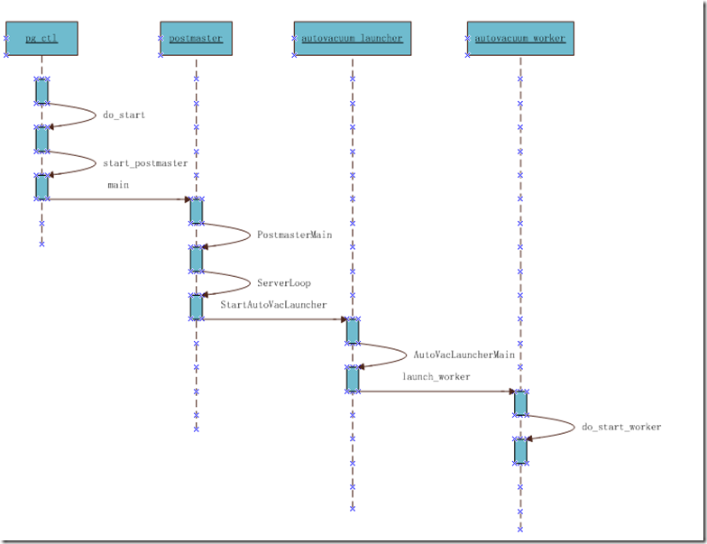
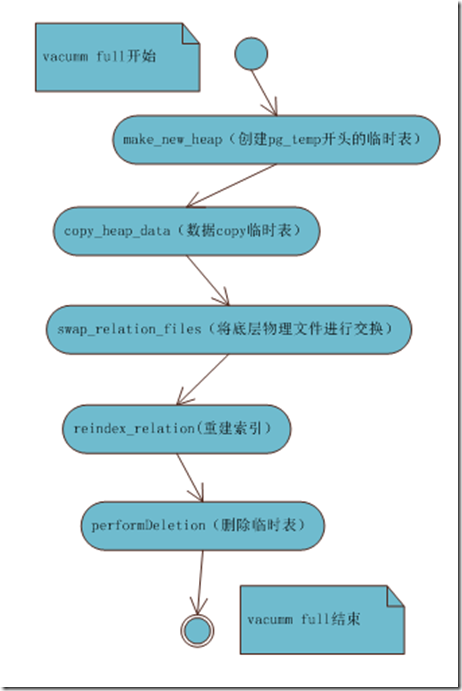
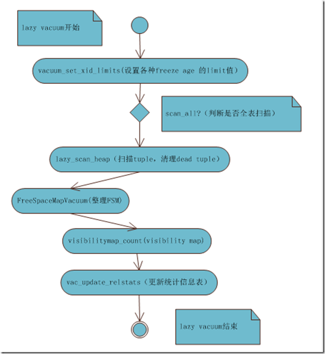
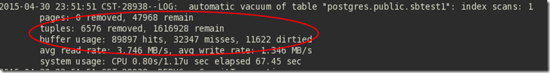
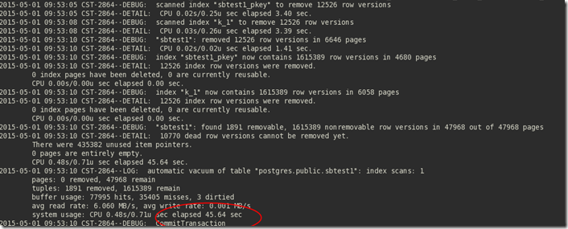
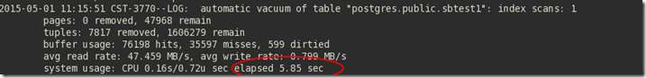
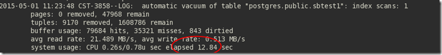
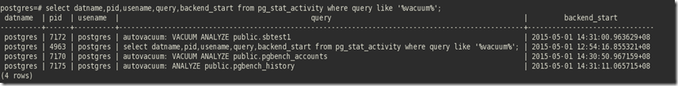
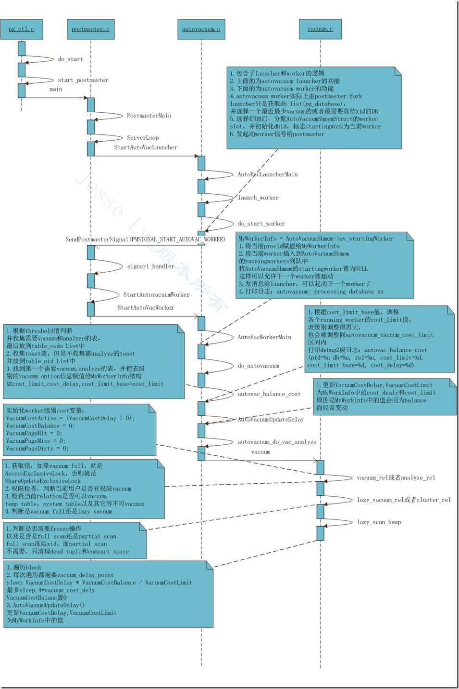

[原文](http://blog.itpub.net/30088583/)

我们知道，PG并没有像Oracle那样的undo来存放旧版本；而是将旧版本直接存放于relation文件中。那么带来的问题就是dead tuple过多，导致relation文件不断增大而带来空间膨胀问题。为了解决这个问题，PG中引入了vacuum后台进程，专门来清理这些dead tuple，并回收空间。当然vacuum的作用不仅在此，它还有以下其它功能：

#### vacuum的功能

1. 回收空间

这个通常是大家最容易想起来的功能。回收空间，将dead tuple清理掉。但是已经分配的空间，一般不会释放掉。除非做vacuum full，但是需要exclusive lock。一般不太建议，因为如果表最终还是会涨到这个高水位上，经常做vacuum full意义不是非常大。一般合理设置vacuum参数，进行常规vacuum也就够了。

2. 冻结tuple的xid

PG会在每条记录（tuple）的header中，存放xmin,xmax信息(增删改事务ID)。transactionID的最大值为2的32次方，即无符整形来表示。当transactionID超过此最大值后，会循环使用。

这会带来一个问题：就是最新事务的transactionID会小于老事务的transactionID。如果这种情况发生后，PG就没有办法按transactionID来区分事务的先后，也没有办法实现MVCC了。因此PG用vacuum后台进程，按一定的周期和算法触发vacuum动作，将过老的tuple的header中的事务ID进行冻结。

冻结事务ID，即将事务ID设置为“2”（“0”表示无效事务ID；“1”表示bootstrap，即初始化；“3”表示最小的事务ID）。PG认为被冻结的事务ID比任何事务都要老。这样就不会出现上面的这种情况了。

3. 更新统计信息

vacuum analyze时，会更新统计信息，让PG的planner能够算出更准确的执行计划。autovacuum_analyze_threshold和autovacuum_analyze_scale_factor参数可以控制analyze的触发的频率。

4. 更新visibility map

在PG中，有一个visibility map用来标记哪些page中是没有dead tuple的。这有两个好处，一是当vacuum进行scan时，直接可以跳过这些page。二是进行index-only scan时，可以先检查下visibility map。这样减少fetch tuple时的可见性判断，从而减少IO操作，提高性能。另外visibility map相对整个relation，还是小很多，可以cache到内存中。

#### vacuum参数介绍

autovacuum有好多参数，用来控制其行为，大致有以下几个：

- autovacuum：默认为on，表示是否开起autovacuum。默认开起。特别的，当需要冻结xid时，尽管此值为off，PG也会进行vacuum。
- autovacuum_naptime：下一次vacuum的时间，默认1min。 这个naptime会被vacuum launcher分配到每个DB上。autovacuum_naptime/num of db。
- log_autovacuum_min_duration：记录autovacuum动作到日志文件，当vacuum动作超过此值时。 “-1”表示不记录。“0”表示每次都记录。
- autovacuum_max_workers：最大同时运行的worker数量，不包含launcher本身。
- autovacuum_vacuum_threshold：默认50。与autovacuum_vacuum_scale_factor配合使用， autovacuum_vacuum_scale_factor：默认值为20%。当update,delete的tuples数量超过autovacuum_vacuum_scale_factor*table_size+autovacuum_vacuum_threshold时，进行vacuum。如果要使vacuum工作勤奋点，则将此值改小。

- autovacuum_analyze_threshold：默认50。与autovacuum_analyze_scale_factor配合使用, autovacuum_analyze_scale_factor：默认10%。当update,insert,delete的tuples数量超过autovacuum_analyze_scale_factor*table_size+autovacuum_analyze_threshold时，进行analyze。

- autovacuum_freeze_max_age和autovacuum_multixact_freeze_max_age：前面一个200 million,后面一个400 million。离下一次进行xid冻结的最大事务数。
- autovacuum_vacuum_cost_delay：如果为-1，取vacuum_cost_delay值。
- autovacuum_vacuum_cost_limit：如果为-1，到vacuum_cost_limit的值，这个值是所有worker的累加值。

基于代价的vacuum参数:

- vacuum_cost_delay ：计算每个毫秒级别所允许消耗的最大IO，vacuum_cost_limit/vacuum_cost_dely。 默认vacuum_cost_delay为20毫秒。
- vacuum_cost_page_hit ：vacuum时，page在buffer中命中时，所花的代价。默认值为1。
- vacuum_cost_page_miss：vacuum时，page不在buffer中，需要从磁盘中读入时的代价默认为10。 vacuum_cost_page_dirty：当vacuum时，修改了clean的page。这说明需要额外的IO去刷脏块到磁盘。默认值为20。
- vacuum_cost_limit：当超过此值时，vacuum会sleep。默认值为200。

把上面每个cost值调整的小点，然后把limit值调的大些，可以延长每次vacuum的时间。这样做，如果在高负载的系统当中，可能IO会有所影响，因vacuum。但是对于表物理存储空间的增长会有所减缓。


#### vacuum启动机制

在前面大致讲了vacuum的几大功能点，以及相关的一些参数，如何来调整vacuum。那么这一章节主要讲比较内核的一些东西。

1. PG发起vacuum的流程

在PG实例起动时，postmaster 进程会fork出autovacuum launcher进程。

```shell
26239 pts/0    S      0:01 /work/pgsql-10/bin/postgres -D ../data
26241 ?        Ss     0:17 postgres: checkpointer process
26242 ?        Ss     2:29 postgres: writer process
26243 ?        Ss     0:27 postgres: wal writer process
26244 ?        Ss     0:00 postgres: autovacuum launcher process
26245 ?        Ss     0:18 postgres: stats collector process
26246 ?        Ss     0:00 postgres: bgworker: logical replication launcher
```

完整的vacuum进程创建如下：

pg_ctl命令行起动PG实例，然后fork出postmaster Server进程，这也是PG的主进程。postmaster进程再负责fork各种其它后台进程。

按以下顺序，依次起动：logger进程，checkpoint进程，writer进程，wal writer进程，autovacuum launcher进程以及stats collector进程。

autovacuum launcher进程再负责fork autovacuum worker进程。我们具体的vacuum动作最后都交由worker进程来做，干杂活。

默认情况下，最多有三个worker进程，由参数autovacuum_max_workers控制。



2. autovacuum launcher进程

autovacuum launcher是vacuum worker的总调度者。在起vacuum worker时，会先balance一次vacuum_cost_limit值，balance的过程就是新的worker起来时，

赋予此worker后面因vacuum而消耗的最大允许IO limit。因为vacuum_cost_limit值是所有worker平摊的，我们设置的vacuum_cost_limit是所有worker的总累加值。

因此新的work加入进来后，需要做两件事：一是计算新的work的cost_limit值；二是调整已经在running的worker的cost_limit值。

另外值得注意的是：从目前源码中得知，vacuum_cost_limit的值是要被vacuum_cost_delay时间平分掉的。假设cost_limit的值是200，cost_delay是10毫秒，max worker是3个，

并且都在running状态。那么可以计算出，其实每个worker每个毫秒所能允许消耗的IO值是：200/10/3，约为6.6。

另外autovacuum launcher还要重建db list，根据autovacuum_naptime去计算每个db分配到的时间。

另外，值得注意的是，虽然可以几个worker一起运行，但是目前的做法是，在db 级别并行。也就是说worker是根据autovacuum launcher重建的db list去逐一遍历每个DB的。


#### vacuum清理模式

在前面，我们讲了vacuum的一些重要参数以及PG发起vacuum的流程。这个章节我们重要讲下vacuum 的实现，为了清理 dead tuple，vacuum提供了两种模式，即 Concurrent VACUUM（lazy vacuum） 和 Full VACUUM。


1. vacumm full

vacuum full会锁表和索引，而且是“AccessExclusiveLock”级别的。其实vacuum full会重建整个表，这个功能实现在cluster.c文件中，因为其行为相当于是一个cluster重建的一个变种。

建临时表阶段：PG会新建一个以”pg_temp_%u”的临时表，临时表继承老表所有属性。”%u”是老表的OID。如果用户表有名字与这个临时表相同的，那么就会失败。另外临时表的OID是relfilenode。 这个阶段，会向pg_class申请“RowExclusiveLock”锁，因为需要插入条目；也会做表名检查，检查是否与现有表名冲突。

copy数据阶段：然后将原来的数据copy到temp表中。对临时表，老表以及索引都以“AccessExclusiveLock”模式打开。另外对于toast，只是lock，不打开。在这个过程中完成Dead Tuple的清理。

swap表阶段：最后做一个swap table操作，新表将老表替换掉。交换只是将物理文件进行交换。reltablespace和relfilenode进行交换，会对pg_class再次申请“RowExclusiveLock”锁。

重建索引阶段：是在交换之后完成的，重建索引时，会更新一些统计信息。对表申请“ShareLock”锁。

删除临时表阶段：索引重建完成后，将带有老物理文件的新临时表进行删除。



2. lazy vacumm

PG在lazy vaccum之前，会先判断此次vacuum是full scan还是part scan。判断靠vacuum_freeze_table_age参数，它只与newest xid和relfrozenxid比较，

公式为：

```
relfrozenxid < newestxid - vacuum_freeze_table_age
```

演变后：

```
vacuum_freeze_table_age < newestxid - relfrozenxid
```

vacuum_freeze_table_age默认值为150million。因此如果一个表在pg_class中的relfrozenxid比newestxid小150 million时，就会触发全表扫描，完成后更新pg_class中的relfrozenxid。

vacuum_freeze_table_age的最大值是0.95*autovacuum_freeze_max_age。

新的冻结relfroenxid的计算需要靠以下公式的运算结果来判断：

```
oldestXmin – vacuum_freeze_min_age < (newestxid - autovacuum_freeze_max_age)
```

上面公式演变后成： 

```
autovacuum_freeze_max_age - vacuum_freeze_min_age < newest xid – oldestXmin
```


| **relfrozenxin取值？** | **公式成立**                   | **公式不成立**                                      |
| ---------------------- | ------------------------------ | --------------------------------------------------- |
| **full scan**          | oldestXmin，说明oldestXmin过老 | oldestXmin-vacuum_freeze_min_age，如果是负值，返回3 |
| **part scan**          | 0                              | 0                                                   |

从上面可以知道，part scan是不会更新pg_class中的relfrozenxid值的，只有full scan会去更新。原因很简单，part scan实际上只是清理dead tuple,FSM(Free Space Map)和标记visibility map。
默认情况下，autovacuum_freeze_max_age 的值为200million，vacuum_freeze_min_age 为50million。那也就是说oldest xid与newest xid的差距不能大于150million。

否则，PG就认为oldestXmin已经太老了，就会提示用户尽量关闭事务，以免发生xid循环使用的问题（wraparound transaction xid）。

对于一个系统，如果每秒事务量为1W tps，可以支持15000秒，也就是4个小时左右。vacuum_freeze_min_age 的最大值不能超过autovacuum_freeze_max_age/2，也就是100million。

对于multixid的冻结，也是同样的计算方法，只不过autovacuum_multixact_freeze_max_age的值为400million，

PG用这个方法，完美解决了wraparound 问题。




#### cost based vacuum

PostgreSQL cost based vacuum的意思就是指每次 vacuum，进行heap scan时，都会基于IO cost进行sleep。如果IO cost越大，总体sleep的时间就会越长。也就是说scan 表，并且清理dead tuple是断断续续的，并不会一次性全vacuum完。这样子做的原因就是尽量避免对当前DML操作的影响，从而减少因vacuum而对系统IO的压力。



cost based 有几个非常重要的参数：

- vacuum_cost_delay ： 默认vacuum_cost_delay为20毫秒。 heap scan时，需要sleep的时间。     
- vacuum_cost_page_hit ：vacuum时，page在buffer中命中时，所花的代价。默认值为1。
- vacuum_cost_page_miss：vacuum时，page不在buffer中，需要从磁盘中读入时的代价默认为10。
- vacuum_cost_page_dirty：当vacuum时，修改了clean的page。这说明需要额外的IO去刷脏块到磁盘。默认值为20。
- vacuum_cost_limit：默认为200，单位时间内多个vacuum worker完成vacuum而不被sleep 惩罚的所允许IO最大消耗值。

上面带有字样“page”的参数是在readbuffer时，计算的代价。它会及时更新到vacuumCostBalance值中，这个值是每个值的总和。即：

```
vacuumCostBalance = vacuum_cost_page_hit * x + vacuum_cost_page_miss * Y  + vacuum_cost_page_dirty * Z
```

其中x,y,z为访问次数。按默认值转换后为：

```
vacuumCostBalance = 1 * x + 10 * Y  + 20 * Z。
```

vacuum_cost_limit有两个用途：

其一是用来计算每个vacuum worker毫秒级别所允许消耗的最大IO，vacuum_cost_limit/vacuum_cost_dely。也就是说每个worker会平摊掉这个cost值。一句话概括就是所有vacuum worker在vacuum_cost_delay时间段
内所允许消耗的最大IO。当新的vacuum_worker进来，都会rebalance一把，得到此worker的VacuumCostLimit值。

其二是在cost base模式下，用来控制每次delay的时间。每次delay最小值为vacuum_cost_delay值，最大值为4*vacuum_cost_delay值。**判断依据为VacuumCostBalance / VacuumCostLimit的值是否大于”4“**。大于”4“之后就是4 * vacuum_cost_delay。PG设置delay最大值为4倍，就是不希望延迟太长。其实4倍的效果已经是非常明显了。因为在vacuum过程中需要scan heap,index等，而且delay都是在block级别的。**因此，如果某个表IO很高时，就需要通过调高vacuum_cost_limit值来缩短delay时间，从而减少空间爆增量。**

从上面两点看出，这是一个非常重要的值，如果这个值设置不够高，也就是说跟当前的系统TPS不匹配的话，那么导致的结果就是vacuum老是被delay，一个TPS高的表，往往就需要很常的时间来vacuum了。

因此，如果高TPS系统，本人还是建议设置的高些。不然高TPS表，不被及时vacuum完成，而是被delay住，那么将导致这个表的增长是非常恐怖的，往往会引起性能问题。这个时候变成大表之后，一般vacuum已经不起作用了，需要vacuum full来处理，而vacuum full是会锁表的。这会导致对应用严重伤害。这个时候有人会跳出来说，vacuum频率高点可能会影响当前的性能。这个当然会有，在IO上会有争用。但是这个性能问题，我们是可能通过其它方式来规避的。比如说应用设计以及数据库分片技术等。

我们先看一个例子，来分析PG是如何基于IO cost，从而来delay vacuum 的：


从上面，看Deal Tuples为6116，已经超过threshod值1651，所以后面开始vacuuming “public.sbtest1”



但是总共花了45.64s，才vacuum完成。这个时候的cost_limit值为100。



我调整了cost_limit的值到1000，这个时候，可以看到只用了5.85秒。vacuum速度快多了。

这是为什么呢？原因就是每次scan tuple时，delay的时间少了。PG在索引，表，visibility map等scan进，都嵌入了vacuum_delay_point（）方法。

这使得delay的效果是堆积的。当我改成400后，12.84s。



**从上面的例子中，已经完全说明了，为什么有些高TPS系统，vacuum老是起不了效果。高DML操作表，一直被增大的原因。**

另外，autovacuum已经能做到表级并行了。下面三个表位于同一个库中。



#### vacuum内核源码机理

为了能全面理解PG整个vacuum的过程，专门绘制了下面一个完整的过程图，用以记录其内核源码实现机理。整个过程比较复杂。大致分为以下几个部分：

一、pg_ctl

这个负责PG server启动，调用start_postmaster后，起动PG主server进程postmaster。后面任务交给postmaster来处理。

二、postmaster

负责起动autovacuum launcher，起动autovacuum launcher后台进程后，控制权交给launcher。

三、autovacuum launcher和 autovacuum worker

这两个进程的源码都在autovacuum.c中，autovacuum.c中的源码可以大致上为分两个阶段：

第一个阶段：主要为launcher的职责。负责为将要起来工作的worker分配AutoVacuumShemStruct结构槽，并且选择一个最近最少vacuum或者最需要冻结xid的DB。

然后将此dbid赋值给worker，并发送信号给postmaster,说已经准备好woker了，可以起动了。

第二个阶段：主要为worker的职责。postmaster接收到launcher的信号后，起动AutoVacuumShemStruct中状态为startingwork的auto vacuum worker。

主要是工作是fork一个进程，并将pid赋值给此worker，然后发信号给launcher，说你可以准备起下一个worker了。

 

**进入autovacuum worker后:**

1.首先收集需要vacuum或者analyze的表。需要vacumm的表的判断依据是Dead Tuples的值超过：

```
vacuum_threshold + vacuum_scale_factor * num_tuples。
```

需要analyze的表的判断依据是DML的记录超过此值：

 ```
analyze_threshold + analyze_scale_factor * num_tuples。
 ```

2.找到第一个需要vacuum的表，并将此表的 vacuum option参数赋值给autovacuum worker，即MyWorkInfo结构体（指向AutoVacuumShemStruct中的worker）。

如cost_limit,cost_delay，cost_limit_base参数。其中cost_limit_base的值等于cost_limit的值。

3.调整每个在running 的worker的cost_limit值。worker中有cost_limit和cost_limit_base两个变量。cost_limit和cost_limit_base的值，在刚开始没有经过balance时，是相等的。

但是经过balance过，cost_limit的值会发生变化。而cost_limit_base的值基本上就是表级别用”alter table xxx set(autovacuum_vacuum_cost_limt=1000)”命令来设置的值。

设置好后，在balance过程中，cost_limit_base的值基本上不变。因此才在名字上加了”base”用于区别。如果没有设置，cost_limit和cost_limit_base都是autovacuum_vacuum_cost_limit这个在postgresql.conf配置的值。
表级别的设置值优先级高于postgresql.conf中定义的全局值。balance时，参考cost_limit_base的值对每个running worker 的cost_limit进行调整。cost_limit最大值不超过cost_limit_base，即需在[1,cost_limit_base]闭区间内。cost_limit值的意义其实就是每个毫秒时间内vacuum所能允许消耗的IO cost值。即cost_limit/cost_delay。而这个cost_limit/cost_delay又会被autovacuum_max_workers个workers平分掉，而不是简单的做个限制。如果超过，就是最高以4倍的cost_delay来惩罚，这将导致vacuum过程严重变长。

详细说明见”第6“步。

4.balance完成后，接着就用上面的cost_limit和cost_delay值去更新VacuumCostDelay和VacuumCostLimit这两个值。并将VacuumCostBalance的值置为“0”。这三个值的意义在”第6“步中讲。

5.接着去判断此次发起的是哪种类型的vacuum: vacuum full 还是lazy vacuum。如果是vacuum full，相当于重建relation，需要AccessExclusiveLock。如果是lazy vacuum，则是SharedUpdateExclusiveLock。lazy vacuum 还要判断是否需要full scan。如果是full scan，需要更新pg_class中的relfrozenxid值。partial scan只清理dead tuple和compact free space。

6.最后就是去scan heap了。按每个block依次遍历。每遍历一个block都需要 delay一次。在这里上面“第4步”中的三个值就派上用场了。每次sleep的时间按公式：

```
msec = VacuumCostDelay * VacuumCostBalance/VacuumCostLimit
```

如果上面这个值大于4倍的VacuumCostDelay值，那么msec就等于“4*VacuumCostDelay”。否则就按上面公式算出的值进行sleep。sleep完成后，将MyWorkInfo中的cost_limit和cost_delay赋值给VacuumCostDelay,VacuumCostLimit，以适应balance过程。然后再次将VacuumCostBalance设置为“0”。

其中VacuumCostDelay和VacuumCostLimit基本上每次balance后就不变了。唯有VacuumCostBalance值是在整个block遍历的过程中变化的，它的cost计算是根据当前page hit,page miss以及page dirty来计算的，参考上面的cost based vacuum。因此如果一个表的update,delete操作很高，那么dead tuple就非常多，导致vacumm时，VacuumCostBalance值变高。因此如果要加快vacuum，减少一个表在vacuum时的delay时间，只有把cost_limit的值提高，也就是postgresql.conf中autovacuum_vacuum_cost中的值调大，才会使上面公式的值就小。

上面还是太理论了，还是有点难懂的。我举个简单的例子来说明下cost的计算：

假设当前有3个表需要vacuum，而且起了3个worker。每个表的autovacuum_vacuum_cost_limit都为默认值200，autovacuum_vacuum_cost_delay的值都为10ms。另外postgresql.conf中配置的这两个值也是默认值，分别为200和10ms。那么cost_limit 的值就是：200/3=66。当然，如果在每个表的cost_limit_base都不同的情况下，计算会复杂点。总体思路就是cost_limit_base大的表，分到的cost_limit值也大些。但是区间还是在”第3步”中的区间，即[1,cost_limit_base]。cost_limit的可配置范围在[1,10000]；cost_delay的值在[1,100]，单位是ms。

**计算公式我归纳如下：**

每个runing worker都加起来。

```
cost_total = sum(cost_limit_base/cost_limit_delay)
```

postgresql.conf中配置的值。

```
cost_avail = autovacuum_vacuum_cost_limit/autovacuum_vacuum_cost_delay
```

每个worker的cost_limit

```
cost_limit = max(min(cost_avail * cost_limit_base/cost_total, cost_limit_base), 1)
```

所以上面的值代入，得到约为66。 

PG用这种算法，完善实现了cost based vacuum。详细图见下：

