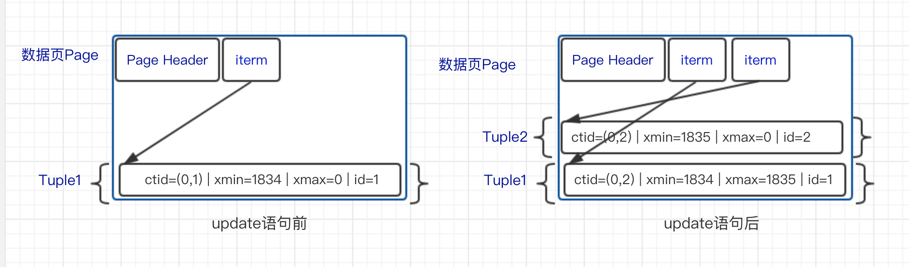

我们在使用PostgreSQL的时候，可能会碰到表膨胀的问题，即表的数据量并不大，但是占用的磁盘空间比较大，查询比较慢。为什么PostgreSQL有可能发生表膨胀呢？这是因为PostgreSQL引入了MVCC机制来保证事务的隔离性，实现数据库的隔离级别。

在数据库中，并发的数据库操作会面临脏读（Dirty Read）、不可重复读（Nonrepeatable Read）、幻读（Phantom Read）和串行化异常等问题，为了解决这些问题，在标准的SQL规范中对应定义了四种事务隔离级别：

- RU(Read uncommitted)：读未提交
- RC(Read committed)：读已提交
- RR(Repeatable read)：重复读
- SERIALIZABLE(Serializable)：串行化

当前PostgreSQL已经支持了这四种标准的事务隔离级别（可以使用SET TRANSACTION语句来设置，详见[文档](https://www.postgresql.org/docs/current/static/sql-set-transaction.html)），下表是PostgreSQL官方文档上列举的四种事务隔离级别和对应数据库问题的关系：

| Isolation Level  | Dirty Read             | Nonrepeatable Read | Phantom Read           | Serialization Anomaly |
| ---------------- | ---------------------- | ------------------ | ---------------------- | --------------------- |
| Read uncommitted | Allowed, but not in PG | Possible           | Possible               | Possible              |
| Read committed   | Not possible           | Possible           | Possible               | Possible              |
| Repeatable read  | Not possible           | Not possible       | Allowed, but not in PG | Possible              |
| Serializable     | Not possible           | Not possible       | Not possible           | Not possible          |

需要注意的是，在PostgreSQL中：

- RU隔离级别不允许脏读，实际上和Read committed一样
- RR隔离级别不允许幻读

在PostgreSQL中，为了保证事务的隔离性，实现数据库的隔离级别，引入了MVCC(Multi-Version Concurrency Control)多版本并发控制。

#### MVCC常用实现方法

一般MVCC有2种实现方法：

- 写新数据时，把旧数据转移到一个单独的地方，如回滚段中，其他人读数据时，从回滚段中把旧的数据读出来，如Oracle数据库和MySQL中的innodb引擎。
- 写新数据时，旧数据不删除，而是把新数据插入。PostgreSQL就是使用的这种实现方法。

两种方法各有利弊，相对于第一种来说，PostgreSQL的MVCC实现方式优缺点如下：

- 优点
  - 无论事务进行了多少操作，事务回滚可以立即完成
  - 数据可以进行很多更新，不必像Oracle和MySQL的Innodb引擎那样需要经常保证回滚段不会被用完，也不会像oracle数据库那样经常遇到“ORA-1555”错误的困扰
- 缺点
  - 旧版本的数据需要清理。当然，PostgreSQL 9.x版本中已经增加了自动清理的辅助进程来定期清理
  - 旧版本的数据可能会导致查询需要扫描的数据块增多，从而导致查询变慢

#### PostgreSQL中MVCC的具体实现

为了实现MVCC机制，必须要：

- 定义多版本的数据。在PostgreSQL中，使用元组头部信息的字段来标示元组的版本号
- 定义数据的有效性、可见性、可更新性。在PostgreSQL中，通过当前的事务快照和对应元组的版本号来判断该元组的有效性、可见性、可更新性
- 实现不同的数据库隔离级别

接下来，我们会按照上面的顺序，首先介绍多版本元组的存储结构，再介绍事务快照、数据可见性的判断以及数据库隔离级别的实现。

#### 多版本元组存储结构

为了定义MVCC 中不同版本的数据，PostgreSQL在每个元组的头部信息HeapTupleHeaderData中引入了一些字段如下：

```c
struct HeapTupleHeaderData
{
	union
	{
		HeapTupleFields t_heap;
		DatumTupleFields t_datum;
	}			t_choice;

	ItemPointerData t_ctid;		/* current TID of this or newer tuple (or a
								 * speculative insertion token) */

	/* Fields below here must match MinimalTupleData! */

	uint16		t_infomask2;	/* number of attributes + various flags */

	uint16		t_infomask;		/* various flag bits, see below */

	uint8		t_hoff;			/* sizeof header incl. bitmap, padding */

	/* ^ - 23 bytes - ^ */

	bits8		t_bits[FLEXIBLE_ARRAY_MEMBER];	/* bitmap of NULLs */

	/* MORE DATA FOLLOWS AT END OF STRUCT */
};
```

其中：

- t_heap存储该元组的一些描述信息，下面会具体去分析其字段
- t_ctid存储用来记录当前元组或新元组的物理位置
  - 由块号和块内偏移组成
  - 如果这个元组被更新，则该字段指向更新后的新元组
  - 这个字段指向自己，且后面t_heap中的xmax字段为空，就说明该元组为最新版本
- t_infomask存储元组的xmin和xmax事务状态，以下是t_infomask每位分别代表的含义：

```c
#define HEAP_HASNULL        0x0001    /* has null attribute(s) */
#define HEAP_HASVARWIDTH        0x0002    /* has variable-width attribute(s) 有可变参数 */
#define HEAP_HASEXTERNAL        0x0004    /* has external stored attribute(s) */
#define HEAP_HASOID        0x0008    /* has an object-id field */
#define HEAP_XMAX_KEYSHR_LOCK    0x0010    /* xmax is a key-shared locker */
#define HEAP_COMBOCID        0x0020    /* t_cid is a combo cid */
#define HEAP_XMAX_EXCL_LOCK    0x0040    /* xmax is exclusive locker */
#define HEAP_XMAX_LOCK_ONLY    0x0080    /* xmax, if valid, is only a locker */
/* xmax is a shared locker */
#define HEAP_XMAX_SHR_LOCK  (HEAP_XMAX_EXCL_LOCK | HEAP_XMAX_KEYSHR_LOCK)
#define HEAP_LOCK_MASK    (HEAP_XMAX_SHR_LOCK | HEAP_XMAX_EXCL_LOCK | \
                         HEAP_XMAX_KEYSHR_LOCK)
#define HEAP_XMIN_COMMITTED    0x0100    /* t_xmin committed 即xmin已经提交*/
#define HEAP_XMIN_INVALID        0x0200    /* t_xmin invalid/aborted */
#define HEAP_XMIN_FROZEN        (HEAP_XMIN_COMMITTED|HEAP_XMIN_INVALID)
#define HEAP_XMAX_COMMITTED    0x0400    /* t_xmax committed即xmax已经提交*/
#define HEAP_XMAX_INVALID        0x0800    /* t_xmax invalid/aborted */
#define HEAP_XMAX_IS_MULTI        0x1000    /* t_xmax is a MultiXactId */
#define HEAP_UPDATED        0x2000    /* this is UPDATEd version of row */
#define HEAP_MOVED_OFF        0x4000    /* moved to another place by pre-9.0                    * VACUUM FULL; kept for binary                     * upgrade support */
#define HEAP_MOVED_IN        0x8000    /* moved from another place by pre-9.0                * VACUUM FULL; kept for binary                  * upgrade support */
#define HEAP_MOVED (HEAP_MOVED_OFF | HEAP_MOVED_IN)
#define HEAP_XACT_MASK        0xFFF0    /* visibility-related bits */
```

上文HeapTupleHeaderData中的t_heap存储着元组的一些描述信息，结构如下：

```c
typedef struct HeapTupleFields
{
TransactionId t_xmin;   /* inserting xact ID */
TransactionId t_xmax;   /* deleting or locking xact ID */

union
{
   CommandId t_cid;   /* inserting or deleting command ID, or both */
   TransactionId t_xvac; /* VACUUM FULL xact ID */
}    t_field3;
} HeapTupleFields;
```

其中:

- t_xmin 存储的是产生这个元组的事务ID，可能是insert或者update语句
- t_xmax 存储的是删除或者锁定这个元组的事务ID
- t_cid 包含cmin和cmax两个字段，分别存储创建这个元组的Command ID和删除这个元组的Command ID
- t_xvac 存储的是VACUUM FULL 命令的事务ID

这里需要简单介绍下PostgreSQL中的事务ID：

- 由32位组成，这就有可能造成事务ID回卷的问题，具体参考[文档](https://www.postgresql.org/docs/current/static/routine-vacuuming.html#vacuum-for-wraparound)
- 顺序产生，依次递增
- 没有数据变更，如INSERT、UPDATE、DELETE等操作，在当前会话中，事务ID不会改变

PostgreSQL主要就是通过t_xmin，t_xmax，cmin和cmax，ctid，t_infomask来唯一定义一个元组（t_xmin，t_xmax，cmin和cmax，ctid实际上也是一个表的隐藏的标记字段），下面以一个例子来表示元组更新前后各个字段的变化。

- 创建表test，插入数据，并查询t_xmin，t_xmax，cmin和cmax，ctid属性

```sql
postgres=# create table test(id int);
CREATE TABLE
postgres=# insert into test values(1);
INSERT 0 1
postgres=# select ctid, xmin, xmax, cmin, cmax,id from test;
 ctid  | xmin | xmax | cmin | cmax | id
-------+------+------+------+------+----
 (0,1) | 1834 |    0 |    0 |    0 |  1
(1 row)
```

- 更新test，并查询t_xmin，t_xmax，cmin和cmax，ctid属性

```sql
postgres=# update test set id=2;
UPDATE 1
postgres=# select ctid, xmin, xmax, cmin, cmax,id from test;
 ctid  | xmin | xmax | cmin | cmax | id
-------+------+------+------+------+----
 (0,2) | 1835 |    0 |    0 |    0 |  2
(1 row)
```

- 使用heap_page_items 方法查看test表对应page header中的内容

```sql
postgres=# select * from heap_page_items(get_raw_page('test',0));
 lp | lp_off | lp_flags | lp_len | t_xmin | t_xmax | t_field3 | t_ctid | t_infomask2 | t_infomask | t_hoff | t_bits | t_oid
----+--------+----------+--------+--------+--------+----------+--------+-------------+------------+--------+--------+-------
  1 |   8160 |        1 |     28 |   1834 |   1835 |        0 | (0,2)  |       16385 |       1280 |     24 |        |
  2 |   8128 |        1 |     28 |   1835 |      0 |        0 | (0,2)  |       32769 |      10496 |     24 |        |
```

从上面可知，实际上数据库存储了更新前后的两个元组，这个过程中的数据块中的变化大体如下： 



Tuple1更新后会插入一个新的Tuple2，而Tuple1中的ctid指向了新的版本，同时Tuple1的xmax从0变为1835，这里可以被认为被标记为过期（只有xmax为0的元组才没过期），等待PostgreSQL的自动清理辅助进程回收掉。

也就是说，PostgreSQL通过HeapTupleHeaderData 的几个特殊的字段，给元组设置了不同的版本号，元组的每次更新操作都会产生一条新版本的元组，版本之间从旧到新形成了一条版本链（旧的ctid指向新的元组）。

不过这里需要注意的是，更新操作可能会使表的每个索引也产生新版本的索引记录，即对一条元组的每个版本都有对应版本的索引记录。这样带来的问题就是浪费了存储空间，旧版本占用的空间只有在进行VACCUM时才能被回收，增加了数据库的负担。

为了减缓更新索引带来的影响，8.3之后开始使用HOT机制。定义符合下面条件的为HOT元组：

- 索引属性没有被修改
- 更新的元组新旧版本在同一个page中，其中新的被称为HOT元组

更新一条HOT元组不需要引入新版本的索引，当通过索引获取元组时首先会找到最旧的元组，然后通过元组的版本链找到HOT元组。这样HOT机制让拥有相同索引键值的不同版本元组共用一个索引记录，减少了索引的不必要更新。

#### 事务快照的实现

为了实现元组对事务的可见性判断，PostgreSQL引入了事务快照SnapshotData，其具体数据结构如下：

```c
typedef struct SnapshotData
{
    SnapshotSatisfiesFunc satisfies;    /* tuple test function */
    TransactionId xmin;        /* all XID < xmin are visible to me */
    TransactionId xmax;        /* all XID >= xmax are invisible to me */
    TransactionId *xip;    //所有正在运行的事务的id列表
    uint32    xcnt;    /* # of xact ids in xip[]，正在运行的事务的计数 */
    TransactionId *subxip;           //进程中子事务的ID列表
    int32    subxcnt;        /* # of xact ids in subxip[]，进程中子事务的计数 */
    bool    suboverflowed;    /* has the subxip array overflowed? */
    bool    takenDuringRecovery;    /* recovery-shaped snapshot? */
    bool    copied;            /* false if it's a static snapshot */
    CommandId    curcid;    /* in my xact, CID < curcid are visible */
    uint32    speculativeToken;
    uint32    active_count;    /* refcount on ActiveSnapshot stack，在活动快照链表里的
*引用计数 */
    uint32    regd_count;    /* refcount on RegisteredSnapshots，在已注册的快照链表
*里的引用计数 */
    pairingheap_node ph_node;    /* link in the RegisteredSnapshots heap */
    TimestampTz  whenTaken;    /* timestamp when snapshot was taken */
    XLogRecPtr   lsn;        /* position in the WAL stream when taken */
} SnapshotData;
```

**这里注意区分SnapshotData的xmin，xmax和HeapTupleFields的t_xmin，t_xmax**

事务快照是用来存储数据库的事务运行情况。一个事务快照的创建过程可以概括为：

- 查看当前所有的未提交并活跃的事务，存储在数组中
- 选取未提交并活跃的事务中最小的XID，记录在快照的xmin中
- 选取所有已提交事务中最大的XID，加1后记录在xmax中
- 根据不同的情况，赋值不同的satisfies，创建不同的事务快照

其中根据xmin和xmax的定义，事务和快照的可见性可以概括为：

- 当事务ID小于xmin的事务表示已经被提交，其涉及的修改对当前快照可见
- 事务ID大于或等于xmax的事务表示正在执行，其所做的修改对当前快照不可见
- 事务ID处在 [xmin, xmax)区间的事务, 需要结合活跃事务列表与事务提交日志CLOG，判断其所作的修改对当前快照是否可见，即SnapshotData中的satisfies。

satisfies是PostgreSQL提供的对于事务可见性判断的统一操作接口。目前在PostgreSQL 10.0中具体实现了以下几个函数：

- HeapTupleSatisfiesMVCC：判断元组对某一快照版本是否有效
- HeapTupleSatisfiesUpdate：判断元组是否可更新
- HeapTupleSatisfiesDirty：判断当前元组是否已脏
- HeapTupleSatisfiesSelf：判断tuple对自身信息是否有效
- HeapTupleSatisfiesToast：用于TOAST表（参考[文档](https://www.postgresql.org/docs/current/static/storage-toast.html)）的判断
- HeapTupleSatisfiesVacuum：用在VACUUM，判断某个元组是否对任何正在运行的事务可见，如果是，则该元组不能被VACUUM删除
- HeapTupleSatisfiesAny：所有元组都可见
- HeapTupleSatisfiesHistoricMVCC：用于CATALOG 表

上述几个函数的参数都是 (HeapTuple htup, Snapshot snapshot, Buffer buffer)，其具体逻辑和判断条件，本文不展开具体讨论，有兴趣的可以参考《PostgreSQL数据库内核分析》的7.10.2 MVCC相关操作。

此外，为了对可用性判断的过程进行加速，PostgreSQL还引入了Visibility Map机制（详见[文档](https://www.postgresql.org/docs/current/static/storage-vm.html)）。Visibility Map标记了哪些page中是没有dead tuple的。这有两个好处：

- 当vacuum时，可以直接跳过这些page
- 进行index-only scan时，可以先检查下Visibility Map。这样减少fetch tuple时的可见性判断，从而减少IO操作，提高性能

另外visibility map相对整个relation，还是小很多，可以cache到内存中。

#### 隔离级别的实现

PostgreSQL中根据获取快照时机的不同实现了不同的数据库隔离级别（对应代码中函数GetTransactionSnapshot）：

- 读未提交/读已提交：每个query都会获取最新的快照CurrentSnapshotData
- 重复读：所有的query 获取相同的快照都为第1个query获取的快照FirstXactSnapshot
- 串行化：使用锁系统来实现

#### 总结

为了保证事务的原子性和隔离性，实现不同的隔离级别，PostgreSQL引入了MVCC多版本机制，概括起就是：

- 通过元组的头部信息中的xmin，xmax以及t_infomask等信息来定义元组的版本
- 通过事务提交日志来判断当前数据库各个事务的运行状态
- 通过事务快照来记录当前数据库的事务总体状态
- 根据用户设置的隔离级别来判断获取事务快照的时间

如上文所讲，PostgreSQL的MVCC实现方法有利有弊。其中最直接的问题就是表膨胀，为了解决这个问题引入了AutoVacuum自动清理辅助进程，将MVCC带来的垃圾数据定期清理，这部分内容我们将在下面进行分析。


---


PostgreSQL中的MVCC机制同时存储新旧版本的元组，对于经常更新的表来说，会造成表膨胀的情况。为了解决这个问题，PostgreSQL 引入了[VACUUM](https://www.postgresql.org/docs/current/static/sql-vacuum.html)和[ANALYZE](https://www.postgresql.org/docs/current/static/sql-analyze.html)命令，并且引入了AutoVacuum自动清理。

在PostgreSQL中，AutoVacuum自动清理操作包括：

- 删除或重用无效元组的磁盘空间
- 更新数据统计信息，保证执行计划更优
- 更新visibility map，加速index-only scans （详见[文档](https://www.postgresql.org/docs/current/static/indexes-index-only-scans.html)）
- 避免XID 回卷造成的数据丢失（详见[文档](https://www.postgresql.org/docs/current/static/routine-vacuuming.html#vacuum-for-wraparound)）

为了实现自动清理，PostgreSQL引入了两种类型的辅助进程：

- autovacuum launcher
- autovacuum worker

本文主要分析autovacuum launcher进程相关操作，autovacuum worker比较复杂和重要，我们将在后面详细分析。

#### autovacuum launcher

autovacuum launcher 进程可以理解为AutoVacuum机制的守护进程，周期性地调度autovacuum worker进程。

#### 相关参数

autovacuum launcher 进程在postgresql.conf文件中的相关配置参数（支持对每个表单独配置参数，方法见[文档](https://www.postgresql.org/docs/current/static/sql-createtable.html#SQL-CREATETABLE-STORAGE-PARAMETERS)）如下：

- track_counts：是否开启统计信息收集功能。
- autovacuum：是否启动系统自动清理功能，默认值为on。
- autovacuum_max_workers：设置系统自动清理工作进程的最大数量。
- autovacuum_naptime：设置两次系统自动清理操作之间的间隔时间。
- autovacuum_vacuum_cost_limit：声明将在自动VACUUM操作里使用的开销限制数值。
- autovacuum_vacuum_cost_delay ：声明如果超过了上面的开销限制，则需要延迟清理的时间。
- autovacuum_freeze_max_age：设置需要强制对数据库进行清理的XID上限值。
- autovacuum_multixact_freeze_max_age：设置需要强制对数据库进行清理的multi XID上限值。

因为AutoVacuum依赖于统计信息，所以只有track_counts=on 且autovacuum=on 时，PostgreSQL才启动autovacuum launcher 进程。

autovacuum launcher 进程会周期性地创建autovacuum worker 进程，最多能够创建autovacuum_max_workers个autovacuum worker 进程。我们将会从下面二个方面来分析autovacuum launcher：

- 执行周期，即autovacuum launcher进程的休眠时间
- autovacuum worker 调度管理

#### 执行周期

上文的参数autovacuum_naptime决定了autovacuum launcher 的基本执行周期。在PostgreSQL中，理想状态是在autovacuum_naptime的时间内对所有的数据库进行一次清理，即每个数据库希望能够分配到autovacuum_naptime/(数据库的个数) 的时间片去创建一个autovacuum worker进行自动清理。这就要求autovacuum launcher 进程每经过autovacuum_naptime/(数据库的个数) 的时间就要被唤醒，并启动对应的autovacuum worker 进程。

基于此设计思想，autovacuum launcher 进程中维护了一个数据库列表DatabaseList，其中维护了各个database的期望AutoVacuum时间等信息，具体的元素结构如下：

```c
/* struct to keep track of databases in launcher */
typedef struct avl_dbase
{
	Oid			adl_datid;		/* hash key -- must be first */
	TimestampTz adl_next_worker;
	int			adl_score;
	dlist_node	adl_node;
} avl_dbase;
```

其中：

- adl_datid 表示对应database oid，是该Hash表结构的key
- TimestampTz 表示该database下次将要进行AutoVacuum的时间
- adl_score 表示该database对应的分值，该分值决定该database启动worker 的时间
- adl_node 表示该avl_dbase对应的在列表中的位置信息包括：

```c
struct dlist_node
{
	dlist_node *prev;
	dlist_node *next;
};
```

当autovacuum launcher初始化时，DatabaseList为空，需要重建，具体步骤如下：

- 刷新统计信息
- 建立一个Hash表dbhash存储adl_datid，即数据库ID和avl_dbase（上面的结构体）的对应关系
- 获取当前所有的数据库和数据库的统计信息，如果存在统计信息且不存在dbhash中，则插入到dbhash中，并将其avl_dbase->adl_score加1，adl_score最后统计存在统计信息且不存在dbhash中的database数量
- 将Hash 表中的avl_dbase按照adl_score排序，按照顺序给每个database的adl_next_worker赋值为当前时间+每个数据库分到的时间片*其在列表中的顺序。其中每个数据库分到的时间片= autovacuum_naptime/adl_score

可以看出，创建完成之后，DatabaseList中存储按照期望执行自动化清理的时间从大到小排序的数据库信息。

通过分析代码发现，autovacuum launcher进程的执行周期主要是由launcher_determine_sleep 函数来决定的：

1. 如果autovacuum worker 空闲列表（详见下文autovacuum worker 管理中的分析）为空，autovacuum launcher进程睡眠autovacuum_naptime 后唤醒，否则进行下面的判断
2. 如果当前DatabaseList不为空，则将DatabaseList列表尾部的数据库期望AutoVacuum的时间戳作为下次唤醒的时间
3. 除上面之外的情况，用autovacuum_naptime作为执行周期

如果当前的时间已经晚于第2种情况得到的时间戳，则纠正为autovacuum launcher最小的休眠时间100ms。

综上所述，我们知道：

- autovacuum launcher 基本周期是autovacuum_naptime。如果当前不存在空闲的autovacuum worker，则休眠autovacuum_naptime
- 在一个autovacuum_naptime工作周期里，每个database 数据库期望占用autovacuum_naptime/adl_score 时间（adl_score可以简单理解为当前存在统计信息的database总数），当该时间到达时，launch a worker，自动清理该数据库

#### autovacuum worker 管理

因为AutoVacuum的具体过程会消耗数据库资源（比如CPU），可能影响性能，在PostgreSQL中规定，autovacuum launcher可以启动最多autovacuum_max_workers个autovacuum worker 进程。为了管理autovacuum worker 进程，PostgreSQL维护了共享内存AutoVacuumShmemStruct来存储当前所有autovacuum worker的情况，其结构如下：

```c
typedef struct
{
	sig_atomic_t av_signal[AutoVacNumSignals];
	pid_t		av_launcherpid;
	dlist_head	av_freeWorkers;
	dlist_head	av_runningWorkers;
	WorkerInfo	av_startingWorker;
	AutoVacuumWorkItem av_workItems[NUM_WORKITEMS];
} AutoVacuumShmemStruct;
```

其中：

- av_signal目前是由长度为2的int 数组组成，分别用0，1来表示是否启动worker失败，是否需要重新计算对每个autovacuum worker 的资源限制
- av_launcherpid代表autovacuum launcher 的pid
- av_freeWorkers代表空闲的autovacuum woker 相应的WorkerInfoData 列表，WorkerInfoData的具体结构如下：

```c
/*-------------
 * This struct holds information about a single worker's whereabouts.  We keep
 * an array of these in shared memory, sized according to
 * autovacuum_max_workers.
 *
 * wi_links		entry into free list or running list
 * wi_dboid		OID of the database this worker is supposed to work on
 * wi_tableoid	OID of the table currently being vacuumed, if any
 * wi_sharedrel flag indicating whether table is marked relisshared
 * wi_proc		pointer to PGPROC of the running worker, NULL if not started
 * wi_launchtime Time at which this worker was launched
 * wi_cost_*	Vacuum cost-based delay parameters current in this worker
 *
 * All fields are protected by AutovacuumLock, except for wi_tableoid which is
 * protected by AutovacuumScheduleLock (which is read-only for everyone except
 * that worker itself).
 *-------------
 */
typedef struct WorkerInfoData
{
	dlist_node	wi_links;
	Oid			wi_dboid;
	Oid			wi_tableoid;
	PGPROC	   *wi_proc;
	TimestampTz wi_launchtime;
	bool		wi_dobalance;
	bool		wi_sharedrel;
	int			wi_cost_delay;
	int			wi_cost_limit;
	int			wi_cost_limit_base;
} WorkerInfoData;
```

- av_runningWorkers代表正在运行的autovacuum woker 相应的WorkerInfoData 列表
- av_startingWorker代表正在启动的autovacuum woker 相应的WorkerInfoData
- av_workItems存储着一组（256个）AutoVacuumWorkItem。AutoVacuumWorkItem存储着每个autovacuum worker的item 信息。

从上面可以看出，autovacuum launcher中维护三种不同状态的autovacuum worker 进程列表：

- 空闲的autovacuum worker进程列表
- 正在启动的autovacuum worker进程
- 运行中的autovacuum worker进程列表

autovacuum launcher 通过维护AutoVacuumShmemStruct的信息，达到调度autovacuum worker的作用，具体如下：

- 初始化共享内存时，初始化长度为autovacuum_max_workers的空闲autovacuum worker进程列表。
- 如果autovacuum launcher进程需要一个worker进程，空闲列表为不空且没有启动中的autovacuum worker进程，则启动一个autovacuum worker进程，并从空闲列表取出一个autovacuum worker 进程，将共享内存中的av_startingWorker赋值为该autovacuum worker的WorkerInfoData。
- 如果autovacuum worker启动成功，将该autovacuum worker 的WorkerInfoData放入共享内存的av_runningWorkers列表中。
- autovacuum worker进程退出，将该autovacuum worker 的WorkerInfoData放入共享内存的av_freeWorkers列表中

其中需要注意的是autovacuum launcher进程中只允许存在一个“启动中”状态的autovacuum worker进程，如果启动超时（状态一直为“启动中”时间超过autovacuum_naptime）将被取消启动。autovacuum launcher进程调用launch_worker函数来选择一个database，并为其启动相应的autovacuum worker。launch_worker主要做两件事情：

- 选取合适的database，并且向postmaster 发送信号创建worker进程
- 更新该database的期望autovaccum的时间为当前时间+autovacuum_naptime/adl_score

其中，符合下面条件的database将会启动一个worker，进行自动清理：

- 数据库的最大xid超过配置的autovacuum_freeze_max_age或者最大multixact超过autovacuum_multixact_freeze_max_age。
- 没有符合上面条件的数据库，则选择数据库列表中最长时间未执行过自动清理操作的数据库。

至此，我们可以概括出autovacuum launcher的大致操作：

- 调用函数rebuild_database_list，初始化时DatabaseList。DatabaseList保存每个database的laucher期望运行时间等信息
- 设置进程休眠时间。根据空闲autovacuum worker列表和数据库列表DatabaseList来计算休眠的时间。同时autovacuum launcher休眠也可以被其他信号中断。
- 处理失败的autovacuum worker进程列表，重新向Postmaster发送信号创建autovacuum worker进程。
- 处理一直启动的autovacuum worker进程，如果超时，则重置该autovacuum worker信息。
- 如果DatabaseList为空或者当前时间已经晚于DatabaseList中存储的各个数据库的期望执行autovacuum的最早时间，则会调用launch_worker。launch_worker会去选择合适的数据库并向Postmaster发送信号创建autovacuum worker进程。

#### 总结

经过上面的分析，我们可以得出以下结论：

- 优先对xid或者multixact 超限的数据库进行自动清理
- 越长时间没有经过自动清理的数据库优先被清理
- autovacuum launcher两次启动autovacuum worker的时间间隔不会大于autovacuum_naptime
- 最多只能启动autovacuum_max_workers个autovacuum worker 进程

除此之外，autovacuum launcher中还涉及到对各个autovacuum_worker的资源限制，这部分内容在下面进行分析。


---


####autovacuum worker

PostgreSQL数据库为了定时清理因为MVCC 引入的垃圾数据，实现了自动清理机制。其中涉及到了两种辅助进程：

- autovacuum launcher
- autovacuum worker

其中，autovacuum launcher 主要负责调度autovacuum worker，autovacuum worker进程进行具体的自动清理工作。本文主要是对autovacuum worker进行分析。

#### 相关参数

除了之前提到的参数track_counts，autovacuum，autovacuum_max_workers，autovacuum_naptime，autovacuum_vacuum_cost_limit，autovacuum_vacuum_cost_delay，autovacuum_freeze_max_age，autovacuum_multixact_freeze_max_age之外，autovacuum worker还涉及到以下参数：

- log_autovacuum_min_duration：所有运行超过此时间或者因为锁冲突而退出的autovacuum 会被打印在日志中，该参数每个表可以单独设置。
- autovacuum_vacuum_threshold ：与下文的autovacuum_vacuum_scale_factor配合使用，该参数每个表可以单独设置。
- autovacuum_analyze_threshold：与下文的autovacuum_analyze_scale_factor配合使用，该参数每个表可以单独设置。
- autovacuum_vacuum_scale_factor ：当表更新或者删除的元组数超过autovacuum_vacuum_threshold+ autovacuum_vacuum_scale_factor* table_size会触发VACUUM，该参数每个表可以单独设置。
- autovacuum_analyze_scale_factor：当表插入，更新或者删除的元组数超过autovacuum_analyze_threshold+ autovacuum_analyze_scale_factor* table_size会触发ANALYZE，该参数每个表可以单独设置。
- vacuum_cost_page_hit：清理一个在共享缓存中找到的缓冲区的估计代价。它表示锁住缓冲池、查找共享哈希表和扫描页内容的代价。默认值为1。
- vacuum_cost_page_miss：清理一个必须从磁盘上读取的缓冲区的代价。它表示锁住缓冲池、查找共享哈希表、从磁盘读取需要的块以及扫描其内容的代价。默认值为10。
- vacuum_cost_page_dirty：当清理修改一个之前干净的块时需要花费的估计代价。它表示再次把脏块刷出到磁盘所需要的额外I/O。默认值为20。

其中，autovacuum_vacuum_threshold和autovacuum_vacuum_scale_factor参数配置会决定VACUUM 的频繁程度。因为autovacuum会消耗一定的资源，设置的不合适，有可能会影响用户的其他正常的查询。对PostgreSQL使用者来说，一般有2种方案：

- 调大触发阈值，在业务低峰期，主动去做VACUUM。在VACUUM过程中，性能可能会出现抖动。
- 调小触发阈值，将清理工作分摊到一段时间内。但是参数如果设置不合理，会使得正常查询性能都会下降。

为了降低对并发正常查询的影响，autovacuum引入了vacuum_cost_delay，vacuum_cost_page_hit，vacuum_cost_page_miss，vacuum_cost_page_dirty，vacuum_cost_limit参数。在VACUUM和ANALYZE命令的执行过程中，系统维护着一个内部计数器来跟踪各种被执行的I/O操作的估算开销。当累计的代价达到一个阈值（vacuum_cost_limit），执行这些操作的进程将按照vacuum_cost_delay所指定的休眠一小段时间。然后它将重置计数器并继续执行，这样就大大降低了这些命令对并发的数据库活动产生的I/O影响。

#### autovacuum worker 的启动

根据之前的分析，autovacuum launcher 在选取合适的database 之后会向Postmaster 守护进程发送PMSIGNAL_START_AUTOVAC_WORKER信号。Postmaster 接受信号会调用StartAutovacuumWorker函数：

- 调用StartAutoVacWorker 启动worker
- 调用成功，则释放后台进程slot进行善后处理，否则向autovacuum launcher发送信息，标记其为失败的autovacuum worker

StartAutoVacWorker 函数调用AutoVacWorkerMain 函数启动worker 进程：

- 注册信号处理函数
- 更新GUC参数配置：
  - zero_damaged_pages 参数强制设置为off，这个参数会忽略掉坏页，在自动清理的过程中，这样设置太危险
  - statement_timeout，lock_timeout，idle_in_transaction_session_timeout 为0，防止这些配置阻碍清理任务
  - default_transaction_isolation 设置为read committed，相对于设置为serializable，没增加死锁的风险，同时也不会阻塞其他的事务
  - synchronous_commit 设置为local，这样就允许我们不受备库的影响能够进行正常的清理任务
- 读取共享内存中的AutoVacuumShmem 结构中的av_startingWorker 并更新需要清理的databaseoid 和wi_proc，放在运行中的autovacuum worker进程列表里面，并更新av_startingWorker 为NULL唤醒autovacuum launcher
- 更新统计信息中autovacuum 的开始时间
- 连接数据库，并读取最新的xid 和multixactid
- 调用do_autovacuum 函数清理数据

#### do_autovacuum 函数的具体流程

do_autovacuum 函数会去遍历选中数据库的所有relation对象，进行自动清理工作，具体过程如下：

- 初始化内存上下文
- 更新统计信息
- 获取effective_multixact_freeze_max_age
- 设置default_freeze_min_age，default_freeze_table_age，default_multixact_freeze_min_age，default_multixact_freeze_table_age
- 遍历pg_class所有的对象，并相应的进行处理：
  - 孤儿临时表（创建的session已经退出）打标并等待删除
  - 判断relation是否需要vacuum，analyze，wraparound，判断方法如下：
    - 该表统计信息中标记为dead的元组数大于autovacuum_vacuum_threshold+ autovacuum_vacuum_scale_factor* reltuples时，需要vacuum
    - 该表统计信息中从上次analyze之后改变的元组数大约autovacuum_analyze_threshold+ autovacuum_analyze_scale_factor* reltuples时，需要analyze
    - vacuum_freeze_table_age < recentXid - autovacuum_freeze_max_age 或者 relminmxid < recentMulti - multixact_freeze_max_age，为了防止XID 的回卷带来的问题，详见[文档](https://www.postgresql.org/docs/current/static/routine-vacuuming.html#VACUUM-FOR-WRAPAROUND)，标记为wraparound，这时必须强制vacuum
- 根据上个步骤得到所有需要进行vacuum or analyze的对象，遍历所有对象，进行如下操作：
  - 重载最新的GUC 参数
  - 检查是否有其他的worker 进程正在对该relation进行清理，如果有，则跳过
  - 再次检查该relation是否需要清理，并生成用于追踪的autovac_table 结构
  - 根据上文所说的参数，对所有的worker 做资源平衡
  - 调用函数autovacuum_do_vac_analyze，进行vacuum or analyze
  - 释放缓存，更新之前autovacuum launcher分析的MyWorkerInfo结构
- 更新该database的datfrozenxid

可以看出，do_autovacuum中利用共享内存AutoVacuumShmem 获取当前其他worker 的运行情况，避免并行worker 造成冲突。在此过程中调用函数autovacuum_do_vac_analyze 时会传递autovac_table 为参数，其定义如下：

```c
/* struct to keep track of tables to vacuum and/or analyze, after rechecking */
typedef struct autovac_table
{
	Oid			at_relid;
	int			at_vacoptions;	/* bitmask of VacuumOption */
	VacuumParams at_params;
	int			at_vacuum_cost_delay;
	int			at_vacuum_cost_limit;
	bool		at_dobalance;
	bool		at_sharedrel;
	char	   *at_relname;
	char	   *at_nspname;
	char	   *at_datname;
} autovac_table;
```

其中at_vacoptions指示vacuum的类型，具体如下：

```c
typedef enum VacuumOption
{
	VACOPT_VACUUM = 1 << 0,		/* do VACUUM */
	VACOPT_ANALYZE = 1 << 1,	/* do ANALYZE */
	VACOPT_VERBOSE = 1 << 2,	/* print progress info */
	VACOPT_FREEZE = 1 << 3,		/* FREEZE option */
	VACOPT_FULL = 1 << 4,		/* FULL (non-concurrent) vacuum */
	VACOPT_NOWAIT = 1 << 5,		/* don't wait to get lock (autovacuum only) */
	VACOPT_SKIPTOAST = 1 << 6,	/* don't process the TOAST table, if any */
	VACOPT_DISABLE_PAGE_SKIPPING = 1 << 7	/* don't skip any pages */
} VacuumOption;
```

在autovacuum中，只涉及到VACOPT_SKIPTOAST，VACOPT_VACUUM，VACOPT_ANALYZE，VACOPT_NOWAIT。其中默认有VACOPT_SKIPTOAST选项，即会自动跳过TOAST表，关于TOAST表的autovacuum，我们在之后的内容详细分析。而VACOPT_VACUUM，VACOPT_ANALYZE，VACOPT_NOWAIT对应上文的vacuum，analyze，wraparound。

at_params存储vacuum的相关参数，其结构VacuumParams定义如下：

```c
/*
 * Parameters customizing behavior of VACUUM and ANALYZE.
 */
typedef struct VacuumParams
{
	int			freeze_min_age; /* min freeze age, -1 to use default */
	int			freeze_table_age;	/* age at which to scan whole table */
	int			multixact_freeze_min_age;	/* min multixact freeze age, -1 to
											 * use default */
	int			multixact_freeze_table_age; /* multixact age at which to scan
											 * whole table */
	bool		is_wraparound;	/* force a for-wraparound vacuum */
	int			log_min_duration;	/* minimum execution threshold in ms at
									 * which  verbose logs are activated, -1
									 * to use default */
} VacuumParams;
```

#### vacuum函数的具体流程

vacuum 函数会根据传递的at_vacoptions 参数和at_params 参数对对应的对象进行VACUUM，既可以被autovacuum调用，又被用户手动执行VACUUM命令调用。所以这里的对象可以是relation，也可以是一个database，如果是database则会默认去vacuum该数据库所有relation 对象。autovacuum 调用vacuum函数时，这里的对象是具体的某个relation，其过程如下：

- 检查at_vacoptions 参数正确性
- 更新统计信息（autovacuum 在之前已经做过了，所以跳过）
- 设置上下文
- 如果需要VACUUM，则调用vacuum_rel 函数
- 如果需要ANALYZE，则调用analyze_rel函数
- 释放上下文，更新该database的datfrozenxid（autovacuum在do_autovacuum中已经做了，无需再做）

vacuum_rel函数具体去做VACUUM，这里根据at_vacoptions 参数的不同可以分为：

- LAZY vacuum：只是找到dead的元组，把它们的状态标记为可用状态。但是它不进行空间合并。
- FULL vacuum：除了 LAZY vacuum，还进行空间合并，因此它需要锁表。

autovacuum 是调用的LAZY vacuum。对于不断增长的表来说，LAZY vacuum显然是更合适的，LAZY vacuum主要完成：

- 遍历该relation所有的页面，标记dead 元组为可用
- 清理无用的index
- 更新visibility map
- 更新数据统计信息

LAZY vacuum该过程的调用函数关系为vacuum_rel—>lazy_scan_heap—>lazy_vacuum_heap—>lazy_vacuum_page，整个过程我们可以简单概括为：

- 清理无用的index
- 遍历所有的relation（table级数据库对象）：
  - 遍历relation所有的page：
    - 把page 放在缓存中
    - 更新页面的组织形式（详见之前的mvcc浅析），将无效元组对应的iterm设置为UNUSED，并将页面所有的tuples重新布局，使页尾保存空闲的空间，并将本页面打标为含有未使用的空间PD_HAS_FREE_LINES
    - 更新页面的free space 信息
    - 设置页面为脏页，等待后台进程将该页面刷新到磁盘
  - 更新该relation的统计信息
- 更新visibility map
- freeze tuple操作

#### 总结

至此，我们得到的database 就是已经经过自动清理后的database。不过本文中还有很多问题没有涉及到：

- 为了避免XID 回卷，freeze tuple等操作是如何实现的
- FULL vacuum的具体操作是如何实现的
- TOAST 表的vacuum 是如何实现的

我们会在后面进行分析，敬请期待。


#### 参考

http://mysql.taobao.org/monthly/2017/10/01/

http://mysql.taobao.org/monthly/2017/12/04/

http://mysql.taobao.org/monthly/2018/02/04/