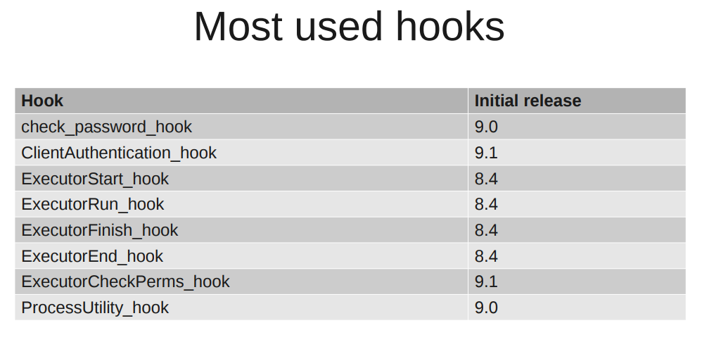
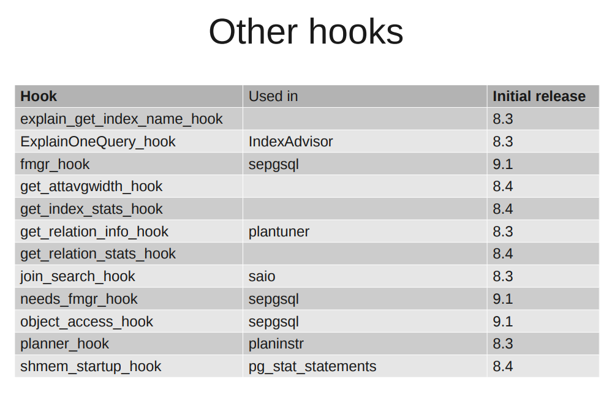

[原文](https://www.cnblogs.com/flying-tiger/p/7801258.html)

众所周知，PostgreSQL具有很好的扩展性，是一个可以"开发"的数据库。在PostgreSQL里面，你可以定制你自己的Types、Function、Operation，支持各种过程语言等等。还可以依据自己的喜好修改源码增加新功能。为方便扩展，PostgreSQL提供了很多有用的API、头文件扩展文件夹等等。然而其中一个很重要hook机制却不是特别为人所知，今天我们就来学习下PostgreSQL的hook机制。

hook机制来源于Windows平台。钩子(Hook)，是Windows消息处理机制的一个平台,应用程序可以在上面设置子程以监视指定窗口的某种消息，当消息到达后，在目标窗口处理函数之前处理它。钩子机制允许应用程序截获处理window消息或特定事件。钩子实际上是一个处理消息的程序段，通过系统调用，把它挂入系统。每当特定的消息发出，在没有到达目的窗口前，钩子程序就先捕获该消息，亦即钩子函数先得到控制权。这时钩子函数即可以加工处理（改变）该消息，也可以不作处理而继续传递该消息，还可以强制结束消息的传递。

#### 1.常用的hook

PostgreSQL中提供了很多种hook，与上面提到的类似，但是更多的是中断和替换操作。更重要的是该机制提供了一种修改PostgreSQL内核功能却不必修改内核代码的手段，且可以轻松的加载和还原。
首先我们还是看下PostgreSQL中都有哪些常用的hook吧。



其他的还有这些：



#### 2.内部机制

所有的hook都和一个全局函数指针相关。在初始时该函数指针被设置为NULL，表示hook未被使用，当PostgreSQL执行到hook处的时候，如果hook为NULL它什么额外的事情也不做，但是如果hook被设置为某个函数的地址时(当然是你增加的那个函数了，通常是做成一个共享库咯)，程序就开始转向你的新增函数中，执行你所期望的各种新功能啦。

那么问题来了，如何设置hook连接到你设置的共享库呢？PostgreSQL的配置文件中给出了shared_preload_libraries参数来加载你的共享库(当然了，设置完是需要重启的)。那么问题就又回到了：如何写一个被PostgreSQL所接受的共享库呢？

你至少要实现这三个函数：

```
_PG_init()
your_hook_function()
_PG_fini()
```

我们慢慢说。

首先，当PostgreSQL加载共享库(create extension xxxx)时，它需要把共享库加载到内存中。这时需要你写一个_PG_init函数，这种函数你在PostgreSQL源码的contrib目录下很容易找到，大概就像下面这样：

```
_PG_init()
{
    prev_ExecutorRun_hook = ExecutorRun_hook;
    ExecutorRun_hook = your_function_hook;
}
```

保存当前的hook值(保证你移除修改后能够还原)，并将你的hook挂在到PostgreSQL的hook函数指针上。

那么与之相对应的，你要写一个_PG_fini函数在卸载(drop extension xxxx)的时候使用,也就是移除你的hook并且把它重置为之前的指针值。

```c
_PG_fini()
{
    ExecutorRun_hook = prev_ExecutorRun_hook;
}
```

这两个函数加上你的hook函数（your_hook_function()）就构成了最基础的PostgreSQL的hook了。

#### 3.举例说明

下面我们以上面提到的ClientAuthentication_hook举例说明吧。
这个hook的作用是帮助你在client得到验证之后并且服务端还未给client反馈的时候运行你的代码(contrib目录下的auth_delay和sepgsql使用了这个hook)。
首先，这个hook指针声明在
src/include/libpq/auth.h, line 27

```c
/* Hook for plugins to get control in ClientAuthentication() */
typedef void (*ClientAuthentication_hook_type) (Port *, int);
extern PGDLLIMPORT ClientAuthentication_hook_type ClientAuthentication_hook;
```

它的调用点，也就是hook所在的位置是：

src/backend/libpq/auth.c, line 215

```c
/*
* This hook allows plugins to get control following client authentication,
* but before the user has been informed about the results. It could be used
* to record login events, insert a delay after failed authentication, etc.
*/
ClientAuthentication_hook_type ClientAuthentication_hook = NULL;
```

我们可以看到该hook初始化为NULL。具体到函数里，它出现在：

src/backend/libpq/auth.c, line 580

```c
if (ClientAuthentication_hook)
 (*ClientAuthentication_hook) (port, status);
```

这很明显，就是如果你写好了一个ClientAuthentication_hook并且通过我们上面提到的方法把它挂到了ClientAuthentication_hook上，那么你的hook就会在这里被调用。

对于ClientAuthentication_hook，我们看到他有两个入参，分别是：

```c
port  PostGreSQL内部的一个Port结构体(定义在include/libpq/libpq-be.h)
Status  是PostgreSQL内部的状态码：STATUS_ERROR, STATUS_OK
```

那么我们写一个完整的extension吧，它的作用是 will deny connections if a specific file is present。

首先写一个初始化函数初始化hook。

```c
static ClientAuthentication_hook_type next_client_auth_hook = NULL;
/* Module entry point */
void
_PG_init(void)
{
 next_client_auth_hook = ClientAuthentication_hook;
 ClientAuthentication_hook = my_client_auth;
} 
```

很简单，我们先保存之前的hook值，在设置上我们自己的hook函数。
记住，初始化必须要在_PG_init函数里面做，该函数在PostgreSQL加载你的共享库的时候被调用。

然后就是咱们的hook函数，在这里你自由发挥，写下你想干的事儿，比如：

```c
static void my_client_auth(Port *port, int status)
{
 struct stat buf;
 if (next_client_auth_hook)
    (*next_client_auth_hook) (port, status);
 if (status != STATUS_OK)
    return;
 if(!stat("/tmp/connection.stopped", &buf))
    ereport(FATAL, (errcode(ERRCODE_INTERNAL_ERROR),
        errmsg("Connection not authorized!!")));
} 
```

这里，如果之前已经设置过ClientAuthentication_hook的话，我们不妨大方的先让他做完好了，然后如果Client的Authentication都不OK的话(都没通过验证),那我们后面的deny操作不是多余么，那就return吧。最后，我们再做我们事：如果不存在connection.stopped文件，我们拒绝connection。Wow，很cool很上帝。

最后，你再写一个_PG_fini咯：

```c
_PG_fini(void)
{
 ClientAuthentication_hook = next_client_auth_hook;
}
```

自此，c文件里面的活我们干完了。剩下的我们写这几个文件

```c
Makefile
your_extension--1.0.control
your_extension--1.0.sql
```

首先，对于Makefile我们知道是用来编译c程序的。它大概是这样：

```c
MODULE_big = your_hook
OBJS = your_hook.o
ifdef USE_PGXS
PG_CONFIG = pg_config
PGXS := $(shell $(PG_CONFIG) --pgxs)
include $(PGXS)
else
subdir = contrib/your_hook
top_builddir = ../..
include $(top_builddir)/src/Makefile.global
include $(top_srcdir)/contrib/contrib-global.mk
endif
```

通常你是要在PostgreSQL的源码目录结构中编译它，这样你就要在contrib目录下建立你自己的目录(这一点可以参考该目录下的其他extension)，然后make。如果你不想在PostgreSQL的源码目录结构中编译它，of course，你可以使用PGXS选项，它定义在PostgreSQL的pg_config命令里。然后你就执行make USE_PGXS=1 吧。当然，你需要设置pg_config到你的PATH里面。

编译完了之后，你就make install吧，把你的共享库装载到PostgreSQL的lib目录中去。

而对于剩下的两个文件最后会被安装到PostgreSQL的share/extension目录下。

your_extension--1.0.control里面主要是写一些控制信息，

your_extension--1.0.sql用于创建一些你需要的数据库对象，比如表，触发器，函数等等。

而这两个文件在这个简单的例子里暂时用不到。我们后面再细说。

在这之后把你的共享库加入到Postgreql.conf文件的shared_preload_libraries中,重启数据库。

然后你就尽情的用起来吧。

这里说的比较简单，敬请期待第二部进阶版+_+

#### 参考文献

http://wiki.postgresql.org/images/e/e3/Hooks_in_postgresql.pdf