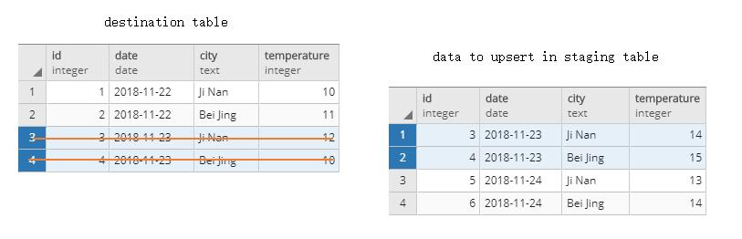

PostgreSQL有 [Copy功能](../../22/2018-11-22-import-and-export-CSV-with-COPY/)，和MySQL的 `LOAD INFILE` 类似。然而，`copy` 命令不支持 Upsert，这使一些增量 ETL 的工作非常不方便。

不过有一种利用 staging 表的方式实现 bulk upsert，大致步骤如下：

一. 目标表

```sql
select * from destination ;
 id |    date    |   city   | temperature 
----+------------+----------+-------------
  1 | 2018-11-22 | Ji Nan   |          10
  2 | 2018-11-22 | Bei Jing |          11
  3 | 2018-11-23 | Ji Nan   |          12
  4 | 2018-11-23 | Bei Jing |          10
(4 rows)
```

二. 把增量数据批量插入中间表

```shell
cat destination 
3,2018-11-23,Ji Nan,14
4,2018-11-23,Bei Jing,15
5,2018-11-24,Ji Nan,13
6,2018-11-24,Bei Jing,14
```

```sql
CREATE TABLE IF NOT EXISTS staging (LIKE destination INCLUDING DEFAULTS INCLUDING CONSTRAINTS INCLUDING INDEXES);

COPY staging FROM '/work/pgsql/pgsql-11-stable/bin/destination' WITH CSV;

select * from staging ;
 id |    date    |   city   | temperature 
----+------------+----------+-------------
  3 | 2018-11-23 | Ji Nan   |          14
  4 | 2018-11-23 | Bei Jing |          15
  5 | 2018-11-24 | Ji Nan   |          13
  6 | 2018-11-24 | Bei Jing |          14
(4 rows)
```

三. 把目标表中与 staging 表冲突部分删掉

```sql
DELETE FROM destination
USING staging
WHERE destination.id = staging.id
```



四. 把 staging 表批量插入到目标表，因为冲突部分已经删掉，所以这步不会有任何冲突。

```sql
INSERT INTO destination (SELECT * FROM staging);

select * from destination ;
 id |    date    |   city   | temperature 
----+------------+----------+-------------
  1 | 2018-11-22 | Ji Nan   |          10
  2 | 2018-11-22 | Bei Jing |          11
  3 | 2018-11-23 | Ji Nan   |          14
  4 | 2018-11-23 | Bei Jing |          15
  5 | 2018-11-24 | Ji Nan   |          13
  6 | 2018-11-24 | Bei Jing |          14
(6 rows)
```

五. 把 staging 表清空

```sql
truncate staging ;
```


