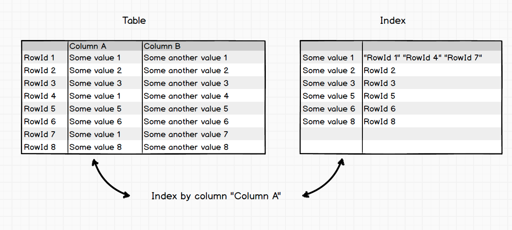
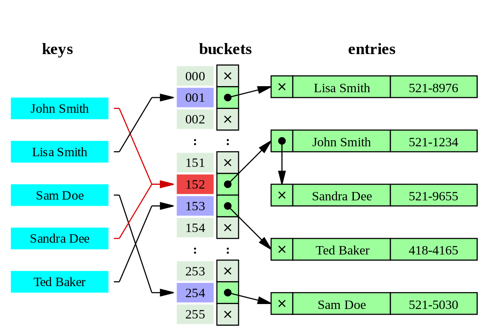
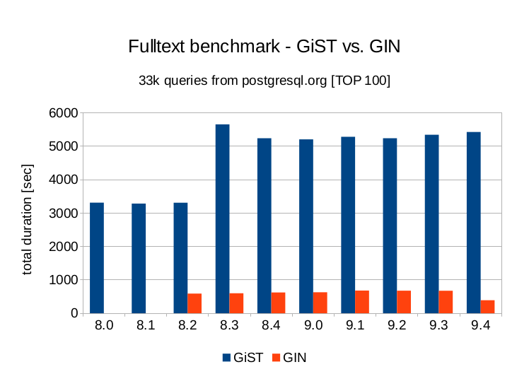

[原文](https://leopard.in.ua/2015/04/13/postgresql-indexes#.W_42_VVfiHs)

Hello my dear friends. This is my new article in which I would like to to tell you about PostgreSQL indexes.

## First of all what is Index?

For the beginning let us remind ourselves what is a table in relational database.

首先关系数据库中的表是什么。

Table in a relational database is a list of rows, in the same time each row have cells. The number of cells and cell types in the row is the same as a scheme of a column (columns) in table. This list of rows has consecutively numbered RowId sequence number. So, we can consider table as list of pairs: (RowId, row).

关系数据库中的表是行列表，同时每行都有单元格。行中的单元格数和单元格类型与表中列（columns）的相同。该行列表具有连续编号的RowId序列号。因此，我们可以将表视为 (RowId, row) 对的列表。

Indexes are in the inverse relationship: (row, RowId). In index row must contain at least one cell. Obviously, if a row is not unique (two identical rows), these relations look like mapped RowId list.

索引具有反向关系：(row, RowId)。在索引行中必须至少包含一个单元格。显然，如果一个行不是唯一的（两个相同的行），这些关系看起来像映射的RowId列表。



Index is an additional data structure, which can help us with:

- Data search - all indexes support search values on equality. Some indexes also support prefix search (like “abc%”), arbitrary ranges search
- Optimizer - B-Tree and R-Tree indexes represent a histogram arbitrary precision
- Join - indexes can be used for Merge, Index algorithms
- Relation - indexes can be used for except/intersect operations
- Aggregations - indexes can effectively calculate some aggregation function (count, min, max, etc)
- Grouping - indexes can effectively calculate the arbitrary grouping and aggregate functions (sort-group algorithm)

- 数据搜索 - 所有索引都支持等值搜索。一些索引还支持前缀搜索（如 “abc%”），任意范围搜索
- 优化器 - B-Tree和R-Tree索引表示直方图任意精度
- 连接 - 索引可用于Merge，Index算法
- 关系 - 索引可用于except/intersect操作
- 聚合 - 索引可以有效地计算一些聚合函数（count，min，max 等）
- 分组 - 索引可以有效地计算任意分组和聚合函数（sort-group 算法）

## PostgreSQL Index Types

There are many types of indexes in PostgreSQL, as well as different ways to use them. Let’s review all these indexes.

#### B-Tree index

B-Tree is the default index that you get when you do `CREATE INDEX`. Virtually all databases will have some B-tree indexes. The B stands for Balanced (Boeing/Bayer/Balanced/Broad/Bushy-Tree), and the idea is that the amount of data on both sides of the tree is roughly the same. Therefore the number of levels that must be traversed to find rows is always in the same approximate number. B-Tree indexes can be used for equality and range queries efficiently. They can operate against all datatypes, and can also be used to retrieve NULL values. Btrees are designed to work very well with caching, even when only partially cached.

B-Tree是 `CREATE INDEX` 时获得的默认索引。几乎所有数据库都有一些B-tree索引。B代表平衡（Boeing/Bayer/Balanced/Broad/Bushy-Tree），其思想是树两侧的数据量大致相同。因此，查找行必须遍历的级别数总是在相同的近似数中。B-tree索引可以有效地用于等值和范围查询。它们可以针对所有数据类型进行操作，也可以用于检索NULL值。B-tree旨在与缓存一起工作，即使只是部分缓存。


Advantages:

- Retain sorting data
- Support the search for the unary and binary predicates
- Allow the entire sequence of data to estimate cardinality (number of entries) for the entire index (and therefore the table), range, and with arbitrary precision without scanning
- 保留排序数据
- 支持搜索一元和二元谓词
- 允许整个数据序列估算整个索引（以及表），范围和任意精度的基数（条目数），而无需扫描

Disadvantages:

- For their construction is require to perform a full sorting pairs (row, RowId) (slow operation)
- Take up a lot of disk space. Index on unique “Integers” weights twice more as the column (because additionaly RowId need stored)
- Recording unbalances tree constantly, and begins to store data sparsely, and the access time is increased by increasing the amount of disk information. What is why, B-Tree indexes require monitoring and periodic rebuilding

- 因为它们的构造需要执行完整的排序对 (row, RowId)（慢速操作）
- 占用大量磁盘空间。唯一“整数”的权重索引作为列的两倍（因为另外需要存储RowId）
- 不断记录不平衡树，并开始稀疏地存储数据，并通过增加磁盘信息量来增加访问时间。原因是，B-Tree索引需要监控和定期重建

#### R-Tree index

R-Tree (rectangle-tree) index storing numeric type pairs of (X, Y) values (for example, the coordinates). R-Tree is very similar to B-Tree. The only difference is the information written to intermediate page in a tree. For the i-th value of the B-Tree node we write the most out of the i-th subtree. In R-Tree it is a minimum rectangle that encloses all the rectangles of the child. Details can be seen in figure:

R-Tree（矩形树）索引，存储数值类型对（X，Y）值（例如，坐标）。R-Tree与B-Tree非常相似。唯一的区别是写入树中间页面的信息。对于B-Tree节点的第i个值，我们从第i个子树中写出最多。在R-Tree中，它是一个包含孩子所有矩形的最小矩形。细节可以在图中看到：


Advantages:

- Search for arbitrary regions, points
- Allows us to estimate the number of dots in a region without a full data scan
- 搜索任意区域，点
- 允许我们估算没有完整数据扫描的区域中的点数

Disadvantages:

- Significant redundancy in the data storage
- Slow update
- 数据存储有显著冗余
- 更新缓慢

In general, the pros-cons are very similar to B-Tree.

一般来说，优点与B-Tree非常相似。

#### Hash index

Hash index doesn’t store the values, but their hashes. Such indexing way reducing the size (and therefore increased speed and processing) of high index fields. In this case, when a query using Hash indexes will not be compared with the value of the field, but the hash value of the desired hash fields.

哈希索引不存储值，而是存储哈希值。这种索引方式减小了高索引字段的大小（并因此增加了速度和处理）。在这种情况下，当使用哈希索引的查询不会与字段的值进行比较时，而是与所需哈希字段的哈希值进行比较。

Because hash functions is non-linear, such index cannot be sorted. This causes inability to use the comparisons more/less and “IS NULL” with this index. In addition, since the hashes are not unique, then the matching hashes used methods of resolving conflicts.

由于散列函数是非线性的，因此无法对此类索引进行排序。这导致无法使用此索引大于、小于和“IS NULL”。另外，由于散列不是唯一的，因此匹配散列使用了解决冲突的方法。



Advantages:

- Very fast search O(1)
- Stability - the index does not need to be rebuild
- 非常快速的搜索 O(1)
- 稳定性 - 索引不需要重建

Disadvantages:

- Hash is very sensitive to collisions. In the case of “bad” data distribution, most of the entries will be concentrated in a few bouquets, and in fact the search will occur through collision resolution.
- 哈希对碰撞非常敏感。在“坏”数据分布的情况下，大多数条目将集中在几个花束中，实际上搜索将通过冲突解析进行。

As you can see, Hash indexes are only useful for equality comparisons, but you pretty much never want to use them since they are not transaction safe, need to be manually rebuilt after crashes, and are not replicated to followers in PostgreSQL (all this fixed in PostgreSQL 10).

正如您所看到的，Hash索引仅对等式比较有用，但您几乎不想使用它们，因为它们不是事务安全的，需要在崩溃后手动重建，并且不会复制到PostgreSQL中的备库（所有这些在PostgreSQL 10 都已修复）。

#### Bitmap index

Bitmap index create a separate bitmap (a sequence of 0 and 1) for each possible value of the column, where each bit corresponds to a string with an indexed value. Bitmap indexes are optimal for data where bit unique values (example, gender field).

位图索引为列的每个可能值创建单独的位图（0和1的序列），其中每个位对应于具有索引值的字符串。位图索引最适合于BIT唯一值的数据(例如，性别字段)。


Advantages:

- Compact representation (small amount of disk space)
- Fast reading and searching for the predicate “is”
- Effective algorithms for packing masks (even more compact representation, than indexed data)
- 紧凑表示(少量磁盘空间)
- 快速读取和搜索谓词“is”
- 包装掩码的有效算法(比索引数据更紧凑的表示)

Disadvantages:

- You can not change the method of encoding values in the process of updating the data. From this it follows that if the distribution data has changed, it is required the index to be completely rebuild
- 您无法在更新数据的过程中更改编码值的方法。由此可见，如果分发数据已经改变，则需要完全重建索引

PostgreSQL is not provide persistent bitmap index. But it can be used in database to combine multiple indexes. PostgreSQL scans each needed index and prepares a bitmap in memory giving the locations of table rows that are reported as matching that index’s conditions. The bitmaps are then ANDed and ORed together as needed by the query. Finally, the actual table rows are visited and returned.

PostgreSQL不提供持久位图索引。但它可以在数据库中用于组合多个索引。PostgreSQL扫描每个需要的索引并在内存中准备一个位图，给出表行的位置，报告为匹配索引的条件。然后根据查询的需要对位图进行AND运算和OR运算。最后，访问并返回实际的表行。

#### GiST index

Generalized Search Tree (GiST) indexes allow you to build general balanced tree structures, and can be used for operations beyond equality and range comparisons. The tree structure is not changed, still no elevators in each node pair stored value (the page number) and the number of children with the same amount of steam in the node.

通用搜索树（GiST）索引允许您构建一般平衡树结构，并且可用于超出相等和范围比较的操作。树结构没有改变，每个节点对中仍然没有电梯存储值（页码）和节点中具有相同蒸汽量的子节点数。

The essential difference lies in the organization of the key. B-Tree trees sharpened by search ranges, and hold a maximum subtree-child. R-Tree - the region on the coordinate plane. GiST offers as values in the non-leaf nodes store the information that we consider essential, and which will determine if we are interested in values (satisfying the predicate) in the subtree-child. The specific form of information stored depends on the type of search that we wish to pursue. Thus parameterize R-Tree and B-Tree tree predicates and values we automatically receive specialized for the task index (examples: PostGiST, pg_trgm, hstore, ltree, etc.). They are used to index the geometric data types, as well as full-text search.

关键的区别在于组织关键。B-Tree树由搜索范围锐化，并保持最大子树。R树 - 坐标平面上的区域。GiST提供非叶子节点中的值存储我们认为必不可少的信息，这将决定我们是否对子树子中的值（满足谓词）感兴趣。存储的特定信息形式取决于我们希望追求的搜索类型。因此参数化我们自动接收的R-Tree和B-Tree树谓词和值，专门用于任务索引（例如：PostGiST，pg_trgm，hstore，ltree等）。它们用于索引几何数据类型以及全文搜索。

Advantages:

- Efficient search
- 搜索高效

Disadvantages:

- Large redundancy
- The specialized implementation for each query group are nessesary
- 冗余大
- 每个查询组的专门实现是必要的

The rest of the pros-cons similar to B-Tree and R-Tree.

其余的优点与B-Tree和R-Tree相似。

#### GIN index

Generalized Inverted Indexes (GIN) are useful when an index must map many values to one row, whereas B-Tree indexes are optimized for when a row has a single key value. GINs are good for indexing array values as well as for implementing full-text search.

当索引必须将多个值映射到一行时，广义反向索引（GIN）非常有用，而B-Tree索引针对行具有单个键值进行优化。GIN适用于索引数组值以及实现全文搜索。



Key features:

- Well suited for full-text search
- Look for a full match (“is”, but not “less” or “more”).
- Well suited for semi-structured data search
- Allows you to perform several different searches (queries) in a single pass
- Scales much better than GiST (support large volumes of data)
- Works well for frequent recurrence of elements (and therefore are perfect for full-text search)

- 非常适合全文搜索
- 寻找完整匹配
- 非常适合半结构化数据搜索
- 允许您一次执行多个不同的搜索（查询）
- 比GiST更好的扩展（支持大量数据）
- 适用于元素的频繁复发（因此非常适合全文搜索）

## Block Range (BRIN) Index (9.5+)

BRIN stands for Block Range INdexes, and store metadata on a range of pages. At the moment this means the minimum and maximum values per block.

BRIN代表块范围INdexes，并在一系列页面上存储元数据。目前这意味着每个块的最小值和最大值。

This results in an inexpensive index that occupies a very small amount of space, and can speed up queries in extremely large tables. This allows the index to determine which blocks are the only ones worth checking, and all others can be skipped. So if a 10GB table of order contained rows that were generally in order of order date, a BRIN index on the order_date column would allow the majority of the table to be skipped rather than performing a full sequential scan. This will still be slower than a regular BTREE index on the same column, but with the benefits of it being far smaller and requires less maintenance.

这导致廉价的索引占用非常小的空间，并且可以加速极大表中的查询。这允许索引确定哪些块是唯一值得检查的块，并且可以跳过所有其他块。因此，如果10GB的订单表包含通常按订单日期排序的行，则order_date列上的BRIN索引将允许跳过表的大部分而不是执行完整的顺序扫描。这仍然比同一列上的常规BTREE索引慢，但是它的好处是它更小并且需要更少的维护。

More info about this index you can read in [this article](http://pythonsweetness.tumblr.com/post/119568339102/block-range-brin-indexes-in-postgresql-95).

## Partial Indexes

A partial index covers just a subset of a table’s data. It is an index with a `WHERE` clause. The idea is to increase the efficiency of the index by reducing its size. A smaller index takes less storage, is easier to maintain, and is faster to scan.

部分索引仅涵盖表数据的子集。它是一个带有`WHERE`子句的索引。这个想法是通过减小其规模来提高指数的效率。较小的索引占用较少的存储空间，易于维护，扫描速度更快。

For example, suppose you log in table some information about network activity and very often you need check logs from local IP range. You may want to create an index like so:

例如，假设您在表中登录有关网络活动的一些信息，并且通常需要检查来自本地IP范围的日志。您可能想要创建一个索引，如下所示：

```sql
CREATE INDEX access_log_client_ip_ix ON access_log (client_ip)
        WHERE (client_ip > inet '192.168.100.0' AND
                   client_ip < inet '192.168.100.255');
```

and such sql query will use such index

```sql
SELECT * FROM access_log WHERE client_ip = '192.168.100.45';
```

This index will remain fairly small, and can also be used along other indexes on the more complex queries that may require it.

此索引将保持相当小，并且还可以与可能需要它的更复杂查询的其他索引一起使用。

## Expression Indexes

Expression indexes are useful for queries that match on some function or modification of your data. Postgres allows you to index the result of that function so that searches become as efficient as searching by raw data values.

表达式索引对于匹配某些功能或修改数据的查询非常有用。Postgres允许您索引该函数的结果，以便搜索变得与搜索原始数据值一样高效。

For example, suppose you doing very often search by first leter in lower case from `name` field. You may want to create an index like so:

例如，假设您经常按首字母从名称字段进行小写搜索。您可能想要创建一个索引，如下所示：

```sql
CREATE INDEX users_name_first_idx ON foo ((lower(substr(name, 1, 1))));
```

and such sql query will use such index

```sql
SELECT * FROM users WHERE lower(substr(name, 1, 1)) = 'a';
```

## Unique Indexes

A unique index guarantees that the table won’t have more than one row with the same value. It’s advantageous to create unique indexes for two reasons: data integrity and performance. Lookups on a unique index are generally very fast.

唯一索引保证表不会有多个具有相同值的行。创建唯一索引是有利的，原因有两个：数据完整性和性能。查找唯一索引通常非常快。

There is little distinction between unique indexes and unique constraints. Unique indexes can be though of as lower level, since expression indexes and partial indexes cannot be created as unique constraints. Even partial unique indexes on expressions are possible.

唯一索引和唯一约束之间几乎没有区别。由于表达式索引和部分索引不能创建为唯一约束，因此唯一索引可以是较低级别。表达式上甚至可以使用部分唯一索引。

## Multi-column Indexes

While Postgres has the ability to create multi-column indexes, it’s important to understand when it makes sense to do so. The Postgres query planner has the ability to combine and use multiple single-column indexes in a multi-column query by performing a bitmap index scan (“Bitmap index” for more info). In general, you can create an index on every column that covers query conditions and in most cases Postgres will use them, so make sure to benchmark and justify the creation of a multi-column index before you create them. As always, indexes come with a cost, and multi-column indexes can only optimize the queries that reference the columns in the index in the same order, while multiple single column indexes provide performance improvements to a larger number of queries.

虽然Postgres能够创建多列索引，但了解何时这样做很重要。Postgres查询规划器能够通过执行位图索引扫描（“位图索引”以获取更多信息）在多列查询中组合和使用多个单列索引。通常，您可以在涵盖查询条件的每个列上创建索引，并且在大多数情况下Postgres将使用它们，因此请确保在创建多列索引之前对其进行基准测试并证明其合理性。与往常一样，索引带有成本，而多列索引只能以相同的顺序优化引用索引中列的查询，而多个单列索引可以为大量查询提供性能改进。

However there are cases where a multi-column index clearly makes sense. An index on columns (a, b) can be used by queries containing `WHERE a = x AND b = y`, or queries using `WHERE a = x` only, but will not be used by a query using `WHERE b = y`. So if this matches the query patterns of your application, the multi-column index approach is worth considering. Also note that in this case creating an index on a alone would be redundant.

然而，有时候多列索引显然是有意义的。列（a，b）的索引可以由包含WHERE a = x AND b = y的查询使用，或者仅使用WHERE a = x的查询使用，但使用WHERE b = y的查询不会使用。因此，如果这与您的应用程序的查询模式匹配，则多列索引方法值得考虑。另请注意，在这种情况下，单独创建索引将是多余的。

## Summary

Indexes are common way to enhance database performance. Index allows the database server to find and retrieve specific rows much faster than it can be without an index. But indexes also add overhead to the database system as a whole, so they should be used sensibly.

索引是增强数据库性能的常用方法。索引允许数据库服务器比没有索引时更快地查找和检索特定行。但索引也会增加整个数据库系统的开销，因此应合理使用它们。

*That’s all folks!* Thank you for reading till the end.


