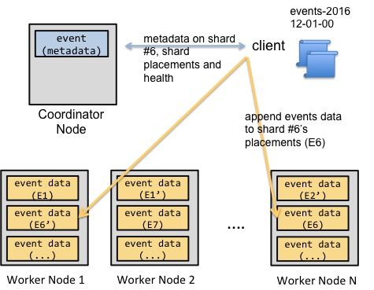
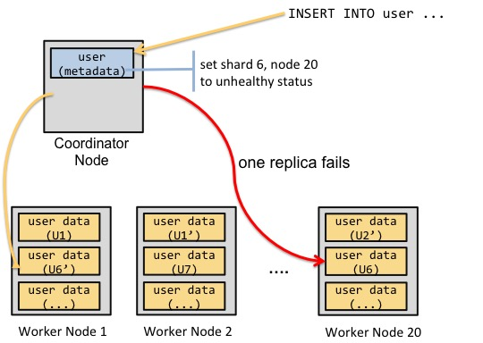
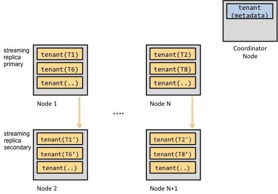

https://docs.citusdata.com/en/latest/develop/append.html

https://www.citusdata.com/blog/2016/12/15/citus-replication-model-today-and-tomorrow/


> 本文内容来自citus官方文档，包括一些原文翻译，简略介绍，使用示例等内容。

##  Abstract

> Append distribution is a specialized technique which requires care to use efficiently. Hash distribution is a better choice for most situations. 
>
> 追加分配是一项需要谨慎有效使用的专门技术。对于大多数情况，散列分布是更好的选择。 

While Citus’ most common use cases involve hash data distribution, it can also distribute timeseries data across a variable number of shards by their order in time. This section provides a short reference to loading, deleting, and manipulating timeseries data.

虽然Citus最常见的用例涉及散列数据分布，但它也可以按时间顺序将timeseries数据分布在数量可变的分片上。本节提供有关加载、删除和操作timeseries数据的简短参考。

As the name suggests, append based distribution is more suited to append-only use cases. This typically includes event based data which arrives in a time-ordered series. You can then distribute your largest tables by time, and batch load your events into Citus in intervals of N minutes. This data model can be generalized to a number of time series use cases; for example, each line in a website’s log file, machine activity logs or aggregated website events. Append based distribution supports more efficient range queries. This is because given a range query on the distribution key, the Citus query planner can easily determine which shards overlap that range and send the query only to relevant shards.

顾名思义，基于append的分布更适合仅追加的用例。这通常包括按时间顺序到达的基于事件的数据。然后可以按时间分布最大的表，并以N分钟为间隔将事件批量加载到Citus中。该数据模型可以推广到多个时间序列用例;例如，网站日志文件中的每一行、机器活动日志或聚合的网站事件。基于附加的分布支持更有效的范围查询。这是因为，给定分布键上的范围查询，Citus查询计划器可以很容易地确定哪些分片与该范围重叠，并只将查询发送到相关的分片。

Hash based distribution is more suited to cases where you want to do real-time inserts along with analytics on your data or want to distribute by a non-ordered column (eg. user id). This data model is relevant for real-time analytics use cases; for example, actions in a mobile application, user website events, or social media analytics. In this case, Citus will maintain minimum and maximum hash ranges for all the created shards. Whenever a row is inserted, updated or deleted, Citus will redirect the query to the correct shard and issue it locally. This data model is more suited for doing co-located joins and for queries involving equality based filters on the distribution column.

基于散列的分布更适合于这样的情况，即您希望执行实时插入并对数据进行分析，或者希望按无序列进行分布(例如。用户id)。这个数据模型与实时分析用例相关;例如，移动应用程序中的操作、用户网站事件或社交媒体分析。在这种情况下，Citus将为所有创建的分片维护最小和最大散列范围。无论何时插入、更新或删除一行，Citus都会将查询重定向到正确的分片，并在本地发出它。此数据模型更适合于在分布列上执行协同定位连接和涉及基于等式的过滤器的查询。

Citus uses slightly different syntaxes for creation and manipulation of append and hash distributed tables. Also, the operations supported on the tables differ based on the distribution method chosen. In the sections that follow, we describe the syntax for creating append distributed tables, and also describe the operations which can be done on them.

Citus在创建和操作append和散列分布式表时使用的语法略有不同。此外，根据所选择的分发方法，表上支持的操作也有所不同。在接下来的小节中，我们将描述用于创建append分布式表的语法，并描述可以对其进行的操作。

## Creating and Distributing Tables

```sql
CREATE TABLE github_events
(
    event_id bigint,
    event_type text,
    event_public boolean,
    repo_id bigint,
    payload jsonb,
    repo jsonb,
    actor jsonb,
    org jsonb,
    created_at timestamp
);
```

Next, you can use the create_distributed_table() function to mark the  table as an append distributed table and specify its distribution  column. 

接下来，可以使用create_distributed_table()函数将该表标记为追加分布式表并指定其分布列。 

```sql
SELECT create_distributed_table('github_events', 'created_at', 'append');
```

This function informs Citus that the github_events table should be  distributed by append on the created_at column. Note that this method  doesn’t enforce a particular distribution; it merely tells the database  to keep minimum and maximum values for the created_at column in each  shard which are later used by the database for optimizing queries. 

该函数通知Citus, github_events表应该通过追加到created_at列上的方式分发。请注意，此方法并不强制执行特定的分发;它只是告诉数据库在每个分片中保留created_at列的最小值和最大值，稍后数据库将使用这些值来优化查询。 

## Expiring Data

In append distribution, users typically want to track data only for  the last few months / years. In such cases, the shards that are no  longer needed still occupy disk space. To address this, Citus provides a user defined function master_apply_delete_command() to delete old  shards. The function takes a [DELETE](http://www.postgresql.org/docs/current/static/sql-delete.html) command as input and deletes all the shards that match the delete criteria with their metadata.

在append分发中，用户通常只想跟踪最近几个月/几年的数据。在这种情况下，不再需要的分片仍然占用磁盘空间。为了解决这个问题，Citus提供了一个用户定义的函数master_apply_delete_command()来删除旧分片。该函数以[DELETE](http://www.postgresql.org/docs/current/static/sql-delete.html)命令作为输入，并删除与删除条件匹配的所有分片及其元数据。 

The function uses shard metadata to decide whether or not a shard  needs to be deleted, so it requires the WHERE clause in the DELETE  statement to be on the distribution column. If no condition is  specified, then all shards are selected for deletion. The UDF then  connects to the worker nodes and issues DROP commands for all the shards which need to be deleted. If a drop query for a particular shard  replica fails, then that replica is marked as TO DELETE. The shard  replicas which are marked as TO DELETE are not considered for future  queries and can be cleaned up later.

该函数使用分片元数据来决定是否需要删除分片，因此它要求DELETE语句中的WHERE子句位于分布列上。如果没有指定任何条件，则选择删除所有分片。然后，UDF连接到工作节点，并发出删除所有需要删除的分片的命令。如果针对特定分片副本的drop查询失败，则该副本被标记为要删除。标记为要删除的shard副本不会考虑用于将来的查询，可以在以后进行清理。 

The example below deletes those shards from the github_events table  which have all rows with created_at >= ‘2015-01-01 00:00:00’. Note  that the table is distributed on the created_at column.

下面的示例将从github_events表中删除那些包含created_at >= ' 2015-01-01 00:00:00 '的所有行。注意，表分布在created_at列上。 

```sql
SELECT * from master_apply_delete_command('DELETE FROM github_events WHERE created_at >= ''2015-01-01 00:00:00''');
 master_apply_delete_command
-----------------------------
                           3
(1 row)
```

To learn more about the function, its arguments and its usage, please visit the [Citus Utility Functions](https://docs.citusdata.com/en/latest/develop/api_udf.html#user-defined-functions) section of our documentation.  Please note that this function only  deletes complete shards and not individual rows from shards. If your use case requires deletion of individual rows in real-time, see the section below about deleting data.

请注意，此函数只删除完整的分片，而不删除分片中的单个行。如果您的用例需要实时删除个别行，请参阅下面关于删除数据的部分。 

## Deleting Data

The most flexible way to modify or delete rows throughout a Citus cluster with regular SQL statements:

最灵活的方式来修改或删除整个Citus集群的常规SQL语句行: 

```sql
DELETE FROM github_events
WHERE created_at >= '2015-01-01 00:03:00';
```

Unlike master_apply_delete_command, standard SQL works at the row-  rather than shard-level to modify or delete all rows that match the  condition in the where clause. It deletes rows regardless of whether  they comprise an entire shard.

与master_apply_delete_command不同，标准SQL在行上工作，而不是在分片级上修改或删除与where子句中的条件匹配的所有行。它删除行，不管它们是否包含整个分片。 

## Dropping Tables

You can use the standard PostgreSQL [DROP TABLE](http://www.postgresql.org/docs/current/static/sql-droptable.html) command to remove your append distributed tables. As with regular tables, DROP TABLE removes any indexes, rules, triggers, and constraints that exist for the target table. In addition, it also drops the shards on the worker nodes and cleans up their metadata.

可以使用标准的PostgreSQL [DROP TABLE](http://www.postgresql.org/docs/current/static/sql-droptable.html)命令删除附加的分布式表。与常规表一样，DROP表删除目标表的所有索引、规则、触发器和约束。此外，它还删除工作节点上的分片并清理它们的元数据。 

```sql
DROP TABLE github_events;
```

## Data Loading

Citus supports two methods to load data into your append distributed  tables. The first one is suitable for bulk loads from files and involves using the \copy command. For use cases requiring smaller, incremental  data loads, Citus provides two user defined functions. We describe each  of the methods and their usage below.

Citus支持两种方法来将数据加载到附加的分布式表中。第一种方法适用于从文件进行批量加载，并涉及到使用\copy命令。对于需要更小的增量数据负载的用例，Citus提供了两个用户定义的函数。我们将在下面描述每种方法及其用法。 

### Bulk load using \copy

The [\copy](http://www.postgresql.org/docs/current/static/app-psql.html#APP-PSQL-META-COMMANDS-COPY) command is used to copy data from a file to a distributed table while handling replication and failures automatically. You can also use the server side [COPY command](http://www.postgresql.org/docs/current/static/sql-copy.html). In the examples, we use the \copy command from psql, which sends a COPY  .. FROM STDIN to the server and reads files on the client side, whereas  COPY from a file would read the file on the server.

[\copy](http://www.postgresql.org/docs/current/static/app-psql.html# app-psql - metadata - copy)命令用于将数据从文件复制到分布式表，同时自动处理复制和失败。您还可以使用服务器端[COPY命令](http://www.postgresql.org/docs/current/static/sql-copy.html)。在本例中，我们使用来自psql的\copy命令，它发送一个副本…从STDIN到服务器并读取客户端上的文件，而从文件复制则读取服务器上的文件。

You can use \copy both on the coordinator and from any of the  workers. When using it from the worker, you need to add the master_host  option. Behind the scenes, \copy first opens a connection to the  coordinator using the provided master_host option and uses  master_create_empty_shard to create a new shard. Then, the command  connects to the workers and copies data into the replicas until the size reaches shard_max_size, at which point another new shard is created.  Finally, the command fetches statistics for the shards and updates the  metadata.

您可以在协调节点和任何工作节点上使用\copy。当从工作节点中使用它时，您需要添加master_host选项。在后台，\copy首先使用提供的master_host选项打开到协调节点的连接，并使用master_create_empty_shard创建一个新的shard。然后，该命令连接到工作节点并将数据复制到副本中，直到大小达到shard_max_size，此时将创建另一个新分片。最后，该命令获取分片的统计信息并更新元数据。

```sql
SET citus.shard_max_size TO '64MB';
\copy github_events from 'github_events-2015-01-01-0.csv' WITH (format CSV, master_host 'coordinator-host')
```

Citus assigns a unique shard id to each new shard and all its  replicas have the same shard id. Each shard is represented on the worker node as a regular PostgreSQL table with name ‘tablename_shardid’ where  tablename is the name of the distributed table and shardid is the unique id assigned to that shard. One can connect to the worker postgres  instances to view or run commands on individual shards.

Citus分配一个惟一的分片id到每个新分片及其所有副本具有相同的分片id。每个分片是工人代表节点作为常规PostgreSQL表名称的tablename_shardid分布表的表名是名字的和shardid是惟一的id分配到分片。可以连接到worker postgres实例来查看或运行单个分片上的命令。

By default, the \copy command depends on two configuration parameters for its behavior. These are called citus.shard_max_size and  citus.shard_replication_factor.

默认情况下，\copy命令的行为取决于两个配置参数。分别是：citus.shard_max_size 和citus.shard_replication_factor

1. **citus.shard_max_size :-** This parameter determines  the maximum size of a shard created using \copy, and defaults to 1 GB.  If the file is larger than this parameter, \copy will break it up into  multiple shards.
2. 此参数确定使用\copy创建的分片的最大大小，默认为1 GB。如果文件比这个参数大，\copy将把它分成多个分片。 
3. **citus.shard_replication_factor :-** This parameter  determines the number of nodes each shard gets replicated to, and  defaults to one. Set it to two if you want Citus to replicate data  automatically and provide fault tolerance. You may want to increase the  factor even higher if you run large clusters and observe node failures  on a more frequent basis.
4. 该参数决定每个shard复制到的节点数量，默认为一个。如果希望Citus自动复制数据并提供容错，请将其设置为2。如果您运行大型集群并更频繁地观察节点故障，则可能希望进一步提高这个因素。 

The configuration setting citus.shard_replication_factor can only be set on the coordinator node.

配置设置citus。shard_replication_factor只能在协调节点上设置。

Please note that you can load several files in parallel through  separate database connections or from different nodes. It is also worth  noting that \copy always creates at least one shard and does not append  to existing shards. You can use the method described below to append to  previously created shards.

请注意，您可以通过单独的数据库连接或从不同的节点并行加载多个文件。还值得注意的是，\copy总是创建至少一个切分，并且不会附加到现有的切分上。您可以使用下面描述的方法将之前创建的分片追加到后面。

There is no notion of snapshot isolation across shards, which means  that a multi-shard SELECT that runs concurrently with a COPY might see  it committed on some shards, but not on others. If the user is storing  events data, he may occasionally observe small gaps in recent data. It  is up to applications to deal with this if it is a problem (e.g.   exclude the most recent data from queries, or use some lock).

没有跨分片的快照隔离的概念，这意味着与一个副本并发运行的多分片选择可能会在一些分片上提交，而不是在其他分片上提交。如果用户正在存储事件数据，他可能会偶尔观察到最近数据中的小间隙。如果这是一个问题，则由应用程序来处理(例如，从查询中排除最近的数据，或使用一些锁)。

If COPY fails to open a connection for a shard placement then it behaves in the same way as INSERT, namely to mark the  placement(s) as inactive unless there are no more active placements. If  any other failure occurs after connecting, the transaction is rolled  back and thus no metadata changes are made.

如果复制无法为分片放置打开连接，那么它的行为与INSERT相同，即将放置标记为非活动的，除非没有更多的活动放置。如果连接后发生任何其他故障，则事务将回滚，因此不会对元数据进行更改。

### Incremental loads by appending to existing shards

The \copy command always creates a new shard when it is used and is  best suited for bulk loading of data. Using \copy to load smaller data  increments will result in many small shards which might not be ideal. In order to allow smaller, incremental loads into append distributed  tables, Citus provides 2 user defined functions. They are  master_create_empty_shard() and master_append_table_to_shard().

当使用\copy命令时，它总是创建一个新的分片，并且最适合批量加载数据。使用\copy加载较小的数据增量将导致许多小分片，这可能不是理想的结果。为了允许向append分布式表中增加更小的负载，Citus提供了两个用户定义的函数。它们是master_create_empty_shard()和master_append_table_to_shard()。

master_create_empty_shard() can be used to create new empty shards  for a table. This function also replicates the empty shard to  citus.shard_replication_factor number of nodes like the \copy command.

master_create_empty_shard()可用于为表创建新的空分片。此函数还将空分片复制到citus。shard_replication_factor节点数，如\copy命令。

master_append_table_to_shard() can be used to append the contents of a PostgreSQL table to an existing shard. This allows the user to control  the shard to which the rows will be appended. It also returns the shard  fill ratio which helps to make a decision on whether more data should be appended to this shard or if a new shard should be created.

master_append_table_to_shard()可用于将PostgreSQL表的内容附加到现有的shard。这允许用户控制将附加行的分片。它还返回分片填充率，这有助于决定是否应该向这个分片添加更多的数据，还是应该创建一个新的分片。

To use the above functionality, you can first insert incoming data  into a regular PostgreSQL table. You can then create an empty shard  using master_create_empty_shard(). Then, using  master_append_table_to_shard(), you can append the contents of the  staging table to the specified shard, and then subsequently delete the  data from the staging table. Once the shard fill ratio returned by the  append function becomes close to 1, you can create a new shard and start appending to the new one.

要使用上述功能，您可以首先将传入的数据插入到常规的PostgreSQL表中。然后可以使用master_create_empty_shard()创建一个空分片。然后，使用master_append_table_to_shard()，可以将staging表的内容附加到指定的shard中，然后从staging表中删除数据。一旦append函数返回的分片填充比接近1，您就可以创建一个新的分片并开始将其附加到新的分片中。

```sql
SELECT * from master_create_empty_shard('github_events');
master_create_empty_shard
---------------------------
                102089
(1 row)

SELECT * from master_append_table_to_shard(102089, 'github_events_temp', 'master-101', 5432);
master_append_table_to_shard
------------------------------
        0.100548
(1 row)
```

To learn more about the two UDFs, their arguments and usage, please visit the [Citus Utility Functions](https://docs.citusdata.com/en/latest/develop/api_udf.html#user-defined-functions) section of the documentation.

## Example

### Range Based Sharding

```sql
young=# create table test(id int, ts timestamptz);
CREATE TABLE
young=# SELECT create_distributed_table('test', 'ts', 'append');
NOTICE:  using statement-based replication
DETAIL:  Streaming replication is supported only for hash-distributed tables.
 create_distributed_table 
--------------------------
 
(1 row)

young=# SELECT * from master_create_empty_shard('test');
 master_create_empty_shard 
---------------------------
                    102046
(1 row)

young=# insert into test values (1, now());
INSERT 0 1
young=# table test ;
 id |              ts               
----+-------------------------------
  1 | 2019-11-07 15:02:23.850578+08
(1 row)

young=# table pg_dist_shard;
 logicalrelid | shardid | shardstorage | shardminvalue | shardmaxvalue 
--------------+---------+--------------+---------------+---------------
 test         |  102046 | t            |               | 
(1 row)

young=# insert into test values (2, now());
INSERT 0 1
young=# SELECT                             
    n.nodename,
    n.nodeport,
    sum(foo.result::int4)
FROM (
    SELECT *
    FROM
        run_command_on_shards ('test',
            'select count(*) from %s')) AS foo,
    pg_dist_placement p,
    pg_dist_node n
WHERE
    foo.shardid = p.shardid
    AND p.groupid = n.groupid
GROUP BY
    n.nodename,
    n.nodeport;
 nodename | nodeport | sum 
----------+----------+-----
 10.0.0.5 |     9432 |   2
(1 row)

young=# SELECT * from master_create_empty_shard('test');
 master_create_empty_shard 
---------------------------
                    102047
(1 row)

young=# insert into test values (3, now());             
ERROR:  cannot run INSERT command which targets multiple shards
HINT:  Make sure the value for partition column "ts" falls into a single shard.
young=# table pg_dist_shard;
 logicalrelid | shardid | shardstorage | shardminvalue | shardmaxvalue 
--------------+---------+--------------+---------------+---------------
 test         |  102046 | t            |               | 
 test         |  102047 | t            |               | 
(2 rows)

young=# select min(ts), max(ts) from test;
              min              |              max              
-------------------------------+-------------------------------
 2019-11-07 15:02:23.850578+08 | 2019-11-07 15:03:46.776405+08
(1 row)

young=# update pg_dist_shard set shardminvalue = '2019-11-07 15:00:00', shardmaxvalue = '2019-11-07 15:04:59' where shardid = 102046;
UPDATE 1
young=# table pg_dist_shard;
 logicalrelid | shardid | shardstorage |    shardminvalue    |    shardmaxvalue    
--------------+---------+--------------+---------------------+---------------------
 test         |  102047 | t            |                     | 
 test         |  102046 | t            | 2019-11-07 15:00:00 | 2019-11-07 15:04:59
(2 rows)

young=# SELECT                                          
    n.nodename,
    n.nodeport,
    sum(foo.result::int4)
FROM (
    SELECT *
    FROM
        run_command_on_shards ('test',
            'select count(*) from %s')) AS foo,
    pg_dist_placement p,
    pg_dist_node n
WHERE
    foo.shardid = p.shardid
    AND p.groupid = n.groupid
GROUP BY
    n.nodename,
    n.nodeport;
 nodename  | nodeport | sum 
-----------+----------+-----
 10.0.0.5  |     9432 |   2
 10.0.0.10 |     9432 |   1
(2 rows)

young=# update pg_dist_shard set shardminvalue = '2019-11-07 15:05:00', shardmaxvalue = '2019-11-07 15:09:59' where shardid = 102047;
UPDATE 1
young=# table pg_dist_shard;
 logicalrelid | shardid | shardstorage |    shardminvalue    |    shardmaxvalue    
--------------+---------+--------------+---------------------+---------------------
 test         |  102046 | t            | 2019-11-07 15:00:00 | 2019-11-07 15:04:59
 test         |  102047 | t            | 2019-11-07 15:05:00 | 2019-11-07 15:09:59
(2 rows)
```
文档有介绍删除分片、删除数据及删除表，未介绍TRUNCATE

```sql
young=# table pg_dist_shard;
 logicalrelid | shardid | shardstorage |    shardminvalue    |    shardmaxvalue    
--------------+---------+--------------+---------------------+---------------------
 test         |  102046 | t            | 2019-11-07 15:00:00 | 2019-11-07 15:04:59
 test         |  102047 | t            | 2019-11-07 15:05:00 | 2019-11-07 15:09:59
(2 rows)
young=# truncate test ;
TRUNCATE TABLE
young=# table pg_dist_shard;
 logicalrelid | shardid | shardstorage | shardminvalue | shardmaxvalue 
--------------+---------+--------------+---------------+---------------
(0 rows)
```


### Directory Based Sharding

这与基于范围的分片类似，但不是确定分片键的数据属于哪个范围，而是将每个键绑定到其自己的特定分片。

```sql
young=# create table list(id int, col text);
CREATE TABLE
young=# SELECT create_distributed_table('list', 'col', 'append');
NOTICE:  using statement-based replication
DETAIL:  Streaming replication is supported only for hash-distributed tables.
 create_distributed_table 
--------------------------
 
(1 row)

young=# select master_create_empty_shard('list');
 master_create_empty_shard 
---------------------------
                    102052
(1 row)

young=# update pg_dist_shard set shardminvalue = 'beijing', shardmaxvalue = 'beijing' where shardid = 102052;
UPDATE 1
young=# table pg_dist_shard;
 logicalrelid | shardid | shardstorage | shardminvalue | shardmaxvalue 
--------------+---------+--------------+---------------+---------------
 list         |  102052 | t            | beijing       | beijing
(1 row)

young=# insert into list values (1, 'beijing');
INSERT 0 1
young=# insert into list values (2, 'hangzhou');
ERROR:  cannot run INSERT command which targets no shards
HINT:  Make sure you have created a shard which can receive this partition column value.
young=# table list ;
 id |   col   
----+---------
  1 | beijing
(1 row)
```

### bulk load using copy

大小达到shard_max_size，将创建另一个新分片

此示例中一个copy创建多个分片

```sql
young=# show citus.shard_max_size ;
 citus.shard_max_size 
----------------------
 1GB
(1 row)

young=# table pg_dist_shard;
 logicalrelid | shardid | shardstorage | shardminvalue | shardmaxvalue 
--------------+---------+--------------+---------------+---------------
(0 rows)

young=# \copy github_events from '/data/citus/github_events-2015-01-01-0.csv' WITH (format CSV);
COPY 7702

young=# SELECT                                                                                  
    n.nodename,
    n.nodeport,
    sum(foo.result::int4)
FROM (
    SELECT *
    FROM
        run_command_on_shards ('github_events',
            'select count(*) from %s')) AS foo,
    pg_dist_placement p,
    pg_dist_node n
WHERE
    foo.shardid = p.shardid
    AND p.groupid = n.groupid
GROUP BY
    n.nodename,
    n.nodeport;
 nodename  | nodeport | sum  
-----------+----------+------
 10.0.0.20 |     9432 | 7702
(1 row)

young=# table pg_dist_shard;
 logicalrelid  | shardid | shardstorage |    shardminvalue    |    shardmaxvalue    
---------------+---------+--------------+---------------------+---------------------
 github_events |  102053 | t            | 2015-01-01 00:00:00 | 2015-01-01 00:59:58
(1 row)

young=# SET citus.shard_max_size TO '4MB';
SET
young=# show citus.shard_max_size ;
 citus.shard_max_size 
----------------------
 4MB
(1 row)

young=# \copy github_events from '/data/citus/github_events-2015-01-01-1.csv' WITH (format CSV);
COPY 7427
young=# table pg_dist_shard;
 logicalrelid  | shardid | shardstorage |    shardminvalue    |    shardmaxvalue    
---------------+---------+--------------+---------------------+---------------------
 github_events |  102053 | t            | 2015-01-01 00:00:00 | 2015-01-01 00:59:58
 github_events |  102054 | t            | 2015-01-01 01:00:00 | 2015-01-01 01:14:55
 github_events |  102055 | t            | 2015-01-01 01:14:55 | 2015-01-01 01:27:40
 github_events |  102056 | t            | 2015-01-01 01:27:40 | 2015-01-01 01:41:02
 github_events |  102057 | t            | 2015-01-01 01:41:02 | 2015-01-01 01:56:29
 github_events |  102058 | t            | 2015-01-01 01:56:29 | 2015-01-01 01:59:59
(6 rows)

young=# SELECT              
    n.nodename,
    n.nodeport,
    sum(foo.result::int4)
FROM (
    SELECT *
    FROM
        run_command_on_shards ('github_events',
            'select count(*) from %s')) AS foo,
    pg_dist_placement p,
    pg_dist_node n
WHERE
    foo.shardid = p.shardid
    AND p.groupid = n.groupid
GROUP BY
    n.nodename,
    n.nodeport;
 nodename  | nodeport | sum  
-----------+----------+------
 10.0.0.20 |     9432 | 9506
 10.0.0.5  |     9432 | 2300
 10.0.0.10 |     9432 | 1662
 10.0.0.21 |     9432 | 1661
(4 rows)
```

### appending to existing shards

```sql
young=# create table test(id int , col int);
CREATE TABLE
young=# SELECT create_distributed_table('test', 'col', 'append');
NOTICE:  using statement-based replication
DETAIL:  Streaming replication is supported only for hash-distributed tables.
 create_distributed_table 
--------------------------
 
(1 row)

young=# create table tmp (id int, col int);
CREATE TABLE
young=# insert into tmp select id, id from generate_series(1,5) as id;
INSERT 0 5
young=# table tmp ;
 id | col 
----+-----
  1 |   1
  2 |   2
  3 |   3
  4 |   4
  5 |   5
(5 rows)

young=# select master_create_empty_shard('test');
 master_create_empty_shard 
---------------------------
                    102059
(1 row)

young=# SELECT master_append_table_to_shard(102059, 'tmp', '10.0.0.4', 9432);
 master_append_table_to_shard 
------------------------------
                   0.00195312
(1 row)

young=# table pg_dist_shard;
 logicalrelid  | shardid | shardstorage |    shardminvalue    |    shardmaxvalue    
---------------+---------+--------------+---------------------+---------------------
 test          |  102059 | t            | 1                   | 5
(1 rows)

young=# table test ;
 id | col 
----+-----
  1 |   1
  2 |   2
  3 |   3
  4 |   4
  5 |   5
(5 rows)
```

### other

ERROR:  INSERT ... SELECT into an append-distributed table is not supported

```sql
young=# table pg_dist_shard;
 logicalrelid | shardid | shardstorage |    shardminvalue    |    shardmaxvalue    
--------------+---------+--------------+---------------------+---------------------
 range        |  102050 | t            | 11                  | 15
 range        |  102049 | t            | 6                   | 10
 range        |  102048 | t            | 0                   | 5
(3 rows)

young=# insert into range select id, id from generate_series(1,15) as id;
ERROR:  INSERT ... SELECT into an append-distributed table is not supported
```

ERROR:  modifying the partition value of rows is not allowed

```sql
# Across the shard
young=# update range set col1 = 11 where id = 5;
ERROR:  modifying the partition value of rows is not allowed

# The same shard
young=# update range set col1 = 11 where id = 12;
ERROR:  modifying the partition value of rows is not allowed
```

## replication model

以append方式建表时可以注意到

```sql
NOTICE:  using statement-based replication
DETAIL:  Streaming replication is supported only for hash-distributed tables.
```

citus 有两种复制模式：基于语句复制、流复制

最初版本的citus主要用来做实时分析，数据也是通过追加方式存储在分布式集群中。

事件数据的这些属性使事件数据的并行加载变得相对容易，而不需要牺牲一致性语义。协调节点将保存与集群中的分片和分片放置(副本)相关的元数据。然后，客户机将与协调节点节点通信，并交换元数据，以便在这些元数据上附加事件数据分片。一旦客户端将相关事件数据附加到相关分片中，客户端将通过更新协调节点上的分片元数据来结束操作。

  

上面的简化图显示了一个数据加载示例。客户端告诉协调节点节点，它希望将事件数据追加到追加分布式表中。协调节点向客户提供有关shard 6的位置信息。然后客户端将这些事件复制到分片的位置，并使用相关元数据更新协调节点。如果客户机无法将事件复制到其中一个节点，它可以将相关分片的位置标记为无效，也可以中止复制操作。

追加分配还存在一个问题是不能更新数据，上面已经做过测试。

因此，我们将Citus的基于语句的复制模型进行了扩展。 在该模型中，我们还提供了哈希分布作为一种数据分布方法。通过这种方式，用户可以轻松地更新和删除单独的行。启用更新和删除还需要解决两个问题:更新同一行的并发客户机，以及在更新期间一个shard副本不可用。 

因此，我们以两种方式扩展了协调节点。首先，协调节点处理涉及相同分片的update和delete语句的锁定。其次，如果协调节点在写操作期间无法到达分片副本，则会将该副本标记为不健康。然后，用户将运行一个命令来修复不健康的副本。

从一致性语义的角度来看，这种方法通常称为读写一致性（写后读一致性）。

  

假设您有200个表，如果并发更新了10个表的分片，但是无法到达保存分片副本的机器您需要将该机器上的所有200个分片副本标记为非活动的。

如果高可用性特性，那么基于语句的复制通常是不够好的。

解决方法之一是将 replication factor 设置为1，不使用副本。

另一种方案是从基于语句复制切换到流复制。

这种方法的架构如下：

  

