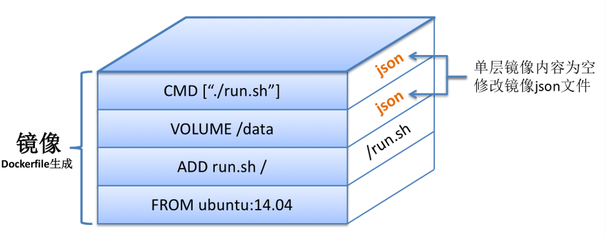

#### 简介

自动化构建是产品发布过程中必不可少的环节，通常会涉及编译、打包等环节，而这些环节在构建产品时通常会有以下问题：

- 需要直接或间接的写一坨用于构建的shell命令等，不易管理、兼容性较差
- 重度依赖如编译机或打包机上的软件环境

理想情况是：不同的应用都可以在某台负责构建的宿主机上并行无干扰的执行构建操作，且构建中依赖的软件环境、构建流程等都可以由开发人员控制。

到目前为止，能很好的完成以上使命的，可能非docker莫属了！

在docker的世界里，构建交付的是镜像，而能够产生镜像的是Dockerfile。

- Dockerfile 是专门用来进行自动化构建镜像的编排文件，我们可以通过 docker build命令来自动化地从 Dockerfile所描述的步骤来构建自定义的Docker镜像，这比我们去命令行一条条指令执行的方式构建高效得多。
- 另一方面，由于 Dockerfile提供了统一的配置语法，因此通过这样一份配置文件，我们可以在各种不同的平台上进行分发，需要时通过 Dockerfile 构建一下就能得到所需的镜像。
- Dockerfile 通过与镜像配合使用，使得 Docker镜像构建之时可以充分利用“镜像的缓存功能”，因此也提效不少！

写 Dockerfile 也像写代码一样，一份精心设计、Clean Code 的 Dockerfile 能在提高可读性的同时也大大提升 Docker 的使用效率

#### Dockerfile 命令

Dockerfile有十几条命令可用于构建镜像，下文将简略介绍这些命令。

**ADD**

ADD命令有两个参数，源和目标。它的基本作用是从源系统的文件系统上复制文件到目标容器的文件系统。如果源是一个URL，那该URL的内容将被下载并复制到容器中。


```
Usage: ADD [source directory or URL] [destination directory]
ADD /my_app_folder /my_app_folder
```

**CMD**

和RUN命令相似，CMD可以用于执行特定的命令。和RUN不同的是，这些命令不是在镜像构建的过程中执行的，而是在用镜像构建容器后被调用。


```
# Usage 1: CMD application "argument", "argument", ..
CMD "echo" "Hello docker!"
```

**ENTRYPOINT**

配置容器启动后执行的命令，并且不可被 docker run 提供的参数覆盖。

每个 Dockerfile 中只能有一个 ENTRYPOINT，当指定多个时，只有最后一个起效。

ENTRYPOINT 帮助你配置一个容器使之可执行化，如果你结合CMD命令和ENTRYPOINT命令，你可以从CMD命令中移除“application”而仅仅保留参数，参数将传递给ENTRYPOINT命令。

```
# Usage: ENTRYPOINT application "argument", "argument", ..
# Remember: arguments are optional. They can be provided by CMD
# or during the creation of a container.
ENTRYPOINT echo
# Usage example with CMD:
# Arguments set with CMD can be overridden during *run*
CMD "Hello docker!"
ENTRYPOINT echo
```

**ENV **
ENV命令用于设置环境变量。这些变量以”key=value”的形式存在，并可以在容器内被脚本或者程序调用。这个机制给在容器中运行应用带来了极大的便利。

```
# Usage: ENV key value
ENV SERVER_WORKS 4
```

**EXPOSE**

EXPOSE用来指定端口，使容器内的应用可以通过端口和外界交互。

```
# Usage: EXPOSE [port]
EXPOSE 8080
```

**FROM**

FROM命令可能是最重要的Dockerfile命令。改命令定义了使用哪个基础镜像启动构建流程。基础镜像可以为任意镜 像。如果基础镜像没有被发现，Docker将试图从Docker image index来查找该镜像。FROM命令必须是Dockerfile的首个命令。

```
# Usage: FROM [image name]
FROM ubuntu
```

**MAINTAINER**

我建议这个命令放在Dockerfile的起始部分，虽然理论上它可以放置于Dockerfile的任意位置。这个命令用于声明作者，并应该放在FROM的后面。

```
# Usage: MAINTAINER [name]
MAINTAINER authors_name
```

**RUN**

RUN命令是Dockerfile执行命令的核心部分。它接受命令作为参数并用于创建镜像。不像CMD命令，RUN命令用于创建镜像（在之前commit的层之上形成新的层）。

```
# Usage: RUN [command]
RUN aptitude install -y riak
```

**USER**

USER命令用于设置运行容器的UID。

```
# Usage: USER [UID]
USER 751
```

**VOLUME**

VOLUME命令用于让你的容器访问宿主机上的目录。

```
# Usage: VOLUME ["/dir_1", "/dir_2" ..]
VOLUME ["/my_files"]
```

**WORKDIR**

WORKDIR命令用于设置CMD指明的命令的运行目录。

```
# Usage: WORKDIR /path
WORKDIR ~/
```
#### 使用Dockerfile

使用Dockerfiles和手工使用Docker Daemon运行命令一样简单。脚本运行后输出为新的镜像ID。

```
# Build an image using the Dockerfile at current location
# Example: sudo docker build -t [name] .
docker build -t pgsql .
```

#### 示例

以下演示以构建centos76+postgresql11镜像为例。

这只是一个简单的示例，将pg源码拷贝到基础镜像然后编译。

```
$ cat Dockerfile 
# --------------------------------------------------
# Dockerfile to build postgreSQL container images
# Base on CentOS 7.6
# --------------------------------------------------

# Set the base image to neokylin
FROM docker.io/centos:7.6

# File Author / Maintainer
LABEL maintainer "yangjie@highgo.com"  

RUN /bin/echo 'root:123456' | chpasswd
RUN useradd postgres
RUN /bin/echo 'postgres:123456' | chpasswd

# Copy postgresql files from the current directory
ADD postgres /opt/postgres

# Install necessary tools
RUN yum -y install bison flex readline-devel zlib-devel
    && yum clean all 
    && rm -rf /var/cache/yum

RUN cd /opt/postgres \
    && ./configure \
    && make clean; make; make install; \
    && cd contrib/ \
    && make clean; make; make install;

# Setting environment variables
# Install database


# Expose the default port
EXPOSE 5432
EXPOSE 22
EXPOSE 80

# Set the default command to execute
# when creating a new container
CMD ["/usr/sbin/sshd"]
```

构建

```
# 构建
$ docker build -t pgsql .
# 查看
$ docker images
REPOSITORY                                TAG                 IMAGE ID            CREATED             SIZE
pgsql                                     latest              c79f4b0a8f78        5 minutes ago       1.38 GB
# 启动容器
$ docker run -itd --name pgsql pgsql:latest /bin/bash
# 查看容器
$ docker ps
CONTAINER ID        IMAGE                  COMMAND                  CREATED             STATUS              PORTS                      NAMES
365b22da366c        pgsql:latest           "/bin/bash"              5 minutes ago       Up 5 minutes        22/tcp, 80/tcp, 5432/tcp   pgsql
# 连接容器
$ docker exec -it pgsql /bin/bash
[root@365b22da366c /]# chown -R postgres:postgres /usr/local/pgsql/
[root@365b22da366c /]# su - postgres
[postgres@365b22da366c ~]$ cd /usr/local/pgsql/bin/
[postgres@365b22da366c bin]$ ./initdb -D ../data
[postgres@365b22da366c bin]$ ./pg_ctl -D ../data/ start
[postgres@365b22da366c bin]$ ./psql 
psql (11.2)
Type "help" for help.

postgres=# 
```
#### 镜像大小
```
$ docker images
REPOSITORY                                TAG                 IMAGE ID            CREATED             SIZE
pgsql                                     latest              c79f4b0a8f78        10 minutes ago      1.38 GB
docker.io/centos                          latest              9f38484d220f        10 days ago         202 MB

```
注意到centos的镜像其实只有200MB，仅仅编译pg竟然到了1.3GB，这就需要进一步了解dockerfile做了什么？

Dockerfile由多条指令构成，随着深入研究Dockerfile与镜像的关系，非常快大家就会发现。

Dockerfile中的每一条指令都会相应于Docker镜像中的一层。

继续以例如以下Dockerfile为例：

FROM ubuntu:14.04
ADD run.sh /
VOLUME /data
CMD ["./run.sh"]
通过docker build以上Dockerfile的时候。会在Ubuntu:14.04镜像基础上，加入三层独立的镜像，依次相应于三条不同的命令。

镜像示意图例如以下：



有了Dockerfile与镜像关系的初步认识之后，我们再进一步联系到每一层镜像的大小。

不得不说，在层级化管理的Docker镜像中。有不少层大小都为0。

那些镜像层大小不为0的情况，归根结底的原因是：构建Docker镜像时，对当前的文件系统造成了改动更新。

而改动更新的情况主要有两种：

1.ADD或COPY命令:ADD或者COPY的作用是在docker build构建镜像时向容器中加入内容。仅仅要内容加入成功，当前构建的那层镜像就是加入内容的大小，如以上命令ADD run.sh /。新构建的那层镜像大小为文件run.sh的大小。

2.RUN命令:RUN命令的作用是在当前空的镜像层内执行一条命令，倘若执行的命令须要更新磁盘文件。那么全部的更新内容都在存储在当前镜像层中。

举例说明：RUN echo DaoCloud命令不涉及文件系统内容的改动，故命令执行完之后当前镜像层的大小为0；`RUN wget http://abc.com/def.tar`命令会将压缩包下载至当前文件夹下，因此当前这一层镜像的大小为:对文件系统内容的增量改动部分，即def.tar文件的大小。

再来看一下我们的镜像，我们可以清楚的发现拷贝pg源码占了900MB
```
$ docker history c79f4b0a8f78
IMAGE               CREATED             CREATED BY                                      SIZE                COMMENT
c79f4b0a8f78        11 minutes ago      /bin/sh -c #(nop)  CMD ["/usr/sbin/sshd"]       0 B                 
1d374bf6fe39        11 minutes ago      /bin/sh -c #(nop)  EXPOSE 80/tcp                0 B                 
225293fa2cd3        11 minutes ago      /bin/sh -c #(nop)  EXPOSE 22/tcp                0 B                 
b68e1cbfa05f        11 minutes ago      /bin/sh -c #(nop)  EXPOSE 5432/tcp              0 B                 
9b5975854593        11 minutes ago      /bin/sh -c set -eux  && cd /opt/postgres  ...   75.5 MB             
af193290b45c        15 minutes ago      /bin/sh -c set -x  && yum -y install bison...   156 MB              
41150c6c7581        16 minutes ago      /bin/sh -c #(nop) ADD dir:d57fa47decdfdc50...   948 MB              
efa2cda50b68        57 minutes ago      /bin/sh -c /bin/echo 'postgres:123456' | c...   1.83 kB             
a394918a64fd        57 minutes ago      /bin/sh -c useradd postgres                     296 kB              
60abcd73fa1e        57 minutes ago      /bin/sh -c /bin/echo 'root:123456' | chpasswd   1.52 kB             
3c440ae01e3b        57 minutes ago      /bin/sh -c #(nop)  LABEL maintainer=yangji...   0 B                 
9f38484d220f        10 days ago         /bin/sh -c #(nop)  CMD ["/bin/bash"]            0 B                 
<missing>           10 days ago         /bin/sh -c #(nop)  LABEL org.label-schema....   0 B                 
<missing>           10 days ago         /bin/sh -c #(nop) ADD file:074f2c974463ab3...   202 MB
```
这里完全可以优化一下：

将下载源码，编译，删除源码放在一条命令中完成。

```
RUN set -eux \
        && wget https://ftp.postgresql.org/pub/source/v11.2/postgresql-11.2.tar.gz \
        && tar zxvf postgresql-11.2.tar.gz -C /opt && rm postgresql-11.2.tar.gz \
        && cd /opt/postgresql-11.2 \
        && ./configure \
        && make clean; make; make install \
        && cd contrib \
        && make clean; make; make install \
        && rm -rf /opt/postgresql-11.2

$ docker build pgsql-11.2 .

$ docker images
REPOSITORY                                TAG                 IMAGE ID            CREATED             SIZE
pgsql-11.2                                latest              338afc2a0a3e        2 minutes ago       383 MB

$ docker history 338afc2a0a3e
IMAGE               CREATED             CREATED BY                                      SIZE                COMMENT
338afc2a0a3e        3 minutes ago       /bin/sh -c #(nop)  CMD ["/usr/sbin/sshd"]       0 B                 
373751418cf4        3 minutes ago       /bin/sh -c #(nop)  EXPOSE 80/tcp                0 B                 
6e555eb07f75        3 minutes ago       /bin/sh -c #(nop)  EXPOSE 22/tcp                0 B                 
ae4866a01334        3 minutes ago       /bin/sh -c #(nop)  EXPOSE 5432/tcp              0 B                 
5f475c6acf58        3 minutes ago       /bin/sh -c set -eux  && wget https://ftp.p...   24.2 MB             
ec3c374d38db        10 minutes ago      /bin/sh -c set -x  && yum -y install bison...   157 MB              
efa2cda50b68        About an hour ago   /bin/sh -c /bin/echo 'postgres:123456' | c...   1.83 kB             
a394918a64fd        About an hour ago   /bin/sh -c useradd postgres                     296 kB              
60abcd73fa1e        About an hour ago   /bin/sh -c /bin/echo 'root:123456' | chpasswd   1.52 kB             
3c440ae01e3b        About an hour ago   /bin/sh -c #(nop)  LABEL maintainer=yangji...   0 B                 
9f38484d220f        10 days ago         /bin/sh -c #(nop)  CMD ["/bin/bash"]            0 B                 
<missing>           10 days ago         /bin/sh -c #(nop)  LABEL org.label-schema....   0 B                 
<missing>           10 days ago         /bin/sh -c #(nop) ADD file:074f2c974463ab3...   202 MB 
```
镜像大小现在只有380MB。

#### 参考

https://www.cnblogs.com/boshen-hzb/p/6400272.html

https://www.cnblogs.com/claireyuancy/p/7029126.html

https://blog.csdn.net/a1010256340/article/details/80092038

