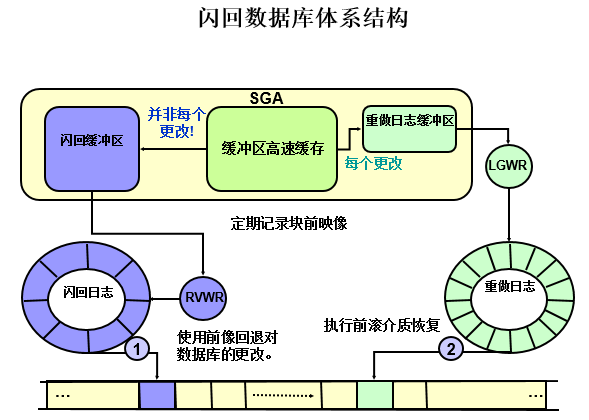
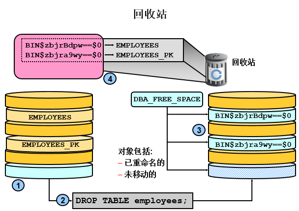
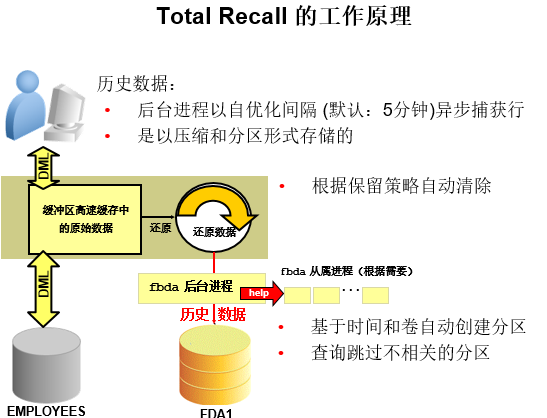

闪回技术是一组Oracle新特性，能够查看objects过去状态或使objects返回到过去的状态而无需使用media recovery。 

闪回技术可实现：

- 查询过去时间点数据
- 查询过去时间段数据的变化
- 恢复表或行到过去的时间点
- 自动追踪和归档事务数据的更改
- 在线回退事务及其依赖的事务

## 闪回技术示例

### 闪回数据库

闪回数据库依赖闪回日志。

闪回数据库类似传统的media recovery，允许将数据库返回到最近过去的一个时间点，但是闪回数据库要比传统的恢复快很多，因为不需要从备份中恢复数据文件，而是从归档日志中应用一部分更改。

闪回数据库可应用于任何逻辑数据损坏的情况，但对于数据库物理故障无法使用闪回数据库，如：数据文件删除、丢失、损坏等；控制文件恢复、重建等。

 

要想启用闪回数据库，需要做如下配置：

1. 启用数据库Flashback功能，数据库必须处于archivelog 模式. 
2. 配置快速恢复区（Flash Recovery Area）


>*db_recovery_file_dest/db_recovery_file_dest_size*
>
>要想使用闪回数据库， 必须使用快速恢复区，因为闪回数据库日志只能保存在这里。 要配置的2个参数如下，一个是大小，一个是位置。
>
>*db_flashback_retention_target*
>
>该参数用来控制闪回日志数据保留的时间，默认值是1440，单位是minute，即24 小时，需要注意的是该参数虽然未直接指定快速恢复区大小，但却受其制约，举个例子假如数据库每天有10%左右的数据变动的话，如果该初始化参数值设置为1440，则快速恢复区的大小至少要是当前数据库实际容量的10%，如果该初始化参数设置为2880，则快速恢复区的大小就至少是数据库所占容量的20%。  
>
>*log_archive_dest_1*
>
>log_archive_dest_n 参数可以设置最多10个不同的归档路径，通过设置关键词location或service，该参数指向的路径可以是本地或远程的。 

```sql
SQL> select LOG_MODE,FLASHBACK_ON from v$database;

LOG_MODE     FLASHBACK_ON
------------ ------------------
ARCHIVELOG   YES

db_recovery_file_dest
db_recovery_file_dest_size
db_flashback_retention_target
log_archive_dest_1

SQL> show parameter db_recovery_file 

NAME				     TYPE	 VALUE
------------------------------------ ----------- ------------------------------
db_recovery_file_dest		    string	 /highgo/data/oracle/flash_recovery_area
db_recovery_file_dest_size	     big integer 2G

SQL> archive log list; 
Database log mode	       Archive Mode
Automatic archival	       Enabled
Archive destination	       USE_DB_RECOVERY_FILE_DEST
Oldest online log sequence     1
Next log sequence to archive   1
Current log sequence	       4
```

**示例：**

**1，确认闪回窗口，找到最早可闪回时间点**

```sql
SQL> SELECT OLDEST_FLASHBACK_SCN, to_char(OLDEST_FLASHBACK_TIME,'yyyy-mm-dd hh24:mi:ss') FROM  v$FLASHBACK_DATABASE_LOG;

OLDEST_FLASHBACK_SCN TO_CHAR(OLDEST_FLAS
-------------------- -------------------
	   146446313 2018-06-25 11:09:32
```

> *注意1*：闪回窗口受快速恢复区大小db_recovery_file_dest_size及保留时间db_flashback_retention_target影响，总是尽可能维持在保留期内，但参数不是强制，如果快速恢复区过小，无法存放新的闪回日志，依然会自动清理旧的闪回日志，无论是否在保留期内。
>
> *注意2*：闪回数据库可以和强制还原点(guaranteed restore points)，配合来保证闪回窗口时间，但要确保有足够的快速恢复区大小db_recovery_file_dest_size及强制还原点以来所有的归档日志。


**2，模拟逻辑错误**

```sql
select * from yangjie.dept;

    DEPTNO LOC
---------- --------------------------------------------------
	 1 jinan
	 2 beijing
	 3 hangzhou

SQL> drop user yangjie cascade;

User dropped.

SQL> select * from yangjie.dept;
select * from yangjie.dept
                      *
ERROR at line 1:
ORA-00942: table or view does not exist
```

**3，指定时间点尝试闪回**

```sql
SQL> shutdown immediate
Database closed.
Database dismounted.
ORACLE instance shut down.

SQL> startup mount
ORACLE instance started.

Total System Global Area 1068937216 bytes
Fixed Size		    2260088 bytes
Variable Size		  641729416 bytes
Database Buffers	  419430400 bytes
Redo Buffers		    5517312 bytes
Database mounted.

SQL> FLASHBACK DATABASE TO timestamp to_timestamp('2018-06-25 11:20:32', 'yyyy-mm-dd hh24:mi:ss');

Flashback complete.

或者： 
Flashback database to scn xxxxx; 
```

**4，打开数据库**

在执行完闪回数据库命令之后，oracle 提供了两种方式让你修复数据库： 

1). 直接alter database open resetlogs打开数据库，当然，指定scn或者timestamp时间点之后产生的数据统统丢失。 

2). 先执行alter database open read only 命令以read-only 模式打开数据库，然后立刻通过逻辑导出的方式将误操作涉及表的数据导出，再执行recover database 命令以重新应用数据库产生的redo，将数据库修复到flashback database 操作前的状态，然后再通过逻辑导入的方式，将之前误操作的表重新导入，这样的话对现有数据的影响最小，不会有数据丢失。 

```sql
-- 可以read only打开方式验证此时间点是否为目标时间点
SQL> alter database open read only;

Database altered.

SQL> select * from yangjie.dept;
select * from yangjie.dept
                      *
ERROR at line 1:
ORA-00942: table or view does not exist
-- 非目标时间点

-- 在目标时间点闪回成功后，以open resetlogs 方式打开数据库
SQL> FLASHBACK DATABASE TO timestamp to_timestamp('2018-06-25 11:15:32', 'yyyy-mm-dd hh24:mi:ss');

Flashback complete.
SQL> alter database open read only;

Database altered.

SQL> select * from yangjie.dept;

    DEPTNO LOC
---------- --------------------------------------------------
	 1 jinan
	 2 beijing
	 3 hangzhou
	 
shutdown immediate
startup mount
alter database open resetlogs;
```


### 闪回查询、闪回版本查询

闪回查询依赖还原undo数据。

闪回查询允许查询过去时间点数据，或过去时间段数据变化。


前提：

1 配置自动还原管理（AUM）

```
SQL> show parameter undo 

NAME				     TYPE	 VALUE
------------------------------------ ----------- ------------------------------
undo_management 		     string	 AUTO
undo_retention			     integer	 900
undo_tablespace 		     string	 UNDOTBS1

```

2 授予相应select权限


示例：

环境配置

```sql
SQL> create table dept_test as select * from dept;
SQL> select to_char(sysdate,'yyyy-mm-dd hh24:mi:ss') from dual;

TO_CHAR(SYSDATE,'YY
-------------------
2018-06-28 11:36:34
```

事务操作

```sql
SQL> select to_char(sysdate,'yyyy-mm-dd hh24:mi:ss') from dual;

TO_CHAR(SYSDATE,'YY
-------------------
2018-06-28 11:36:52

SQL> update dept_test set loc='JINAN' where deptno=2; 

1 row updated.

SQL> commit;

Commit complete.

SQL> select to_char(sysdate,'yyyy-mm-dd hh24:mi:ss') from dual;

TO_CHAR(SYSDATE,'YY
-------------------
2018-06-28 11:37:45

SQL> update dept_test set loc='beijing' where deptno=2;   

1 row updated.

SQL> update dept_test set loc='shanghai' where deptno=2;

1 row updated.

SQL> commit;

Commit complete.

SQL> select to_char(sysdate,'yyyy-mm-dd hh24:mi:ss') from dual;

TO_CHAR(SYSDATE,'YY
-------------------
2018-06-28 11:38:35
```

闪回查询

在select中使用 AS OF 子句指定过去时间点查询即可

```sql
SQL> select * from dept_test where deptno=2;

    DEPTNO LOC
---------- --------------------------------------------------
	 2 shanghai

SQL> SELECT * FROM dept_test AS OF TIMESTAMP TO_TIMESTAMP('2018-06-28 11:36:52',  'YYYY-MM-DD HH:MI:SS') WHERE deptno=2;

    DEPTNO LOC
---------- --------------------------------------------------
	 2 beijing
	 
SQL> SELECT * FROM dept_test AS OF TIMESTAMP TO_TIMESTAMP('2018-06-28 11:37:45',  'YYYY-MM-DD HH:MI:SS') WHERE deptno=2;

    DEPTNO LOC
---------- --------------------------------------------------
	 2 JINAN

SQL> SELECT * FROM dept_test AS OF TIMESTAMP TO_TIMESTAMP('2018-06-28 11:38:35',  'YYYY-MM-DD HH:MI:SS') WHERE deptno=2;

    DEPTNO LOC
---------- --------------------------------------------------
	 2 shanghai
```

 闪回版本查询

在select中使用VERSIONS BETWEEN子句指定时间点查询即可 

```sql
SQL> SELECT * FROM dept_test 
		VERSIONS BETWEEN TIMESTAMP 
			TO_TIMESTAMP('2018-06-28 11:36:52', 'YYYY-MM-DD HH24:MI:SS') 
		AND TO_TIMESTAMP('2018-06-28 11:38:35', 'YYYY-MM-DD HH24:MI:SS') 
		WHERE deptno=2;

    DEPTNO LOC
---------- --------------------------------------------------
	 2 shanghai
	 2 JINAN
	 2 beijing
```

Beijing并不是一个版本，因为没有提交！ 


### 闪回事务查询与闪回事务

闪回事务查询及闪回事务是对 事务transaction 这个对象的闪回操作。

闪回事务查询，查询视图flashback_transaction_query

 

前提

1 兼容版本 10.0及以上

2 启用补充日志

```sql
-- Enable supplemental logging:
ALTER DATABASE ADD SUPPLEMENTAL LOG DATA;
```

否则会不会记录额外列信息

 ```sql
XID      OPERATION         START_SCN COMMIT_SCN LOGON_USER             UNDO_SQL
---------------- -------------------- ---------- ---------- ------------------------------ ----------------------------------------
09000F00B9040000 UNKNOWN         1806200    1807474 SCOTT
09000F00B9040000 BEGIN           1806200    1807474 SCOTT
 ```

示例：

1 事务操作

```sql
SQL> select * from dept_test;

    DEPTNO DNAME	  LOC
---------- -------------- -------------
	10 ACCOUNTING	  test
	20 RESEARCH	  DALLAS
	30 SALES	  CHICAGO
	40 OPERATIONS	  BOSTON
SQL> update dept_test set loc='beijing' where deptno=10;
SQL> update dept_test set loc='nanjing' where deptno=20;
SQL> commit;
SQL> select to_char(sysdate,'yyyy-mm-dd hh24:mi:ss') from dual;

TO_CHAR(SYSDATE,'YY
-------------------
2017-07-24 12:40:11
```


2 通过闪回版本查询，找到事务id（XID）

```sql
SELECT versions_xid, versions_operation,loc FROM dept_test
  VERSIONS BETWEEN TIMESTAMP
      TO_TIMESTAMP('2017-07-24 12:35:11', 'YYYY-MM-DD HH24:MI:SS')
  AND TO_TIMESTAMP('2017-07-24 12:40:11', 'YYYY-MM-DD HH24:MI:SS')
  WHERE deptno=10;

VERSIONS_XID	 V LOC
---------------- - -------------
05001900A8040000 U beijing
		   			Test
```


3 闪回查询事务信息

```sql
SQL> SELECT xid, operation, start_scn, commit_scn, logon_user, undo_sql
		FROM flashback_transaction_query
		WHERE xid = '02001D00AE040000';   

XID      OPERATION    START_SCN COMMIT_SCN LOGON_USER      UNDO_SQL
---------------- --------------- ---------- ---------- --------------- ----------------------------------------
02001D00AE040000 UPDATE         1812260    1812266 SCOTT           update "SCOTT"."DEPT_TEST" set "LOC" = '
                                       nanjing' where ROWID = 'AAATtxAAEAAAAIbA
                                       AB';

02001D00AE040000 UPDATE         1812260    1812266 SCOTT           update "SCOTT"."DEPT_TEST" set "LOC" = '
                                       beijing' where ROWID = 'AAATtxAAEAAAAIbA
                                       AA';

02001D00AE040000 BEGIN          1812260    1812266 SCOTT
```

事务02001D00AE040000有两个update操作，还可以看到undo_sql

注：也可通过其他条件，闪回事务查询

```sql
select xid,table_name,table_owner,operation,undo_sql from flashback_transaction_query where table_name='T3_HR'; 
```


4 闪回事务

通过PL/SQL程序包DBMS_FLASHBACK.TRANSACTION_BACKOUT可以直接闪回一个事务机器及依赖的事务


前提配置

Configuring Your Database for Flashback Transaction

To configure your database for the Flashback Transaction feature, you or your database administrator must:

With the database mounted but not open, enable ARCHIVELOG:

```sql
ALTER DATABASE ARCHIVELOG;
```

Open at least one archive log:

```sql
ALTER SYSTEM ARCHIVE LOG CURRENT;
```

If not done, enable minimal and primary key supplemental logging:

```sql
ALTER DATABASE ADD SUPPLEMENTAL LOG DATA;

ALTER DATABASE ADD SUPPLEMENTAL LOG DATA (PRIMARY KEY) COLUMNS;
```

If you want to track foreign key dependencies, enable foreign key supplemental logging:

```sql
ALTER DATABASE ADD SUPPLEMENTAL LOG DATA (FOREIGN KEY) COLUMNS;
```


```sql
delete from dept_test where deptno=10;

XID     UNDO_SQL
---------------- ----------------------------------------
03001400A7040000 insert into "SCOTT"."DEPT_TEST"("DEPTNO"
        ,"DNAME","LOC") values ('10','ACCOUNTING
        ','xid2');

SQL> alter system archive log current;

declare
 xids sys.xid_array;
begin
 xids := sys.xid_array('03001400A7040000');
 dbms_flashback.transaction_backout(1,xids,options=>dbms_flashback.cascade);
end;
/

commit;

SQL> select * from dept_test;

    DEPTNO DNAME    LOC
---------- -------------- -------------
    20 RESEARCH     nanjing2
    30 SALES     CHICAGO
    40 OPERATIONS   BOSTON

SQL> /

    DEPTNO DNAME    LOC
---------- -------------- -------------
    20 RESEARCH     nanjing2
    30 SALES        CHICAGO
    40 OPERATIONS   BOSTON
    10 ACCOUNTING   xid2
```


### 闪回表

闪回表依赖的是undo数据

使用闪回表，可将一个或多个表还原到特定时间点，而不需要还原备份

 

前提条件

需要具有对特定表的 FLASHBACK ANY TABLE 或 FLASHBACK 对象权限。

需要对要闪回的表具有SELECT, INSERT, DELETE,和 ALTER 权限。

必须对要执行闪回操作的表启用行移动。

````sql
ALTER TABLE tbl_name ENABLE ROW MOVEMENT;
````

示例：

```sql
SQL> select * from dept_test;

    DEPTNO LOC
---------- --------------------------------------------------
	 1 jinan
	 2 shanghai
	 3 hangzhou

SQL> select to_char(sysdate,'yyyy-mm-dd hh24:mi:ss') from dual;

TO_CHAR(SYSDATE,'YY
-------------------
2018-07-02 09:29:52

SQL> delete from dept_test;

3 rows deleted.

SQL> commit;

Commit complete.
        
SQL> select * from dept_test;

no rows selected

-- 启动行移动
SQL> ALTER TABLE dept_test ENABLE ROW MOVEMENT;

Table altered.

-- 闪回表
SQL> FLASHBACK TABLE dept_test TO TIMESTAMP TO_TIMESTAMP('2018-07-02 09:29:52','YYYY-MM-DD HH24:MI:SS');

Flashback complete.

SQL> select * from dept_test;

    DEPTNO LOC
---------- --------------------------------------------------
	 1 jinan
	 2 shanghai
	 3 hangzhou
```


注意：

闪回表会获取DML排查锁

闪回表不可跨DDL操作


### 闪回删除

闪回删除依赖的是回收站recyclebin，回收站默认开启

```sql
SQL> show parameter recyclebin

NAME				     TYPE	 VALUE
------------------------------------ ----------- ------------------------------
recyclebin			     string	 on
```

闪回删除会还原表及其依赖的对象

示例：

```sql
SQL> create table emp_test as select * from emp;

Table created.

SQL> create index emp_test_idx on emp_test(empno);

Index created.

SQL> commit;

Commit complete.

SQL> select count(*) from emp_test;

  COUNT(*)
----------
	 2

-- 删除表
SQL> drop table emp_test;

Table dropped.

-- 查询回收站
SQL> select OBJECT_NAME,ORIGINAL_NAME,DROPTIME from user_recyclebin;

OBJECT_NAME		       ORIGINAL_NAME
------------------------------ --------------------------------
DROPTIME
-------------------
BIN$b/uZEChWRazgU7FkqMAD/g==$0 EMP_TEST_IDX
2018-07-02:10:03:04

BIN$b/uZEChXRazgU7FkqMAD/g==$0 EMP_TEST
2018-07-02:10:03:04

-- 闪回删除
SQL> flashback table EMP_TEST to before drop;

Flashback complete.

-- 查询
SQL> select * from emp_test;

     EMPNO DATA
---------- --------------------------------------------------
	 1 aa
	 2 bb

-- 依赖表的索引也一并被闪回回来，但索引的名字保留回收站中的名字
SQL> select INDEX_NAME,TABLE_OWNER,table_name from user_indexes;

INDEX_NAME		       TABLE_OWNER
------------------------------ ------------------------------
TABLE_NAME
------------------------------
BIN$b/uZEChWRazgU7FkqMAD/g==$0 YANGJIE
EMP_TEST
```


### 闪回数据归档

前面发现，很多闪回技术依赖与还原数据undo，即受限于undo保留时间。

undo表空间大小有是一定的，循环使用的，依据undo_retention的设置，默认其为非强制参数，按以下顺序使用

优先使用未用部分

使用undo_retention过期部分

使用undo_retention保护期内部分

严禁使用未提交事务所占用的undo部分

所以undo数据总有丢失的时候，ORA-01555就是其中一个体现

为了更好的使用闪回技术，使闪回数据归档访问历史数据，Oracle提供了闪回数据归档，即归档undo数据，类似归档redo。这样就可以闪回查询N年前的数据 


闪回数据归档简单配置

1 创建用于保存 FDA的新表空间。

```sql
create tablespace fda datafile '/u02/app/oracle/fda01.dbf' size 50m autoextend on;
```

2.  使用 FLASHBACK ARCHIVE ADMINISTER 系统权限：创建闪回数据归档，将它分配到表空间，并指定其保留期。 

```sql
CREATE FLASHBACK ARCHIVE fda1 TABLESPACE fda QUOTA 10M RETENTION 1 YEAR; 
```

3.  使用 FLASHBACK ARCHIVE 对象权限：变更基表以启用归档并将其分配到一个闪回归档。

```sql
ALTER TABLE scott.dept_test FLASHBACK ARCHIVE fda1;
```


监视闪回数据归档

*_FLASHBACK_ARCHIVE:显示有关闪回数据归档的信息

*_FLASHBACK_ARCHIVE_TS:显示闪回数据归档的表空间

*_FLASHBACK_ARCHIVE_TABLES:显示有关启用了闪回归档的表的信息


## 闪回技术原理

### 闪回数据库



当启用闪回数据库，在SGA中会多出一块内存-闪回缓冲区，用于存放闪回数据，在buffer cache中，每个数据库更改，都会以log record的方式记录到log buffer，然后通过后台进程LGWR写入到磁盘 online log group，而buffer cache中的更改也会记录到flashback buffer，但并不是每一个更改都记录，只是记录部分更改，然后通过后台进程RVWR写入磁盘flashback log

因为flashback log 并不记录每一个更改，而是按照一定时间间隔，记录更改块的映像，所以，当闪回到过去某个时间点时，需要1flashback log闪回到目标时间点之前数据块影响副本2redo log前滚恢复到目标时间点

Flashback buffer大小受隐含参数 `_flashback_generation_buffer_size`  限制

```sql
P_NAME                   P_DESCRIPTION                      P_VALUE            ISDEFAULT ISMODIFIED ISADJ

---------------------------------------- -------------------------------------------------- ------------------------------ --------- ---------- -----

_flashback_generation_buffer_size    flashback generation buffer size           4194304            TRUE      FALSE FALSE

```

Flashback buffer 每3s检查一次

可对闪回日志dump，做深入研究

```sql
Sql > alter system dump flashback logfile '/u02/app/oracle/fra/ORCL/flashback/o1_mf_dqbmlh1t_.flb';
```

如：

```sql
DUMP OF FLASHBACK LOG FILE (1) /u02/app/oracle/fra/ORCL/flashback/o1_mf_dqbmlh1t_.flb

 FILE HEADER:

        Compatibility Vsn = 186646528=0xb200000

        Db ID=1395555907=0x532e7e43, Db Name='ORCL'

        Activation ID=1395601216=0x532f2f40

        Control Seq=3886=0xf2e, File size=6400=0x1900

        File Number=1, Blksiz=8192, File Type=8 FLASH BACK

  FLASHBACK HEADER:

   Flashback Block Header:

      Seq: 1 Block: 1 Cks: 0x1e9 Flag: 0x1 Lst: 0

   description:"Thread 0001, Seq# 0000000001, SCN 0x000000000000"

   thread: 1  seq: 1  version 0  nab: 4294967295

   reset logs count: 0x33b932c6 scn: 0x0000.000f30dc

   formatted blocks: 6400  usable blocks: 6400

   magic: 2  previous magic: 0  flags: 0x0

   Low scn: 0x0000.00000000 07/24/2017 09:33:03

   High scn: 0xffff.ffffffff 07/25/2017 09:33:03

   Last Marker:

Flashback async buffers are set to 32

 Current records:

  Record at fba: (lno 1 thr 1 seq 1 bno 69 bof 3292) 

    RECORD HEADER:

      Type: 1 (Block Image)  Size: 28

RECORD DATA (Block Image):
```


### 闪回查询、闪回版本查询

闪回查询，闪回版本查询，用到的都是还原undo数据

Oracle中每个事务都会分配一个回滚段，事务的更改以redo record的形式生成redo数据存放与online log group中，事务的前映像以undo数据存储在undo段中，闪回查询类似与读一致性

当我们做一个事务操作，会分配相应的回滚段

```sql
SQL> update dept_test set loc='test' where deptno=10;
```

查询使用的回滚段信息

```sql
select userenv('sid') from dual;

select t.addr,s.taddr,s.sid from vtransaction t,vsession s where t.addr = s.Taddr and sid=26;

select addr,xidusn,xidslot,xidsqn,ubafil,ubablk,ubasqn,ubarec,status,xid from v$transaction where addr='00000000700C32F0';

 

ADDR             XIDUSN    XIDSLOT     XIDSQN     UBAFIL     UBABLK     UBASQN     UBAREC STATUS           XID

---------------- ---------- ---------- ---------- ---------- ---------- ---------- ---------- ---------------- ----------------

00000000700C32F0      9     15       1209      3        280        403      1 ACTIVE           09000F00B9040000

```

那么我们可以看到这条语句的undo信息存储在3号文件280号块上

 Dump undo块查看

```sql
alter system dump datafile 3 block 280;

UNDO BLK:

xid: 0x0009.00f.000004b9  seq: 0x193 cnt: 0x1   irb: 0x1   icl: 0x0   flg: 0x0000

 

 Rec Offset      Rec Offset      Rec Offset      Rec Offset      Rec Offset

---------------------------------------------------------------------------

0x01 0x1f44

 

*-----------------------------

* Rec #0x1  slt: 0x0f  objn: 80753(0x00013b71)  objd: 80753  tblspc: 4(0x00000004)

*       Layer:  11 (Row)   opc: 1   rci 0x00

Undo type:  Regular undo    Begin trans    Last buffer split:  No

Temp Object:  No

Tablespace Undo:  No

rdba: 0x00000000Ext idx: 0

flg2: 0

*-----------------------------

uba: 0x00c0010f.0192.0e ctl max scn: 0x0000.001b8b40 prv tx scn: 0x0000.001b8b54

txn start scn: scn: 0x0000.001b8f78 logon user: 83

 prev brb: 12583179 prev bcl: 0

KDO undo record:

KTB Redo

op: 0x04  ver: 0x01

compat bit: 4 (post-11) padding: 1

op: L  itl: xid:  0x0009.00c.000004b6 uba: 0x00c000ea.018e.25

                      flg: C---    lkc:  0     scn: 0x0000.001b83a1

KDO Op code: URP row dependencies Disabled

  xtype: XA flags: 0x00000000  bdba: 0x0100021b  hdba: 0x0100021a

itli: 2  ispac: 0  maxfr: 4858

tabn: 0 slot: 0(0x0) flag: 0x2c lock: 0 ckix: 0

ncol: 3 nnew: 1 size: 4

col  2: [ 8]  4e 45 57 20 59 4f 52 4b
```

cnt: 0x1 共有一条unod record

0x01 0x1f44：第一条undo record和他的偏移量

Rec #0x1：第一条undo record信息

scn: 0x0000.001b83a1

```sql
TO_CHAR(SCN_TO_TIME
-------------------
2017-07-24 10:51:31
```

KDO Op code：rollback做update操作

4e 45 57 20 59 4f 52 4b ，16进制转换成ascii为前映像-new York

对比scn，找到相应的undo块，读取前映像


### 闪回事务查询与闪回事务

事务存储在undo段头的TRN TBL中，同时也存在于数据段头ITL槽中，整个事务的操作也会以redo record的方式记录到online log group中

所以说事务贯穿了redo ，undo，data balock

通过事物表TRN TBL，可以找到事务的信息

通过undo可以找到数据前映像，

通过redo可以找到数据前后映像

事务insert，产生undo最少，只记录rowid信息，rollback就是做delete操作

事务update，产生undo中间，记录rowid，修改前的值，rollback就是做反向update

事务delete，产生undo最多，记录rowid，存放删除整行操作，rollback就是做insert

```sql
update dept_test set loc='transaction' where deptno=10;

select userenv('sid') from dual;

select t.addr,s.taddr,s.sid from vtransaction t,vsession s where t.addr = s.Taddr and sid=26;

select addr,xidusn,xidslot,xidsqn,ubafil,ubablk,ubasqn,ubarec,status,xid from v$transaction where addr='00000000700A4BE0'; ADDR            XIDUSN    XIDSLOT     XIDSQN     UBAFIL     UBABLK     UBASQN     UBAREC STATUS           XID
---------------- ---------- ---------- ---------- ---------- ---------- ---------- ---------- ---------------- ----------------
00000000700A4BE0      2     14       1202      3        775        241      1 ACTIVE           02000E00B2040000
```

事务02000E00B2040000存放在2号undo段头事务槽的14号，undo信息存储在3号文件的775号块上

查询相关信息

```sql
SQL> select addr,xidusn,xidslot,xidsqn from v$transaction;

ADDR             XIDUSN    XIDSLOT     XIDSQN
---------------- ---------- ---------- ----------
00000000700A4BE0      2     14       1202

SQL> select * from v$rollname;

       USN NAME
---------- ------------------------------
     0 SYSTEM
     1 _SYSSMU1_1240252155$
     2 _SYSSMU2_111974964$
     3 _SYSSMU3_4004931649$
     4 _SYSSMU4_1126976075$
     5 _SYSSMU5_4011504098$
     6 _SYSSMU6_3654194381$
     7 _SYSSMU7_4222772309$
     8 _SYSSMU8_3612859353$
     9 _SYSSMU9_3945653786$
    10 _SYSSMU10_3271578125$

11 rows selected.

SQL> select EXTENT_ID,FILE_ID, BLOCK_ID,BYTES,BLOCKS,STATUS from dba_undo_extents where segment_name='_SYSSMU2_111974964$';

 EXTENT_ID    FILE_ID   BLOCK_ID      BYTES BLOCKS STATUS
---------- ---------- ---------- ---------- ---------- ---------
     0      3        144      65536      8 EXPIRED
     1      3        312      65536      8 EXPIRED
     2      3       1024    1048576    128 EXPIRED
     3      3        768    1048576    128 ACTIVE

SQL> select group#,status from v$log;

    GROUP# STATUS
---------- ----------------
     1 CURRENT
     2 INACTIVE
     3 INACTIVE

SQL> select group#,member from v$logfile where group#=1;

    GROUP#
----------
MEMBER
--------------------------------------------------------------------------------------------------------------------------------------------------------------------------------------------------------
     1
+DATA/orcl/onlinelog/group_1.261.867775175

SQL> select object_id from dba_objects where object_name='DEPT_TEST';

 OBJECT_ID
----------
     80753
```

分别dump 事务所在的undo断头块，undo块信息，redo日志信息，分析相关dump信息

```sql
alter session set tracefile_identifier='undo_header';
alter system dump undo header '_SYSSMU2_111974964$';
alter session set tracefile_identifier='undo';
alter system dump datafile 3 block 775;
alter session set tracefile_identifier='redo';
alter system dump logfile '+DATA/orcl/onlinelog/group_1.261.867775175';
```


### 闪回表

参考闪回事务查询与闪回事务

对表的操作

事务insert，产生undo最少，只记录rowid信息，rollback就是做delete操作

事务update，产生undo中间，记录rowid，修改前的值，rollback就是做反向update

事务delete，产生undo最多，记录rowid，存放删除整行操作，rollback就是做insert

只要undo信息还在，就可以通过闪回将整个表还原到过去的时间


### 闪回删除



Oracle中回收站类似windows中的回收站，其空间大小受限于数据文件剩余空间

当把一个表从数据库中删除后，并没有真正的删掉，其被重命名为回收站名字，标记为可覆盖使用的空闲空间。数据文件的使用优先使用未用部分，然后使用可覆盖部分，当空闲空间不足时，会覆盖使用回收站中对象占用的空间


### 闪回数据归档



闪回数据归档可自动分区及压缩，且根据保留册率自动清除


## 参考

http://docs.oracle.com/cd/E11882_01/appdev.112/e41502/adfns_flashback.htm#ADFNS1008

http://docs.oracle.com/database/122/BRADV/using-flasback-database-restore-points.htm#BRADV582

Oracle OCP administrator 2

http://www.docin.com/p-1781240856.html