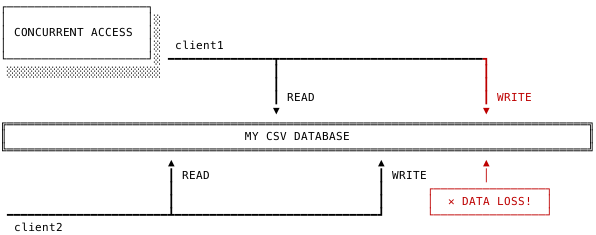

https://brandur.org/postgres-atomicity


Atomicity (in the sense of “ACID”) states that for a series of operations performed against a database, either every one of them commits together, or they’re all rolled back; no in between states are allowed. For code that needs to be resilient to the messiness of the real world, it’s a godsend.

原子性（Atomicity，ACID的A），对于对数据库执行的一系列操作，要么全部都提交，要么全部都回滚；不可能停滞在中间某个环节。对于需要适应现实世界混乱的代码，这是一个天赐之物。

Instead of bugs that make it to production changing data and then leaving it permanently corrupt, those changes are reverted. The long tail of connections that are dropped midway from intermittent problems and other unexpected states while handling millions of requests might cause inconvenience, but won’t scramble your data.

这些更改将被还原, 而不是使其生产更改数据并将其永久损坏的 bug。在处理数百万个请求时，间歇性问题和其他意外状态中途丢弃的连接可能会造成不便，但不会扰乱您的数据。

Postgres’s implementation in particular is known to provide powerful transaction semantics with little overhead. And while I’ve used it for years, it’s never been something that I’ve understood. Postgres works reliably enough that I’ve been able to treat it as a black box – wonderfully useful, but with inner workings that are a mystery.

众所周知，Postgres的实现能够以很少的开销提供强大的事务语义。虽然我已经用了很多年了，但它从来都不是我所理解的东西。Postgres工作得很可靠，我可以把它当成一个黑匣子 -- 非常有用，但内心的运作却是一个谜。

This article looks into how Postgres keeps the books on its transactions, how they’re committed atomically, and some concepts that are key to understanding it all [1](https://brandur.org/postgres-atomicity#footnote-1).

本文将探讨Postgres如何保存其事务记录，如何以原子方式提交这些事务，以及一些对理解所有事务至关重要的概念 [1](#footnote-1)。

> [1](#footnote-1-source) 
>
> A few words of warning: the Postgres source code is pretty overwhelming, so I’ve glossed over a few details to make this reading more digestible. It’s also under active development, so the passage of time will likely render some of these code samples quite obsolete.
>
> 几句警告：Postgres的源代码非常强大，所以我浏览了一些细节，以使这个阅读更容易理解。它也在积极的开发中，所以随着时间的推移，这些代码样本中的一些很可能已经过时了。

## Managing concurrent access

Say you build a simple database that reads and writes from an on-disk CSV file. When a single client comes in with a request, it opens the file, reads some information, and writes the changes back. Things are mostly working fine, but then one day you decide to enhance your database with a sophisticated new feature, multi-client support!

假设您构建了一个简单的数据库，可以从磁盘上的CSV文件进行读写。当单个客户端提交请求时，它会打开文件，读取一些信息，然后将更改写回。事情大多进展顺利，但有一天，您决定用一个复杂的新特性 - 多客户端支持来增强您的数据库！

Unfortunately, the new implementation is immediately plagued by problems that seem to especially apparent when two clients are trying to access data around the same time. One opens the CSV file, reads, modifies, and writes some data, but that change is immediately clobbered by another client trying to do the same.

不幸的是，新的实现立即受到问题的困扰，当两个客户机同时试图访问数据时，这些问题似乎尤其明显。一个人打开CSV文件，读取、修改和写入一些数据，但是这个更改立即遭到另一个尝试执行相同操作的客户端破坏。



Data loss from contention between two clients.

两个客户端之间争用的数据丢失。

This is a problem of concurrent access and it’s addressed by introducing *concurrency control*. There are plenty of naive solutions. We could ensure that any process takes out an exclusive lock on a file before reading or writing it, or we could push all operations through a single flow control point so that they only run one at a time. Not only are these workarounds slow, but they won’t scale up to allow us to make our database fully ACID-compliant. Modern databases have a better way, MVCC (multi-version concurrency control).

这是一个并发访问的问题，通过引入并发控制解决了这个问题。有很多天真的解决方案。我们可以确保任何进程在读取或写入文件之前对其进行独占锁定，或者我们可以将所有操作通过单个流控制点，以便它们每次只运行一个操作。这些变通方法不仅速度慢，而且不能使我们的数据库完全符合ACID标准。现代数据库有一个更好的方法，MVCC（多版本并发控制）。

Under MVCC, statements execute inside of a **transaction**, and instead of overwriting data directly, they create new versions of it. The original data is still available to other clients that might need it, and any new data stays hidden until the transaction commits. Clients are no longer in direct contention, and data stays safely persisted because they’re not overwriting each other’s changes.

在MVCC下，语句在事务内部执行，它们不是直接覆盖数据，而是创建新版本的数据。原始数据仍可供其他可能需要的客户端使用，并且在事务提交之前，任何新数据都将保持隐藏状态。客户端不再处于直接争用中，并且数据将安全地持久化，因为它们不会覆盖彼此的更改。

When a transaction starts, it takes a **snapshot** that captures the state of a database at that moment in time. Every transaction in the database is applied in *serial* order, with a global lock ensuring that only one is being confirmed committed or aborted at a time. A snapshot is a perfect representation of the database’s state between two transactions.

当事务开始时，它将获取一个该时刻数据库状态的快照。数据库中的每个事务都按串行顺序应用，使用全局锁确保每次只确认、提交或中止一个事务。快照是两个事务之间数据库状态的完美表示。

To avoid the neverending accumulation of rows that have been deleted and hidden, databases will eventually remove obsolete data by way of a *vacuum*process (or in some cases, opportunistic “microvacuums” that happen in band with other queries), but they’ll only do so for information that’s no longer needed by open snapshots.

为了避免已经删除和隐藏的行的无休止累积，数据库最终将通过一个vacuum进程（或在某些情况下，与其他查询一起发生的随机的 “microvacuums”）来删除过时的数据，但它们只会对打开快照不再需要的信息这样做。

Postgres manages concurrent access with MVCC. Lets take a look at how it works.

Postgres管理与MVCC的并发访问。让我们来看看它是如何工作的。

## Transactions, tuples, and snapshots

Here’s the data structure that Postgres uses to represent a transaction (from [proc.c](https://github.com/postgres/postgres/blob/b35006ecccf505d05fd77ce0c820943996ad7ee9/src/include/storage/proc.h#L207)):

这是Postgres用来表示事务的数据结构（[proc.c](https://github.com/postgres/postgres/blob/b35006ecccf505d05fd77ce0c820943996ad7ee9/src/include/storage/proc.h#L207)）：

```c
typedef struct PGXACT
{
    TransactionId xid;   /* id of top-level transaction currently being
                          * executed by this proc, if running and XID
                          * is assigned; else InvalidTransactionId */

    TransactionId xmin;  /* minimal running XID as it was when we were
                          * starting our xact, excluding LAZY VACUUM:
                          * vacuum must not remove tuples deleted by
                          * xid >= xmin ! */

    ...
} PGXACT;
```

Transactions are identified with a `xid` (transaction, or “xact” ID). As an optimization, Postgres will only assign a transaction a `xid` if it starts to modify data because it’s only at that point where other processes need to start tracking its changes. Readonly transactions can execute happily without ever needing a `xid`.

事务用 `xid` （transaction, or “xact” ID）标识。作为一种优化，Postgres只在事务开始修改数据时为它分配一个 `xid`，因为只有在这个时候，其他进程才需要开始跟踪它的更改。只读事务可以在不需要 `xid` 的情况下轻松执行。

`xmin` is always set immediately to the smallest `xid` of any transactions that are still running when this one starts. Vacuum processes calculate the minimum boundary of data that they need to keep by taking the minimum of the `xmin`s of all active transactions

`xmin` 总是立即设置为在此事务启动时仍在运行的任何事务中最小的 `xid`。vacuum进程通过获取所有活动事务的最小 `xmin` 来计算它们需要保持的数据的最小边界。

### Lifetime-aware tuples

Rows of data in Postgres are often referred to as **tuples**. While Postgres uses common lookup structures like B-trees to make retrievals fast, indexes don’t store a tuple’s full set of data or any of its visibility information. Instead, they store a `tid` (tuple ID) that can be used to retrieve a row from physical storage, otherwise known as “the heap”. The `tid` gives Postgres a starting point where it can start scanning the heap until it finds a tuple that satisfies the current snapshot’s visibility.

Postgres中的数据行通常称为元组 tuple。虽然Postgres使用常见的查找结构（如B-tree）来快速进行检索，但索引不会存储元组的完整数据集或任何可见性信息。相反，它们存储一个 `tid`（tuple ID），可用于从物理存储中检索行，也称为“堆”。`tid` 为Postgres提供了一个起点，在这里它可以开始扫描堆，直到找到满足当前快照可见性的元组。

Here’s the Postgres implementation for a *heap tuple* (as opposed to an *index tuple* which is the structure found in an index), along with a few other structs that represent its header information ([from `htup.h`](https://github.com/postgres/postgres/blob/b35006ecccf505d05fd77ce0c820943996ad7ee9/src/include/access/htup_details.h#L116) [and`htup_details.h`](https://github.com/postgres/postgres/blob/b35006ecccf505d05fd77ce0c820943996ad7ee9/src/include/access/htup.h#L62)):

下面是堆元组的Postgres实现（与索引元组不同，索引元组是索引中的结构），以及表示其头信息的一些其他结构（[htup.h](https://github.com/postgres/postgres/blob/b35006ecccf505d05fd77ce0c820943996ad7ee9/src/include/access/htup_details.h#L116) 和 [htup_details.h](https://github.com/postgres/postgres/blob/b35006ecccf505d05fd77ce0c820943996ad7ee9/src/include/access/htup.h#L62)）：

```c
typedef struct HeapTupleData
{
    uint32          t_len;         /* length of *t_data */
    ItemPointerData t_self;        /* SelfItemPointer */
    Oid             t_tableOid;    /* table the tuple came from */
    HeapTupleHeader t_data;        /* -> tuple header and data */
} HeapTupleData;

/* referenced by HeapTupleData */
struct HeapTupleHeaderData
{
    HeapTupleFields t_heap;

    ...
}

/* referenced by HeapTupleHeaderData */
typedef struct HeapTupleFields
{
    TransactionId t_xmin;        /* inserting xact ID */
    TransactionId t_xmax;        /* deleting or locking xact ID */

    ...
} HeapTupleFields;
```

Like a transaction, a tuple tracks its own `xmin`, except in the tuple’s case it’s recorded to represent the first transaction where the tuple becomes visible (i.e. the one that created it). It also tracks `xmax` to be the *last* transaction where the tuple is visible (i.e. the one that deleted it) [2](https://brandur.org/postgres-atomicity#footnote-2).

与事务一样，元组跟踪它自己的 `xmin`，除了在元组的情况下，它被记录为表示元组可见的第一个事务（即创建元组的事务）。它还跟踪 `xmax`，使其成为元组可见的最后一个事务（即删除元组的事务）[2](#footnote-2)。

> [2](#footnote-2-source) 
>
> Readers may notice that while `xmin` and `xmax` are fine for tracking a tuple’s creation and deletion, they aren’t to enough to handle updates. For brevity’s sake, I’m glossing over how updates work for now.
>
> 读者可能会注意到，虽然 `xmin` 和 `xmax` 可以很好地跟踪元组的创建和删除，但它们不足以处理更新。为了简洁起见，我现在要讨论一下更新是如何工作的。


A heap tuple's lifetime being tracked with xmin and xmax.

使用xmin和xmax跟踪堆元组的生命周期。

`xmin` and `xmax` are internal concepts, but they can be revealed as hidden columns on any Postgres table. Just select them explicitly by name:

`xmin` 和 `xmax` 是内部概念，它们可以在任何Postgres表上显示为隐藏列。只需通过名称显式地使用它们：

```sql
# SELECT *, xmin, xmax FROM names;

 id |   name   | xmin  | xmax
----+----------+-------+-------
  1 | Hyperion | 27926 | 27928
  2 | Endymion | 27927 |     0
```

### Snapshots: xmin, xmax, and xip

Here’s the snapshot structure ([from snapshot.h](https://github.com/postgres/postgres/blob/b35006ecccf505d05fd77ce0c820943996ad7ee9/src/include/utils/snapshot.h#L52)):

下面是快照结构（[snapshot.h](https://github.com/postgres/postgres/blob/b35006ecccf505d05fd77ce0c820943996ad7ee9/src/include/utils/snapshot.h#L52)）：

```c
typedef struct SnapshotData
{
    /*
     * The remaining fields are used only for MVCC snapshots, and are normally
     * just zeroes in special snapshots.  (But xmin and xmax are used
     * specially by HeapTupleSatisfiesDirty.)
     *
     * An MVCC snapshot can never see the effects of XIDs >= xmax. It can see
     * the effects of all older XIDs except those listed in the snapshot. xmin
     * is stored as an optimization to avoid needing to search the XID arrays
     * for most tuples.
     */
    TransactionId xmin;            /* all XID < xmin are visible to me */
    TransactionId xmax;            /* all XID >= xmax are invisible to me */

    /*
     * For normal MVCC snapshot this contains the all xact IDs that are in
     * progress, unless the snapshot was taken during recovery in which case
     * it's empty. For historic MVCC snapshots, the meaning is inverted, i.e.
     * it contains *committed* transactions between xmin and xmax.
     *
     * note: all ids in xip[] satisfy xmin <= xip[i] < xmax
     */
    TransactionId *xip;
    uint32        xcnt; /* # of xact ids in xip[] */

    ...
}
```

A snapshot’s `xmin` is calculated the same way as a transaction’s (i.e. the lowest `xid` amongst running transactions when the snapshot is created), but for a different purpose. This `xmin` is a lower boundary for data visibility. Tuples created by a transaction with `xid < xmin` are visible to the snapshot.

快照的 `xmin` 的计算方式与事务的相同（即创建快照时运行事务中的最小 `xid`），但目的不同。这个 `xmin` 是数据可见性的下限。由 `xid < xmin` 的事务创建的元组对快照可见。

It also defines an `xmax`, which is set to the last committed `xid` plus one. `xmax` tracks the upper bound of visibility; transactions with `xid >= xmax`are invisible to the snapshot.

它还定义了一个 `xmax`，它被设置为最后提交的 `xid` 加1。`xmax` 跟踪可见性的上限； `xid >= xmax` 的事务对快照不可见。

Lastly, a snapshot defines `*xip`, an array of all of the `xid`s of transactions that were in progress when the snapshot was created. `*xip` is needed because even though there’s already a visibility boundary with `xmin`, there may still be some transactions that are already committed with `xid`s greater than `xmin`, but *also* greater than a `xid` of an in-progress transaction (so they couldn’t be included in `xmin`).

最后，快照定义了 `*xip`，它是创建快照时正在进行的事务的所有 `xid` 的数组。`*xip` 是必需的，因为即使已经存在与 `xmin` 的可见性边界，仍可能有一些事务已经使用大于 `xmin` 的 `xid` 提交，但也大于正在进行的事务的 `xid`（因此它们不能包含在 `xmin` 中）。

We want the results any committed transactions with `xid > xmin` to be visible, but the results of any that were in flight hidden. `*xip` stores the list of transactions that were active when the snapshot was created so that we can tell which is which.

我们希望使用 `xid > xmin` 提交的任何事务的结果都是可见的，但是任何运行中的事务的结果都是隐藏的。`*xip` 存储创建快照时处于活动状态的事务列表，以便判断哪个是哪个。


Transactions executing against a database and a snapshot capturing a moment in time.

针对数据库执行的事务和捕捉某一时刻的快照。

## Beginning a transaction

When you execute a `BEGIN`, Postgres puts some basic bookkeeping in place, but it will defer more expensive operations as long as it can. For example, the new transaction isn’t assigned a `xid` until it starts modifying data to reduce the expense of tracking it elsewhere in the system.

当您执行 `BEGIN` 时，Postgres会设置一些基本的簿记，但它会尽可能地延迟更昂贵的操作。例如，直到新事务开始修改数据以减少在系统中其他地方跟踪它的开销，才会给新事务分配 `xid`。

The new transaction also won’t immediately get a snapshot. It will when it runs its first query, whereupon `exec_simple_query` ([in `postgres.c`](https://github.com/postgres/postgres/blob/b35006ecccf505d05fd77ce0c820943996ad7ee9/src/backend/tcop/postgres.c#L1010)) will push one onto a stack. Even a simple `SELECT 1;` is enough to trigger it:

新事务也不会立即获得快照。当它运行第一个查询时，`exec_simple_query`（[postgres.c](https://github.com/postgres/postgres/blob/b35006ecccf505d05fd77ce0c820943996ad7ee9/src/backend/tcop/postgres.c#L1010)）会将一个查询推入堆栈。即使是简单的 `SELECT 1;` 足以触发它：

```c
static void
exec_simple_query(const char *query_string)
{
    ...

    /*
     * Set up a snapshot if parse analysis/planning will need one.
     */
    if (analyze_requires_snapshot(parsetree))
    {
        PushActiveSnapshot(GetTransactionSnapshot());
        snapshot_set = true;
    }

    ...
}
```

Creating the new snapshot is where the machinery really starts coming to life. Here’s `GetSnapshotData` ([in `procarray.c`](https://github.com/postgres/postgres/blob/b35006ecccf505d05fd77ce0c820943996ad7ee9/src/backend/storage/ipc/procarray.c#L1507)):

创建新快照是工作真正开始的地方。下面是GetSnapshotData（[procarray.c](https://github.com/postgres/postgres/blob/b35006ecccf505d05fd77ce0c820943996ad7ee9/src/backend/storage/ipc/procarray.c#L1507)）：

```c
Snapshot
GetSnapshotData(Snapshot snapshot)
{
    /* xmax is always latestCompletedXid + 1 */
    xmax = ShmemVariableCache->latestCompletedXid;
    Assert(TransactionIdIsNormal(xmax));
    TransactionIdAdvance(xmax);

    ...

    snapshot->xmax = xmax;
}
```

This function does a lot of initialization, but like we talked about, some of its most important work is set to the snapshot’s `xmin`, `xmax`, and `*xip`. The easiest of these is `xmax`, which is retrieved from shared memory managed by the postmaster. Every transaction that commits notifies the postmaster that it did, and `latestCompletedXid` will be updated if the `xid` is higher than what it already holds. (more on this later).

这个函数进行了很多初始化，但就像我们所说的那样，它的一些最重要的工作被设置为快照的 `xmin`，`xmax` 和 `*xip`。其中最简单的是 `xmax`，它是从postmaster管理的共享内存中检索的。每个提交的事务都会通知postmaster它做了什么，如果 `xid` 比它已经保存的数据更高，则将更新 `latestCompletedXid`。（稍后会详细介绍）。

Notice that it’s the function’s responsibility to add one to the last `xid`. This isn’t quite as trivial as incrementing it because transaction IDs in Postgres are allowed to wrap. A transaction ID is defined as a simple unsigned 32-bit integer (from [c.h](https://github.com/postgres/postgres/blob/b35006ecccf505d05fd77ce0c820943996ad7ee9/src/include/c.h#L397)):

请注意，函数负责将最后一个 `xid` 加1。这不像递增那么简单，因为Postgres中的事务ID可以回卷。事务ID定义为简单的无符号32位整数（[c.h](https://github.com/postgres/postgres/blob/b35006ecccf505d05fd77ce0c820943996ad7ee9/src/include/c.h#L397)）：

```c
typedef uint32 TransactionId;
```

Even though `xid`s are assigned only opportunistically (as mentioned above, reads don’t need one), a system doing a lot of throughput can easily hit the bounds of 32 bits, so the system needs to be able to wrap to “reset” the `xid` sequence as necessary. This is handled by some preprocessor magic (in [transam.h](https://github.com/postgres/postgres/blob/b35006ecccf505d05fd77ce0c820943996ad7ee9/src/include/access/transam.h#L31)):

即使只是随机地分配了 `xid` (如上所述，读不需要)，但是执行大量吞吐量的系统可以很容易地达到32位的界限，因此系统需要能够根据需要进行回卷以重置 `xid` 序列。这是由一些预处理器（[transam.h](https://github.com/postgres/postgres/blob/b35006ecccf505d05fd77ce0c820943996ad7ee9/src/include/access/transam.h#L31)）处理的：

```c
#define InvalidTransactionId        ((TransactionId) 0)
#define BootstrapTransactionId      ((TransactionId) 1)
#define FrozenTransactionId         ((TransactionId) 2)
#define FirstNormalTransactionId    ((TransactionId) 3)

...

/* advance a transaction ID variable, handling wraparound correctly */
#define TransactionIdAdvance(dest)    \
    do { \
        (dest)++; \
        if ((dest) < FirstNormalTransactionId) \
            (dest) = FirstNormalTransactionId; \
    } while(0)
```

The first few IDs are reserved as special identifiers, so we always skip those and start at `3`.

前几个ID被保留为特殊标识符，因此我们总是跳过这些ID，从3开始。

Back in `GetSnapshotData`, we get `xmin` and `xip` by iterating over all running transactions (again, see [Snapshots](https://brandur.org/postgres-atomicity#snapshots) above for an explanation of what these do):

回过头来看看 `GetSnaphunData`，我们通过遍历所有正在运行的事务来获取 `xmin` 和 `xip`（同样，请参见上面的[快照](#snapshots)以了解它们的作用）：

```c
/*
 * Spin over procArray checking xid, xmin, and subxids.  The goal is
 * to gather all active xids, find the lowest xmin, and try to record
 * subxids.
 */
for (index = 0; index < numProcs; index++)
{
    volatile PGXACT *pgxact = &allPgXact[pgprocno];
    TransactionId xid;
    xid = pgxact->xmin; /* fetch just once */

    /*
     * If the transaction has no XID assigned, we can skip it; it
     * won't have sub-XIDs either.  If the XID is >= xmax, we can also
     * skip it; such transactions will be treated as running anyway
     * (and any sub-XIDs will also be >= xmax).
     */
    if (!TransactionIdIsNormal(xid)
        || !NormalTransactionIdPrecedes(xid, xmax))
        continue;

    if (NormalTransactionIdPrecedes(xid, xmin))
        xmin = xid;

    /* Add XID to snapshot. */
    snapshot->xip[count++] = xid;

    ...
}

...

snapshot->xmin = xmin;
```

## Committing a transaction

Transactions are committed through [`CommitTransaction` (in `xact.c`)](https://github.com/postgres/postgres/blob/b35006ecccf505d05fd77ce0c820943996ad7ee9/src/backend/access/transam/xact.c#L1939). This function is monstrously complex, but here are a few of its important parts:

事务通过 `CommitTransaction`（[xact.c](https://github.com/postgres/postgres/blob/b35006ecccf505d05fd77ce0c820943996ad7ee9/src/backend/access/transam/xact.c#L1939)）提交。这一函数极其复杂，但以下是它的几个重要部分：

```c
static void
CommitTransaction(void)
{
    ...

    /*
     * We need to mark our XIDs as committed in pg_xact.  This is where we
     * durably commit.
     */
    latestXid = RecordTransactionCommit();

    /*
     * Let others know about no transaction in progress by me. Note that this
     * must be done _before_ releasing locks we hold and _after_
     * RecordTransactionCommit.
     */
    ProcArrayEndTransaction(MyProc, latestXid);

    ...
}
```

### Durability and the WAL

Postgres is entirely designed around the idea of durability, which dictates that even in extreme events like a crash or power loss, committed transactions should stay committed. Like many good systems, it uses a *write-ahead log* (*WAL*, or “xlog”) to achieve this durability. All changes are written and flushed to disk, and even in the event of a sudden termination, Postgres can replay what it finds in the WAL to recover any changes that didn’t make it into its data files.

Postgres完全是围绕持久性的概念而设计的，它要求即使在崩溃或停电等极端事件中，提交的事务也应保持提交。像许多好的系统一样，它使用一个预先写日志（wal，or “xlog”）来实现这种持久性。所有更改都被写入并刷新到磁盘，即使在突然终止的情况下，Postgres也可以重放它在WAL中找到的内容，以恢复任何没有写入其数据文件的更改。

`RecordTransactionCommit` from the snippet above handles getting a change in transaction state to the WAL:

`RecordTransactionCommit` 从上面的代码段处理获取对WAL的事务状态的更改:

```c
static TransactionId
RecordTransactionCommit(void)
{
    bool markXidCommitted = TransactionIdIsValid(xid);

    /*
     * If we haven't been assigned an XID yet, we neither can, nor do we want
     * to write a COMMIT record.
     */
    if (!markXidCommitted)
    {
        ...
    } else {
        XactLogCommitRecord(xactStopTimestamp,
                            nchildren, children, nrels, rels,
                            nmsgs, invalMessages,
                            RelcacheInitFileInval, forceSyncCommit,
                            MyXactFlags,
                            InvalidTransactionId /* plain commit */ );

        ....
    }

    if ((wrote_xlog && markXidCommitted &&
         synchronous_commit > SYNCHRONOUS_COMMIT_OFF) ||
        forceSyncCommit || nrels > 0)
    {
        XLogFlush(XactLastRecEnd);

        /*
         * Now we may update the CLOG, if we wrote a COMMIT record above
         */
        if (markXidCommitted)
            TransactionIdCommitTree(xid, nchildren, children);
    }

    ...
}
```

### The commit log

Along with the WAL, Postgres also has a *commit log* (or “clog” or “pg_xact”) which summarizes every transaction and whether it committed or aborted. This is what `TransactionIdCommitTree` is doing above – the bulk of the information is written out to WAL first, then`TransactionIdCommitTree` goes through and sets the transaction’s status in the commit log to “committed”.

除了WAL之外，Postgres还有一个提交日志（“clog” or “pg_xact”），它记录了每个事务的状态，无论它是提交的还是中止的。这就是上面的 `TransactionIdCommitteeTree` 正在做的事情 - 大部分信息首先被写到WAL，然后 `TransactionIdCommitTree`  执行并将提交日志中事务的状态设置为“commited”。

Although the commit log is called a “log”, it’s really more of a bitmap of commit statuses split across a number of pages in shared memory and on disk. In an example of the kind of frugality rarely seen in modern programming, the status of a transaction can be recorded in only two bits, so we can store four transactions per byte, or 32,768 in a standard 8k page.

虽然提交日志被称为“log”，但它实际上更像是分配在共享内存和磁盘上的多个页面中的提交状态的位图。在现代编程中很少见到的节俭性的一个例子中，事务的状态只能记录两位，因此我们可以在每个字节存储四个事务，或者在标准的8k页面中存储32,768个事务。

From [`clog.h`](https://github.com/postgres/postgres/blob/b35006ecccf505d05fd77ce0c820943996ad7ee9/src/include/access/clog.h#L26) and [`clog.c`](https://github.com/postgres/postgres/blob/b35006ecccf505d05fd77ce0c820943996ad7ee9/src/backend/access/transam/clog.c#L57):

[clog.h](https://github.com/postgres/postgres/blob/b35006ecccf505d05fd77ce0c820943996ad7ee9/src/include/access/clog.h#L26) 和 [clog.c](https://github.com/postgres/postgres/blob/b35006ecccf505d05fd77ce0c820943996ad7ee9/src/backend/access/transam/clog.c#L57)：

```c
#define TRANSACTION_STATUS_IN_PROGRESS      0x00
#define TRANSACTION_STATUS_COMMITTED        0x01
#define TRANSACTION_STATUS_ABORTED          0x02
#define TRANSACTION_STATUS_SUB_COMMITTED    0x03

#define CLOG_BITS_PER_XACT  2
#define CLOG_XACTS_PER_BYTE 4
#define CLOG_XACTS_PER_PAGE (BLCKSZ * CLOG_XACTS_PER_BYTE)
```

### All sizes of optimization

While durability is important, performance is also a value that’s core to the Postgres philosophy. If a transaction was never assigned a `xid`, Postgres skips writing it to the WAL and commit log. If a transaction was aborted, we still write its aborted status to the WAL and commit log, but don’t bother to immediately flush (fsync) because even in the event of a crash, we wouldn’t lose any information. During crash recovery, Postgres would notice the unflagged transactions, and assume that they were aborted.

虽然持久性很重要，但性能也是Postgres理念的核心价值。如果事务从未分配过 `xid`，Postgres会跳过将其写入WAL和提交日志。如果一个事务被中止，我们仍然将其中止状态写入WAL和提交日志，但是不要立即刷新（fsync），因为即使在崩溃的情况下，我们也不会丢失任何信息。在崩溃恢复期间，Postgres会注意到未标记的事务，并假设它们已中止。

### Defensive programming

`TransactionIdCommitTree` (in [transam.c](https://github.com/postgres/postgres/blob/b35006ecccf505d05fd77ce0c820943996ad7ee9/src/backend/access/transam/transam.c#L259), and its implementation `TransactionIdSetTreeStatus` in [clog.c](https://github.com/postgres/postgres/blob/b35006ecccf505d05fd77ce0c820943996ad7ee9/src/backend/access/transam/clog.c#L148)) commits a “tree” because a commit may have subcommits. I won’t go into subcommits in any detail, but it’s worth nothing that because `TransactionIdCommitTree` cannot be guaranteed to be atomic, each subcommit is recorded as committed separately, and the parent is recorded as a final step. When Postgres is recovering after a crash, subcommit records aren’t considered to be committed (even if they’re marked as such) until the parent record is read and confirmed committed.

`TransactionIdCommitTree`（在[transam.c](https://github.com/postgres/postgres/blob/b35006ecccf505d05fd77ce0c820943996ad7ee9/src/backend/access/transam/transam.c#L259)中，及其在[clog.c](https://github.com/postgres/postgres/blob/b35006ecccf505d05fd77ce0c820943996ad7ee9/src/backend/access/transam/clog.c#L148)中的实现 `TransactionIdSetTreeStatus`）提交一个“树”，因为提交可能有子提交。我不会详细讨论子提交，但是因为无法保证 `TransactionIdCommitTree` 是原子的，每个子提交都分别记录为提交，而父操作记录为最后一步，这一点毫无价值。当Postgres在崩溃后恢复时，在读取和确认提交父记录之前，不会认为提交了子提交记录（即使它们被标记为提交记录）。

Once again this is in the name of atomicity; the system could have successfully recorded every subcommit, but then crashed before it could write the parent.

这又是以原子性的名义；系统本可以成功地记录每个子提交，但在写入父级之前就崩溃了。

Here’s what that looks like [in `clog.c`](https://github.com/postgres/postgres/blob/b35006ecccf505d05fd77ce0c820943996ad7ee9/src/backend/access/transam/clog.c#L254):

这是[clog.c](https://github.com/postgres/postgres/blob/b35006ecccf505d05fd77ce0c820943996ad7ee9/src/backend/access/transam/clog.c#L254)中的样子：

```c
/*
 * Record the final state of transaction entries in the commit log for
 * all entries on a single page.  Atomic only on this page.
 *
 * Otherwise API is same as TransactionIdSetTreeStatus()
 */
static void
TransactionIdSetPageStatus(TransactionId xid, int nsubxids,
                           TransactionId *subxids, XidStatus status,
                           XLogRecPtr lsn, int pageno)
{
    ...

    LWLockAcquire(CLogControlLock, LW_EXCLUSIVE);

    /*
     * Set the main transaction id, if any.
     *
     * If we update more than one xid on this page while it is being written
     * out, we might find that some of the bits go to disk and others don't.
     * If we are updating commits on the page with the top-level xid that
     * could break atomicity, so we subcommit the subxids first before we mark
     * the top-level commit.
     */
    if (TransactionIdIsValid(xid))
    {
        /* Subtransactions first, if needed ... */
        if (status == TRANSACTION_STATUS_COMMITTED)
        {
            for (i = 0; i < nsubxids; i++)
            {
                Assert(ClogCtl->shared->page_number[slotno] == TransactionIdToPage(subxids[i]));
                TransactionIdSetStatusBit(subxids[i],
                                          TRANSACTION_STATUS_SUB_COMMITTED,
                                          lsn, slotno);
            }
        }

        /* ... then the main transaction */
        TransactionIdSetStatusBit(xid, status, lsn, slotno);
    }

    ...

    LWLockRelease(CLogControlLock);
}
```

### Signaling completion through shared memory

With the transaction recorded to commit log, it’s safe to signal its completion to the rest of the system. This happens in the second call in `CommitTransaction` above ([into procarray.c](https://github.com/postgres/postgres/blob/b35006ecccf505d05fd77ce0c820943996ad7ee9/src/backend/storage/ipc/procarray.c#L394)):

事务记录到提交日志后，就可以安全地向系统的其他部分发出完成该事务的信号。这发生在上面的CommitTransaction中的第二次调用中（[procarray.c](https://github.com/postgres/postgres/blob/b35006ecccf505d05fd77ce0c820943996ad7ee9/src/backend/storage/ipc/procarray.c#L394)）：

```c
void
ProcArrayEndTransaction(PGPROC *proc, TransactionId latestXid)
{
    /*
     * We must lock ProcArrayLock while clearing our advertised XID, so
     * that we do not exit the set of "running" transactions while someone
     * else is taking a snapshot.  See discussion in
     * src/backend/access/transam/README.
     */
    if (LWLockConditionalAcquire(ProcArrayLock, LW_EXCLUSIVE))
    {
        ProcArrayEndTransactionInternal(proc, pgxact, latestXid);
        LWLockRelease(ProcArrayLock);
    }

    ...
}

static inline void
ProcArrayEndTransactionInternal(PGPROC *proc, PGXACT *pgxact,
                                TransactionId latestXid)
{
    ...

    /* Also advance global latestCompletedXid while holding the lock */
    if (TransactionIdPrecedes(ShmemVariableCache->latestCompletedXid,
                              latestXid))
        ShmemVariableCache->latestCompletedXid = latestXid;
}
```

You may be wondering what a “proc array” is. Unlike many other daemon-like services, Postgres uses a a process forking model to handle concurrency instead of threading. When it accepts a new connection, the Postmaster forks a new backend ([in `postmaster.c`](https://github.com/postgres/postgres/blob/b35006ecccf505d05fd77ce0c820943996ad7ee9/src/backend/postmaster/postmaster.c#L4014)). Backends are represented by the `PGPROC` structure ([in `proc.h`](https://github.com/postgres/postgres/blob/b35006ecccf505d05fd77ce0c820943996ad7ee9/src/include/storage/proc.h#L94)), and the entire set of active processes is tracked in shared memory, thus “proc array”.

您可能想知道“proc array”是什么。与许多其他类似守护进程的服务不同，Postgres使用一个fork进程来处理并发而不是线程。当它接受新连接时，Postmaster会fork一个新的后端（[postmaster.c](https://github.com/postgres/postgres/blob/b35006ecccf505d05fd77ce0c820943996ad7ee9/src/backend/postmaster/postmaster.c#L4014)）。后端由 `PGPROC` 结构（[proc.h](https://github.com/postgres/postgres/blob/b35006ecccf505d05fd77ce0c820943996ad7ee9/src/include/storage/proc.h#L94)）表示，整个活动进程集在共享内存中被跟踪，因此是 “proc array”。

Now remember how when we created a snapshot we set its `xmax` to `latestCompletedXid + 1`? By setting `latestCompletedXid` in global shared memory to the `xid` of the transaction that just committed, we’ve just made its results visible to every new snapshot that starts from this point forward across any backend.

现在还记得我们在创建快照时如何将 `xmax` 设置为 `latestCompletedXid + 1` 吗？ 通过将全局共享内存中的 `latestCompletedXid` 设置为刚刚提交的事务的 `xid`，我们刚刚将结果显示给从任何后端开始的每个新快照。

Take a look at the lock acquisition and release calls on the lines with `LWLockConditionalAcquire` and `LWLockRelease`. Most of the time, Postgres is perfectly happy to let processes do work in parallel, but there are a few places where locks need to be acquired to avoid contention, and this is one of them. Near the beginning of this article we touched on how transactions in Postgres commit or abort in serial order, one at a time.`ProcArrayEndTransaction` acquires an exclusive lock so that it can update `latestCompletedXid` without having its work negated by another process.

查看 `LWLockConditionalAcquire` 和 `LWLockRelease` 使用加锁和释放锁调用。大多数时候，Postgres非常乐意让流程并行工作，但是有一些地方需要获取锁以避免争用，这就是其中之一。在本文开头附近，我们讨论了Postgres中的事务如何以串行顺序一次一个提交或中止。 `ProcArrayEndTransaction` 获取一个独占锁，以便它可以更新 `latestCompletedXid` 而不会被另一个进程终止。

### Responding to the client

Throughout this entire process, a client has been waiting synchronously for its transaction to be confirmed. Part of the atomicity guarantee is that false positives where the databases signals a transaction as committed when it hasn’t been aren’t possible. Failures can happen in many places, but if there is one, the client finds out about it and has a chance to retry or otherwise address the problem.

在整个过程中，客户端一直在同步等待其事务被提交。原子性保证不可能存在的误报，即数据库在尚未提交事务时发出已提交事务的信号。失败可能发生在许多地方，但如果有失败，客户发现它并有机会重试或以其他方式解决问题。

## Checking visibility

We covered earlier how visibility information is stored on heap tuples. `heapgettup` (in [heapam.c](https://github.com/postgres/postgres/blob/b35006ecccf505d05fd77ce0c820943996ad7ee9/src/backend/access/heap/heapam.c#L478)) is the method responsible for scanning the heap for tuples that meet a snapshot’s visibility criteria:

我们之前介绍了可见性信息如何存储在堆元组中。`heapgettup`（[heapam.c]()）是负责扫描堆以满足快照可见性标准的元组的方法：

```c
static void
heapgettup(HeapScanDesc scan,
           ScanDirection dir,
           int nkeys,
           ScanKey key)
{
    ...

    /*
     * advance the scan until we find a qualifying tuple or run out of stuff
     * to scan
     */
    lpp = PageGetItemId(dp, lineoff);
    for (;;)
    {
        /*
         * if current tuple qualifies, return it.
         */
        valid = HeapTupleSatisfiesVisibility(tuple,
                                             snapshot,
                                             scan->rs_cbuf);

        if (valid)
        {
            return;
        }

        ++lpp;            /* move forward in this page's ItemId array */
        ++lineoff;
    }

    ...
}
```

`HeapTupleSatisfiesVisibility` is a preprocessor macro that will call into “satisfies” function like `HeapTupleSatisfiesMVCC` ([in `tqual.c`](https://github.com/postgres/postgres/blob/b35006ecccf505d05fd77ce0c820943996ad7ee9/src/backend/utils/time/tqual.c#L962)):

`HeapTupleSatisfiesVisibility` 是一个预处理器宏，它将调用 “satisfies” 函数，如 `HeapTupleSatisfiesMVCC`（[tqual.c](https://github.com/postgres/postgres/blob/b35006ecccf505d05fd77ce0c820943996ad7ee9/src/backend/utils/time/tqual.c#L962)）：

```c
bool
HeapTupleSatisfiesMVCC(HeapTuple htup, Snapshot snapshot,
                       Buffer buffer)
{
    ...

    else if (XidInMVCCSnapshot(HeapTupleHeaderGetRawXmin(tuple), snapshot))
        return false;
    else if (TransactionIdDidCommit(HeapTupleHeaderGetRawXmin(tuple)))
        SetHintBits(tuple, buffer, HEAP_XMIN_COMMITTED,
                    HeapTupleHeaderGetRawXmin(tuple));

    ...

    /* xmax transaction committed */

    return false;
}
```

`XidInMVCCSnapshot` does an initial check to see whether the tuple’s `xid` is visible according to the snapshot’s `xmin`, `xmax`, and `xip`. Here’s a simplified implementation that shows the checks on each ([from `tqual.c`](https://github.com/postgres/postgres/blob/b35006ecccf505d05fd77ce0c820943996ad7ee9/src/backend/utils/time/tqual.c#L1463)):

`XidInMVCCSnapshot` 根据快照的 `xmin`，`xmax` 和 `xip` 进行初始检查，以查看元组的 `xid` 是否可见。下面是一个简单的实现，显示了对每一项的检查（[tqual.c](https://github.com/postgres/postgres/blob/b35006ecccf505d05fd77ce0c820943996ad7ee9/src/backend/utils/time/tqual.c#L1463)）：

```c
static bool
XidInMVCCSnapshot(TransactionId xid, Snapshot snapshot)
{
    /* Any xid < xmin is not in-progress */
    if (TransactionIdPrecedes(xid, snapshot->xmin))
        return false;
    /* Any xid >= xmax is in-progress */
    if (TransactionIdFollowsOrEquals(xid, snapshot->xmax))
        return true;

    ...

    for (i = 0; i < snapshot->xcnt; i++)
    {
        if (TransactionIdEquals(xid, snapshot->xip[i]))
            return true;
    }

    ...
}
```

Note the function’s return value is inverted compared to how you’d think about it intuitively – a `false` means that the `xid` *is* visible to the snapshot. Although confusing, you can follow what it’s doing by comparing the return values to where it’s invoked.

请注意，函数的返回值与您直观地思考它的方式相反 - `false` 意味着 `xid` 对快照是可见的。虽然令人困惑，但您可以通过将返回值与调用它的位置进行比较来了解它在做什么。

After confirming that the `xid` is visible, Postgres checks its commit status with `TransactionIdDidCommit` ([from `transam.c`](https://github.com/postgres/postgres/blob/b35006ecccf505d05fd77ce0c820943996ad7ee9/src/backend/access/transam/transam.c#L124)):

在确认 `xid` 可见后，Postgres使用 `TransactionIdDidCommit`（[transam.c](https://github.com/postgres/postgres/blob/b35006ecccf505d05fd77ce0c820943996ad7ee9/src/backend/access/transam/transam.c#L124)）检查其提交状态：

```c
bool /* true if given transaction committed */
TransactionIdDidCommit(TransactionId transactionId)
{
    XidStatus xidstatus;

    xidstatus = TransactionLogFetch(transactionId);

    /*
     * If it's marked committed, it's committed.
     */
    if (xidstatus == TRANSACTION_STATUS_COMMITTED)
        return true;

    ...
}
```

Further exploring the implementation of `TransactionLogFetch` will reveal that it works as advertised. It calculates a location in the commit log from the given transaction ID and reaches into it to get that transaction’s commit status. Whether or not the transaction committed is used to help determine the tuple’s visibility.

进一步研究 `TransactionLogFetch` 的实现将揭示它的工作原理。它根据给定的事务ID计算提交日志中的位置，并进入该位置以获取该事务的提交状态。事务是否提交用于帮助确定元组的可见性。

The key here is that for purposes of consistency, the commit log is considered the canonical source for commit status (and by extension, visibility) [3](https://brandur.org/postgres-atomicity#footnote-3). The same information will be returned regardless of whether Postgres successfully committed a transaction hours ago, or seconds before a crash that the server is just now recovering from.

这里的关键是，出于一致性的目的，提交日志被认为是提交状态（以及可见性）的规范源 [3](#footnote-3)。无论Postgres是在几小时前成功提交了事务，还是在服务器刚刚从崩溃中恢复过来之前几秒钟成功提交了事务，都将返回相同的信息。

> [3](#footnote-3-source) 
>
> Note that the commit log will eventually be truncated, but only beyond the a snapshot’s `xmin` horizon, and therefore for the visibility check short circuits before having to make a check in WAL.
>
> 请注意，提交日志最终将被截断，但仅限于快照的 `xmin` 范围之外，因此在必须在WAL中进行检查之前，先进行可见性检查。

### Hint bits

`HeapTupleSatisfiesMVCC` from above does one more thing before returning from a visibility check:

`HeapTupleSishfiesMVCC` 在从可见性检查返回之前再做一件事：

```c
SetHintBits(tuple, buffer, HEAP_XMIN_COMMITTED,
            HeapTupleHeaderGetRawXmin(tuple));
```

Checking the commit log to see whether a tuple’s `xmin` or `xmax` transactions are committed is an expensive operation. To avoid having to go to it every time, Postgres will set special commit status flags called “hint bits” for a heap tuple that is scanned. Subsequent operations can check the tuple’s hint bits and are saved a trip to the commit log themselves.

检查提交日志以查看元组的xmin或xmax事务是否提交了，这是一项开销很大的操作。为了避免每次都要使用它，Postgres将为扫描的堆元组设置称为 “hint bits” 的特殊提交状态标志。后续操作可以检查元组的提示位，并保存到提交日志中。

## The box's dark walls

When I run a transaction against a database:

当我对数据库运行事务时：

```sql
BEGIN;

SELECT * FROM users WHERE email = 'brandur@example.com';

INSERT INTO users (email) VALUES ('brandur@example.com')
    RETURNING *;

COMMIT;
```

I don’t stop to think about what’s going on. I’m given a powerful high level abstraction (in the form of SQL) which I know will work reliably, and as we’ve seen, Postgres does all the heavy lifting under the covers. Good software is a black box, and Postgres is an especially dark one (although with pleasantly accessible internals).

我不会停下来思考发生了什么。我被赋予了一个强大的高级抽象（以SQL的形式），我知道它将可靠地工作，正如我们所见，Postgres完成了所有繁重的工作。好的软件是一个黑盒子，而Postgres是一个特别黑暗的盒子（尽管有令人愉快的可访问的内部结构）。

Thank you to [Peter Geoghegan](https://twitter.com/petervgeoghegan) for patiently answering all my amateur questions about Postgres transactions and snapshots, and giving me some pointers for finding relevant code.

感谢 [Peter Geoghegan](https://twitter.com/petervgeoghegan) 耐心地回答有关Postgres事务和快照的所有问题，并给出了一些查找相关代码的指示。