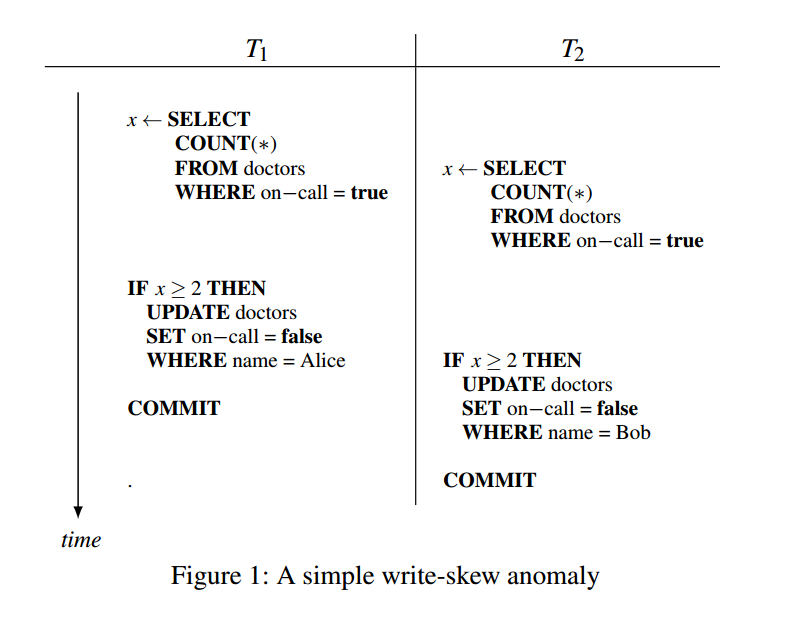
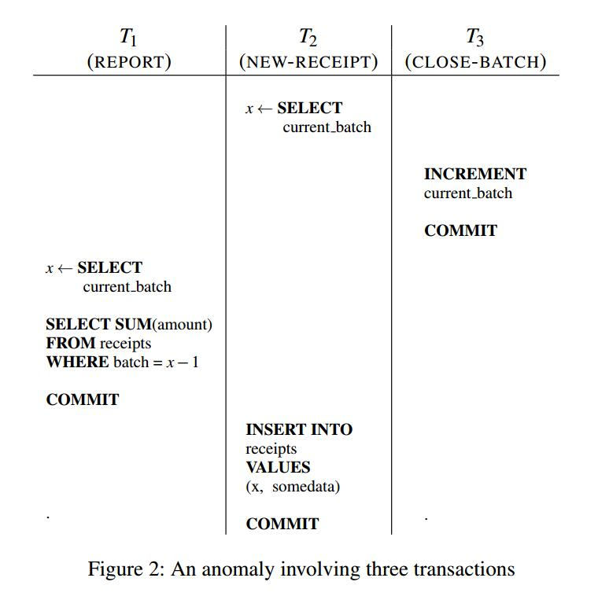
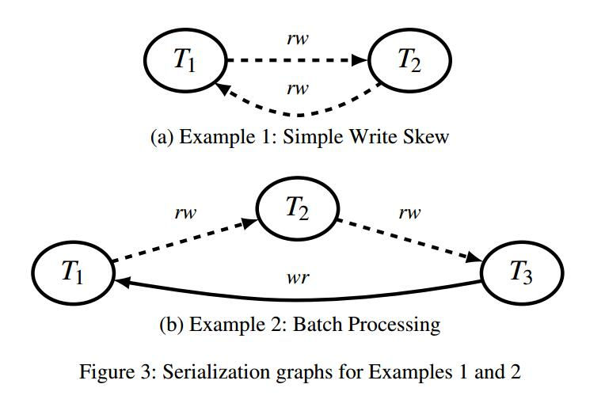
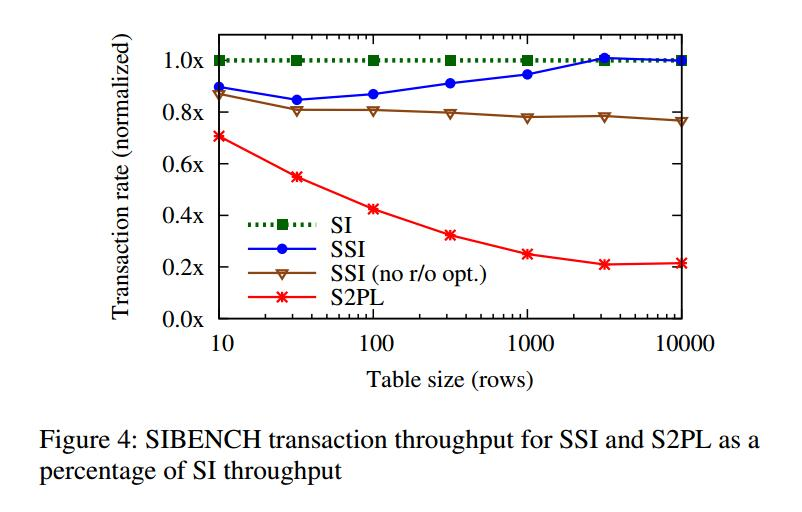
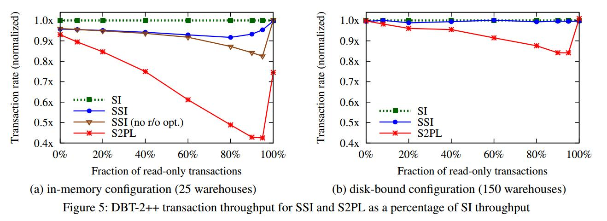
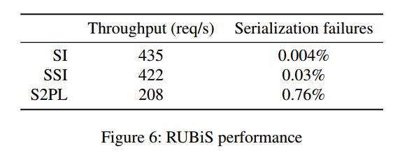

https://www.drkp.net/papers/ssi-vldb12.pdf

### ABSTRACT

This paper describes our experience implementing PostgreSQL’s new serializable isolation level. It is based on the recently-developed Serializable Snapshot Isolation (SSI) technique. This is the first implementation of SSI in a production database release as well as the first in a database that did not previously have a lock-based serializable isolation level. We reflect on our experience and describe how we overcame some of the resulting challenges, including the implementation of a new lock manager, a technique for ensuring memory usage is bounded, and integration with other PostgreSQL features. We also introduce an extension to SSI that improves performance for read-only transactions. We evaluate PostgreSQL’s serializable isolation level using several benchmarks and show that it achieves performance only slightly below that of snapshot isolation, and significantly outperforms the traditional two-phase locking approach on read-intensive workloads.

本文描述了在PostgreSQL实现可串行化隔离级别的经验。它基于最近开发的可串行化快照隔离(SSI)技术.。这是生产数据库版本中SSI的第一个实现，也是第一个实现基于锁的可串行化隔离级别的数据库。我们回顾了我们的经验，并描述了我们如何克服了一些由此带来的挑战，包括实现新的锁管理器、确保内存使用的技术，以及与其他PostgreSQL特性的集成。我们还引入了SSI的扩展，该扩展提高了只读事务的性能。我们使用几个基准测试评估PostgreSQL的可串行化隔离级别，结果显示它的性能仅略低于快照隔离，并且在读取密集型工作负载上显著地优于传统的两阶段锁定方法。

### 1 OVERVIEW

Serializable isolation for transactions is an important property: it allows application developers to write transactions as though they will execute sequentially, without regard for interactions with concurrently-executing transactions. Until recently, PostgreSQL, a popular open-source database, did not provide a serializable isolation level because the standard two-phase locking mechanism was seen as too expensive. Its highest isolation level was snapshot isolation, which offers greater performance but allows certain anomalies. 

事务的可串行化隔离是一个重要的属性：它允许应用程序开发人员编写事务，就像他们将按顺序执行一样，而不考虑与并发执行的事务的交互。直到最近，流行的开源数据库PostgreSQL还没有提供可串行化的隔离级别，因为标准的两阶段锁定机制被认为过于昂贵。它的最高隔离级别是快照隔离，它提供了更好的性能，但允许某些异常。

In the latest PostgreSQL 9.1 release, we introduced a serializable isolation level that retains many of the performance benefits of snapshot isolation while still guaranteeing true serializability. It uses an extension of the Serializable Snapshot Isolation (SSI) technique from current research [7]. SSI runs transactions using snapshot isolation, but checks at runtime for conflicts between concurrent transactions, and aborts transactions when anomalies are possible. We extended SSI to improve performance for read-only transactions, an important part of many workloads. 

在最新的PostgreSQL9.1版本中，我们引入了一个可串行化的隔离级别，它保留了快照隔离的许多性能优势，同时仍然保证真正的可串行化。它使用了当前研究中的可串行化快照隔离(SSI)技术的扩展[7]。SSI使用快照隔离运行事务，但在运行时检查并发事务之间的冲突，并在可能出现异常时中止事务。我们扩展了SSI以提高只读事务的性能，这是许多工作负载的一个重要部分。

This paper describes our experiences implementing SSI in PostgreSQL. Our experience is noteworthy for several reasons: 

本文介绍了在PostgreSQL中实现SSI的经验。我们的经验值得注意，原因如下：

It is the first implementation of SSI in a production database release. Accordingly, it must address interactions with other database features that previous research prototypes have ignored. For example, we had to integrate SSI with PostgreSQL’s support for replication systems, two-phase commit, and subtransactions. We also address memory usage limitations, an important practical concern; we describe a transaction summarization technique that ensures that the SSI implementation uses a bounded amount of RAM without limiting the number of concurrent transactions. 

它是生产数据库发行版中SSI的第一个实现。因此，它必须解决以前的研究原型忽略的与其他数据库特性的交互。例如，我们必须将SSI与PostgreSQL对复制系统、两阶段提交和子事务的支持集成在一起。我们还讨论了内存使用限制，这是一个重要的实际问题；我们描述了一种事务汇总技术，该技术确保SSI实现使用有限数量的RAM，而不限制并发事务的数量。

Ours is also the first implementation of SSI for a purely snapshotbased DBMS. Although SSI seems especially suited for such databases, earlier SSI implementations were based on databases that already supported serializable isolation via two-phase locking, such as MYSQL. As a result, they were able to take advantage of existing predicate locking mechanisms to detect conflicting transactions for SSI. Lacking this infrastructure, we were required to build a new lock manager. Our lock manager is specifically optimized for tracking SSI read dependencies, making it simpler in some respects than a classic lock manager but also introducing some unusual challenges. PostgreSQL 9.1 uses this lock manager, along with multiversion concurrency control data, to detect conflicts between concurrent transactions. We also introduce a safe retry rule, which resolves conflicts by aborting transactions in such a way that an immediately retried transaction does not fail in the same way. 

我们的系统也是针对纯基于快照的DBMS的第一个SSI实现。虽然SSI似乎特别适合于这类数据库，但较早的SSI实现是基于通过两阶段锁定支持串行化隔离的数据库，例如MYSQL。因此，他们能够利用现有的谓词锁定机制来检测SSI的冲突事务。由于缺乏这种基础结构，我们需要构建一个新的锁管理器。我们的锁管理器专门针对跟踪SSI读取依赖项进行了优化，使其在某些方面比传统的锁管理器简单，但也引入了一些不寻常的挑战。PostgreSQL9.1使用此锁管理器以及多版本并发控制数据来检测并发事务之间的冲突。我们还引入了一个安全重试规则，该规则通过中止事务来解决冲突，从而使立即重试的事务不会以同样的方式失败。

Read-only transactions are common, so PostgreSQL 9.1 optimizes for them. We extend SSI by deriving a result in multiversion serializability theory and applying it to reduce the rate of false positive serialization failures. We also introduce safe snapshots and deferrable transactions, which allow certain read-only transactions to execute without the overhead of SSI by identifying cases where snapshot isolation anomalies cannot occur. 

只读事务很常见，所以PostgreSQL9.1对它们进行了优化。我们通过在多版本可串行性理论中推导出一个结果来扩展 SSI, 并应用它来降低误正串行化失败率。我们还引入了安全快照和可延迟事务，它们通过识别快照隔离异常无法发生的情况，允许执行某些只读事务而无需SSI的开销。

PostgreSQL 9.1’s serializable isolation level is effective: it provides true serializability but allows more concurrency than twophase locking. Our experiments with a transaction proceSSIng and a web application benchmark show that our serializable mode has a performance cost of less than 7% relative to snapshot isolation, and outperforms two-phase locking significantly on some workloads. 

PostgreSQL9.1的可串行化隔离级别是有效的：它提供了真正的可串行化，但比两阶段锁定允许更多的并发性。我们使用事务处理和Web应用程序基准测试的实验表明，与快照隔离相比，我们的串行化模式的性能成本不到7%，并且在某些工作负载上显着地优于两阶段锁定。

This paper begins with an explanation of how snapshot isolation differs from serializability and why we view serializability as an important DBMS feature in Section 2. Section 3 describes the SSI technique and reviews the previous work. Section 4 extends SSI with new optimizations for read-only transactions. We then turn to the implementation of SSI in PostgreSQL 9.1, with Section 5 giving an overview of the implementation and Section 6 discuSSIng techniques for reducing its memory usage. Section 7 examines how SSI interacts with other PostgreSQL features. Finally, in Section 8 we compare the performance of our implementation to PostgreSQL’s existing snapshot isolation level and to a lock-based implementation of serializability.

本文首先解释快照隔离与可串行化的区别，以及为什么我们在第二节中将可串行化视为一个重要的DBMS特性。第3节描述了SSI技术，并回顾了以前的工作。第4节对SSI进行了扩展，对只读事务进行了新的优化。然后我们将讨论PostgreSQL9.1中SSI的实现，第5节给出了实现的概述，第6节讨论了减少其内存使用的技术。第7节研究SSI如何与其他PostgreSQL特性交互。最后，在第8节中，我们将我们的实现的性能与PostgreSQL现有的快照隔离级别以及基于锁的可串行化实现进行比较。

### 2 SNAPSHOT ISOLATION VERSUS SERIALIZABILITY

Users group operations into transactions to ensure they are atomic with respect to other concurrently-executing transactions, as well as with respect to crashes. ANSI SQL allows the user to request one of several isolation levels; the strongest is serializability [4]. In a serializable execution, the effects of transactions must be equivalent to executing the transactions in some serial order. This property is appealing for users because it means that transactions can be treated in isolation: if each transaction can be shown to do the right thing when run alone (such as maintaining a data integrity invariant), then it also does so in any mix of concurrent transactions. 

用户将操作分组到事务中，以确保它们对于其他并发执行的事务以及崩溃都是原子的。ANSI SQL允许用户请求几个隔离级别中的一个；最强大的是可串行化[4]。在可串行化的执行中，事务的效果必须等效于按某种串行顺序执行事务。这个属性对用户很有吸引力，因为它意味着可以孤立地对待事务：如果可以显示每个事务在单独运行时都做了正确的事情(例如保持数据完整性不变)，那么它也可以在任何并发事务组合中这样做。

At weaker isolation levels, race conditions between concurrent transactions can produce a result that does not correspond to any serializable execution. In spite of this, such isolation levels can provide better performance and are commonly used. For example, PostgreSQL, like many other databases, uses its weakest isolation level, READ COMMITTED, by default. This level guarantees only that transactions do not see uncommitted data, but offers high performance because it can be implemented without read locks in PostgreSQL’s multiversion storage system; a lock-based DBMS could implement it using only short-duration read locks [12]. 

在较弱的隔离级别上，并发事务之间的竞争条件可能会产生与任何可串行化执行不对应的结果。尽管如此，这样的隔离级别可以提供更好的性能，并且是常用的。例如，PostgreSQL与许多其他数据库一样，默认情况下使用其最弱的隔离级别Read COMMITTED。这个级别只保证事务不会看到未提交的数据，但是提供了高性能，因为它可以在PostgreSQL的多版本存储系统中实现而无需读锁；基于锁的DBMS可以只使用短时间的读锁来实现它[12]。

Snapshot isolation (SI) is one particular weak isolation level that can be implemented efficiently using multiversion concurrency control, without read locking. It was previously the strongest isolation level available in PostgreSQL: users requesting SERIALIZABLE mode actually received snapshot isolation (as they still do in the Oracle DBMS). However, snapshot isolation does not guarantee serializable behavior; it allows certain anomalies [2,5]. This unexpected transaction behavior can pose a problem for users that demand data integrity, such as the Wisconsin Court System, one of the motivating cases for this work. In particular, snapshot isolation anomalies are difficult to deal with because they typically manifest themselves as silent data corruption (e.g. lost updates). In many cases, the invalid data is not discovered until much later, and the error cannot easily be reproduced, making the cause difficult to track down.

快照隔离(SI)是一种特殊的弱隔离级别，可以使用多版本并发控制有效地实现，而无需读锁。它以前是PostgreSQL中可用的最强大的隔离级别：请求SERIALIZABLE模式的用户实际上会收到快照隔离(就像他们在Oracle DBMS中所做的那样)。但是，快照隔离并不保证可串行化的行为；它允许某些异常[2,5]。这种意外的事务行为可能会给需要数据完整性的用户带来问题，例如威斯康星法院系统，这是这项工作的动机之一。特别是，快照隔离异常很难处理，因为它们通常表现为静默数据损坏(例如，丢失的更新)。在许多情况下，直到很久以后才会发现无效的数据，并且错误不能很容易地重现，这使得原因很难追踪。

#### 2.1 Snapshot Isolation

In snapshot isolation, all reads within a transaction see a consistent view of the database, as though the transaction operates on a private snapshot of the database taken before its first read. Section 5.1 describes how PostgreSQL implements these snapshots using versioned tuples. In addition, SI prohibits concurrent transactions from modifying the same data. Like most SI databases, PostgreSQL uses tuple-level write locks to implement this restriction. 

在快照隔离中，事务中的所有读取都会看到数据库的一致视图，就好像事务操作的是在第一次读取之前获取的数据库的私有快照。第5.1节描述PostgreSQL如何使用版本化的元组实现这些快照。此外，SI禁止并发事务修改相同的数据。与大多数SI数据库一样，PostgreSQL使用元组级别的写锁来实现此限制。

Snapshot isolation does not allow the three anomalies defined in the ANSI SQL standard: dirty reads, non-repeatable reads, and phantom reads. However, it allows several other anomalies. These anomalies were not initially well understood, and they remain poorly understood in practice. For example, there is a common misconception that avoiding the aforementioned three anomalies is a sufficient condition for serializability, and for years the PostgreSQL documentation did not acknowledge the difference between its SERIALIZABLE mode and true serializability.

快照隔离不允许ANSI SQL标准中定义的三种异常：脏读、不可重复读和幻读。然而，它允许其他几个异常。这些异常现象最初没有得到很好的理解，而且在实践中仍然没有得到很好的理解。例如，有一种常见的误解，认为避免上述三种异常是串行化的充分条件，多年来PostgreSQL文档没有承认它的SERIALIZABLE模式与真正的串行化之间的区别。

##### 2.1.1 Example 1: Simple Write Skew

The simplest anomaly occurs between two concurrent transactions that read the same data, but modify disjoint sets of data. 

最简单的异常发生在两个并发事务之间，这两个事务读取相同的数据，但修改不相交的数据集。

Consider the two transactions in Figure 1 (based on an example given by Cahill et al [7]). Each checks whether there are at least two doctors on call, and if so takes one doctor off call. Given an initial state where Alice and Bob are the only doctors on call, it can easily be verified that executing $T_1$ and $T_2$ sequentially in either order will leave at least one doctor on call – making these transactions an effective way of enforcing that invariant. 

考虑图1中的两个事务(基于Cahill等人给出的示例[7])。每个人检查是否有至少两名医生随叫随到，如果是的话，可以让一名医生停职。在初始状态下，Alice和Bob是唯一的随叫随到医生，可以很容易地验证，按任意顺序依次执行 $T_1$ 和 $T_2$ 都会留下至少一名医生随叫随到 - 这使得这些事务成为加强这种不变性的一种有效方法。

But the interleaving of Figure 1, when executed under snapshot isolation, violates that invariant. Both transactions read from a snapshot taken when they start, showing both doctors on call. Seeing that, they both proceed to remove Alice and Bob, respectively, from call status. The write locks taken on update don’t solve this problem, because the two transactions modify different rows and thus do not conflict. By contrast, in two-phase locking DBMS, each transaction would take read locks that would conflict with the other’s write. Similarly, in an optimistic-concurrency system, the second transaction would fail to commit because its read set is no longer up to date.

但是图1的交错(在快照隔离下执行时)违反了这种不变。这两个事务都读取了开始时拍摄的快照，显示了两个医生的随叫随到状态。看到这一点，它们都继续将Alice和Bob分别从Call状态中删除。UPDATE上的写锁不能解决这个问题，因为这两个事务修改不同的行，因此不会发生冲突。相反，在两阶段锁定DBMS中，每个事务都会采用与另一个事务的写操作相冲突的读锁。类似地，在乐观并发系统中，第二个事务将无法提交，因为它的读取集不再是最新的。

##### 2.1.2 Example 2: Batch ProceSSIng

The previous example is simple in the sense that it consists of only two transactions that directly conflict with each other. But more complex interactions between transactions are possible. Here, we give an example of a snapshot isolation anomaly resulting from three transactions, one of which is read-only. 

前面的示例很简单，因为它只包含两个直接冲突的事务。但是，事务之间更复杂的交互也是可能的。这里，我们给出了一个快照隔离异常的例子，它是由三个事务引起的，其中一个是只读的。

Consider a transaction-proceSSIng system that maintains two tables. A receipts table tracks the day’s receipts, with each row tagged with the associated batch number. A separate control table simply holds the current batch number. There are three transaction types:

考虑一个维护两个表的事务处理系统。收据表跟踪当天的收据，每一行都标记有相关的批号。一个单独的控制表只保存当前的批号。有三种事务类型：

- NEW-RECEIPT: reads the current batch number from the control table, then inserts a new entry in the receipts table tagged with that batch number
- CLOSE-BATCH: increments the current batch number in the control table
- REPORT: reads the current batch number from the control table, then reads all entries from the receipts table with the previous batch number (i.e. to display a total of the previous day’s receipts) 
- NEW-RECEIPT：从控制表中读取当前批号，然后在标有该批号的收据表中插入一个新条目。
- CLOSE-BATCH：递增控制表中的当前批号。
- REPORT：从控制表中读取当前批号，然后读取带有前一个批号的收据表中的所有条目(即显示前一天的总收据)

The following useful invariant holds under serializable executions: after a REPORT transaction has shown the total for a particular batch, subsequent transactions cannot change that total. This is because the REPORT shows the previous batch’s transactions, so it must follow a CLOSE-BATCH transaction. Every NEW-RECEIPT transaction must either precede both transactions, making it visible to the REPORT,or follow the CLOSE-BATCH transaction, in which case it will be aSSIgned the next batch number. 

在可序列化执行下，以下有用的不变量保持不变：在REPORT事务显示特定批次的总计后，后续事务不能更改该总计。 这是因为REPORT显示了上一批的事务，因此它必须遵循CLOSE-BATCH事务。 每个NEW-RECEIPT事务必须在两个事务之前，使其对REPORT可见，或者遵循CLOSE-BATCH事务，在这种情况下，它将成为下一个批号的一个SSI。

However, the interleaving shown in Figure 2 is allowed under SI, and violates this invariant. The receipt inserted by transaction $T_2$ has the previous batch number because $T_2$ starts before $T_3$ commits, but is not visible in the corresponding report produced by $T_1$. 

然而，图2所示的交错在SI下是允许的，并且违反了这个不变。事务$T_2$插入的收据具有前一个批号，因为$T_2$在$T_3$提交之前开始，但在$T_1$生成的相应报告中不可见。

Interestingly, this anomaly requires all three transactions, including $T_1$ – even though it is read-only. Without it, the execution is serializable, with the serial ordering being ($T_2$, $T_3$). The fact that read-only transactions can be involved in SI anomalies was a surprising result discovered by Fekete et al. [11].

有趣的是，这种异常需要所有三个事务，包括 $T_1$ - 即使它是只读的。没有它，执行是可串行化的，串行顺序是($T_2$，$T_3$)。Fekete等人发现，只读事务可以参与SI异常，这是一个令人惊讶的结果。[11]

#### 2.2 Why Serializability?

Snapshot isolation anomalies like those described above are undesirable because they can cause unexpected transaction behavior that leads to inconsistencies in the database. Nevertheless, SI is widely used, and many techniques have been developed to avoid anomalies:

上面描述的快照隔离异常是不可取的，因为它们可能导致意外的事务行为，从而导致数据库中的不一致。尽管如此，SI得到了广泛的应用，并开发了许多技术来避免异常：

- some workloads simply don’t experience any anomalies; their behavior is serializable under snapshot isolation. The TPC-C benchmark is one such example [10].
- if a potential conflict between two transactions is identified, explicit locking can be used to avoid it. PostgreSQL provides explicit locking at the table level via the LOCK TABLE command, and at the tuple level via SELECT FOR UPDATE.
- alternatively, the conflict can be materialized by creating a dummy row to represent the conflict, and forcing every transaction involved to update that row [10].
- if the desired goal is to enforce an integrity constraint, and that constraint can be expressed to the DBMS (e.g. using a foreign key, uniqueness, or exclusion constraint), then the DBMS can enforce it regardless of isolation level. 
- 一些工作负载根本没有任何异常；它们的行为在快照隔离下是可串行化的。TPC-C基准就是这样的一个例子[10]。
- 如果发现两个事务之间存在潜在冲突，可以使用显式锁定来避免这种冲突。PostgreSQL通过LOCKTABLE命令在表级提供显式锁定，通过SELECT FOUPDATE在元组级提供显式锁定。
- 或者，可以通过创建一个虚拟行来表示冲突，并强制所涉及的每个事务更新该行，从而实现冲突[10]。
- 如果期望的目标是强制执行完整性约束，并且该约束可以表示给DBMS(例如，使用外键、唯一性或排除约束)，那么DBMS可以不考虑隔离级别而强制执行完整性约束。

Given the existence of these techniques, one might question the need to provide serializable isolation in the database: shouldn’t users just program their applications to handle the lower isolation level? (We have often been asked this question.) Our view is that providing serializability in the database is an important simplification for application developers, because concurrency issues are notoriously difficult to deal with. Indeed, SI anomalies have been discovered in real-world applications [14]. The analysis required to identify potential anomalies (or prove that none exist) is complex and is likely beyond the reach of many users. In contrast, serializable transactions offer simple semantics: users can treat their transactions as though they were running in isolation. 

考虑到这些技术的存在，人们可能会质疑在数据库中提供可串行化隔离的必要性：用户难道不应该对他们的应用程序进行编程以处理较低的隔离级别吗？(我们经常被问到这个问题。)。我们的观点是，在数据库中提供可串行化对于应用程序开发人员来说是一个重要的简化，因为众所周知，并发问题很难处理。事实上，SI异常已经在现实世界的应用中被发现[14]。识别潜在异常(或证明不存在异常)所需的分析是复杂的，可能超出了许多用户的能力范围。相反，可串行化事务提供了简单的语义：用户可以将其事务视为独立运行。

In particular, the analysis is difficult because it inherently concerns interactions between transactions. Thus, each transaction must be analyzed in the context of all other transactions that it might run concurrently with. It is difficult to do this $n^2$  analysis in a dynamic environment with many complex transactions. Such was the case at the Wisconsin Court System. Data integrity is a critical concern, given the nature of the data (e.g. warrant status information) and regulatory requirements. Snapshot isolation anomalies posed a dangerous threat to data integrity, especially because they can cause silent corruption. At the same time, with a complex schema (hundreds of relations), over 20 full-time programmers writing new queries, and queries being auto-generated by object-relational frameworks, analyzing query interactions to find possible anomalies – and keeping the analysis up to date – was simply not feasible. 

特别是，分析是困难的，因为它本质上关注事务之间的交互。因此，每个事务必须在它可能与之并行运行的所有其他事务的上下文中进行分析。在具有许多复杂事务的动态环境中，很难进行这种 $n^2$ 分析。威斯康辛州法院系统的情况就是如此。考虑到数据的性质(例如，权证状况信息)和监管要求，数据的完整性是一个关键问题。快照隔离异常对数据完整性构成了危险的威胁，特别是因为它们可能导致无声的损坏。同时，对于一个复杂的模式(数百个关系)，20多个全职程序员编写新的查询，并由对象关系框架自动生成查询，分析查询交互以发现可能的异常 - 并保持分析最新 - 是完全不可行的。

A further problem is that using static analysis to identify anomalies may not be possible when the workload includes ad hoc queries. Even applications that execute pre-defined stored procedures are likely to also have occasional ad hoc queries for administrative tasks. For example, an administrator might manually execute queries (e.g. using the psql command line utility or a front-end like pgAdmin) to inspect the database or repair corrupted data. Static analysis, lacking knowledge of these transactions, cannot prevent anomalies involving them. Even read-only ad hoc transactions, such as making a copy of the database with the pg dump utility, can expose anomalous states of the database.

另一个问题是，当工作负载包括即席查询时，使用静态分析来识别异常可能是不可能的。即使执行预定义存储过程的应用程序也可能偶尔对管理任务进行临时查询。例如，管理员可以手动执行查询(例如，使用psql命令行实用工具或pgAdmin等)来检查数据库或修复损坏的数据。静态分析缺乏对这些事务的了解，无法防止涉及这些事务的异常情况。即使是只读的临时事务，如使用pg dump实用程序复制数据库，也可以暴露数据库的异常状态。

### 3 SERIALIZABLE SNAPSHOT ISOLATION

Our implementation of serializability in PostgreSQL is unique among production databases in that it uses the recently-developed Serializable Snapshot Isolation (SSI) technique [7]. Nearly all other databases that provide serializability do so using strict two-phase locking (S2PL). In S2PL, transactions acquire locks on all objects they read or write, and hold those locks until the transaction commits. To prevent phantoms, these locks must be predicate locks, usually implemented using index-range locks. 

我们在PostgreSQL中的串行化实现在生产数据库中是独一无二的，因为它使用了最近开发的可串行化快照隔离(SSI)技术[7]。几乎所有其他提供可串行化性的数据库都使用严格的两阶段锁定(S2PL)。在S2PL中，事务获取它们读取或写入的所有对象的锁，并持有这些锁，直到事务提交为止。为了防止幻象，这些锁必须是谓词锁，通常使用索引范围锁来实现。

One could certainly implement a serializable isolation level for PostgreSQL using S2PL, but we did not want to do so for performance reasons. Indeed, the original POSTGRES storage manager inherited from the Berkeley research project had precisely that, using a conventional lock manager to provide concurrency control [19]; its replacement with a multiversion concurrency control (MVCC) system in 1999 was one of the first major accomplishments of the PostgreSQL open-source community. Subsequently, the benefits of MVCC have become firmly ingrained in the PostgreSQL ethos, making a lock-based SERIALIZABLE mode that behaved so differently a non-starter. Users accustomed to the “readers don’t block writers, and writers don’t block readers” mantra would be surprised by the additional blocking, and a S2PL approach was unpalatable to most of the developer community. 

当然可以使用S2PL为PostgreSQL实现可串行化的隔离级别，但出于性能原因，我们不希望这样做。实际上，最初从伯克利研究项目继承下来的Postgres存储管理器正是这样，使用传统的锁管理器来提供并发控制[19]；1999年用多版本并发控制(Mvcc)系统取代它是PostgreSQL开源社区的首批主要成就之一。随后，mvcc的好处已经深深扎根于PostgreSQL的风气中，使得基于锁的SERIALIZABLE模式表现得如此不同，无法启动。习惯于“读不阻塞写，写不堵塞读”的用户会对额外的阻塞感到惊讶，而S2PL方法对于大多数开发人员社区来说都是令人不快的。

SSI takes a different approach to ensuring serializability: it runs transactions using snapshot isolation, but adds additional checks to determine whether anomalies are possible. This is based on a theory of snapshot isolation anomalies, discussed below. SSI was appealing to us because it built on snapshot isolation, and offered higher performance than a S2PL implementation. Another important factor was that SSI does not require any additional blocking. Transactions that might violate serializability are simply aborted. Because basic snapshot isolation can already roll back transactions due to update conflicts, users must already be prepared to handle transactions aborted by serialization failures, e.g. using a middleware layer that automatically retries transactions. 

SSI采用了一种不同的方法来确保可串行化：它使用快照隔离运行事务，但添加其他检查以确定是否可能出现异常。这是基于下面讨论的快照隔离异常的理论。SSI之所以对我们有吸引力，是因为它构建在快照隔离之上，并且提供了比S2PL实现更高的性能。另一个重要因素是SSI不需要任何额外的阻塞。可能违反可串行化性的事务只会被终止。由于更新冲突，基本快照隔离已经可以回滚事务，因此用户必须已经准备好处理串行化失败导致的事务中止，例如使用自动重试事务的中间件层。

The remainder of this section reviews the previous work on SSI. Sections 3.1 and 3.2 review the theory of snapshot isolation anomalies and when they arise. Section 3.3 describes the SSI algorithm and some proposed variants on it.

本节的其余部分将回顾以前关于SSI的工作。第3.1节和第3.2节回顾了快照隔离异常的理论及其出现的时间。3.3节描述了SSI算法及其一些拟议的变体。

#### 3.1 Snapshot Isolation Anomalies

SSI builds on a line of research studying the nature of snapshot isolation anomalies. Not long after snapshot isolation was implemented, it was observed that SI allowed non-serializable executions but did not exhibit any of the well-understood anomalies proscribed by the SQL standard [5], This suggested that existing isolation level definitions were inadequate, and prompted an effort to define the anomalies caused by SI and when they arise. 

SSI建立在研究快照隔离异常性质的一条线上。在实现快照隔离后不久，观察到SI允许不可串行化的执行，但没有表现出SQL标准[5]所禁止的任何众所周知的异常，这表明现有的隔离级别定义是不充分的，并促使人们努力定义SI引起的异常及其出现的时间。

Adya et al. [2] proposed representing an execution with a multiversion serialization history graph. This graph contains a node per transaction, and an edge from transaction $T_1$ to transaction $T_2$ if $T_1$ must have preceded $T_2$ in the apparent serial order of execution. Three types of dependencies can create these edges:

阿迪亚等人。[2]提出用多版本串行化历史图表示执行。此图包含每个事务的一个节点，如果$T_1$必须在明显的串行执行顺序中先于$T_2$，则从事务$T_1$到事务$T_2$的边。有三种类型的依赖关系可以创建这些边：

- wr-dependencies: if $T_1$ writes a version of an object, and $T_2$ reads that version, then $T_1$ appears to have executed before $T_2$
- ww-dependencies: if $T_1$ writes a version of some object, and $T_2$ replaces that version with the next version, then $T_1$ appears to have executed before $T_2$
- rw-antidependencies: if $T_1$ writes a version of some object, and $T_2$ reads the previous version of that object, then $T_1$ appears to have executed after $T_2$, because $T_2$ did not see its update. As we will see, these dependencies are central to SSI; we sometimes also refer to them as rw-conflicts. 
- wr-dependencies：如果$T_1$编写一个对象的版本，$T_2$读取该版本，那么$T_1$似乎在$T_2$之前就已经执行了。
- ww-dependencies：如果$T_1$编写某个对象的一个版本，并且$T_2$将该版本替换为下一个版本，那么$T_1$似乎已经在$T_2$之前执行了。
- rw-antidependencies：如果$T_1$编写某个对象的版本，而$T_2$读取该对象的以前版本，则$T_1$似乎在$T_2$之后执行，因为$T_2$没有看到它的更新。正如我们将看到的，这些依赖关系是SSI的核心；我们有时也将它们称为rw-conflicts。

If a cycle is present in the graph, then the execution does not correspond to any serial order, i.e. a snapshot isolation anomaly has caused a serializability violation. Otherwise, the serial order can be determined using a topological sort. 

如果图中存在循环，则执行不对应于任何串行顺序，即快照隔离异常导致了可串行化冲突。否则，可以使用拓扑排序来确定串行顺序。

Note that the definitions above referred to objects. We use this more abstract term rather than “tuple” or “row” because dependencies can also be caused by predicate reads. For example, if $T_1$ scans a table for all rows where x = 1, and $T_2$ subsequently inserts a new row matching that predicate, then there is a $T_1 \longrightarrow T_2$ rw-antidependency. 

请注意，上面的定义指的是对象。我们使用这个更抽象的术语，而不是“tuple”或“row”，因为依赖关系也可以由谓词读取引起。例如，如果$T_1$扫描表中的所有行，其中x=1，并且$T_2$随后插入与该谓词匹配的新行，则存在 $T_1 \longrightarrow T_2$  rw-antidependency。

Figure 3 shows the serialization graphs corresponding to Examples 1 and 2 from Section 2.1. For Example 1, $T_1$ updates the row containing Alice’s call status, but this update is not visible to $T_2$’s SELECT, creating a rw-antidependency: $T_2$ appears to have executed before $T_1$. Similarly, $T_2$’s UPDATE is not visible to $T_1$, creating a rw-antidependency in the opposite direction. The resulting cycle indicates that the execution is not serializable. Example 2, the batchproceSSIng example, contains three transactions and two types of dependencies. $T_3$, which increments the batch number, appears to execute after $T_2$, which reads the old version. The receipt inserted by $T_2$ does not appear in $T_1$’s report, so $T_2$ appears to execute after $T_1$. Finally, $T_3$ appears to execute before $T_1$, completing the cycle. This last edge is a wr-dependency: $T_3$’s increment of the batch number was visible to $T_1$’s read, because $T_3$ committed before $T_1$ began.

图3显示了与2.1节中的示例1和2对应的串行化图。例如，$T_1$更新包含alice的调用状态的行，但是$T_2$的SELECT看不到此更新，从而创建了一个rw-antidependency关系：$T_2$似乎在$T_1$之前就已经执行了。同样，$T_2$的更新对$T_1$是不可见的，从而在相反的方向产生了rw-antidependency。结果周期指示执行是不可串行化的。示例2(批处理示例)包含三个事务和两种类型的依赖项。增加批号的$T_3$似乎在$T_2$之后执行，$T_2$读取旧版本。由$T_2$插入的收据不会出现在$T_1$的报告中，因此$T_2$似乎是在$T_1$之后执行的。最后，$T_3$似乎在$T_1$之前执行，完成了循环。最后一个边是wr-dependency：$T_3$的批号增量对$T_1$的读取是可见的，因为$T_3$在$T_1$开始之前就提交了。

#### 3.2 Serializability Theory

Note that a wr-dependency from A to B means that A must have committed before B began, as this is required for A’s changes to be visible to B’s snapshot. The same is true of ww-dependencies because of write locking. However, rw-antidependencies occur between concurrent transactions: one must start while the other was active. Therefore, they play an important role in SI anomalies. 

注意，从A到B的wr-dependency意味着A必须在B开始之前提交，因为这是A的更改对B的快照可见所必需的。由于写入锁定，ww-dependency项也是如此。然而，rw-antidependency发生在并发事务之间：一个必须在另一个处于活动状态时启动。因此，它们在SI异常中起着重要的作用。

Adya [1] observed that every cycle in the serialization graph (i.e. every anomaly) contains at least two rw-antidependency edges. Fekete et al. [10] subsequently showed that two such edges must be adjacent: 

Adya [1] 注意到串行化图中的每个圈(即每个异常)至少包含两个rw-antidependency边。费克特等人。[10] 随后表明，这两条边必须相邻：

Theorem 1 (Fekete et al. [10]). Every cycle in the serialization history graph contains a sequence of edges $T_1 \longrightarrow T_2 \longrightarrow  T_3$ where each edge is a rw-antidependency. Furthermore, $T_3$ must be the first transaction in the cycle to commit. 

定理1(Fekete等人)。[10])。串行化历史图中的每个圈都包含一系列边 $T_1 \longrightarrow T_2 \longrightarrow  T_3$，其中每个边都是rw-antidependency的。此外，$T_3$必须是要提交的周期中的第一个事务。

Note that this is actually a stronger statement than that given by Fekete et al., who state only that $T_3$ must commit before $T_1$ and $T_2$. Though not explicitly stated, it is a consequence of their proof that $T_3$ must be the first transaction in the entire cycle to commit. 

注意，这实际上是一个比Fekete等人给出的更有力的声明，Fekete等人只声明$T_3$必须在$T_1$和$T_2$之前提交。虽然没有明确说明，但这是他们证明$T_3$必须是整个周期中第一个提交事务的结果。

Corollary 2. Transaction $T_1$ is concurrent with $T_2$, and $T_2$ is concurrent with $T_3$, because rw-antidependencies occur only between concurrent transactions. Note that $T_1$ and $T_3$ may refer to the same transaction, for cycles of length 2 such as the one in the write-skew example (Figure 3a).

推论2。事务$T_1$与$T_2$并发，而$T_2$与$T_3$并发，因为rw-antidependency只发生在并发事务之间。注意，对于长度为2的周期，$T_1$和$T_3$可能引用相同的事务，如write-skew示例中的周期(图3a)。

#### 3.3 SSI

Cahill et al. introduced SSI, a technique for providing serializability using snapshot isolation, by detecting potential anomalies at runtime, and aborting transactions as necessary [7]. It is similar to concurrency control protocols based on serialization graph testing [8], in that it tracks edges in the serialization graph and prevents cycles from forming. However, rather than testing the graph for cycles, it checks for a “dangerous structure” of two adjacent rwantidependency edges. If any transaction has both an incoming rw-antidependency and an outgoing one, SSI aborts one of the transactions involved. Theorem 1 shows that doing so ensures serializable execution, but it may have false positives because not every dangerous structure is part of a cycle. The benefit is that it is more efficient. Besides being a less expensive runtime check than cycle testing, dangerous structures are composed entirely of rw-antidependencies, so SSI does not need to track wr- and ww-dependency edges. 

Cahill等人引入了SSI，这是一种使用快照隔离提供可串行化性的技术，方法是在运行时检测潜在异常，并在必要时中止事务[7]。它类似于基于串行化图测试的并发控制协议[8]，因为它跟踪串行化图中的边并防止生成循环。但是，它不是测试图中的循环，而是检查两个相邻的rwantiDependant边的“危险结构”。如果任何事务同时具有传入的rw-antidependency和传出的rw-antidependency，则SSI将中止所涉及的事务之一。定理1表明，这样做可以确保可串行化的执行，但它可能会有误报，因为并非每个危险的结构都是循环的一部分。好处是它更有效率。除了比循环测试更便宜的运行时检查外，危险的结构完全由rw-antidependency组成，因此SSI不需要跟踪wr-dependencies和ww-dependency边。

This approach can offer greater concurrency than a typical S2PL or optimistic concurrency control (OCC) [15] system. Essentially, both S2PL and classic OCC prevent concurrent transactions from having rw-conflicts. SSI allows some rw-conflicts as long as they do not form a dangerous structure, a less restrictive requirement. For instance, consider Example 2 with the read-only transaction $T_1$ removed. We saw in Section 2.1.2 that this execution is serializable even though there is a rw-antidependency $T_1 \longrightarrow T_2$. However, neither S2PL nor OCC would permit this execution, whereas SSI would allow it, because it contains only a single rw-antidependency. 

这种方法可以提供比典型的S2PL或乐观并发控制(OCC)[15]系统更大的并发性。本质上，S2PL和经典的OCC都防止并发事务发生rw-conflicts。SSI允许一些rw-conflicts，只要它们不形成一个危险的结构，一个限制较少的要求。例如，考虑删除了只读事务$T_1$的示例2。我们在2.1.2节中看到，即使存在rw-antidependency $T_2 \longrightarrow T_3$，该执行也是可串行化的。然而，无论是S2PL还是OCC都不允许这种执行，而SSI则允许这样做，因为它只包含一个rw-antidependency项。

SSI requires detecting rw-antidependencies at runtime. The SSI paper describes a method for identifying these dependencies by having transactions acquire locks in a special “SIREAD” mode on the data they read. These locks do not block conflicting writes (thus, “lock” is somewhat of a misnomer). Rather, a conflict between a SIREAD lock and a write lock flags an rw-antidependency, which might cause a transaction to be aborted. Furthermore, SIREAD locks must persist after a transaction commits, because conflicts can occur even after the reader has committed (e.g. the $T_1 \longrightarrow T_2$ conflict in Example 2). Corollary 2 implies that the locks must be retained until all concurrent transactions commit. Our PostgreSQL implementation uses SIREAD locks, but their implementation differs significantly because PostgreSQL was purely snapshot-based, as we describe in Section 5.2.

SSI需要在运行时检测rw-antidependency项。SSI文件描述了一种识别这些依赖关系的方法，方法是让事务以特殊的“SIREAD”模式对它们所读取的数据获取锁。这些锁不会阻塞冲突的写入(因此，“锁”有点用词不当)。相反，SIREAD锁和写锁之间的冲突会标记rw-antidependency，这可能导致事务中止。此外，SIREAD锁必须在事务提交后保持，因为即使在读取器提交之后也可能发生冲突(例如，示例2中的 $T_1 \longrightarrow T_2$ 冲突)。推论2暗示必须保留锁，直到所有并发事务提交为止。我们的PostgreSQL实现使用SIREAD锁，但是它们的实现有很大不同，因为PostgreSQL纯粹是基于快照的，正如我们在5.2节中描述的那样。

##### 3.3.1 Variants on SSI

Subsequent work has suggested refinements to the basic SSI approach. Cahill’s thesis [6] suggests a commit ordering optimization that can reduce false positives. Theorem 1 actually shows that every cycle contains a dangerous structure $T_1 \longrightarrow T_2 \longrightarrow T_3$, where $T_3$ is the first to commit. Thus, even if a dangerous structure is found, no aborts are necessary if either $T_1$ or $T_2$ commits before $T_3$. Verifying this condition requires tracking some additional state, but avoids some false positive aborts. We use an extension of this optimization in PostgreSQL. It does not, however, eliminate all false positives: there may not be a path $T_3 \leadsto T_1$ that closes the cycle. For example, in Example 2, if $T_1$’s REPORT accessed only the receipts table (not the current batch number), there would be no wr-dependency from $T_3$ to $T_1$, and the execution would be serializable with order ($T_1$, $T_2$, $T_3$). However, the dangerous structure of rw-antidependencies $T_1 \longrightarrow T_2 \longrightarrow T_3$ would force some transaction to be spuriously aborted.

随后的工作对基本的SSI方法提出了改进建议。Cahill的论文[6]提出了一种可以减少误报的提交顺序优化。定理1实际上表明，每个循环都包含一个危险的结构 $T_1 \longrightarrow T_2 \longrightarrow T_3$，其中$T_3$是第一个提交的。因此，即使发现危险结构，如果$T_1$或$T_2$在$T_3$之前提交，也不需要中止。验证此条件需要跟踪一些附加状态，但避免了一些误报中止。我们在PostgreSQL中使用这种优化的扩展。然而，它并不能消除所有的误报：可能没有路径$T_3 \leadsto T_1$关闭周期。例如，在示例2中，如果$T_1$的报告只访问了Recits表(而不是当前的批号)，那么从$T_3$到$T_1$之间就没有wr-dependency，并且执行可以用（$T_1$，$T_2$，$T_3$）顺序进行串行化。然而，rw-antidependency $T_1 \longrightarrow T_2 \longrightarrow T_3$的危险结构将迫使某些事务被虚假地中止。

PSSI (Precisely Serializable Snapshot Isolation) is an extension of SSI that does eliminate all false positives [18]. It does so by building the full serialization history graph and testing it for cycles, rather than simply checking for dangerous structures. On a microbenchmark that stresses false aborts, PSSI can reduce the abort rate by up to 40% [18]. We considered this approach for PostgreSQL, but rejected it because we felt the costs outweighed the benefits of the reduced false positive abort rate. PSSI requires tracking wr- and ww-dependencies in addition to rw-antidependencies, consuming additional memory. Keeping the memory footprint small was an important requirement, and some of the optimizations we applied toward that end (Section 6) would not be compatible with PSSI. At the same time, the workloads we evaluate in Section 8 have a serialization failure rate well under 1%, suggesting additional precision has a limited benefit.

PSSI(精确地串行化快照隔离)是SSI的扩展，它确实消除了所有误报[18]。它是通过构建完整的串行化历史图并对其进行循环测试来实现的，而不是简单地检查危险结构。在一个强调错误中止的微基准上，PSSI可以减少高达40%的中止率[18]。我们考虑了PostgreSQL的这种方法，但拒绝了它，因为我们认为成本超过了降低误报中止率的好处。除了rw-antidependency外，PSSI还需要跟踪wr-dependencies和ww-dependencies，这会消耗额外的内存。保持较小的内存占用是一个重要的要求，并且我们为此应用的一些优化(第6节)将与PSSI不兼容。同时，我们在第8节中评估的工作负载的串行化故障率远低于1%，这意味着额外的精度带来的好处有限。

### 4 READ-ONLY OPTIMIZATIONS

Our version of SSI in PostgreSQL 9.1 includes new optimizations for read-only transactions. It’s worthwhile to optimize specifically for read-only transactions: many workloads contain a significant fraction of read-only queries. Furthermore, long-running read-only transactions are also common. As we will discuss, these long-running transactions can substantially increase the overhead of SSI. 

我们PostgreSQL9.1中的SSI版本包含了针对只读事务的新优化。值得专门针对只读事务进行优化：许多工作负载包含很大一部分只读查询。此外，长时间运行的只读事务也很常见。正如我们将要讨论的，这些长时间运行的事务会大大增加SSI的开销。

We improve performance for read-only transactions in two ways. Both derive from a new serializability theory result that characterizes when read-only transactions can be involved in SI anomalies. First, the theory enables a read-only snapshot ordering optimization to reduce the false-positive abort rate, an improved version of the commit ordering optimization described in Section 3.3.1. Second, we also identify certain safe snapshots on which read-only transactions can execute safely without any SSI overhead or abort risk, and introduce deferrable transactions, which delay their execution to ensure they run on safe snapshots.

我们通过两种方式提高只读事务的性能。两者都源于一种新的可串行化理论的结果，该结果描述了当只读事务可能涉及到SI异常时的特征。首先，该理论使只读快照排序优化能够减少误报的流失率，这是3.3.1节中描述的提交排序优化的一个改进版本。其次，我们还确定了某些安全快照，在这些快照上，只读事务可以安全地执行，而不存在任何SSI开销或中止风险，并引入了可延迟的事务，这些事务延迟它们的执行，以确保它们在安全快照上运行。

#### 4.1 Theory

Our read-only optimizations are based on the following extension of Theorem 1: 

我们的只读优化基于以下定理1的扩展：

Theorem 3. Every serialization anomaly contains a dangerous structure $T_1 \longrightarrow T_2 \longrightarrow T_3$, where if $T_1$ is read-only, $T_3$ must have committed before $T_1$ took its snapshot. 

定理3.。每个串行化异常都包含一个危险的结构 $T_1 \longrightarrow T_2 \longrightarrow T_3$，如果$T_1$是只读的，则$T_3$必须在$T_1$获取快照之前提交。

Proof. Consider a cycle in the serialization history graph. From Theorem 1, we know it must have a dangerous structure $T_1 \longrightarrow T_2 \longrightarrow T_3$ where $T_3$ is the first transaction in the cycle to commit. Consider the case where $T_1$ is read-only. 

证据。考虑串行化历史图中的循环。从定理1，我们知道它必须具有危险的结构 $T_1 \longrightarrow T_2 \longrightarrow T_3$，其中$T_3$是要提交的周期中的第一个事务。考虑$T_1$是只读的情况。 

Because there is a cycle, there must be some transaction $T_0$ that precedes $T_1$ in the cycle. (If the cycle has length 3, $T_0$ is the same transaction as $T_3$, but this does not affect the proof.) The edge $T_0 \longrightarrow T_1$ can’t be a rw-antidependency or a ww-dependency, because $T_1$ was read-only, so it must be a wr-dependency. A wr-dependency means that $T_0$’s changes were visible to $T_1$, so $T_0$ must have committed before $T_1$ took its snapshot. Because $T_3$ is the first transaction in the cycle to commit, it must commit before $T_0$ commits – and therefore before $T_1$ takes its snapshot. 

因为有一个周期，所以在这个周期中必须有一些事务$T_0$先于$T_1$。(如果周期长度为3，则$T_0$与$T_3$相同，但这不影响证明。)。边$T_0 \longrightarrow T_1$不能是rw-antidependency或ww-dependency，因为$T_1$是只读的，所以它必须是WR依赖。wr-dependency意味着$T_0$的变化对$T_1$是可见的，所以$T_0$必须在$T_1$拍摄快照之前提交。因为$T_3$是要提交的周期中的第一个事务，所以它必须在$T_0$提交之前提交-因此在$T_1$获取快照之前也是如此。

This result can be applied directly to reduce the false positive rate, using the following read-only snapshot ordering rule: if a dangerous structure is detected where $T_1$ is read-only, it can be disregarded as a false positive unless $T_3$ committed before $T_1$’s snapshot. Here, a transaction is considered read-only if it is explicitly declared as such (with BEGIN TRANSACTION READ ONLY) or if it has committed without modifying any data. 

这个结果可以直接应用于降低误报率，使用以下只读快照排序规则：如果在$T_1$为只读的地方检测到危险结构，则可以将其视为误报，除非$T_3$在$T_1$快照之前提交。这里，如果事务被显式声明为只读事务(使用BEGINTRANSACTION只读)，或者如果它已提交但未修改任何数据，则将其视为只读事务。

This result means that whether a read-only transaction can be a part of a dangerous structure depends only on when it takes its snapshot, not its commit time. Intuitively, it matters when read/write transactions commit, as this is the point when its changes become visible to other transactions. But it does not matter when read-only transactions commit, because they do not make any changes; only their snapshot times have an effect.

此结果意味着只读事务是否可以成为危险结构的一部分只取决于它何时获取快照，而不是提交时间。直觉上，读/写事务提交时很重要，因为此时它的更改对其他事务是可见的。但是当只读事务提交时，这并不重要，因为它们不做任何更改；只有它们的快照时间才有影响。

#### 4.2 Safe Snapshots

If we can prove that a particular transaction will never be involved in a serialization anomaly, then that transaction can be run using standard snapshot isolation, without the need to track readsets for SSI. The rule above gives us a way to do so. A read-only transaction $T_1$ cannot have a rw-conflict pointing in, as it did not perform any writes. The only way it can be part of a dangerous structure, therefore, is if it has a conflict out to a concurrent read/write transaction $T_2$, and $T_2$ has a conflict out to a third transaction $T_3$ that committed before $T_1$’s snapshot. If no such $T_2$ exists, then $T_1$ will never cause a serialization failure. This depends only on the concurrent transactions, not on $T_1$’s behavior; therefore, we describe it as a property of the snapshot:

如果我们能够证明某个事务永远不会涉及到串行化异常，那么该事务就可以使用标准快照隔离运行，而无需跟踪SSI的重新设置。上述规则为我们提供了这样做的方法。只读事务$T_1$不能有一个rw-conflicts指向，因为它没有执行任何写操作。因此，它可以成为危险结构的一部分的唯一方法是，如果它与并发读/写事务$T_2$发生冲突，而$T_2$与在$T_1$快照之前提交的第三个事务$T_3$发生冲突。如果不存在此类$T_2$，则$T_1$将永远不会导致串行化失败。这只取决于并发事务，而不是$T_1$的行为；因此，我们将其描述为快照的一个属性：

- Safe snapshots: A read-only transaction $T$ has a safe snapshot if no concurrent read/write transaction has committed with a rw-antidependency out to a transaction that committed before $T$’s snapshot, or has the poSSIbility to do so. 
- 安全快照：如果没有并发的读/写事务与在$T$的快照之前提交的事务具有rw-antidependency关系，则只读事务$T$具有安全快照，或者有这样做的可能性。

A read-only transaction running on a safe snapshot can read any data (perform any query) without risk of serialization failure. It cannot be aborted, and does not need to take SIREAD locks. Conceptually, the set of transactions visible to a safe snapshot is a prefix of the apparent serial order of execution. This prevents precisely the situation in Figure 2. There, $T_1$ (the REPORT transaction) does not have a safe snapshot, because a concurrent transaction $T_2$ (NEW-RECEIPT) has a conflict out to an earlier transaction $T_3$ (CLOSE-BATCH). The conflict means $T_2$ must precede $T_3$ in the serial ordering. Because only $T_3$ is visible in $T_1$’s snapshot, its reads may (as in the example) contradict that serial ordering, requiring an abort. 

在安全快照上运行的只读事务可以读取任何数据(执行任何查询)，而不会出现串行化失败的风险。它不能中止，并且不需要使用SIREAD锁。从概念上讲，安全快照可见的事务集是明显的串行执行顺序的前缀。这恰好防止了图2所示的情况。在那里，$T_1$(REPORT事务)没有安全快照，因为并发事务$T_2$(NEW-RECEIPT)与较早的事务$T_3$(CLOSE-BATCH)有冲突。冲突意味着在序列排序中$T_2$必须先于$T_3$。因为在$T_1$的快照中只有$T_3$是可见的，所以它的读取(如示例所示)可能与串行顺序相矛盾，需要中止。

An unusual property of this definition is that we cannot determine whether a snapshot is safe at the time it is taken, only once all concurrent read/write transactions complete, as those transactions might subsequently develop conflicts. Therefore, when a READ ONLY transaction is started, PostgreSQL makes a list of concurrent transactions. The read-only transaction executes as normal, maintaining SIREAD locks and other SSI state, until those transactions commit. After they have committed, if the snapshot is deemed safe, the read-only transaction can drop its SIREAD locks, essentially becoming a REPEATABLE READ (snapshot isolation) transaction. An important special case is a snapshot taken when no read/write transactions are active; such a snapshot is immediately safe and a read-only transaction using it incurs no SSI overhead.

该定义的一个不寻常的特性是，只有在所有并发读/写事务完成后，我们才能确定快照在获取快照时是否安全，因为这些事务可能随后发生冲突。因此，当只读事务启动时，PostgreSQL会列出并发事务。只读事务照常执行，维护SIREAD锁和其他SSI状态，直到这些事务提交为止。在提交快照之后，如果认为快照是安全的，则只读事务可以删除它的SIREAD锁，这实际上是一个可重复的读(快照隔离)事务。一个重要的特殊情况是当没有读/写事务处于活动状态时拍摄的快照；这样的快照立即是安全的，使用它的只读事务不会产生SSI开销。

#### 4.3 Deferrable Transactions

Some workloads contain long-running read-only transactions. For example, one might run occasional analytic queries on a database that normally handles OLTP transactions. Periodic database maintenance tasks, such as backups using PostgreSQL’s pg dump utility, may also use long-running transactions. Such transactions are doubly problematic for SSI. Because they access large amounts of data, they take more SIREAD locks and are more likely to conflict with concurrent transactions. Worse, they inhibit cleanup of other transactions’ SIREAD locks, because these locks must be kept until all concurrent transactions complete; this can easily exhaust memory. 

某些工作负载包含长时间运行的只读事务。例如，可以对通常处理OLTP事务的数据库偶尔运行分析查询。定期的数据库维护任务，例如使用PostgreSQL的pg转储实用工具进行备份，也可能使用长时间运行的事务。这类事务对SSI来说是双重问题。因为它们访问大量数据，所以它们使用更多的SIREAD锁，并且更有可能与并发事务发生冲突。更糟糕的是，它们禁止清除其他事务的SIREAD锁，因为必须保留这些锁，直到所有并发事务都完成为止；这很容易耗尽内存。

These transactions would especially benefit from running on safe snapshots: they could avoid taking SIREAD locks, they would be guaranteed not to abort, and they would not prevent concurrent transactions from releasing their locks. Deferrable transactions, a new feature, provide a way to ensure that complex read-only transactions will always run on a safe snapshot. Read-only serializable transactions can be marked as deferrable with a new keyword, e.g. BEGIN TRANSACTION READ ONLY, DEFERRABLE. Deferrable transactions always run on a safe snapshot, but may block before their first query. 

这些事务将特别受益于在安全快照上运行：它们可以避免使用SIREAD锁，保证它们不会中止，并且它们不会阻止并发事务释放它们的锁。可延迟事务是一种新特性，它提供了一种确保复杂的只读事务始终运行在安全快照上的方法。只读可串行化事务可以用一个新关键字标记为可延迟事务，例如 BEGIN TRANSACTION READ ONLY, DEFERRABLE。可延迟的事务总是在安全快照上运行，但可能会在第一次查询之前阻塞。

When a deferrable transaction begins, our system acquires a snapshot, but blocks the transaction from executing. It must wait for concurrent read/write transactions to finish. If any commit with a rw-conflict out to a transaction that committed before the snapshot, the snapshot is deemed unsafe, and we retry with a new snapshot. If all read/write transactions commit without such a conflict, the snapshot is deemed safe, and the deferrable transaction can proceed. 

当一个可延迟的事务开始时，我们的系统获取一个快照，但是阻止事务的执行。它必须等待并发的读/写事务完成。如果任何带有rw-conflicts的提交到快照之前提交的事务，则快照被认为是不安全的，我们将使用新的快照重试。如果所有读/写事务都提交而没有发生这样的冲突，则认为快照是安全的，并且可以继续执行可延迟的事务。

Note that deferrable transactions are not guaranteed to successfully obtain a safe snapshot within a fixed time. Indeed, for certain transaction patterns, it is possible that no safe snapshot ever becomes available. In theory, we could prevent this starvation by aborting concurrent transactions that would make the snapshot unsafe, or by preventing new transactions from starting. However, we have not found starvation to be a problem in practice. For example, in Section 8.4 we show that, even running concurrently with a heavy benchmark workload, deferrable transactions can usually obtain a safe snapshot within 1–6 seconds (and never more than 20 seconds).

请注意，可延迟事务不能保证在固定时间内成功获取安全快照。实际上，对于某些事务模式，可能永远不会有安全快照可用。理论上，我们可以通过终止会使快照不安全的并发事务或防止启动新事务来防止这种饥饿。然而，我们还没有发现饥饿在实践中是一个问题。例如，在8.4节中，我们说明了，即使与繁重的基准工作负载同时运行，可延迟事务通常也可以在1-6秒(且永远不超过20秒)内获得安全快照。

### 5 IMPLEMENTING SSI IN PostgreSQL

Our implementation of SSI – the first in a production database release – has some notable differences from previous implementations (as described in previous papers [6, 7, 18] and in Section 3.3). Much of these differences stem from the fact that PostgreSQL did not previously provide a true serializable isolation level. Previous implementations of SSI were built atop Berkeley DB [7] or MYSQL’s InnoDB [6, 18], both of which already supported strict two-phase locking. Accordingly, they were able to take advantage of features that were already present (e.g. predicate locking), whereas we needed to implement them anew. In particular, we had to build a new SSI lock manager; because it is designed specifically for tracking SIREAD locks, it has some unusual properties. 

我们的SSI实现-这是生产数据库发行版中的第一个-与以前的实现(如前几篇文章[6, 7, 18]和3.3节中所描述的)有一些显著的区别。这些差异在很大程度上源于PostgreSQL以前没有提供真正的可串行化隔离级别这一事实。以前的SSI实现是建立在伯克利DB[7]或MYSQL的InnoDB[6, 18]之上的，这两种实现都已经支持严格的两阶段锁定。因此，它们能够利用已经存在的特性(例如谓词锁定)，而我们需要重新实现它们。特别是，我们必须构建一个新的SSI锁管理器；因为它是专门为跟踪SIREAD锁而设计的，所以它具有一些不寻常的属性。

Our experience is especially relevant because SSI seems like a natural fit for databases like PostgreSQL that provide only snapshotbased isolation levels and lack a pre-existing serializable mode. One might expect SSI, being based on snapshot isolation, to be easier to implement on such databases than a traditional S2PL serializable level. We are the first to evaluate it in this context. As we discuss below, our experience suggests that SSI is actually more difficult to implement on such a database because it requires building much of the same lock manager infrastructure required to support S2PL.

我们的经验特别重要，因为SSI似乎很适合PostgreSQL这样的数据库，这些数据库只提供基于快照的隔离级别，并且缺乏预先存在的可串行化模式。可以预期，基于快照隔离的SSI比传统的S2PL可串行化级别更容易在此类数据库上实现。我们是第一个在这方面对其进行评估的国家。正如我们在下面讨论的，我们的经验表明，SSI实际上更难在这样的数据库上实现，因为它需要构建支持S2PL所需的大部分相同的锁管理器基础结构。

#### 5.1 PostgreSQL Background

Before delving into our SSI implementation, we begin by reviewing PostgreSQL’s existing concurrency control mechanisms. 

在深入研究SSI实现之前，我们首先回顾PostgreSQL现有的并发控制机制。

PostgreSQL previously provided two isolation levels – now three with the addition of SSI. Both were based on multiversion concurrency. The previous “SERIALIZABLE” mode provided snapshot isolation: every command in a transaction sees the same snapshot of the database, and write locks prevent concurrent updates to the same tuple. The weaker READ COMMITTED level essentially works the same way, but takes a new snapshot before each query rather than using the same one for the duration of the transaction, and handles concurrent updates differently. In PostgreSQL 9.1, the SERIALIZABLE level now uses SSI, and the snapshot isolation level remains available as REPEATABLE READ. 

PostgreSQL以前提供了两个隔离级别-现在增加了三个级别的SSI。两者都基于多版本并发。以前的“SERIALIZABLE”模式提供了快照隔离：事务中的每个命令都看到相同的数据库快照，并且写锁防止对同一个元组进行并发更新。较弱的读提交级别的工作方式基本相同，但在每个查询之前使用新的快照，而不是在事务期间使用相同的快照，并且处理并发更新的方式也不同。在PostgreSQL9.1中，SERIALIZABLE级别现在使用SSI，而快照隔离级别仍然作为可重复读取可用。

All queries in PostgreSQL are performed with respect to a snapshot, which is represented as the set of transactions whose effects are visible in the snapshot. Each tuple is tagged with the transaction ID of the transaction that created it (xmin), and, if it has been deleted or replaced with a new version, the transaction that did so (xmax). Checking which of these transactions are included in a snapshot determines whether the tuple should be visible. Updating a tuple is, in most respects, identical to deleting the existing version and creating a new tuple. The new tuple has a separate location in the heap, and may have separate index entries.2 Here, PostgreSQL differs from other MVCC implementations (e.g. Oracle’s) that update tuples in-place and keep a separate rollback log. 

PostgreSQL中的所有查询都是针对快照执行的，快照表示为效果在快照中可见的事务集。每个元组都被标记为创建它的事务ID(Xmin)，如果它已被删除或替换为一个新版本，则为这样做的事务(XMax)。检查快照中包含的这些事务中的哪些事务，将确定元组是否应该是可见的。在大多数情况下，更新元组与删除现有版本和创建新元组是相同的。新的元组在堆中有一个单独的位置，并且可能有单独的索引项。这里，PostgreSQL不同于其他MVCC实现(例如Oracle的)，后者就地更新元组并保留单独的回滚日志。

Internally, PostgreSQL uses three distinct lock mechanisms:

在内部，PostgreSQL使用三种不同的锁定机制：

- lightweight locks are standard reader-writer locks for synchronizing access to shared memory structures and buffer cache pages; these are typically referred to as latches elsewhere in the literature
- 轻量级锁是用于同步访问共享内存结构和缓冲区缓存页的标准读写器锁；这些通常在文献中的其他地方称为锁。
- heavyweight locks are used for long-duration (e.g. transactionscope) locks, and support deadlock detection. A variety of lock modes are available, but normal-case operations such as SELECT and UPDATE acquire locks in non-conflicting modes. Their main purpose is to prevent schema-changing operations, such as DROP TABLE or REINDEX, from being run concurrently with other operations on the same table. These locks can also be explicitly acquired using LOCK TABLE. 
- 重量级锁用于长时间(例如事务范围)锁，并支持死锁检测。可以使用多种锁模式，但选择和更新等正常情况下的操作以非冲突模式获取锁。它们的主要目的是防止模式更改操作(如DROPTABLE或REINDEX)与同一表上的其他操作同时运行。还可以使用LOCK TABLE显式获取这些锁。
- tuple locks prevent concurrent modifications to the same tuple. Because a transaction might acquire many such locks, they are not stored in the heavyweight lock table; instead, they are stored in the tuple header itself, reusing the xmax field to identify the lock holder. SELECT FOR UPDATE also acquires these locks. Conflicts are resolved by calling the heavyweight lock manager, to take advantage of its deadlock detection.
- 元组锁防止对同一元组进行并发修改。因为一个事务可能会获得许多这样的锁，所以它们不会存储在重量级锁表中；相反，它们存储在元组头本身中，重用xmax字段来标识锁持有者。SELECT FOR UPDATE也获得这些锁。通过调用重量级锁管理器来利用其死锁检测来解决冲突。

#### 5.2 Detecting Conflicts

One of the main requirements of SSI is to be able to detect rwconflicts as they happen. Earlier work suggested modifying the lock manager to acquire read locks in a new SIREAD mode, and flagging a rw-antidependency when a conflicting lock is acquired. Unfortunately, this technique cannot be directly applied to PostgreSQL because the lock managers described above do not have the necessary information. To begin with, PostgreSQL did not previously acquire read locks on data accessed in any isolation level, unlike the databases used in prior SSI implementations, so SIREAD locks cannot simply be acquired by repurposing existing hooks for read locks. Worse, even with these locks, there is no easy way to match them to conflicting write locks because PostgreSQL’s tuple-level write locks are stored in tuple headers on disk, rather than an in-memory table. 

SSI的主要要求之一是能够在发生rw-conflicts时检测它们。先前的工作建议修改锁管理器以在新的SIREAD模式下获取读锁，并在获取冲突锁时标记rw-antidependency项。不幸的是，这种技术不能直接应用于PostgreSQL，因为上面描述的锁管理器没有必要的信息。首先，PostgreSQL以前不获取在任何隔离级别访问的数据的读锁，这与以前的SSI实现中使用的数据库不同，因此SIREAD锁不能简单地通过重新利用现有的读锁挂钩来获取。更糟糕的是，即使使用这些锁，也没有简单的方法将它们与冲突的写锁相匹配，因为PostgreSQL的元组级写锁存储在磁盘上的元组头中，而不是内存表中。

Instead, PostgreSQL’s SSI implementation uses existing MVCC data as well as a new lock manager to detect conflicts. Which one is needed depends on whether the write happens chronologically before the read, or vice versa. If the write happens first, then the conflict can be inferred from the MVCC data, without using locks. Whenever a transaction reads a tuple, it performs a visibility check, inspecting the tuple’s xmin and xmax to determine whether the tuple is visible in the transaction’s snapshot. If the tuple is not visible because the transaction that created it had not committed when the reader took its snapshot, that indicates a rw-conflict: the reader must appear before the writer in the serial order. Similarly, if the tuple has been deleted – i.e. it has an xmax – but is still visible to the reader because the deleting transaction had not committed when the reader took its snapshot, that is also a rw-conflict that places the reader before the deleting transaction in the serial order. 

相反，PostgreSQL的SSI实现使用现有的MVCC数据以及新的锁管理器来检测冲突。需要哪一个取决于写是在读之前按时间顺序进行，还是相反。如果首先进行写入，则可以从MVCC数据推断冲突，而无需使用锁。每当事务读取一个元组时，它就执行可见性检查，检查元组的xmin和xmax，以确定该元组在事务的快照中是否可见。如果元组是不可见的，因为创建元组的事务在读取器获取快照时未提交，则表示rw-conflicts：读取器必须按串行顺序出现在写入器之前。类似地，如果元组已被删除 - 即它有一个xmax - 但由于读取器抓取快照时删除事务尚未提交，因此对读取器来说仍然可见，这也是一个rw-conflicts，它在串行顺序中将读取器放在删除事务之前。

We also need to handle the case where the read happens before the write. This cannot be done using MVCC data alone; it requires tracking read dependencies using SIREAD locks. Moreover, the SIREAD locks must support predicate reads. As discussed earlier, none of PostgreSQL’s existing lock mechanisms were suitable for this task, so we developed a new SSI lock manager. The SSI lock manager stores only SIREAD locks. It does not support any other lock modes, and hence cannot block. The two main operations it supports are to obtain a SIREAD lock on a relation, page, or tuple, and to check for conflicting SIREAD locks when writing a tuple.

我们还需要处理读取发生在写入之前的情况。这不能仅使用MVCC数据来完成；它需要使用SIREAD锁跟踪读取依赖项。此外，SIREAD锁必须支持谓词读取。如前所述，PostgreSQL的现有锁机制都不适合执行此任务，因此我们开发了一个新的SSI锁管理器。SSI锁管理器只存储SIREAD锁。它不支持任何其他锁定模式，因此不能阻塞。它支持的两个主要操作是获取关系、页面或元组上的SIREAD锁，以及在编写元组时检查是否有冲突的SIREAD锁。

##### 5.2.1 Implementation of the SSI Lock Manager

The PostgreSQL SSI lock manager, like most lock managers used for S2PL-based serializability, handles predicate reads using indexrange locks (in contrast to actual predicate locks [9]). Reads acquire SIREAD locks on all tuples they access, and index access methods acquire SIREAD locks on the “gaps” to detect phantoms. Currently, locks on B+-tree indexes are acquired at page granularity; we intend to refine this to next-key locking [16] in a future release. Both heap and index locks can be promoted to coarser granularities to save space in the lock table, e.g. replacing multiple tuple locks with a single page lock.

PostgreSQLSSI锁管理器与大多数用于基于S2PL的串行化的锁管理器一样，使用索引范围锁来处理谓词读取(与实际的谓词锁不同[9])。Read获取它们访问的所有元组的SIREAD锁，而索引访问方法获取“空白”上的SIREAD锁以检测幻象。目前，B+-树索引上的锁是以页面粒度获取的；我们打算在将来的发行版中将其细化为下一个键锁定[16]。可以将堆锁和索引锁提升为粗粒度，以节省锁表中的空间，例如，用单个页面锁替换多个元组锁。

One simplification we were able to make is that intention locks were not necessary, despite the use of multigranularity locking (and contrary to a suggestion that intention-SIREAD locks would be required [7]). It suffices to check for locks at each granularity (relation, page, and tuple) when writing a tuple. To prevent problems with concurrent granularity promotion, these checks must be done in the proper order: coarsest to finest. 

我们能够做的一个简化是，尽管使用了多粒度锁定，但意图锁是不必要的(与意图相反-SIREAD锁将是必需的[7])。在编写tuple时，只需检查每个粒度(关系、页面和元组)的锁就够了。为了防止并发粒度提升的问题，这些检查必须按照正确的顺序进行：从粗到细。

Some other simplifications arise because SIREAD locks cannot cause blocking. Deadlock detection becomes unnecessary, though this was not a significant benefit because PostgreSQL already had a deadlock detector. It also simplifies placement of the calls to acquire locks and check for conflicts. In a traditional lock implementation, these calls must be carefully placed where no lightweight locks are held (e.g. no buffer pool pages are locked), because blocking while these are held might cause a lock-latch deadlock. 

由于SIREAD锁不能导致阻塞，因此会出现其他一些简化。死锁检测变得不必要，尽管这不是一个显著的好处，因为PostgreSQL已经有了死锁检测器。它还简化了获取锁和检查冲突的调用的放置。在传统的锁实现中，这些调用必须小心地放置在没有轻量级锁的地方(例如，没有缓冲池页被锁定)，因为当它们被持有时阻塞可能会导致锁死。

However, the SSI lock manager must also handle some situations that a typical S2PL lock manager does not. In particular, SIREAD locks must be kept up to date when concurrent transactions modify the schema with data-definition language (DDL) statements. Statements that rewrite a table, such as RECLUSTER or ALTER TABLE, cause the physical location of tuples to change. As a result, pageor tuple-granularity SIREAD locks, which are identified by physical location, are no longer valid; PostgreSQL therefore promotes them to relation-granularity. Similarly, if an index is removed, any index-gap locks on it can no longer be used to detect conflicts with a predicate read, so they are replaced with a relation-level lock on the associated heap relation. These issues don’t arise in a S2PL lock manager, as holding a read lock on a tuple would block the DDL operations described here until the reading transaction completes. SIREAD locks, however, are retained after a transaction commits, so it would be overly restrictive if they blocked DDL operations.

但是，SSI锁管理器还必须处理一些典型的S2PL锁管理器不能处理的情况。特别是，当并发事务使用数据定义语言(DDL)语句修改架构时，SIREAD锁必须保持最新。重写表的语句(如RECLUSTER或ALTERTABLE)会导致元组的物理位置发生更改。因此，通过物理位置标识的pageor元组粒度siread锁不再有效；PostgreSQL因此将它们提升到关系粒度。类似地，如果删除了索引，则不能再使用它上的任何索引间隙锁来检测与谓词读取的冲突，因此它们被替换为关联堆关系上的关系级锁。在S2PL锁管理器中不会出现这些问题，因为在读取事务完成之前，在元组上持有读锁会阻止这里描述的DDL操作。但是，SIREAD锁在事务提交后被保留，因此如果它们阻塞DDL操作，就会造成过度的限制。

#### 5.3 Tracking Conflicts

The previous section described how to detect rw-antidependencies, but one antidependency alone is not a problem; it is only a dangerous structure of two rw-antidependencies that may cause an anomaly. Detecting when this is the case requires keeping some state to represent serializable transactions and their dependencies. 

上一节描述了如何检测rw-antidependency，但是单独一个反依赖不是问题；它只是两个rw-antidependency的危险结构，可能会导致异常。检测这种情况时，需要保持某种状态来表示可串行化的事务及其依赖项。

One question we were faced with was how much information to track about a transaction’s dependencies. Each previous SSI implementation has answered this question differently. The original SSI paper suggested two single-bit flags per transaction: whether the transaction had a rw-antidependency pointing in, and whether it had one pointing out [7]. Later, this was extended to two pointers, with a pointer-to-self being used to represent a transaction with multiple rw-antidependencies in or out [6]. PSSI opted instead to store the entire graph, including wr- and ww-dependencies, to support cycle-testing [18]. 

我们面临的一个问题是跟踪事务依赖关系的信息有多少。以前的每个SSI实现都以不同的方式回答了这个问题。最初的SSI论文建议每个事务有两个单比特标志：事务是否有一个rw-antidependency指向，以及它是否有一个指向[7]。后来，这被扩展到两个指针，其中一个指向自己的指针用于表示一个具有多个rw-antidependency项的事务[6]。PSSI选择存储整个图，包括wr-dependency和ww-dependency项，以支持循环测试[18]。

We chose to keep a list of all rw-antidependencies in or out for each transaction, but not wr- and ww-dependencies. Keeping pointers to the other transaction involved in the rw-antidependency, rather than a simple flag, is necessary to implement the commit ordering optimization described in Section 3.3 and the read-only optimization of Section 4.1. It also allows us to remove conflicts if one of the transactions involved has been aborted. Keeping only one pointer would require us to abandon these optimization for transactions with multiple rw-antidependencies in or out. We also implemented a number of techniques to aggreSSIvely discard information about committed transactions to conserve memory (Section 6), and these require accurate information about the rw-antidependency graph. 

我们选择保留每个事务的所有rw-antidependency项的列表，而不是wr-dependencies和ww-dependencies的列表。保持指向RW中涉及的其他事务的指针-反依赖项，而不是简单的标志，是实现3.3节中描述的提交顺序优化和4.1节中的只读优化所必需的。它还允许我们在所涉及的事务之一被中止时移除冲突。只保留一个指针将要求我们放弃对具有多个rw-antidependency项的事务的这些优化。我们还实现了许多技术来积极丢弃已提交事务的信息以节省内存(第6节)，这些技术需要关于rw-antidependency图的准确信息。

We considered the PSSI approach, which uses cycle testing to eliminate false positives, but did not use it because it requires tracking ww- and wr-dependencies. As mentioned above, we were concerned about memory usage, so we did not want to track additional dependencies. More fundamentally, we were concerned about wrdependencies that take place partially outside the database, which we cannot track. For example, an alternate implementation of the batch proceSSIng example might implement the REPORT operation described in Section 2 as two separate transactions: one that queries the batch number and another that obtains all receipts for a particular batch. A user might run one transaction that reads the batch number and observes that batch x is current, and then – in a separate transaction – list the receipts for batch x − 1. Having observed the effects of the CLOSE-BATCH transaction that incremented the batch number, the user could reasonably expect that no further receipts would be added for the closed batch. PSSI, however, would not detect this dependency (as it was a separate transaction that read the batch number) and allow an anomaly similar to the one in Figure 2. This problem could be resolved by tracking causal dependencies between transactions: a transaction should not appear to execute before a previous transaction from the same user. However, properly tracking causal dependencies between multiple communicating clients requires substantial support from the application.

我们考虑了PSSI方法，它使用循环测试来消除误报，但没有使用它，因为它需要跟踪ww-dependency和wr-dependency。如前所述，我们关心内存使用，因此不想跟踪其他依赖项。更根本的是，我们关注的是部分发生在数据库之外的wr-dependencies，我们无法对此进行跟踪。例如，批处理示例的替代实现可能将第2节中描述的报表操作实现为两个单独的事务：一个查询批号，另一个获取特定批次的所有收据。用户可能会运行一个事务，该事务读取批号并注意到批处理x是当前的，然后-在单独的事务中-列出批x−1的收据。在观察了结束批次事务对增加批号的影响之后，用户可以合理地期望不再为已关闭的批次添加更多的收据。但是，PSSI不会检测到这种依赖关系(因为它是一个单独的事务，读取批号)，并允许出现类似于图2中的异常。这个问题可以通过跟踪事务之间的因果依赖来解决：事务不应该出现在同一用户的前一个事务之前执行。但是，正确跟踪多个通信客户端之间的因果依赖需要应用程序提供大量支持。

#### 5.4 Resolving Conflicts: Safe Retry

When a dangerous structure is found, and the commit ordering conditions are satisfied, some transaction must be aborted to prevent a possible serializability violation. It suffices to abort any one of the transactions involved (unless it has already committed). We want to choose the transaction to abort in a way that ensures the following property:

当发现危险结构并满足提交顺序条件时，必须中止某些事务，以防止可能的可串行化冲突。它只需中止所涉及的任何一个事务(除非它已经提交)。我们希望以确保以下属性的方式选择要中止的事务：

- Safe retry: if a transaction is aborted, immediately retrying the same transaction will not cause it to fail again with the same serialization failure. 
- 安全重试：如果事务被中止，立即重试同一事务不会导致它再次失败并出现相同的串行化失败。

The safe retry property is desirable because it prevents wasted work from repeatedly retrying the same transaction, particularly in a configuration we expect to be common: using a middleware layer to automatically retry transactions aborted for serialization failures.

安全重试属性是可取的，因为它防止浪费的工作重复尝试相同的事务，特别是在我们期望常见的配置中：使用中间件层自动重试因串行化失败而中止的事务。

Once we have identified a dangerous structure $T_1 \longrightarrow T_2 \longrightarrow T_3$, the key principle for ensuring safe retry is to abort a transaction that conflicts with a committed transaction. When the aborted transaction is retried, it will not be concurrent with the committed transaction, and cannot conflict with it. Specifically, the following rules are used to ensure safe retry:

一旦我们确定了危险的结构$T_1 \longrightarrow T_2 \longrightarrow T_3$，确保安全重试的关键原则是中止与已提交事务冲突的事务。当重试中止的事务时，它将不会与已提交的事务并发，也不能与其冲突。具体来说，使用以下规则来确保安全的重试：

1. Do not abort anything until $T_3$ commits. This rule is needed to support the commit ordering optimization, but it also serves the safe retry goal.
2. Always choose to abort $T_2$ if possible, i.e. if it has not already committed. $T_2$ must have been concurrent with both $T_1$ and $T_3$. Because $T_3$ is already committed, the retried $T_2$ will not be concurrent with it and so will not be able to have a rw-conflict out to it, preventing the same error from recurring. (If we had chosen to abort $T_1$ instead, it would still be concurrent with $T_2$, so the same dangerous structure could form again.)
3. If both $T_2$ and $T_3$ have committed when the dangerous structure is detected, then the only option is to abort $T_1$. But this is safe; $T_2$ and $T_3$ have already committed, so the retried transaction will not be concurrent with them, and cannot conflict with either. 

1. 在$T_3$提交之前，不要中止任何操作。这个规则是支持提交顺序优化所必需的，但它也服务于安全重试目标。
2. 如果可能的话，总是选择中止$T_2$，也就是说，如果它还没有提交的话。$T_2$必须同时与$T_1$和$T_3$同时存在。因为$T_3$已经提交，重试过的$T_2$将不会与它并发，因此将无法对其进行rw-conflicts，从而防止相同的错误再次发生。(如果我们选择放弃$T_1$，它仍将与$T_2$并发，因此同样的危险结构可能再次形成。)。
3. 如果检测到危险结构时，$T_2$和$T_3$都已提交，则唯一的选择是中止$T_1$。但是这是安全的；$T_2$和$T_3$已经提交，因此重试的事务将不会与它们并发，并且不能与它们中的任何一个发生冲突。

Note that rule (1) means that dangerous structures may not be resolved immediately when they are detected. As a result, we also perform a check when a transaction commits. If $T_3$ attempts to commit while part of a dangerous structure of uncommitted transactions, it is the first to commit and an abort is necessary. This should be resolved by aborting $T_2$, for the same reasoning as in (2). 

请注意，规则(1)意味着危险结构在被发现时可能不会立即得到解决。因此，我们还在提交事务时执行检查。如果$T_3$试图提交，而未提交事务的危险结构的一部分，它是第一个提交和中止是必要的。这应该通过终止$T_2$来解决，原因与(2)相同。

One might worry that this delayed resolution could cause wasted work or additional conflicts, because a transaction continues to execute even after a conflict that could force it to abort. However, aborting a transaction immediately would cause an equivalent amount of wasted work, if the transaction is immediately retried only to abort again. In fact, the delayed resolution is less wasteful because it may ultimately not be necessary to abort transactions at all, depending on the order in which they commit. 

有人可能会担心这种延迟解决可能导致浪费的工作或额外的冲突，因为即使在可能迫使其中止的冲突之后，事务仍继续执行。但是，如果立即重试事务只是再次中止，则立即中止事务会导致等量的浪费工作。实际上，延迟解决方案的浪费较少，因为最终可能根本不需要中止事务，具体取决于它们的提交顺序。

These rules become slightly more complex when two-phase commit is involved, and safe retry may be impossible, an issue we discuss in Section 7.1.

当涉及两阶段提交时，这些规则会稍微复杂一些，并且安全重试可能是不可能的，我们将在7.1节讨论这个问题。

### 6 MEMORY USAGE MITIGATION
After implementing the basic SSI functionality, one of the problems we were immediately confronted with was its potentially unbounded memory usage. The problem is not merely that one transaction can hold a large number of locks – a standard lock manager problem – but one unique to SSI: a transaction’s locks cannot be released until that transaction and all concurrent transactions commit. Moreover, other transaction state (the rw-antidependency graph) may need to be retained even longer to check for dangerous structures. Thus, a single long-running transaction can easily prevent thousands of transactions from being cleaned up.

在实现基本SSI功能之后，我们立即面临的一个问题是它可能无限制的内存使用情况。问题不仅仅是一个事务可以容纳大量的锁 - 一个标准的锁管理器问题 - 而是一个SSI唯一的锁：在该事务和所有并发事务提交之前，不能释放事务的锁。此外，可能需要更长时间地保留其他事务状态（rw-antidependency关系图）以检查危险结构。因此，单个长时间运行的事务可以轻松地防止数千个事务被清除。

We were faced with two requirements related to memory usage. The SSI implementation’s memory usage must be bounded: the lock table and dependency graph must have a fixed size (specified by the configuration file). The system must also be able to gracefully degrade. Even in the presence of long-running transactions, the system should not fail to process new transactions because it runs out of memory. Instead, it should be able to accept new transactions, albeit poSSIbly with a higher false positive abort rate.

我们面临着与内存使用相关的两个要求。必须限制SSI实现的内存使用：锁定表和依赖关系图必须具有固定大小（由配置文件指定）。系统还必须能够正常降级。即使存在长时间运行的事务，系统也不应该因为内存不足而无法处理新事务。相反，它应该能够接受新的事务，尽管可能具有更高的误报率。

These requirements were driven in part by PostgreSQL’s restrictive limitations on shared memory. PostgreSQL stores all its shared memory in a single System V shared memory segment. The default configuration of many operating systems restricts the size of this segment (e.g. to 32 MB on Linux), so SSI must be able to function even in a low-memory scenario. PostgreSQL also lacks effective support for dynamic allocation of shared memory, forcing us to allocate a fixed amount of memory for the lock table at startup. However, the problem is not PostgreSQL-specific; although other databases might be less likely to exhaust shared memory, any memory used for storing SSI state is memory that cannot put to more productive uses, such as the buffer cache.

这些要求部分是由PostgreSQL对共享内存的限制性限制所驱动的。PostgreSQL将其所有共享内存存储在单个System V共享内存段中。许多操作系统的默认配置限制了此段的大小（例如，在Linux上为32 MB），因此即使在低内存情况下，SSI也必须能够运行。PostgreSQL也缺乏对动态分配共享内存的有效支持，迫使我们在启动时为锁定表分配固定数量的内存。但是，问题不是PostgreSQL特有的; 虽然其他数据库可能不太可能耗尽共享内存，但用于存储SSI状态的任何内存都是无法用于更高效用途的内存，例如缓冲区缓存。

Our PostgreSQL implementation uses four techniques to limit the memory usage of the SSI lock manager. We have already seen the first two; the others are discussed below:

我们的PostgreSQL实现使用四种技术来限制SSI锁管理器的内存使用。我们已经看到了前两个; 其他的讨论如下：

1. Safe snapshots and deferrable transactions (Section 4.2) can reduce the impact of long-running read-only transactions
2. 安全快照和可延迟事务（第4.2节）可以减少长时间运行的只读事务的影响
3. Granularity promotion (Section 5.2): multiple fine-grained locks can be combined into a single coarse-grained lock to reduce space.
4. 粒度提升（第5.2节）：可以将多个细粒度锁组合成单个粗粒度锁以减少空间
5. AggreSSIve cleanup of committed transactions: the parts of a transaction’s state that are no longer needed after commit are removed immediately
6. 对已提交事务进行积极清理：立即删除提交后不再需要的事务状态部分
7. Summarization of committed transactions: if necessary, the state of multiple committed transactions can be consolidated into a more compact representation, at the cost of an increased false positive rate
8. 已提交事务的摘要：如有必要，可以将多个已提交事务的状态合并为更紧凑的表示形式，代价是增加误报率

#### 6.1 AggreSSIve Cleanup
How long does information about a committed transaction need to be retained? As mentioned previously, a committed transaction’s SIREAD locks are no longer necessary once all concurrent trans-actions have committed, as only concurrent transactions can be involved in a rw-antidependency. Therefore, we clean up unnecessary locks when the oldest active transaction commits. However, some information about the conflict graph must be retained longer. Specifically, if an active transaction $T_1$ develops a conflict out to a committed transaction $T_2$, we need to know whether $T_2$ has a conflict out to a third transaction $T_3$, and $T_3$’s commit sequence number. But $T_3$ may have committed before any active transaction began, meaning that it was already cleaned up. To prevent this problem, we record an additional piece of information in each transaction’s node: the commit sequence number of the earliest committed transaction to which it has a conflict out.

关于已提交事务的信息需要保留多长时间？如前所述，一旦提交了所有并发操作，就不再需要提交事务的SIREAD锁，因为只有并发事务才能涉及到rw-antidependency。因此，当最老的活动事务提交时，我们将清除不必要的锁。但是，关于冲突图的一些信息必须保留更长的时间。具体来说，如果活动事务$T_1$与已提交的事务$T_2$发生冲突，我们需要知道$T_2$是否与第三个事务$T_3$发生冲突，以及$T_3$的提交序列号。但是$T_3$可能在任何活动事务开始之前就已经提交了，这意味着它已经被清理了。为了防止这个问题，我们在每个事务的节点中记录一条额外的信息：最早提交的事务的提交序列号，它与之有冲突。

We use another optimization when the only remaining active transactions are read-only. In this case, the SIREAD locks of all committed transactions can be safely discarded. Recall that SIREAD locks are only needed to detect conflicts when a concurrent transaction’s write happens after another transaction’s read – and there are no active transactions that can write. Furthermore, the committed transactions’ lists of rw-antidependencies in can be discarded, because these dependencies could only be a part of a dangerous structure if an active read-write transaction modified some object read by the committed transaction.

当仅剩的活动事务是只读的时，我们使用另一种优化。在这种情况下，所有已提交事务的SIREAD锁都可以安全地丢弃。回想一下，SIREAD锁只用于在并发事务的写入发生在另一个事务的读取之后时检测冲突，并且没有可以写入的活动事务。此外，提交的事务的rw-antidependency列表可以被丢弃，因为如果一个活动的读-写事务修改了被提交事务读取的某个对象，那么这些依赖只能是危险结构的一部分。

#### 6.2 Summarizing Committed Transactions

Our SSI implementation reserves storage for a fixed number of committed transactions. If more committed transactions need to be tracked, we summarize the state of previously committed transactions. It is usually sufficient to discover that a transaction has a conflict with some previously committed transaction, but not which one. Summarization allows the database to continue accepting new transactions, although the false positive abort rate may increase because some information is lost in the process.

我们的SSI实现为固定数量的已提交事务预留了存储空间。如果需要跟踪更多已提交的事务，我们将总结以前提交的事务的状态。通常，只要发现事务与以前提交的事务有冲突，而不是与哪个事务冲突就足够了。摘要允许数据库继续接受新的事务，尽管由于在此过程中丢失了一些信息，误报中止率可能会增加。

Our summarization procedure is based on the observation that information about committed transactions is needed in two cases:

我们的总结过程基于这样的观察：在以下两种情况下，需要有关已提交事务的信息：

First, an active transaction modifying a tuple needs to know if some committed transaction read that tuple. This could create a dangerous structure $T_{committed} \longrightarrow T_{active} \longrightarrow T_3$. We need to keep a SIREAD lock to detect that such a transaction existed – but it does not matter what specific transaction it was, whether it had other rw-antidependencies in or out, etc. This motivates the first part of summarizing a committed transaction: the summarized transaction’s SIREAD locks are consolidated with those of other summarized transactions, by reaSSIgning them to a single dummy transaction. Each lock aSSIgned to this dummy transaction also records the commit sequence number of the most recent transaction that held the lock, to determine when the lock can be cleaned up. The benefit of consolidation is that each lock only needs to be recorded once, even if it was held by multiple committed transactions. Combined with the ability to promote locks to a coarser granularity, this can make it unlikely that the SIREAD lock table will be exhausted.

首先，修改元组的活动事务需要知道是否有提交的事务读取该元组。这可能会产生一个危险的结构，$T_{committed} \longrightarrow T_{active} \longrightarrow T_3$。我们需要保留一个SIREAD锁来检测存在这样的事务-但不管它是什么特定的事务，它是否有其他rw-antidependency项，等等。这就激发了汇总已提交事务的第一部分：通过将汇总事务的SIREAD锁重新分配到单个虚拟事务，将它们与其他汇总事务的SIREAD锁合并在一起。分配给该虚拟事务的每个锁还记录持有该锁的最近事务的提交序列号，以确定何时可以清除该锁。合并的好处是，即使每个锁由多个已提交的事务持有，也只需要记录一次。结合将锁提升到粗粒度的能力，这可能使SIREAD锁表不太可能耗尽。

Second, an active transaction reading a tuple needs to know whether that tuple was written by a concurrent serializable transaction. This could create one of two possible dangerous structures:

其次，读取元组的活动事务需要知道该元组是否是由并发的可串行化事务编写的。这可能造成两种可能的危险结构之一：

$T_1 \longrightarrow T_{active} \longrightarrow T_{committed}$ or $T_{active} \longrightarrow T_{committed} \longrightarrow T_3$

Recall that we detect this situation using the transaction ID of the writer that is stored in the tuple header (Section 5.2). However, we still need to check whether that the writer was a serializable transaction, as opposed to one running with a weaker isolation level. Furthermore, we need to know whether that transaction had a conflict out to a third transaction $T_3$ (and whether $T_3$ committed first), to detect the second case above. For non-summarized transactions, this information is available from the dependency graph. Summarized transactions, however, are removed from the graph. Instead, we keep a simple table mapping a summarized transaction’s ID to the commit sequence number of the oldest transaction to which it has a conflict out. This can be represented using a single 64 bit integer per transaction, and the table can be swapped out to disk using an existing LRU mechanism in PostgreSQL, giving it effectively unlimited capacity.

回想一下，我们使用存储在tuple头中的写入器的事务ID检测到这种情况(第5.2节)。但是，我们仍然需要检查编写器是否是可串行化的事务，而不是使用较弱的隔离级别运行的事务。此外，我们需要知道该事务是否与第三个事务$T_3$发生冲突(以及$T_3$是否首先提交)，以检测上述第二种情况。对于非汇总事务，此信息可从依赖关系图中获得。但是，汇总的事务将从图表中删除。相反，我们保留一个简单的表，将汇总的事务ID映射到它与之冲突的最旧事务的提交序列号。这可以用每个事务一个64位整数来表示，并且可以使用PostgreSQL中现有的LRU机制将表交换到磁盘，从而有效地赋予它无限的容量。

### 7 FEATURE INTERACTIONS
PostgreSQL has a wide variety of features, some of which have interesting or unexpected interactions with SSI. We describe several such interactions in this section. To our knowledge, previous implementations of SSI have not addressed these issues.

PostgreSQL具有多种特性，其中一些特性与SSI有趣的或意外的交互。我们将在本节中描述几个这样的交互。据我们所知，SSI以前的实现没有解决这些问题。

#### 7.1 Two-Phase Commit
PostgreSQL supports two-phase commit: the PREPARE TRANSACTION command ensures a transaction is stored on disk, but does not make its effects visible. A subsequent COMMIT PREPARED is guaranteed to succeed, even if the database server crashes and recovers in the meantime. This requires writing the list of locks held by the transaction to disk, so that they will persist after recovery.

PostgreSQL支持两阶段提交：PREPARE TRANSACTION命令确保事务存储在磁盘上，但其效果不明显。即使数据库服务器在此期间崩溃并恢复，后续的COMMIT PREPARED也将保证成功。这需要将事务持有的锁列表写入磁盘，以便在恢复后保持这些锁。

We extended this procedure so that a transaction’s SIREAD locks will also be written to disk; they, too, must persist after a crash/recovery, because the transaction remains active after recovery and new concurrent transactions may conflict with it. PostgreSQL also needs to know, after recovery, whether the prepared transaction had any rw-antidependencies in or out. It isn’t feasible, however, to record that information in a crash-safe way: the dependency graph could be large, and new conflicts may be detected even after the transaction prepares. Accordingly, after a crash, we conservatively assume that any prepared transaction has rw-antidependencies both in and out.

我们扩展了此过程，以便事务的SIREAD锁也将写入磁盘；它们也必须在崩溃/恢复之后保持，因为该事务在恢复后仍处于活动状态，并且新的并发事务可能与其发生冲突。PostgreSQL还需要知道，在恢复之后，准备好的事务是否具有任何rw-antidependency进出。然而，以一种崩溃安全的方式记录这些信息是不可行的：依赖关系图可能很大，甚至在事务准备之后也可能检测到新的冲突。因此，在崩溃之后，我们保守地假设任何准备好的事务都具有rw-antidependency进出。

A transaction that has PREPARED cannot be aborted. This means that we must perform the pre-commit serialization failure check described in Section 5.4 before preparing. It also means that any serialization failures involving a prepared transaction must be resolved by aborting one of the other transactions involved. Unfortunately, this sometimes makes it impossible to guarantee the safe retry property of Section 5.4. Consider a dangerous structure involving an active transaction, a prepared transaction, and a committed one: 

已准备的事务不能中止。这意味着我们必须在准备之前执行5.4节中描述的预提交串行化失败检查。它还意味着，涉及准备好的事务的任何串行化失败都必须通过中止所涉及的其他事务之一来解决。不幸的是，这有时使第5.4节的安全再审财产无法得到保证。考虑一个涉及活动事务、准备事务和已提交事务的危险结构：

$T_{active} \longrightarrow T_{prepared} \longrightarrow T_{committed}$ 

According to the safe retry rules in Section 5.4, we should choose to abort the “pivot” transaction, Tprepared – but we cannot, as it has prepared. Our only option is to abort Tactive instead. If the user immediately retries that transaction, however, it will still be concurrent with (and can still conflict with) Tprepared, as Tprepared has not yet committed. The retried transaction is therefore likely to be aborted because of the same conflict.

根据第5节中的安全重试规则，我们应该选择中止“轴心”事务，$T_{preaded}$-但我们不能，因为它已经准备好了。我们唯一的选择是终止 $T_{actice}$。但是，如果用户立即重试那个事务，它仍然是并发的(并且仍然可能与$T_{preaded}$发生冲突)，因为$T_{preaded}$还没有提交。因此，由于相同的冲突，重试事务很可能被中止。

#### 7.2 Streaming Replication
Beginning with last year’s 9.0 release, PostgreSQL has built-in support for master-slave replication. As in many other database systems, this is implemented using log shipping: the master streams write-ahead-log records to the slave, which can process read-only transactions while it applies the updates from the master.

从去年的9.0版本开始，PostgreSQL已经内置了对主从复制的支持.。与许多其他数据库系统一样，这是使用日志传送实现的：主流将日志记录提前写入从服务器，在应用来自主服务器的更新时，从服务器可以处理只读事务。

Unfortunately, log-shipping replication does not provide serializable behavior when used with SSI and read-only transactions on the slaves. Two-phase locking has the property that the commit order of transactions matches the apparent serial order; the same is true of the standard optimistic concurrency control technique [15].

不幸的是，日志传送复制在与从服务器上的SSI和只读事务一起使用时，不能提供可串行化的行为。两阶段锁定具有事务的提交顺序与明显的串行顺序相匹配的特性；标准乐观并发控制技术也是如此[15]。

> By design, PostgreSQL does not itself support distributed transactions; its two-phase commit support is intended as a primitive that can be used to build an external transaction coordinator.  
>
> 根据设计，PostgreSQL本身不支持分布式事务；它的两阶段提交支持旨在作为一个原语，可用于构建外部事务协调器。

As a result, running read-only queries on a snapshot of the database guarantees serializability without locking. SSI does not have this property, however. With SSI, a read-only query can cause serialization failures: recall the batch-proceSSIng example’s REPORT transaction in Section 2. If run on the master, SSI would detect the rw-antidependencies between that transaction and the others, and abort one of them. If, however, that REPORT transaction were run on a slave replica, the dependency would go unnoticed and the transaction would see anomalous results. A similar problem could occur with a snapshot-based transactional cache [17].

因此，在数据库快照上运行只读查询可以保证可串行化性，而无需锁定。但是，SSI没有此属性。使用SSI时，只读查询可能导致串行化失败：请回忆第2节中的批处理示例的报表事务。如果在主服务器上运行，SSI将检测该事务与其他事务之间的rw-antidependency关系，并中止其中一个。但是，如果报告事务是在从属副本上运行的，则会忽略该依赖项，并且事务将看到异常的结果。类似的问题也可能发生在基于快照的事务性缓存[17]中。

Currently, PostgreSQL does not allow serializable transactions to be run on the slaves. We plan to eliminate this restriction in a future release. We quickly discounted the option of attempting to track rw-antidependencies caused by queries on slave replicas. This would require the slaves to communicate information back to the master about their transactions’ read sets. The cost and complexity of doing so, along with the required synchronization, would likely eliminate much of the benefit of running queries on the slave.

当前，PostgreSQL不允许在从服务器上运行可串行化的事务。我们计划在将来的版本中消除这个限制。我们很快对跟踪从副本上的查询引起的rw-antidependency的选项进行了折扣。这将要求从服务器将有关其事务的读取集的信息传回给主程序。这样做的成本和复杂性，以及所需的同步，很可能会消除在从服务器上运行查询的许多好处。

Instead, we use our notion of safe snapshots (Section 4.2), on which we can run any read-only query. Slave replicas will run serializable transactions only on safe snapshots, eliminating the need for them to track read dependencies or communicate them to the master. We plan to achieve this by adding information to the log stream that identifies safe snapshots. Then, transactions running on the slaves will have one of three options: they can use the most recent (but potentially stale) safe snapshot; they can wait for the next available safe snapshot (as DEFERRABLE transactions do); or they can simply run at a weaker isolation level (as is possible now).

相反，我们使用我们的安全快照概念(第4.2节)，我们可以在上面运行任何只读查询。从副本将仅在安全快照上运行可串行化事务，无需跟踪读取依赖项或与主服务器通信。我们计划通过向标识安全快照的日志流添加信息来实现这一点。然后，运行在从服务器上的事务将有以下三种选择之一：它们可以使用最近的(但可能是陈旧的)安全快照；它们可以等待下一个可用的安全快照(就像可延迟的事务那样)；或者它们可以在较弱的隔离级别上运行(就像现在可能的那样)。

#### 7.3 Savepoints and Subtransactions
PostgreSQL uses subtransactions to implement savepoints, an issue not addressed by previous SSI implementations. Creating a savepoint starts a new nested subtransaction. This subtransaction cannot commit until the top-level transaction commits. However, it can be aborted using the ROLLBACK TO SAVEPOINT command, discarding all changes made since the savepoint. For the most part, subtransactions have little impact on SSI. We do not drop SIREAD locks acquired during a subtransaction if the subtransaction is aborted (i.e. all SIREAD locks belong to the top-level transaction). This is because data read during the subtransaction may have been reported to the user or otherwise externalized.

PostgreSQL使用子事务来实现保存点，这是以前的SSI实现没有解决的问题。创建保存点将启动一个新的嵌套子事务。在顶级事务提交之前，此子事务不能提交。但是，可以使用ROLLBACK TO SAVEPOINT命令中止它，放弃自保存点以来所做的所有更改。在大多数情况下，子事务对SSI的影响很小。如果子事务被中止(即，所有SIREAD锁都属于顶级事务)，我们不会删除在子事务期间获取的SIREAD锁。这是因为子事务期间读取的数据可能已报告给用户，或者已外部化。

However, subtransactions interact poorly with an optimization not previously discussed. As suggested in Cahill’s thesis [6], we allow a transaction to drop its SIREAD lock on a tuple if it later modifies that tuple. This optimization is safe because the write lock is held until the transaction commits, preventing concurrent transactions from modifying the same tuple and thereby obviating the need for the SIREAD lock. It is a particularly useful optimization in PostgreSQL because the write lock is stored directly in the tuple header, so storing it has effectively no cost beyond that of updating the tuple, whereas SIREAD locks must be stored in an in-RAM table. This optimization cannot be used while executing a subtransaction, because the write lock is associated with the subtransaction. If that subtransaction is rolled back, the write lock will be released, leaving the top-level transaction without either a write or SIREAD lock.

但是，子事务与以前没有讨论过的优化之间的交互效果很差。正如Cahill在论文[6]中所建议的，如果事务后来修改了元组，我们允许事务删除它在元组上的SIREAD锁。这种优化是安全的，因为在事务提交之前一直保持写锁，从而防止并发事务修改相同的元组，从而避免了对SIREAD锁的需要。在PostgreSQL中，这是一个特别有用的优化，因为写锁直接存储在元组头中，因此除了更新元组外，存储它实际上没有任何开销，而SIREAD锁必须存储在一个in-RAM表中。执行子事务时不能使用此优化，因为写入锁与子事务关联。如果回滚该子事务，则会释放写锁，使顶层事务没有写锁或SIREAD锁。

#### 7.4 Index Types
Our discuSSIon of predicate locking has focused mainly on B+-trees, the most common index type. PostgreSQL provides several other types of built-in indexes, including GIST [13] and GIN indexes, and supports an extensible index API, allowing users to define their own index access methods [20]. In general, new index access methods must indicate whether they support predicate locking; if so, they are required to acquire the appropriate SIREAD locks to avoid phantoms. Otherwise, PostgreSQL falls back on acquiring a relation-level lock on the index whenever it is accessed.

我们对谓词锁定的讨论主要集中在B+-树这一最常见的索引类型上.。PostgreSQL提供了其他几种内置索引，包括GIST[13]和GIN索引，并支持可扩展的索引API，允许用户定义自己的索引访问方法[20]。通常，新的索引访问方法必须指明它们是否支持谓词锁定；如果支持，则需要它们获得适当的SIREAD锁，以避免出现幻觉。否则，PostgreSQL在每次访问索引时都依赖于获取关系级锁。

Of PostgreSQL’s built-in index access methods, currently only B+-trees support predicate locking. We plan to add support for GIST indexes in an upcoming release, following a similar approach; the major difference is that GIST indexes must lock internal nodes in the tree, while B+-tree indexes only lock leaf pages. Support for GIN and hash indexes is also planned.

PostgreSQL的内置索引访问方法中，目前只有B+树支持谓词锁定.。我们计划在即将发布的版本中添加对GIST索引的支持，遵循类似的方法；主要区别在于，GIST索引必须锁定树中的内部节点，而B+-tree索引只锁定叶页面。还计划支持GIN和Hash索引。

### 8 EVALUATION
Running transactions in PostgreSQL’s SERIALIZABLE mode comes with a performance cost, compared to snapshot isolation. There are two sources of overhead. First, tracking read dependencies and maintaining the serialization graph imposes CPU overhead and can cause contention on the lock manager’s lightweight locks. Second, transactions may need to be retried after being aborted by serialization failures, some of which may be false positives.

与快照隔离相比，以PostgreSQL的SERIALIZABLE模式运行事务会带来性能成本。开销有两个来源。首先，跟踪读依赖项和维护串行化图会增加CPU开销，并可能导致锁管理器的轻量级锁发生争用。其次，事务可能需要在被串行化失败(其中一些可能是误报)中止后重试。

In this section, we evaluate the cost of serializability in PostgreSQL 9.1. We compare the performance of our SSI implementation to PostgreSQL’s existing snapshot isolation level (REPEATABLE READ). To provide additional context, we also compare with a simple implementation of strict two-phase locking for PostgreSQL. This implementation reuses our SSI lock manager’s support for indexrange and multigranularity locking; rather than acquiring SIREAD locks, it instead acquires “classic” read locks in the heavyweight lock manager, as well as the appropriate intention locks.

在本节中，我们将评估PostgreSQL9.1中可串行化性的成本。我们将SSI实现的性能与PostgreSQL现有的快照隔离级别(可重复读取)进行比较。为了提供更多的上下文，我们还比较了PostgreSQL严格的两阶段锁定的简单实现。这个实现重用了我们的SSI锁管理器对索引范围和多粒度锁定的支持；它没有获得SIREAD锁，而是在重量级锁管理器中获得了“经典”读锁，以及适当的意图锁。

We evaluated the performance on PostgreSQL on three workloads: the SIBENCH microbenchmark (Section 8.1), a modified TPC-Clike transaction proceSSIng benchmark (Section 8.2), and the RUBiS web application benchmark (Section 8.3). We used several hardware configurations to test both CPU and disk bottlenecks. In each case, PostgreSQL’s settings were tuned for the hardware using pgtune.4

我们评估了PostgreSQL在三种工作负载下的性能：SIBENCH微基准(第8.1节)、修改的TPC-Clike事务处理基准(第8.2节)和RUBiS Web应用基准(第8.3节)。我们使用了几种硬件配置来测试CPU和磁盘瓶颈。在每种情况下，PostgreSQL的设置都是使用pgTune.4为硬件进行调优的。

#### 8.1 SIBENCH Microbenchmark
SIBENCH is a simple microbenchmark that demonstrates the benefit of snapshot isolation and SSI over locking approaches when there are many rw-conflicts [6]. The database consists of a single table containing N (key, value) pairs. The SIBENCH workload consists of equal numbers of update transactions, which update the value for one randomly-selected key, and query transactions, which scan the entire table to find the key with the lowest value. We ran this benchmark on a 2.83 GHz Core 2 Quad Q9550 system with 8 GB RAM running Ubuntu 11.10. The database was stored on an in-memory file system (tmpfs), so that the benchmark can measure CPU overhead and contention caused by concurrency control.

SIBENCH是一个简单的微基准，它演示了当存在许多rw-conflicts时，快照隔离和SSI优于锁定方法的好处[6]。数据库由一个包含N (key, value) 对的表组成。SIBENCH工作负载由等量的更新事务和查询事务组成，前者更新随机选择的一个键的值，后者扫描整个表，以找到具有最低值的键。我们在2.83 GHz Core2QuadQ 9550系统上运行这个基准测试，8 GB RAM运行Ubuntu11.10。数据库存储在内存中的文件系统(tmpfs)上，这样基准测试就可以测量由并发控制引起的CPU开销和争用。

Figure 4 shows the throughput in committed transactions per second for SSI and S2PL, relative to the performance of snapshot isolation. Locking imposes a clear performance penalty compared to SI, as update transactions cannot run concurrently with query transactions. SSI obtains throughput close to that of SI because it permits them to execute concurrently. On this simple benchmark, tracking read dependencies has a CPU overhead of 10–20%. Our read-only optimizations reduce this cost. A query transaction can be determined to have a safe snapshot once any update transactions that were active when it started complete; thereafter, it does not have to track read dependencies. For larger table sizes, the query transactions run longer, making this more likely.

图4显示了SSI和S2PL每秒提交事务的吞吐量(相对于快照隔离性能)。与SI相比，锁定带来了明显的性能损失，因为更新事务不能与查询事务同时运行。SSI获得接近SI的吞吐量，因为它允许它们并发执行。在这个简单的基准测试中，跟踪读取依赖项的CPU开销为10-20%。我们的只读优化降低了成本。查询事务一旦启动时激活的任何更新事务完成，就可以确定它具有安全快照；此后，它不必跟踪读取依赖项。对于较大的表大小，查询事务运行的时间更长，这使得这种情况更有可能发生。

#### 8.2 Transaction ProceSSIng: DBT-2++
To measure the overhead of our implementation of SSI using a more realistic workload, we used DBT-2,5 an open-source transaction proceSSIng benchmark inspired by TPC-C [21]. TPC-C is known not to exhibit anomalies under snapshot isolation [10], so we incorporated the “credit check” transaction from Cahill’s “TPC-C++” variant, which can create a cycle of dependencies when run concurrently with other transactions [6]. We also applied some optimizations to eliminate frequent points of contention, including caching certain read-only data and omitting the warehouse year-to-date totals.

为了使用更实际的工作负载来度量SSI实现的开销，我们使用了DBT-2,5，这是一个受TPC-C启发的开放源码事务处理基准[21]。已知TPC-C在快照隔离[10]下不会显示异常，因此我们合并了来自Cahill的“TPC-C+”变体的“信用检查”事务，它可以在与其他事务并发运行时创建一个依赖关系循环[6]。我们还应用了一些优化来消除频繁的争用点，包括缓存某些只读数据和省略仓库全年的总计。

We ran DBT-2++ in two configurations to measure the overhead of SSI. First, we used a 25-warehouse scale factor (a 3 GB dataset) and used the in-memory tmpfs system described above; this allows us to measure the CPU overhead of tracking dependencies in a “worstcase” CPU-bound environment. The second configuration used a 150-warehouse (19 GB) database and was disk-bound, allowing us to evaluate the rate of serialization failures in a configuration with more concurrent and longer-running transactions. For this configuration, we used a 16-core 1.60 GHz Xeon E7310 system with 8 GB of RAM running Ubuntu 11.04. The database was stored on a 3-disk RAID 5 array of Fujitsu MAX3073RC 73 GB 15,000 RPM drives, with an
identical fourth drive dedicated to PostgreSQL’s write-ahead log. The RAID controller used a battery-backed write-back cache.

我们以两种配置运行DBT-2+来测量SSI的开销。首先，我们使用25仓库规模因子(3GB数据集)并使用上面描述的内存中tmpfs系统；这允许我们在“最坏情况”cpu限制环境中测量跟踪依赖项的cpu开销。第二个配置使用了一个150仓库(19 GB)的数据库，并且是磁盘绑定的，允许我们在具有更多并发和更长时间运行事务的配置中评估串行化失败率。对于这种配置，我们使用了一个16核1.60GHz的XeonE 7310系统，8GB的RAM运行Ubuntu11.04。该数据库存储在一个3磁盘RAID 5阵列富士通MAX3073RC 73 GB 15，000 RPM驱动器，与相同的第四个驱动器专用于PostgreSQL的写提前日志。RAID控制器使用电池支持的回写缓存。

The standard TPC-C workload mix consists of 8% read-only transactions. To gain further insight, we scaled the workload mix to contain different fractions of read-only transactions, keeping the transaction proportions otherwise identical. We used concurrency levels of 4 and 36 threads on the in-memory and disk-bound workloads respectively, as these achieved the highest performance. We ran the benchmark with no think time, and measured the resulting throughput, shown in Figure 5. Again, the performance of SSI and S2PL is shown relative to the performance of snapshot isolation.

标准的TPC-C工作负载组合由8%的只读事务组成.。为了获得更深入的了解，我们扩展了工作负载组合，以包含只读事务的不同部分，在其他方面保持相同的事务比例。我们分别在内存中和磁盘绑定的工作负载上使用了4个线程和36个线程的并发级别，因为它们获得了最高的性能。我们在没有思考时间的情况下运行了基准测试，并测量了最终的吞吐量，如图5所示。同样，SSI和S2PL的性能与快照隔离的性能相关。

For the in-memory configuration (Figure 5a), SSI causes a 5% slowdown relative to snapshot isolation because of increased CPU usage. Our read-only optimizations reduce the CPU overhead of SSI for workloads with mostly read-only transactions. SSI outperforms S2PL for all transaction mixes, and does so by a significant margin when the fraction of read-only transactions is high. On these workloads, there are more rw-conflicts between concurrent transactions, so locking imposes a larger performance penalty. (The 100%-readonly workload is a special case; there are no lock conflicts under S2PL, and SSI has no overhead because all snapshots are safe.) The 150-warehouse configuration (Figure 5b) behaves similarly, but the differences are less pronounced: on this disk-bound benchmark, CPU overhead is not a factor, and improved concurrency has a limited benefit. Here, the performance of SSI is indistinguishable from that of SI. Transactions rarely need to be retried; in all cases, the serialization failure rate was under 0.25%.

对于内存中的配置(图5a)，由于CPU使用率的增加，SSI相对于快照隔离会导致5%的减速。对于大部分为只读事务的工作负载，我们的只读优化减少了SSI的CPU开销。对于所有事务混合，SSI的性能都优于S2PL，并且当只读事务的比例很高时，SSI的性能要好于S2PL。在这些工作负载上，并发事务之间存在更多的rw-conflicts，因此锁定会带来更大的性能损失。(100%-只读工作负载是一种特殊情况；在S2PL下不存在锁冲突，并且SSI没有开销，因为所有快照都是安全的。)。150仓库配置(图5b)的行为类似，但差异不太明显：在这个磁盘绑定基准测试中，CPU开销不是一个因素，改进的并发性带来的好处有限。在这里，SSI的性能与SI的性能是不可区分的。事务很少需要重试；在所有情况下，串行化失败率都在0.25%以下。

#### 8.3 Application Performance: RUBiS
We also measured the impact of SSI on application-level performance using the RUBiS web application benchmark [3]. RUBiS simulates an auction site modeled on eBay. We used the PHP implementation of RUBiS, configured with the standard “bidding” workload (85% read-only and 15% read/write transactions), and a dataset containing 225,000 active auctions, 1 million completed auctions, and 1.35 million users, for a total database size of 6 GB.

我们还使用RUBiSWeb应用程序基准测试了SSI对应用程序级别性能的影响[3]。RUBiS模拟了一个仿照eBay的拍卖网站。我们使用了RUBiS的PHP实现，配置了标准的“出价”工作负载(85%的只读和15%的读/写事务)，以及一个包含225，000次活动拍卖、100万次已完成的拍卖和135万用户的数据集，总数据库大小为6GB。

In these benchmarks, the database server ran on a 2.83 GHz Core 2 Quad Q9550 system with 8 GB RAM and a Seagate S$T_3$500418AS 500 GB 7200 RPM hard drive running Ubuntu 11.10. Application server load can be a bottleneck on this workload [3], so we used multiple application servers (running Apache 2.2.17 and PHP 5.3.5) so that database performance was always the limiting factor.

在这些基准测试中，数据库服务器运行在2.83 GHz Core2QuadQ 9550系统上，该系统具有8 GB的RAM和运行Ubuntu11.10的SeagateS$T_3$500418AS 500 GB 7200 RPM硬盘驱动器。应用服务器负载可能是这个工作负载[3]的瓶颈，因此我们使用了多个应用服务器(运行Apache 2.2.17和PHP 5.3.5)，因此数据库性能始终是限制因素。

The RUBiS workload contains frequent rw-conflicts. For example, queries that list the current bids on all items in a particular category conflict with requests to bid on those items. Accordingly, two-phase locking incurs significant overhead from lock contention, as seen in Figure 6. Furthermore, deadlocks occasionally occur, requiring expensive deadlock detection and causing serialization failures. SSI achieves performance comparable to snapshot isolation, because dangerous structures are rare and so transactions are rarely aborted.

RUBiS工作负载包含频繁的rw-conflicts。例如，列出特定类别中所有项目的当前投标的查询与对这些项目的投标请求相冲突。因此，两阶段锁定会从锁争用中产生很大的开销，如图6所示。此外，有时还会发生死锁，这需要进行昂贵的死锁检测，并导致串行化失败。SSI的性能可与快照隔离相媲美，因为危险结构很少，因此事务很少被中止。

#### 8.4 Deferrable Transactions
In Section 4.3, we introduced deferrable transactions. Aimed at long-running analytic queries, this feature allows transactions to avoid the overhead of SSI by running them under snapshot isolation on a safe snapshot. The tradeoff is that these transactions may have to wait until a safe snapshot is detected.

在4.3节中，我们引入了可延迟的事务。针对长时间运行的分析查询，该特性允许事务通过在安全快照上的快照隔离下运行它们来避免SSI的开销。权衡的结果是，这些事务可能必须等到检测到安全快照时才能执行。

How long it takes to obtain a safe snapshot depends on what transactions are running concurrently. We tested deferrable transactions with the DBT-2++ workload described above (using the disk-bound configuration and the standard 8% read-only transactions). This produces a heavy load with many concurrent transactions, making it a particularly challenging case for deferrable transactions. While the benchmark was executing, we started a deferrable transaction, ran a trivial query, and measured how long it took to find a safe snapshot. We repeated this 1200 times with a one-second delay between deferrable transactions. The median latency was 1.98 seconds, with 90% of transactions able to obtain a safe snapshot within 6 seconds, and all within 20 seconds. Given the intended use (long-running transactions), we believe this delay is reasonable.

获取安全快照需要多长时间取决于并发运行的事务。我们使用上面描述的DBT-2+工作负载(使用磁盘绑定配置和标准的8%只读事务)测试可延迟事务。这就产生了许多并发事务的沉重负载，使其成为可延迟事务的一个特别具有挑战性的案例。在执行基准测试时，我们启动了一个可延迟的事务，运行了一个简单的查询，并测量了找到安全快照所需的时间。我们重复了1200次，在可延迟的事务之间有1秒的延迟。延迟中位数为1.98秒，90%的事务能够在6秒内获得安全快照，而所有事务都在20秒内获得安全快照。考虑到预期的用途(长期运行的事务)，我们认为这种延迟是合理的。

### 9 CONCLUSION
Serializable transactions can simplify development by allowing database users to ignore concurrency issues – an advantage that becomes particularly relevant with today’s highly-concurrent systems. Despite this, many users are unwilling to pay any performance cost for serializability. For this reason, PostgreSQL historically did not even provide serializability, instead offering snapshot isolation as its highest isolation level. We addressed this in PostgreSQL 9.1 with a new, SSI-based serializable isolation level. Our experiments show that this serializable mode provides performance similar to snapshot isolation and considerably outperforms strict two-phase locking on read-intensive workloads – hopefully making it a practical option for developers who would have previously opted to use snapshot isolation and endure the resulting anomalies.

可串行化事务可以通过允许数据库用户忽略并发问题来简化开发-这一优势与当今高度并发的系统特别相关。尽管如此，许多用户不愿意为串行化付出任何性能代价。因此，PostgreSQL过去甚至不提供可串行化性，而是提供快照隔离作为其最高隔离级别。我们在PostgreSQL9.1中使用了一个新的、基于SSI的可串行化隔离级别来解决这个问题。我们的实验表明，这种可串行化模式提供了类似快照隔离的性能，并且在读取密集型工作负载上的性能大大优于严格的两阶段锁定，这有望使它成为开发人员的一种实用选择，因为开发人员以前会选择使用快照隔离并忍受由此产生的异常。

Our implementation of SSI is the first in production use, as well as the first in a database that did not previously provide a serializable isolation level. This presented us with a number of new challenges. We had to implement a new predicate lock manager that tracks the read dependencies of transactions, integrate SSI with existing PostgreSQL features, and develop a transaction summarization technique to bound memory usage. We also introduced new optimizations for read-only transactions. Given these challenges, implementing SSI proved more challenging than a typical S2PL-based serializable mode. Despite this, the resulting performance benefits made the effort worthwhile, and played a key role in making this serializable isolation level acceptable to the PostgreSQL community.

我们的SSI实现是第一个在生产中使用的，也是第一个在以前没有提供可串行化隔离级别的数据库中实现的。这给我们带来了一些新的挑战。我们必须实现一个新的谓词锁管理器来跟踪事务的读依赖，将SSI与现有的PostgreSQL特性集成在一起，并开发一种事务摘要技术来绑定内存使用。我们还为只读事务引入了新的优化。考虑到这些挑战，实现SSI证明比典型的基于S2PL的可串行化模式更具挑战性。尽管如此，由此带来的性能优势还是值得付出的努力，并且在使这个可串行化的隔离级别为PostgreSQL社区所接受方面发挥了关键作用。

### 10 ACKNOWLEDGMENTS
Developing the SSI-based serializable isolation level and integrating it into the PostgreSQL release required support from many members of the PostgreSQL community. Heikki Linnakangas, Robert Haas, Jeff Davis, and Joe Conway reviewed the code and provided valuable advice. AnSSI Ka¨ari ¨ ainen and Yamamoto Takahashi found ¨ numerous bugs during careful testing. Markus Wanner and Heikki Linnakangas implemented testing frameworks that proved invaluable during development. We also thank James Cowling, Evan Jones, Barbara Liskov, Sam Madden, David Schultz, and Irene Zhang for helpful feedback about this paper. Dan Ports was supported in part by the National Science Foundation under grant CNS-0834239.

开发基于SSI的可串行化隔离级别并将其集成到PostgreSQL发行版中需要PostgreSQL社区的许多成员的支持。Hekki Linnakangas、Robert Haas、Jeff Davis和Joe Conway审查了代码并提供了宝贵的建议。AnSSI Ka¨ari ¨ ainen和Yamamoto Takahashi在仔细的测试中发现了大量的错误。MarkusWner和HekkiLinnakangas实现了测试框架，这些框架在开发过程中被证明是非常有价值的。我们还感谢JamesCowling、Evan Jones、BarbaraLiskov、Sam Madden、David Schultz和IreneZhang对本文的有益反馈。Dan Ports在CNS-0834239的资助下得到了国家科学基金会的部分支持。

### 11 REFERENCES
[1] A. Adya. Weak Consistency: A Generalized Theory and Optimistic Implementations for Distributed Transactions. PhD thesis, MIT, 1999.
[2] A. Adya, B. Liskov, and P. O’Neil. Generalized isolation level definitions. In ICDE, pages 67–80, 2000.
[3] C. Amza, E. Cecchet, A. Chanda, S. Elnikety, A. Cox, R. Gil, J. Marguerite, K. Rajamani, and W. Zwaenepoel. Bottleneck characterization of dynamic web site benchmarks. TR02-388, Rice University, 2002.
[4] ANSI. Database language – SQL. American National Standard for Information Systems X3.135-1992, 1992.
[5] H. Berenson, P. Bernstein, J. Gray, J. Melton, E. O’Neil, and P. O’Neil. A critique of ANSI SQL isolation levels. In SIGMOD, pages 1–10, 1995.
[6] M. J. Cahill. Serializable Isolation for Snapshot Databases. PhD thesis, University of Sydney, 2009.
[7] M. J. Cahill, U. Rohm, and A. D. Fekete. Serializable isolation ¨ for snapshot databases. In SIGMOD, pages 729–738, 2008.
[8] M. A. Casanova. The Concurrency Control Problem for Database Systems, volume 116 of LNCS. 1981.
[9] K. P. Eswaran, J. N. Gray, R. A. Lorie, and I. L. Traiger. The notions of consistency and predicate locks in a database system. Communications of the ACM, 19(11):624–632, 1976.
[10] A. Fekete, D. Liarokapis, E. O’Neil, P. O’Neil, and D. Shasha. Making snapshot isolation serializable. ACM Transactions on Database Systems, 30(2):492–528, 2005.
[11] A. Fekete, E. O’Neil, and P. O’Neil. A read-only transaction anomaly under snapshot isolation. ACM SIGMOD Record, 33(3):12–14, 2004.
[12] J. N. Gray, R. A. Lorie, G. R. Putzolu, and I. L. Traiger. Granularity of locks and degrees of consistency in a shared data base. In IFIP Working Conference on Modelling of Data Base Management Systems, pages 695–723, 1977.
[13] J. M. Hellerstein, J. F. Naughton, and A. Pfeffer. Generalized search trees for database systems. In VLDB, pages 562–573, 1995.
[14] S. Jorwekar, A. Fekete, K. Ramamritham, and S. Sudarshan. Automating the detection of snapshot isolation anomalies. In VLDB, pages 1263–1274, 2007.
[15] H. T. Kung and J. T. Robinson. On optimistic methods forconcurrency control. ACM Transactions on Database Systems, 6(2):213–226, 1981.
[16] C. Mohan. ARIES/KVL: A key-value locking method for concurrency control of multiaction transactions operating on B-tree indexes. In VLDB, pages 392–405, 1990.
[17] D. R. K. Ports, A. T. Clements, I. Zhang, S. Madden, and B. Liskov. Transactional consistency and automatic management in an application data cache. In OSDI, 2010.
[18] S. Revilak, P. O’Neil, and E. O’Neil. Precisely serializable snapshot isolation (PSSI). In ICDE, pages 482–493, 2011.
[19] M. Stonebraker. The design of the POSTGRES storage system. In VLDB, pages 289–300, 1987.
[20] M. Stonebraker and L. A. Rowe. The design of POSTGRES. In SIGMOD, pages 340–355, 1986.
[21] Transaction ProceSSIng Performance Council. TPC Benchmark C. http://www.tpc.org/tpcc/, 2010.