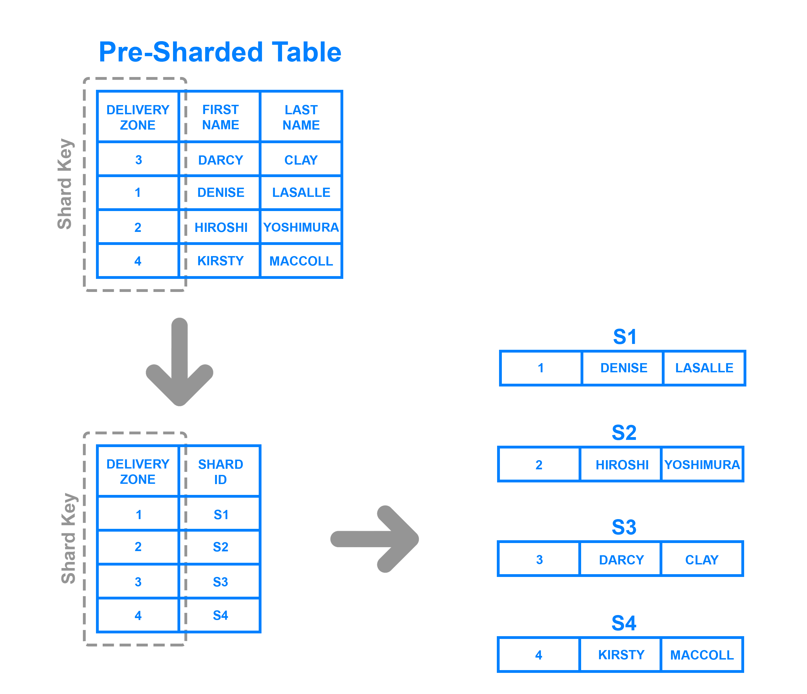

https://www.digitalocean.com/community/tutorials/understanding-database-sharding

## Introduction

Any application or website that sees significant growth will eventually need to scale in order to accommodate increases in traffic. For data-driven applications and websites, it's critical that scaling is done in a way that ensures the security and integrity of their data. It can be difficult to predict how popular a website or application will become or how long it will maintain that popularity, which is why some organizations choose a database architecture that allows them to scale their databases dynamically.

任何看到显着增长的应用程序或网站最终都需要扩展以适应流量的增加。对于数据驱动的应用程序和网站，以确保其数据安全性和完整性的方式进行扩展至关重要。可能很难预测网站或应用程序的流行程度或维持流行程度的时间长短，这就是为什么有些组织选择允许它们动态扩展数据库的数据库体系结构的原因。

In this conceptual article, we will discuss one such database architecture: *sharded databases*. Sharding has been receiving lots of attention in recent years, but many don't have a clear understanding of what it is or the scenarios in which it might make sense to shard a database. We will go over what sharding is, some of its main benefits and drawbacks, and also a few common sharding methods.

在这篇概念性文章中，我们将讨论一种这样的数据库架构：分片数据库。近年来，Sharding一直受到很多关注，但许多人并没有清楚地了解它是什么，也不清楚在哪些场景下对数据库进行分片是有意义。我们将讨论分片是什么，它的一些主要优点和缺点，以及一些常见的分片方法。

## What is Sharding?

Sharding is a database architecture pattern related to *horizontal partitioning* — the practice of separating one table's rows into multiple different tables, known as partitions. Each partition has the same schema and columns, but also entirely different rows. Likewise, the data held in each is unique and independent of the data held in other partitions.

Sharding是一种与水平分区相关的数据库体系结构模式 - 将一个表的行分成多个不同的表（称为分区）的做法。每个分区都具有相同的模式和列，但也有完全不同的行。同样，每个数据中保存的数据都是唯一的，并且与其他分区中保存的数据无关。

It can be helpful to think of horizontal partitioning in terms of how it relates to *vertical partitioning*. In a vertically-partitioned table, entire columns are separated out and put into new, distinct tables. The data held within one vertical partition is independent from the data in all the others, and each holds both distinct rows and columns. The following diagram illustrates how a table could be partitioned both horizontally and vertically:

考虑水平分区与垂直分区的关系，可能会有所帮助。在垂直分区表中，整个列被分离出来并放入新的不同表中。保持在一个垂直分区内的数据独立于所有其他分区中的数据，并且每个数据都包含不同的行和列。下图说明了如何在水平和垂直方向上对表进行分区：

Sharding involves breaking up one's data into two or more smaller chunks, called *logical shards*. The logical shards are then distributed across separate database nodes, referred to as *physical shards*, which can hold multiple logical shards. Despite this, the data held within all the shards collectively represent an entire logical dataset.

分片涉及将一个数据分成两个或多个较小的块，称为逻辑分片。然后，逻辑分片分布在单独的数据库节点上，称为物理分片，它可以容纳多个逻辑分片。尽管如此，所有分片中保存的数据共同代表整个逻辑数据集。

Database shards exemplify a [*shared-nothing architecture*](https://en.wikipedia.org/wiki/Shared-nothing_architecture). This means that the shards are autonomous; they don't share any of the same data or computing resources. In some cases, though, it may make sense to replicate certain tables into each shard to serve as reference tables. For example, let's say there's a database for an application that depends on fixed conversion rates for weight measurements. By replicating a table containing the necessary conversion rate data into each shard, it would help to ensure that all of the data required for queries is held in every shard.

数据库分片举例说明了[shared-nothing架构](https://en.wikipedia.org/wiki/Shared-nothing_architecture)。这意味着分片是自治的; 它们不共享任何相同的数据或计算资源。但是，在某些情况下，将某些表复制到每个分片中作为参考表可能是有意义的。例如，假设某个应用程序的数据库依赖于用于重量测量的固定转换率。通过将包含必要转换率数据的表复制到每个分片中，有助于确保查询所需的所有数据都保存在每个分片中。

Oftentimes, sharding is implemented at the application level, meaning that the application includes code that defines which shard to transmit reads and writes to. However, some database management systems have sharding capabilities built in, allowing you to implement sharding directly at the database level.

通常，在应用程序级别实现分片，这意味着应用程序包含定义传输读取和写入的分片的代码。但是，某些数据库管理系统内置了分片功能，允许您直接在数据库级别实现分片。

Given this general overview of sharding, let's go over some of the positives and negatives associated with this database architecture.

给出了分片的一般概述，让我们来看看与此数据库体系结构相关的一些优点和缺点。

## Benefits of Sharding

The main appeal of sharding a database is that it can help to facilitate *horizontal scaling*, also known as *scaling out*. Horizontal scaling is the practice of adding more machines to an existing stack in order to spread out the load and allow for more traffic and faster processing. This is often contrasted with *vertical scaling*, otherwise known as *scaling up*, which involves upgrading the hardware of an existing server, usually by adding more RAM or CPU.

分片数据库的主要吸引力在于它可以帮助促进水平扩展，也称为横向扩展。水平扩展是向现有堆栈添加更多机器的做法，以便分散负载并允许更多流量和更快的处理。这通常与垂直扩展形成对比，也称为纵向扩展，这涉及升级现有服务器的硬件，通常是添加更多RAM或CPU。

It's relatively simple to have a relational database running on a single machine and scale it up as necessary by upgrading its computing resources. Ultimately, though, any non-distributed database will be limited in terms of storage and compute power, so having the freedom to scale horizontally makes your setup far more flexible.

让关系数据库在单个机器上运行并通过升级其计算资源根据需要进行扩展是相对简单的。但最终，任何非分布式数据库在存储和计算能力方面都会受到限制，因此可以自由地水平扩展，使您的设置更加灵活。

Another reason why some might choose a sharded database architecture is to speed up query response times. When you submit a query on a database that hasn't been sharded, it may have to search every row in the table you're querying before it can find the result set you're looking for. For an application with a large, monolithic database, queries can become prohibitively slow. By sharding one table into multiple, though, queries have to go over fewer rows and their result sets are returned much more quickly.

某些人可能选择分片数据库体系结构的另一个原因是加快查询响应时间。当您对尚未分片的数据库提交查询时，可能必须先搜索您查询的表中的每一行，然后才能找到您要查找的结果集。对于具有大型单片数据库的应用程序，查询可能变得极其缓慢。但是，通过将一个表分成多个，查询只需遍历更少的行，并且返回结果集的速度要快得多。

Sharding can also help to make an application more reliable by mitigating the impact of outages. If your application or website relies on an unsharded database, an outage has the potential to make the entire application unavailable. With a sharded database, though, an outage is likely to affect only a single shard. Even though this might make some parts of the application or website unavailable to some users, the overall impact would still be less than if the entire database crashed.

分片还可以通过减少中断的影响来帮助提高应用程序的可靠性。如果您的应用程序或网站依赖于未加密的数据库，则中断可能会导致整个应用程序不可用。但是，对于分片数据库，中断可能只会影响单个分片。即使这可能使某些用户无法使用某些应用程序或网站部分，但整体影响仍会低于整个数据库崩溃的影响。

## Drawbacks of Sharding

While sharding a database can make scaling easier and improve performance, it can also impose certain limitations. Here, we'll discuss some of these and why they might be reasons to avoid sharding altogether.

虽然对数据库进行分片可以使扩展更容易并提高性能，但它也可能会带来某些限制。在这里，我们将讨论其中的一些以及为什么它们可能是完全避免分片的原因。

The first difficulty that people encounter with sharding is the sheer complexity of properly implementing a sharded database architecture. If done incorrectly, there's a significant risk that the sharding process can lead to lost data or corrupted tables. Even when done correctly, though, sharding is likely to have a major impact on your team's workflows. Rather than accessing and managing one's data from a single entry point, users must manage data across multiple shard locations, which could potentially be disruptive to some teams.

人们遇到分片的第一个困难是正确实现分片数据库体系结构的复杂性。如果操作不正确，则分片过程可能会导致数据丢失或表损坏。即使正确完成，分片也可能对您团队的工作流程产生重大影响。用户必须跨多个分片位置管理数据，而不是从单个入口点访问和管理一个数据，这可能会对某些团队造成干扰。

One problem that users sometimes encounter after having sharded a database is that the shards eventually become unbalanced. By way of example, let's say you have a database with two separate shards, one for customers whose last names begin with letters A through M and another for those whose names begin with the letters N through Z. However, your application serves an inordinate amount of people whose last names start with the letter G. Accordingly, the A-M shard gradually accrues more data than the N-Z one, causing the application to slow down and stall out for a significant portion of your users. The A-M shard has become what is known as a *database hotspot*. In this case, any benefits of sharding the database are canceled out by the slowdowns and crashes. The database would likely need to be repaired and resharded to allow for a more even data distribution.

用户在对数据库进行分片后有时会遇到的一个问题是分片最终会变得不平衡。举例来说，假设您有一个带有两个单独分片的数据库，一个用于姓氏以字母A到M开头的客户，另一个用于名称以字母N到Z开头的客户。但是，您的应用程序为大量姓氏以字母G开头的人提供服务。因此，A-M分片逐渐累积的数据多于N-Z分片，导致应用程序为您的大部分用户放慢速度并使其处于停滞状态。A-M分片已成为所谓的数据库热点。在这种情况下，分片数据库的任何好处都会被减速和崩溃所抵消。数据库可能需要修复和重新分片才能实现更均匀的数据分发。

Another major drawback is that once a database has been sharded, it can be very difficult to return it to its unsharded architecture. Any backups of the database made before it was sharded won't include data written since the partitioning. Consequently, rebuilding the original unsharded architecture would require merging the new partitioned data with the old backups or, alternatively, transforming the partitioned DB back into a single DB, both of which would be costly and time consuming endeavors.

另一个主要缺点是，一旦数据库被分片，就很难将其返回到未分片的体系结构中。在对数据库进行分片之前所做的任何备份都不会包括自分片后写入的数据。因此，重建原始的未分片体系结构将需要将新的分区数据与旧的备份合并，或者，将分片的DB转换回单个DB，这两个过程都将花费大量的时间和精力。

A final disadvantage to consider is that sharding isn't natively supported by every database engine. For instance, PostgreSQL does not include automatic sharding as a feature, although it is possible to manually shard a PostgreSQL database. There are a number of Postgres forks that do include automatic sharding, but these often trail behind the latest PostgreSQL release and lack certain other features. Some specialized database technologies — like MySQL Cluster or certain database-as-a-service products like MongoDB Atlas — do include auto-sharding as a feature, but vanilla versions of these database management systems do not. Because of this, sharding often requires a "roll your own" approach. This means that documentation for sharding or tips for troubleshooting problems are often difficult to find.

要考虑的最后一个缺点是每个数据库引擎本身都不支持分片。例如，PostgreSQL不包括自动分片作为功能，尽管可以手动分片PostgreSQL数据库。有许多Postgres分支包括自动分片，但这些分支通常落后于最新的PostgreSQL版本，缺乏某些其他功能。一些专门的数据库技术 - 如MySQL Cluster或某些数据库即服务产品（如MongoDB Atlas）确实包含自动分片功能，但这些数据库管理系统的普通版本却没有。因此，分片通常需要自己动手的方法。这意味着通常很难找到用于分片的文档或用于解决问题的提示。

These are, of course, only some general issues to consider before sharding. There may be many more potential drawbacks to sharding a database depending on its use case.

当然，这些只是在分片之前要考虑的一些一般性问题。根据其用例，对数据库进行分片可能存在许多潜在的缺点。

Now that we've covered a few of sharding's drawbacks and benefits, we will go over a few different architectures for sharded databases.

现在我们已经介绍了一些分片的缺点和好处，我们将讨论一些分片数据库的不同架构。

## Sharding Architectures

Once you've decided to shard your database, the next thing you need to figure out is how you'll go about doing so. When running queries or distributing incoming data to sharded tables or databases, it's crucial that it goes to the correct shard. Otherwise, it could result in lost data or painfully slow queries. In this section, we'll go over a few common sharding architectures, each of which uses a slightly different process to distribute data across shards.

一旦你决定对你的数据库进行分片，你需要弄清楚的是你将如何去做。在运行查询或将传入数据分发到分片表或数据库时，它必须转到正确的分片。否则，它可能导致数据丢失或查询速度缓慢。在本节中，我们将介绍一些常见的分片架构，每个架构使用稍微不同的过程来跨分片分发数据。

### Key Based Sharding

*Key based sharding*, also known as *hash based sharding*, involves using a value taken from newly written data — such as a customer's ID number, a client application's IP address, a ZIP code, etc. — and plugging it into a *hash function* to determine which shard the data should go to. A hash function is a function that takes as input a piece of data (for example, a customer email) and outputs a discrete value, known as a *hash value*. In the case of sharding, the hash value is a shard ID used to determine which shard the incoming data will be stored on. Altogether, the process looks like this:

基于键值的分片（也称为基于散列的分片）涉及使用从新写入的数据中获取的值 - 例如客户的ID号，客户端应用程序的IP地址，邮政编码等 - 并将其插入哈希函数以确定数据应该去哪个分片。哈希函数是将一段数据（例如，客户电子邮件）作为输入并输出离散值（称为哈希值）的函数。在分片的情况下，散列值是一个分片ID，用于确定传入数据将存储在哪个分片上。总而言之，这个过程看起来像这样：

To ensure that entries are placed in the correct shards and in a consistent manner, the values entered into the hash function should all come from the same column. This column is known as a *shard key*. In simple terms, shard keys are similar to [*primary keys*](https://en.wikipedia.org/wiki/Primary_key) in that both are columns which are used to establish a unique identifier for individual rows. Broadly speaking, a shard key should be static, meaning it shouldn't contain values that might change over time. Otherwise, it would increase the amount of work that goes into update operations, and could slow down performance.

为了确保条目以正确的方式放置在正确的分片中，输入散列函数的值应该都来自同一列。此列称为分片key。简单来说，分片键与[主键](https://en.wikipedia.org/wiki/Primary_key)类似，因为它们都是用于为各行建立唯一标识符的列。一般来说，分片键应该是静态的，这意味着它不应包含可能随时间变化的值。否则，它会增加更新操作的工作量，并可能降低性能。

While key based sharding is a fairly common sharding architecture, it can make things tricky when trying to dynamically add or remove additional servers to a database. As you add servers, each one will need a corresponding hash value and many of your existing entries, if not all of them, will need to be remapped to their new, correct hash value and then migrated to the appropriate server. As you begin rebalancing the data, neither the new nor the old hashing functions will be valid. Consequently, your server won't be able to write any new data during the migration and your application could be subject to downtime.

虽然基于键值的分片是一种相当常见的分片架构，但在尝试动态添加或删除数据库中的其他服务器时，它会使事情变得棘手。在添加服务器时，每个服务器都需要一个相应的哈希值，并且许多现有条目（如果不是全部）都需要重新映射到新的正确哈希值，然后迁移到相应的服务器。当您开始重新平衡数据时，新旧散列函数都不会有效。因此，您的服务器将无法在迁移期间写入任何新数据，您的应用程序可能会停机。

The main appeal of this strategy is that it can be used to evenly distribute data so as to prevent hotspots. Also, because it distributes data algorithmically, there's no need to maintain a map of where all the data is located, as is necessary with other strategies like range or directory based sharding.

该策略的主要吸引力在于它可以用于均匀分布数据以防止热点。此外，由于它以算法方式分配数据，因此无需维护所有数据所在位置的映射，这是其他策略（如范围或基于目录的分片）所必需的。

### Range Based Sharding

*Range based sharding* involves sharding data based on ranges of a given value. To illustrate, let's say you have a database that stores information about all the products within a retailer's catalog. You could create a few different shards and divvy up each products' information based on which price range they fall into, like this:

基于范围的分片涉及基于给定值的范围分片数据。为了说明，假设您有一个数据库，用于存储零售商目录中所有产品的信息。您可以创建一些不同的分片，并根据每个产品的价格范围分配每个产品的信息，如下所示：

The main benefit of range based sharding is that it's relatively simple to implement. Every shard holds a different set of data but they all have an identical schema as one another, as well as the original database. The application code just reads which range the data falls into and writes it to the corresponding shard.

基于范围的分片的主要好处是它实现起来相对简单。每个分片都包含一组不同的数据，但它们都具有相同的模式，以及原始数据库。应用程序代码只读取数据所属的范围并将其写入相应的分片。

On the other hand, range based sharding doesn't protect data from being unevenly distributed, leading to the aforementioned database hotspots. Looking at the example diagram, even if each shard holds an equal amount of data the odds are that specific products will receive more attention than others. Their respective shards will, in turn, receive a disproportionate number of reads.

另一方面，基于范围的分片不能防止数据分布不均匀，导致上述数据库热点。查看示例图，即使每个分片拥有相同数量的数据，特定产品的可能性也会高于其他产品。反过来，它们各自的分片将接收不成比例的读取次数。

### Directory Based Sharding

To implement *directory based sharding*, one must create and maintain a *lookup table* that uses a shard key to keep track of which shard holds which data. In a nutshell, a lookup table is a table that holds a static set of information about where specific data can be found. The following diagram shows a simplistic example of directory based sharding:

要实现基于目录的分片，必须创建并维护一个查找表，该查找表使用分片键来跟踪哪个分片包含哪些数据。简而言之，查找表是一个表，其中包含有关可以找到特定数据的静态信息集。下图显示了基于目录的分片的简单示例：

Here, the **Delivery Zone** column is defined as a shard key. Data from the shard key is written to the lookup table along with whatever shard each respective row should be written to. This is similar to range based sharding, but instead of determining which range the shard key's data falls into, each key is tied to its own specific shard. Directory based sharding is a good choice over range based sharding in cases where the shard key has a low cardinality and it doesn't make sense for a shard to store a range of keys. Note that it's also distinct from key based sharding in that it doesn't process the shard key through a hash function; it just checks the key against a lookup table to see where the data needs to be written.

此处，”Delivery Zone“列定义为分片键。来自分片键的数据被写入查找表以及应该写入每个相应行的任何分片。这与基于范围的分片类似，但不是确定分片键的数据属于哪个范围，而是将每个键绑定到其自己的特定分片。在分片键具有低基数并且分片存储一系列键没有意义的情况下，基于目录分片是比基于范围分片更理想的选择。请注意，它也不同于基于键值的分片，因为它不通过散列函数处理分片键; 它只是根据查找表检查key，以查看数据需要写入的位置。

The main appeal of directory based sharding is its flexibility. Range based sharding architectures limit you to specifying ranges of values, while key based ones limit you to using a fixed hash function which, as mentioned previously, can be exceedingly difficult to change later on. Directory based sharding, on the other hand, allows you to use whatever system or algorithm you want to assign data entries to shards, and it's relatively easy dynamically add shards using this approach.

基于目录的分片的主要吸引力在于其灵活性。基于范围的分片架构限制您指定值的范围，而基于键值的分片限制您使用固定的散列函数，如前所述，稍后可能非常难以更改该函数。另一方面，基于目录的分片允许您使用任何你想要的系统或算法将数据条目分配给分片，并且使用此方法动态添加分片相对容易。

While directory based sharding is the most flexible of the sharding methods discussed here, the need to connect to the lookup table before every query or write can have a detrimental impact on an application's performance. Furthermore, the lookup table can become a single point of failure: if it becomes corrupted or otherwise fails, it can impact one's ability to write new data or access their existing data.

虽然基于目录的分片是这里讨论的最灵活的分片方法，但是在每次查询或写入之前连接到查找表，会对应用程序的性能产生不利影响。此外，查找表可能成为单点故障：如果它被损坏或以其他方式失败，它可能会影响一个人编写新数据或访问其现有数据的能力。

## Should I Shard?

Whether or not one should implement a sharded database architecture is almost always a matter of debate. Some see sharding as an inevitable outcome for databases that reach a certain size, while others see it as a headache that should be avoided unless it's absolutely necessary, due to the operational complexity that sharding adds.

是否应该实现分片数据库架构几乎总是一个争论的问题。有些人认为分片是达到一定规模的数据库的必然结果，而其他人则认为这是一个令人头疼的问题，除非绝对必要，否则应该避免，因为分片增加了操作的复杂性。

Because of this added complexity, sharding is usually only performed when dealing with very large amounts of data. Here are some common scenarios where it may be beneficial to shard a database:

由于这种增加的复杂性，通常仅在处理非常大量的数据时才执行分片。以下是一些常见方案，其中对数据库进行分片可能是有益的：

- The amount of application data grows to exceed the storage capacity of a single database node.
- 应用程序数据量增长到超过单个数据库节点的存储容量。
- The volume of writes or reads to the database surpasses what a single node or its read replicas can handle, resulting in slowed response times or timeouts.
- 对数据库的写入或读取量超过单个节点或其读取副本可以处理的量，从而导致响应时间减慢或超时。
- The network bandwidth required by the application outpaces the bandwidth available to a single database node and any read replicas, resulting in slowed response times or timeouts.
- 应用程序所需的网络带宽超过单个数据库节点和任何只读副本可用的带宽，从而导致响应时间减慢或超时。

Before sharding, you should exhaust all other options for optimizing your database. Some optimizations you might want to consider include:

在分片之前，您应该用尽所有其他选项来优化数据库。您可能需要考虑的一些优化包括：

- **Setting up a remote database**. If you're working with a monolithic application in which all of its components reside on the same server, you can improve your database's performance by moving it over to its own machine. This doesn't add as much complexity as sharding since the database's tables remain intact. However, it still allows you to vertically scale your database apart from the rest of your infrastructure.
- **设置远程数据库**。如果您正在使用其所有组件都驻留在同一服务器上的单一应用程序，则可以通过将其移动到自己的计算机来提高数据库的性能。由于数据库的表保持不变，因此这不会增加分片的复杂性。但是，它仍允许您将数据库与其他基础结构进行垂直扩展。
- **Implementing caching**. If your application's read performance is what's causing you trouble, caching is one strategy that can help to improve it. Caching involves temporarily storing data that has already been requested in memory, allowing you to access it much more quickly later on.
- **实现缓存**。如果您的应用程序的读取性能导致您遇到麻烦，那么缓存是一种可以帮助改进它的策略。缓存涉及临时存储已在内存中请求的数据，以便您以后更快地访问它。
- **Creating one or more read replicas**. Another strategy that can help to improve read performance, this involves copying the data from one database server (the *primary server*) over to one or more *secondary servers*. Following this, every new write goes to the primary before being copied over to the secondaries, while reads are made exclusively to the secondary servers. Distributing reads and writes like this keeps any one machine from taking on too much of the load, helping to prevent slowdowns and crashes. Note that creating read replicas involves more computing resources and thus costs more money, which could be a significant constraint for some.
- **创建一个或多个只读副本**。另一种有助于提高读取性能的策略，包括将数据从一个数据库服务器（主服务器）复制到一个或多个备用服务器。在此之后，每个新写入在复制到备节点之前都会转到主节点，而只能对备用服务器进行读取。像这样分发读写可以防止任何一台机器承担过多的负载，从而有助于防止速度下降和崩溃。请注意，创建只读副本涉及更多的计算资源，因此需要花费更多的钱，这可能是一些人的重要约束。
- **Upgrading to a larger server**. In most cases, scaling up one's database server to a machine with more resources requires less effort than sharding. As with creating read replicas, an upgraded server with more resources will likely cost more money. Accordingly, you should only go through with resizing if it truly ends up being your best option.
- **升级到更大的服务器**。在大多数情况下，将一个人的数据库服务器扩展到具有更多资源的计算机比分片需要更少的工作量。与创建只读副本一样，具有更多资源的升级服务器可能会花费更多的钱。因此，如果它真的最终成为您的最佳选择，您应该只进行调整大小。

Bear in mind that if your application or website grows past a certain point, none of these strategies will be enough to improve performance on their own. In such cases, sharding may indeed be the best option for you.

请记住，如果您的应用程序或网站超过某一点，那么这些策略都不足以提高自己的性能。在这种情况下，分片可能确实是您的最佳选择。

## Conclusion

Sharding can be a great solution for those looking to scale their database horizontally. However, it also adds a great deal of complexity and creates more potential failure points for your application. Sharding may be necessary for some, but the time and resources needed to create and maintain a sharded architecture could outweigh the benefits for others.

对于那些希望横向扩展数据库的人来说，分片是一个很好的解决方案。但是，它还会增加很多复杂性，并为您的应用程序创建更多潜在的故障点。某些人可能需要进行分片，但创建和维护分片结构所需的时间和资源可能会超过其他人的好处。

By reading this conceptual article, you should have a clearer understanding of the pros and cons of sharding. Moving forward, you can use this insight to make a more informed decision about whether or not a sharded database architecture is right for your application.

通过阅读这篇概念性文章，您应该更清楚地了解分片的优缺点。展望未来，您可以使用此洞察力来更明智地决定分片数据库体系结构是否适合您的应用程序。